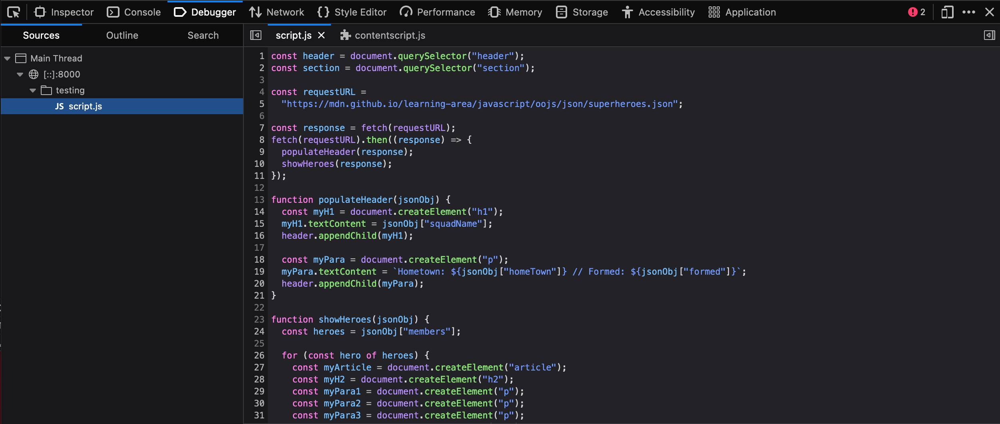

{{LearnSidebar}}

{{PreviousMenuNext("Learn_web_development/Core/Scripting/JSON","Learn_web_development/Core/Frameworks_libraries", "Learn_web_development/Core/Scripting")}}

> [!NOTE]
> The content in this article is currently incomplete, sorry about that! We are working hard to improve the MDN Learn Web Development section, and we will have places marked as incomplete ("TODO") finished soon.

In this lesson, we will return to the subject of debugging JavaScript (which we first looked at in [What went wrong?](/en-US/docs/Learn_web_development/Core/Scripting/What_went_wrong)). Here we will delve deeper into techniques for tracking down errors, but also look at how to code defensively and handle errors in your code, avoiding problems in the first place.

<table>
  <tbody>
    <tr>
      <th scope="row">Prerequisites:</th>
      <td>An understanding of <a href="/en-US/docs/Learn_web_development/Core/Structuring_content">HTML</a> and the <a href="/en-US/docs/Learn_web_development/Core/Styling_basics">fundamentals of CSS</a>, familiarity with JavaScript basics as covered in previous lessons.</td>
    </tr>
    <tr>
      <th scope="row">Learning outcomes:</th>
      <td>
        <ul>
          <li>Using browser developer tools to inspect the JavaScript running on your page and see what errors it is generating.</li>
          <li>Using <code>console.log()</code> and <code>console.error()</code> for debugging.</li>
          <li>Error handling with <code>conditionals</code>, <code>try...catch</code>, and <code>throw</code>.</li>
          <li>Advanced JavaScript debugging with breakpoints, watchers, etc.</li>
        </ul>
      </td>
    </tr>
  </tbody>
</table>

## Recap on types of JavaScript error

Earlier in the module, in [What went wrong?](/en-US/docs/Learn_web_development/Core/Scripting/What_went_wrong), we looked broadly at the kinds of error that can occur in JavaScript programs, and said that they can be roughly broken down into two types — syntax errors and logic errors. We also helped you to make sense of some common types of JavaScript error message, and showed you how to do some simple debugging using [`console.log()`](/en-US/docs/Web/API/console/log_static) statements.

In this article, we will go a bit deeper into the tools you have available for tracking down errors, and also look at ways to prevent errors in the first place.

## Linting your code

You should make sure your code is valid first before trying to track down specific errors. Make use of the W3C's [Markup validation service](https://validator.w3.org/), [CSS validation service](https://jigsaw.w3.org/css-validator/), and a JavaScript linter such as [ESLint](https://eslint.org/play/) to make sure your code is valid. This will likely shake out a bunch of errors, allowing you to concentrate on the errors that remain.

### Code editor plugins

It is not very convenient to have to copy and paste your code over to a web page to check its validity over and over again. We'd recommend installing a linter plugin on your code editor, so that you can get errors reported to you are you write your code. Try searching for ESLint in your code editor's plugins or extensions list, and installing it.

## Common JavaScript problems

There are a number of common JavaScript problems that you will want to be mindful of, such as:

- Basic syntax and logic problems (again, check out [Troubleshooting JavaScript](/en-US/docs/Learn_web_development/Core/Scripting/What_went_wrong)).
- Making sure variables, etc. are defined in the correct scope, and you are not running into conflicts between items declared in different places (see [Function scope and conflicts](/en-US/docs/Learn_web_development/Core/Scripting/Functions#function_scope_and_conflicts)).
- Confusion about [this](/en-US/docs/Web/JavaScript/Reference/Operators/this), in terms of what scope it applies to, and therefore if its value is what you intended. You can read [What is "this"?](/en-US/docs/Learn_web_development/Core/Scripting/Object_basics#what_is_this) for a light introduction; you should also study examples like [this one](https://github.com/mdn/learning-area/blob/7ed039d17e820c93cafaff541aa65d874dde8323/javascript/oojs/assessment/main.js#L143), which shows a typical pattern of saving a `this` scope to a separate variable, then using that variable in nested functions so you can be sure you are applying functionality to the correct `this` scope.
- Incorrectly using functions inside loops that iterate with a global variable (more generally "getting the scope wrong").

> [!CALLOUT]
> For example, in [bad-for-loop.html](https://mdn.github.io/learning-area/tools-testing/cross-browser-testing/javascript/bad-for-loop.html) (see [source code](https://github.com/mdn/learning-area/blob/main/tools-testing/cross-browser-testing/javascript/bad-for-loop.html)), we loop through 10 iterations using a variable defined with `var`, each time creating a paragraph and adding an [onclick](/en-US/docs/Web/API/Element/click_event) event handler to it. When clicked, we want each one to display an alert message containing its number (the value of `i` at the time it was created). Instead they all report `i` as 11 — because the `for` loop does all its iterating before nested functions are invoked.
>
> The easiest solution is to declare the iteration variable with `let` instead of `var`—the value of `i` associated with the function is then unique to each iteration. See [good-for-loop.html](https://mdn.github.io/learning-area/tools-testing/cross-browser-testing/javascript/good-for-loop.html) (see the [source code](https://github.com/mdn/learning-area/blob/main/tools-testing/cross-browser-testing/javascript/good-for-loop.html) also) for a version that works.

- Making sure [asynchronous operations](/en-US/docs/Learn_web_development/Extensions/Async_JS) have completed before trying to use the values they return. This usually means understanding how to use _promises_: using [`await`](/en-US/docs/Web/JavaScript/Reference/Operators/await) appropriately or running the code to handle the result of an asynchronous call in the promise's {{jsxref("Promise.then()", "then()")}} handler. See [How to use promises](/en-US/docs/Learn_web_development/Extensions/Async_JS/Promises) for an introduction to this topic.

> **Note:** [Buggy JavaScript Code: The 10 Most Common Mistakes JavaScript Developers Make](https://www.toptal.com/javascript/10-most-common-javascript-mistakes) has some nice discussions of these common mistakes and more.

## The Browser JavaScript console

Browser developer tools have many useful features for helping to debug JavaScript. For a start, the JavaScript console will report errors in your code.

Make a local copy of our [fetch-broken](https://mdn.github.io/learning-area/tools-testing/cross-browser-testing/javascript/fetch-broken/) example (see the [source code](https://github.com/mdn/learning-area/tree/main/tools-testing/cross-browser-testing/javascript/fetch-broken) also).

If you look at the console, you'll see an error message. The exact wording is browser-dependent, but it will be something like: "Uncaught TypeError: heroes is not iterable", and the referenced line number is 25. If we look at the source code, the relevant code section is this:

```js
function showHeroes(jsonObj) {
  const heroes = jsonObj["members"];

  for (const hero of heroes) {
    // ...
  }
}
```

So the code falls over as soon as we try to use `jsonObj` (which as you might expect, is supposed to be a [JSON object](/en-US/docs/Learn_web_development/Core/Scripting/JSON)). This is supposed to be fetched from an external `.json` file using the following {{domxref("Window/fetch", "fetch()")}} call:

```js
const requestURL =
  "https://mdn.github.io/learning-area/javascript/oojs/json/superheroes.json";

const response = fetch(requestURL);
populateHeader(response);
showHeroes(response);
```

But this fails.

## The Console API

You may already know what is wrong with this code, but let's explore it some more to show how you could investigate this. We'll start with the [Console](/en-US/docs/Web/API/console) API, which allows JavaScript code to interact with the browser's JavaScript console. It has a number of features available; you've already encountered [`console.log()`](/en-US/docs/Web/API/console/log_static), which prints a custom message to the console.

Try adding a `console.log()` call to log the return value of `fetch()`, like this:

```js
const requestURL =
  "https://mdn.github.io/learning-area/javascript/oojs/json/superheroes.json";

const response = fetch(requestURL);
console.log(`Response value: ${response}`);
const superHeroes = response;
populateHeader(superHeroes);
showHeroes(superHeroes);
```

Refresh the page in the browser. This time, before the error message, you'll see a new message logged to the console:

```plain
Response value: [object Promise]
```

The `console.log()` output shows that the return value of `fetch()` is not the JSON data, it's a {{jsxref("Promise")}}. The `fetch()` function is asynchronous: it returns a `Promise` that is fulfilled only when the actual response has been received from the network. Before we can use the response, we have to wait for the `Promise` to be fulfilled.

We can do this by putting the code that uses the response inside the {{jsxref("Promise.prototype.then()", "then()")}} method of the returned `Promise`, like this:

```js
const response = fetch(requestURL);
fetch(requestURL).then((response) => {
  populateHeader(response);
  showHeroes(response);
});
```

To summarize, anytime something is not working and a value does not appear to be what it is meant to be at some point in your code, you can use `console.log()` to print it out and see what is happening.

## Using the JavaScript debugger

Unfortunately, we still have the same error — the problem has not gone away. Let's investigate this now, using a more sophisticated feature of browser developer tools: the [JavaScript debugger](https://firefox-source-docs.mozilla.org/devtools-user/debugger/index.html) as it is called in Firefox.

> [!NOTE]
> Similar tools are available in other browsers; the [Sources tab](https://developer.chrome.com/docs/devtools/#sources) in Chrome, Debugger in Safari (see [Safari Web Development Tools](https://developer.apple.com/safari/tools/)), etc.

In Firefox, the Debugger tab looks like this:



- On the left, you can select the script you want to debug (in this case we have only one).
- The center panel shows the code in the selected script.
- The right-hand panel shows useful details pertaining to the current environment — _Breakpoints_, _Callstack_ and currently active _Scopes_.

The main feature of such tools is the ability to add breakpoints to code — these are points where the execution of the code stops, and at that point you can examine the environment in its current state and see what is going on.

Let's get to work. The error is now being thrown at line 26. Click on line number 26 in the center panel to add a breakpoint to it (you'll see a blue arrow appear over the top of it). Now refresh the page (Cmd/Ctrl + R) — the browser will pause execution of the code at line 26. At this point, the right-hand side will update to show some very useful information.


- Under _Breakpoints_, you'll see the details of the break-point you have set.
- Under _Call Stack_, you'll see a few entries — this is basically a list of the series of functions that were invoked to cause the current function to be invoked. At the top, we have `showHeroes()` the function we are currently in, and second we have `onload`, which stores the event handler function containing the call to `showHeroes()`.
- Under _Scopes_, you'll see the currently active scope for the function we are looking at. We only have three — `showHeroes`, `block`, and `Window` (the global scope). Each scope can be expanded to show the values of variables inside the scope when execution of the code was stopped.

We can find out some very useful information in here.

1. Expand the `showHeroes` scope — you can see from this that the heroes variable is `undefined`, indicating that accessing the `members` property of `jsonObj` (first line of the function) didn't work.
2. You can also see that the `jsonObj` variable is storing a {{domxref("Response")}} object, not a JSON object.

The argument to `showHeroes()` is the value the `fetch()` promise was fulfilled with. So this promise is not in the JSON format: it is a `Response` object. There's an extra step needed to retrieve the content of the response as a JSON object.

We'd like you to try fixing this problem yourself. To get you started, see the documentation for the {{domxref("Response")}} object. If you get stuck, you can find the fixed source code at <https://github.com/mdn/learning-area/tree/main/tools-testing/cross-browser-testing/javascript/fetch-fixed>.

> [!NOTE]
> The debugger tab has many other useful features that we've not discussed here, for example conditional breakpoints and watch expressions. For a lot more information, see the [Debugger](https://firefox-source-docs.mozilla.org/devtools-user/debugger/index.html) page.

## Handling JavaScript errors in your code

HTML and CSS are permissive — errors and unrecognized features can often be handled due to the nature of the languages. For example, CSS will ignore unrecognized properties, and the rest of the code will often just work. JavaScript is not as permissive as HTML and CSS however — if the JavaScript engine encounters mistakes or unrecognized syntax, more often than not it will throw errors.

There are a few strategies for handling JavaScript errors in your code; let's explore the most common ones.

### Conditionals

TODO

### try...catch

TODO

### Throwing errors

TODO

### Feature detection

Feature detection is useful when you are planning to use new JavaScript features that might not be supported in all browsers. Test for the feature, and then conditionally run code to provide an acceptable experience both in browsers that do and don't support the feature. As a quick example, the [Geolocation API](/en-US/docs/Web/API/Geolocation_API) (which exposes available location data for the device the web browser is running on) has a main entry point for its use — a `geolocation` property available on the global [Navigator](/en-US/docs/Web/API/Navigator) object. Therefore, you can detect whether the browser supports geolocation or not by using something like the following:

```js
if ("geolocation" in navigator) {
  navigator.geolocation.getCurrentPosition((position) => {
    // show the location on a map, perhaps using the Google Maps API
  });
} else {
  // Give the user a choice of static maps instead
}
```

## Finding help

There are many other issues you'll encounter with JavaScript (and HTML and CSS!), making knowledge of how to find answers online invaluable.

Among the best sources of support information are MDN (that's where you are now!), [stackoverflow.com](https://stackoverflow.com/), and [caniuse.com](https://caniuse.com/).

- To use the Mozilla Developer Network (MDN), most people do a search engine search of the technology they are trying to find information on, plus the term "mdn", for example, "mdn HTML video".
- [caniuse.com](https://caniuse.com/) provides support information, along with a few useful external resource links. For example, see <https://caniuse.com/#search=video> (you just have to enter the feature you are searching for into the text box).
- [stackoverflow.com](https://stackoverflow.com/) (SO) is a forum site where you can ask questions and have fellow developers share their solutions, look up previous posts, and help other developers. You are advised to look and see if there is an answer to your question already, before posting a new question. For example, we searched for "disabling autofocus on HTML dialog" on SO, and very quickly came up with [Disable showModal auto-focusing using HTML attributes](https://stackoverflow.com/questions/63267581/disable-showmodal-auto-focusing-using-html-attributes).

Aside from that, try searching your favorite search engine for an answer to your problem. It is often useful to search for specific error messages if you have them — other developers will be likely to have had the same problems as you.

## Summary

So that's JavaScript debugging and error handling. Simple huh? Maybe not so simple, but this article should at least give you a start, and some ideas on how to tackle the JavaScript-related problems you will come across.

That's it for the Dynamic scripting with JavaScript module; congratulations on reaching the end! In the next module we'll help you explore JavaScript frameworks and libraries.

{{PreviousMenuNext("Learn_web_development/Core/Scripting/JSON","Learn_web_development/Core/Frameworks_libraries", "Learn_web_development/Core/Scripting")}}
