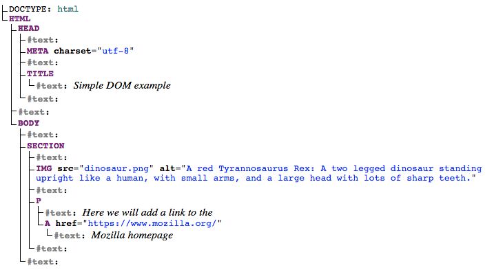
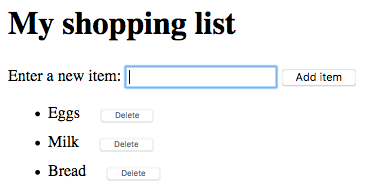

{{PreviousMenuNext("Learn_web_development/Core/Scripting/Object_basics","Learn_web_development/Core/Scripting/Network_requests", "Learn_web_development/Core/Scripting")}}

When writing web pages and apps, one of the most common things you'll want to do is change the document structure in some way. This is usually done by manipulating the Document Object Model (DOM) via a set of built-in browser APIs for controlling HTML and styling information. In this article we'll introduce you to **DOM scripting**.

<table>
  <tbody>
    <tr>
      <th scope="row">Prerequisites:</th>
      <td>An understanding of <a href="/en-US/docs/Learn_web_development/Core/Structuring_content">HTML</a> and the <a href="/en-US/docs/Learn_web_development/Core/Styling_basics">fundamentals of CSS</a>, familiarity with JavaScript basics as covered in previous lessons.</td>
    </tr>
    <tr>
      <th scope="row">Learning outcomes:</th>
      <td>
        <ul>
          <li>What the DOM is — the browser's internal representation of the document's HTML structure as a hierarchy of objects.</li>
          <li>The important parts of a web browser as represented in JavaScript — <code>Navigator</code>, <code>Window</code>, and <code>Document</code>.</li>
          <li>How DOM nodes exist relative to each other in the DOM tree — root, parent, child, sibling, and descendant.</li>
          <li>Getting references to DOM nodes, creating new nodes, adding and removing nodes and attributes.</li>
          <li>Manipulating CSS styles with JavaScript.</li>
        </ul>
      </td>
    </tr>
  </tbody>
</table>

## The important parts of a web browser

Web browsers are very complicated pieces of software with a lot of moving parts, many of which can't be controlled or manipulated by a web developer using JavaScript. You might think that such limitations are a bad thing, but browsers are locked down for good reasons, mostly centering around security. Imagine if a website could get access to your stored passwords or other sensitive information, and log into websites as if it were you?

Despite the limitations, Web APIs still give us access to a lot of functionality that enable us to do a great many things with web pages. There are a few really obvious bits you'll reference regularly in your code — consider the following diagram, which represents the main parts of a browser directly involved in viewing web pages:


- The window is the browser tab that a web page is loaded into; this is represented in JavaScript by the {{domxref("Window")}} object. Using methods available on this object you can do things like return the window's size (see {{domxref("Window.innerWidth")}} and {{domxref("Window.innerHeight")}}), manipulate the document loaded into that window, store data specific to that document on the client-side (for example using a local database or other storage mechanism), attach an [event handler](/en-US/docs/Learn_web_development/Core/Scripting/Events) to the current window, and more.
- The navigator represents the state and identity of the browser (i.e., the user-agent) as it exists on the web. In JavaScript, this is represented by the {{domxref("Navigator")}} object. You can use this object to retrieve things like the user's preferred language, a media stream from the user's webcam, etc.
- The document (represented by the DOM in browsers) is the actual page loaded into the window, and is represented in JavaScript by the {{domxref("Document")}} object. You can use this object to return and manipulate information on the HTML and CSS that comprises the document, for example get a reference to an element in the DOM, change its text content, apply new styles to it, create new elements and add them to the current element as children, or even delete it altogether.

In this article we'll focus mostly on manipulating the document, but we'll show a few other useful bits besides.

## The document object model

Let's provide a brief recap on the Document Object Model (DOM), which we also looked at earlier in the course. The document currently loaded in each one of your browser tabs is represented by a DOM. This is a "tree structure" representation created by the browser that enables the HTML structure to be easily accessed by programming languages — for example the browser itself uses it to apply styling and other information to the correct elements as it renders a page, and developers like you can manipulate the DOM with JavaScript after the page has been rendered.

We have created an example page at [dom-example.html](https://github.com/mdn/learning-area/blob/main/javascript/apis/document-manipulation/dom-example.html) ([see it live also](https://mdn.github.io/learning-area/javascript/apis/document-manipulation/dom-example.html)). Try opening this up in your browser — it is a very simple page containing a {{htmlelement("section")}} element inside which you can find an image, and a paragraph with a link inside. The HTML source code looks like this:

```html
<!doctype html>
<html lang="en-US">
  <head>
    <meta charset="utf-8" />
    <title>Simple DOM example</title>
  </head>
  <body>
    <section>
      
      <p>
        Here we will add a link to the
        <a href="https://www.mozilla.org/">Mozilla homepage</a>
      </p>
    </section>
  </body>
</html>
```

The DOM on the other hand looks like this:



> [!NOTE]
> This DOM tree diagram was created using Ian Hickson's [Live DOM viewer](https://software.hixie.ch/utilities/js/live-dom-viewer/).

Each entry in the tree is called a **node**. You can see in the diagram above that some nodes represent elements (identified as `HTML`, `HEAD`, `META` and so on) and others represent text (identified as `#text`). There are [other types of nodes as well](/en-US/docs/Web/API/Node/nodeType), but these are the main ones you'll encounter.

Nodes are also referred to by their position in the tree relative to other nodes:

- **Root node**: The top node in the tree, which in the case of HTML is always the `HTML` node (other markup vocabularies like SVG and custom XML will have different root elements).
- **Child node**: A node _directly_ inside another node. For example, `IMG` is a child of `SECTION` in the above example.
- **Descendant node**: A node _anywhere_ inside another node. For example, `IMG` is a child of `SECTION` in the above example, and it is also a descendant. `IMG` is not a child of `BODY`, as it is two levels below it in the tree, but it is a descendant of `BODY`.
- **Parent node**: A node which has another node inside it. For example, `BODY` is the parent node of `SECTION` in the above example.
- **Sibling nodes**: Nodes that sit on the same level under the same parent node in the DOM tree. For example, `IMG` and `P` are siblings in the above example.

It is useful to familiarize yourself with this terminology before working with the DOM, as a number of the code terms you'll come across make use of them. You'll also come across them in CSS (e.g., descendant selector, child selector).

## Active learning: Basic DOM manipulation

To start learning about DOM manipulation, let's begin with a practical example.

1. Take a local copy of the [dom-example.html page](https://github.com/mdn/learning-area/blob/main/javascript/apis/document-manipulation/dom-example.html) and the [image](https://github.com/mdn/learning-area/blob/main/javascript/apis/document-manipulation/dinosaur.png) that goes along with it.
2. Add a `<script></script>` element just above the closing `</body>` tag.
3. To manipulate an element inside the DOM, you first need to select it and store a reference to it inside a variable. Inside your script element, add the following line:

   ```js
   const link = document.querySelector("a");
   ```

4. Now we have the element reference stored in a variable, we can start to manipulate it using properties and methods available to it (these are defined on interfaces like {{domxref("HTMLAnchorElement")}} in the case of {{htmlelement("a")}} element, its more general parent interface {{domxref("HTMLElement")}}, and {{domxref("Node")}} — which represents all nodes in a DOM). First of all, let's change the text inside the link by updating the value of the {{domxref("Node.textContent")}} property. Add the following line below the previous one:

   ```js
   link.textContent = "Mozilla Developer Network";
   ```

5. We should also change the URL the link is pointing to, so that it doesn't go to the wrong place when it is clicked on. Add the following line, again at the bottom:

   ```js
   link.href = "https://developer.mozilla.org";
   ```

Note that, as with many things in JavaScript, there are many ways to select an element and store a reference to it in a variable. {{domxref("Document.querySelector()")}} is the recommended modern approach. It is convenient because it allows you to select elements using CSS selectors. The above `querySelector()` call will match the first {{htmlelement("a")}} element that appears in the document. If you wanted to match and do things to multiple elements, you could use {{domxref("Document.querySelectorAll()")}}, which matches every element in the document that matches the selector, and stores references to them in an [array](/en-US/docs/Learn_web_development/Core/Scripting/Arrays)-like object called a {{domxref("NodeList")}}.

There are older methods available for grabbing element references, such as:

- {{domxref("Document.getElementById()")}}, which selects an element with a given `id` attribute value, e.g., `<p id="myId">My paragraph</p>`. The ID is passed to the function as a parameter, i.e., `const elementRef = document.getElementById('myId')`.
- {{domxref("Document.getElementsByTagName()")}}, which returns an array-like object containing all the elements on the page of a given type, for example `<p>`s, `<a>`s, etc. The element type is passed to the function as a parameter, i.e., `const elementRefArray = document.getElementsByTagName('p')`.

These two work better in older browsers than the modern methods like `querySelector()`, but are not as convenient. Have a look and see what others you can find!

### Creating and placing new nodes

The above has given you a little taste of what you can do, but let's go further and look at how we can create new elements.

1. Going back to the current example, let's start by grabbing a reference to our {{htmlelement("section")}} element — add the following code at the bottom of your existing script (do the same with the other lines too):

   ```js
   const sect = document.querySelector("section");
   ```

2. Now let's create a new paragraph using {{domxref("Document.createElement()")}} and give it some text content in the same way as before:

   ```js
   const para = document.createElement("p");
   para.textContent = "We hope you enjoyed the ride.";
   ```

3. You can now append the new paragraph at the end of the section using {{domxref("Node.appendChild()")}}:

   ```js
   sect.appendChild(para);
   ```

4. Finally for this part, let's add a text node to the paragraph the link sits inside, to round off the sentence nicely. First we will create the text node using {{domxref("Document.createTextNode()")}}:

   ```js
   const text = document.createTextNode(
     " — the premier source for web development knowledge.",
   );
   ```

5. Now we'll grab a reference to the paragraph the link is inside, and append the text node to it:

   ```js
   const linkPara = document.querySelector("p");
   linkPara.appendChild(text);
   ```

That's most of what you need for adding nodes to the DOM — you'll make a lot of use of these methods when building dynamic interfaces (we'll look at some examples later).

### Moving and removing elements

There may be times when you want to move nodes, or delete them from the DOM altogether. This is perfectly possible.

If we wanted to move the paragraph with the link inside it to the bottom of the section, we could do this:

```js
sect.appendChild(linkPara);
```

This moves the paragraph down to the bottom of the section. You might have thought it would make a second copy of it, but this is not the case — `linkPara` is a reference to the one and only copy of that paragraph. If you wanted to make a copy and add that as well, you'd need to use {{domxref("Node.cloneNode()")}} instead.

Removing a node is pretty simple as well, at least when you have a reference to the node to be removed and its parent. In our current case, we just use {{domxref("Node.removeChild()")}}, like this:

```js
sect.removeChild(linkPara);
```

When you want to remove a node based only on a reference to itself, which is fairly common, you can use {{domxref("Element.remove()")}}:

```js
linkPara.remove();
```

This method is not supported in older browsers. They have no method to tell a node to remove itself, so you'd have to do the following:

```js
linkPara.parentNode.removeChild(linkPara);
```

Have a go at adding the above lines to your code.

### Manipulating styles

It is possible to manipulate CSS styles via JavaScript in a variety of ways.

To start with, you can get a list of all the stylesheets attached to a document using {{domxref("Document.styleSheets")}}, which returns an array-like object with {{domxref("CSSStyleSheet")}} objects. You can then add/remove styles as wished. However, we're not going to expand on those features because they are a somewhat archaic and difficult way to manipulate style. There are much easier ways.

The first way is to add inline styles directly onto elements you want to dynamically style. This is done with the {{domxref("HTMLElement.style")}} property, which contains inline styling information for each element in the document. You can set properties of this object to directly update element styles.

1. As an example, try adding these lines to our ongoing example:

   ```js
   para.style.color = "white";
   para.style.backgroundColor = "black";
   para.style.padding = "10px";
   para.style.width = "250px";
   para.style.textAlign = "center";
   ```

2. Reload the page and you'll see that the styles have been applied to the paragraph. If you look at that paragraph in your browser's [Page Inspector/DOM inspector](https://firefox-source-docs.mozilla.org/devtools-user/page_inspector/index.html), you'll see that these lines are indeed adding inline styles to the document:

   ```html
   <p
     style="color: white; background-color: black; padding: 10px; width: 250px; text-align: center;">
     We hope you enjoyed the ride.
   </p>
   ```

> [!NOTE]
> Notice how the JavaScript property versions of the CSS styles are written in {{Glossary("camel_case", "lower camel case")}} whereas the CSS versions are hyphenated ({{Glossary("kebab_case", "kebab-case")}}) (e.g., `backgroundColor` versus `background-color`). Make sure you don't get these mixed up, otherwise it won't work.

There is another common way to dynamically manipulate styles on your document, which we'll look at now.

1. Delete the previous five lines you added to the JavaScript.
2. Add the following inside your HTML {{htmlelement("head")}}:

   ```html
   <style>
     .highlight {
       color: white;
       background-color: black;
       padding: 10px;
       width: 250px;
       text-align: center;
     }
   </style>
   ```

3. Now we'll turn to a very useful method for general HTML manipulation — {{domxref("Element.setAttribute()")}} — this takes two arguments, the attribute you want to set on the element, and the value you want to set it to. In this case we will set a class name of highlight on our paragraph:

   ```js
   para.setAttribute("class", "highlight");
   ```

4. Refresh your page, and you'll see no change — the CSS is still applied to the paragraph, but this time by giving it a class that is selected by our CSS rule, not as inline CSS styles.

Which method you choose is up to you; both have their advantages and disadvantages. The first method takes less setup and is good for simple uses, whereas the second method is more purist (no mixing CSS and JavaScript, no inline styles, which are seen as a bad practice). As you start building larger and more involved apps, you will probably start using the second method more, but it is really up to you.

At this point, we haven't really done anything useful! There is no point using JavaScript to create static content — you might as well just write it into your HTML and not use JavaScript. It is more complex than HTML, and creating your content with JavaScript also has other issues attached to it (such as not being readable by search engines).

In the next section we will look at a more practical use of DOM APIs.

> [!NOTE]
> You can find our [finished version of the dom-example.html](https://github.com/mdn/learning-area/blob/main/javascript/apis/document-manipulation/dom-example-manipulated.html) demo on GitHub ([see it live also](https://mdn.github.io/learning-area/javascript/apis/document-manipulation/dom-example-manipulated.html)).

## Active learning: A dynamic shopping list

In this challenge we want to make a simple shopping list example that allows you to dynamically add items to the list using a form input and button. When you add an item to the input and press the button:

- The item should appear in the list.
- Each item should be given a button that can be pressed to delete that item off the list.
- The input should be emptied and focused ready for you to enter another item.

The finished demo will look something like this:



To complete the exercise, follow the steps below, and make sure that the list behaves as described above.

1. To start with, download a copy of our [shopping-list.html](https://github.com/mdn/learning-area/blob/main/javascript/apis/document-manipulation/shopping-list.html) starting file and make a copy of it somewhere. You'll see that it has some minimal CSS, a div with a label, input, and button, and an empty list and {{htmlelement("script")}} element. You'll be making all your additions inside the script.
2. Create three variables that hold references to the list ({{htmlelement("ul")}}), {{htmlelement("input")}}, and {{htmlelement("button")}} elements.
3. Create a [function](/en-US/docs/Learn_web_development/Core/Scripting/Functions) that will run in response to the button being clicked.
4. Inside the function body, start off by storing the current [value](/en-US/docs/Web/API/HTMLInputElement/value) of the input element in a variable.
5. Next, empty the input element by setting its value to an empty string — `''`.
6. Create three new elements — a list item ({{htmlelement('li')}}), {{htmlelement('span')}}, and {{htmlelement('button')}}, and store them in variables.
7. Append the span and the button as children of the list item.
8. Set the text content of the span to the input element value you saved earlier, and the text content of the button to 'Delete'.
9. Append the list item as a child of the list.
10. Attach an event handler to the delete button so that, when clicked, it will delete the entire list item (`<li>...</li>`).
11. Finally, use the [`focus()`](/en-US/docs/Web/API/HTMLElement/focus) method to focus the input element ready for entering the next shopping list item.

> [!NOTE]
> If you get really stuck, have a look at our [finished shopping list](https://github.com/mdn/learning-area/blob/main/javascript/apis/document-manipulation/shopping-list-finished.html) ([see it running live also](https://mdn.github.io/learning-area/javascript/apis/document-manipulation/shopping-list-finished.html)).

## Summary

We have reached the end of our study of document and DOM manipulation. At this point you should understand what the important parts of a web browser are with respect to controlling documents and other aspects of the user's web experience. Most importantly, you should understand what the Document Object Model is, and how to manipulate it to create useful functionality.

## See also

- There are lots more features you can use to manipulate your documents. Check out some of our references and see what you can discover:
  - {{domxref("Document")}}
  - {{domxref("Window")}}
  - {{domxref("Node")}}
  - {{domxref("HTMLElement")}}, {{domxref("HTMLInputElement")}}, {{domxref("HTMLImageElement")}}, etc.
- [DOM Scripting](https://explainers.dev/dom-scripting/), explainers.dev

{{PreviousMenuNext("Learn_web_development/Core/Scripting/Object_basics","Learn_web_development/Core/Scripting/Network_requests", "Learn_web_development/Core/Scripting")}}
