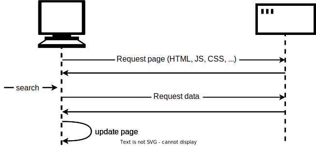

{{LearnSidebar}}

{{PreviousMenuNext("Learn_web_development/Core/Scripting/DOM_scripting","Learn_web_development/Core/Scripting/JSON", "Learn_web_development/Core/Scripting")}}

Another very common task in modern websites and applications is making network requests to retrieve individual data items from the server to update sections of a webpage without having to load an entire new page. This seemingly small detail has had a huge impact on the performance and behavior of sites, so in this article, we'll explain the concept and look at technologies that make it possible: in particular, the [Fetch API](/en-US/docs/Web/API/Fetch_API).

<table>
  <tbody>
    <tr>
      <th scope="row">Prerequisites:</th>
      <td>An understanding of <a href="/en-US/docs/Learn_web_development/Core/Structuring_content">HTML</a> and the <a href="/en-US/docs/Learn_web_development/Core/Styling_basics">fundamentals of CSS</a>, familiarity with JavaScript basics as covered in previous lessons.</td>
    </tr>
    <tr>
      <th scope="row">Learning outcomes:</th>
      <td>
        <ul>
          <li>Asynchronous network requests, which is by far the most common asynchronous JavaScript use case on the web.</li>
          <li>Common types of resources that are fetched from the network: JSON, media assets, data from RESTful APIs.</li>
          <li>How to use <code>fetch()</code> to implement asynchronous network requests.</li>
        </ul>
      </td>
    </tr>
  </tbody>
</table>

## What is the problem here?

A web page consists of an HTML page and (usually) various other files, such as stylesheets, scripts, and images. The basic model of page loading on the Web is that your browser makes one or more HTTP requests to the server for the files needed to display the page, and the server responds with the requested files. If you visit another page, the browser requests the new files, and the server responds with them.


This model works perfectly well for many sites. But consider a website that's very data-driven. For example, a library website like the [Vancouver Public Library](https://www.vpl.ca/). Among other things you could think of a site like this as a user interface to a database. It might let you search for a particular genre of book, or might show you recommendations for books you might like, based on books you've previously borrowed. When you do this, it needs to update the page with the new set of books to display. But note that most of the page content — including items like the page header, sidebar, and footer — stays the same.

The trouble with the traditional model here is that we'd have to fetch and load the entire page, even when we only need to update one part of it. This is inefficient and can result in a poor user experience.

So instead of the traditional model, many websites use JavaScript APIs to request data from the server and update the page content without a page load. So when the user searches for a new product, the browser only requests the data which is needed to update the page — the set of new books to display, for instance.



The main API here is the [Fetch API](/en-US/docs/Web/API/Fetch_API). This enables JavaScript running in a page to make an [HTTP](/en-US/docs/Web/HTTP) request to a server to retrieve specific resources. When the server provides them, the JavaScript can use the data to update the page, typically by using [DOM manipulation APIs](/en-US/docs/Learn_web_development/Core/Scripting/DOM_scripting). The data requested is often [JSON](/en-US/docs/Learn_web_development/Core/Scripting/JSON), which is a good format for transferring structured data, but can also be HTML or just text.

This is a common pattern for data-driven sites such as Amazon, YouTube, eBay, and so on. With this model:

- Page updates are a lot quicker and you don't have to wait for the page to refresh, meaning that the site feels faster and more responsive.
- Less data is downloaded on each update, meaning less wasted bandwidth. This may not be such a big issue on a desktop on a broadband connection, but it's a major issue on mobile devices and in countries that don't have ubiquitous fast internet service.

> [!NOTE]
> In the early days, this general technique was known as [Asynchronous](/en-US/docs/Glossary/Asynchronous) JavaScript and XML ([AJAX](/en-US/docs/Glossary/AJAX)), because it tended to request XML data. This is normally not the case these days (you'd be more likely to request JSON), but the result is still the same, and the term "AJAX" is still often used to describe the technique.

To speed things up even further, some sites also store assets and data on the user's computer when they are first requested, meaning that on subsequent visits they use the local versions instead of downloading fresh copies every time the page is first loaded. The content is only reloaded from the server when it has been updated.

## The Fetch API

Let's walk through a couple of examples of the Fetch API.

### Fetching text content

For this example, we'll request data out of a few different text files and use them to populate a content area.

This series of files will act as our fake database; in a real application, we'd be more likely to use a server-side language like PHP, Python, or Node to request our data from a database. Here, however, we want to keep it simple and concentrate on the client-side part of this.

To begin this example, make a local copy of [fetch-start.html](https://github.com/mdn/learning-area/blob/main/javascript/apis/fetching-data/fetch-start.html) and the four text files — [verse1.txt](https://github.com/mdn/learning-area/blob/main/javascript/apis/fetching-data/verse1.txt), [verse2.txt](https://github.com/mdn/learning-area/blob/main/javascript/apis/fetching-data/verse2.txt), [verse3.txt](https://github.com/mdn/learning-area/blob/main/javascript/apis/fetching-data/verse3.txt), and [verse4.txt](https://github.com/mdn/learning-area/blob/main/javascript/apis/fetching-data/verse4.txt) — in a new directory on your computer. In this example, we will fetch a different verse of the poem (which you may well recognize) when it's selected in the drop-down menu.

Just inside the {{htmlelement("script")}} element, add the following code. This stores references to the {{htmlelement("select")}} and {{htmlelement("pre")}} elements and adds a listener to the `<select>` element, so that when the user selects a new value, the new value is passed to the function named `updateDisplay()` as a parameter.

```js
const verseChoose = document.querySelector("select");
const poemDisplay = document.querySelector("pre");

verseChoose.addEventListener("change", () => {
  const verse = verseChoose.value;
  updateDisplay(verse);
});
```

Let's define our `updateDisplay()` function. First of all, put the following beneath your previous code block — this is the empty shell of the function.

```js-nolint
function updateDisplay(verse) {

}
```

We'll start our function by constructing a relative URL pointing to the text file we want to load, as we'll need it later. The value of the {{htmlelement("select")}} element at any time is the same as the text inside the selected {{htmlelement("option")}} (unless you specify a different value in a value attribute) — so for example "Verse 1". The corresponding verse text file is "verse1.txt", and is in the same directory as the HTML file, therefore just the file name will do.

However, web servers tend to be case-sensitive, and the file name doesn't have a space in it. To convert "Verse 1" to "verse1.txt" we need to convert the 'V' to lower case, remove the space, and add ".txt" on the end. This can be done with {{jsxref("String.replace", "replace()")}}, {{jsxref("String.toLowerCase", "toLowerCase()")}}, and [template literal](/en-US/docs/Web/JavaScript/Reference/Template_literals). Add the following lines inside your `updateDisplay()` function:

```js
verse = verse.replace(" ", "").toLowerCase();
const url = `${verse}.txt`;
```

Finally we're ready to use the Fetch API:

```js
// Call `fetch()`, passing in the URL.
fetch(url)
  // fetch() returns a promise. When we have received a response from the server,
  // the promise's `then()` handler is called with the response.
  .then((response) => {
    // Our handler throws an error if the request did not succeed.
    if (!response.ok) {
      throw new Error(`HTTP error: ${response.status}`);
    }
    // Otherwise (if the response succeeded), our handler fetches the response
    // as text by calling response.text(), and immediately returns the promise
    // returned by `response.text()`.
    return response.text();
  })
  // When response.text() has succeeded, the `then()` handler is called with
  // the text, and we copy it into the `poemDisplay` box.
  .then((text) => {
    poemDisplay.textContent = text;
  })
  // Catch any errors that might happen, and display a message
  // in the `poemDisplay` box.
  .catch((error) => {
    poemDisplay.textContent = `Could not fetch verse: ${error}`;
  });
```

There's quite a lot to unpack in here.

First, the entry point to the Fetch API is a global function called {{domxref("Window/fetch", "fetch()")}}, that takes the URL as a parameter (it takes another optional parameter for custom settings, but we're not using that here).

Next, `fetch()` is an asynchronous API which returns a {{jsxref("Promise")}}. If you don't know what that is, read the module on [asynchronous JavaScript](/en-US/docs/Learn_web_development/Extensions/Async_JS), and in particular the lesson on [promises](/en-US/docs/Learn_web_development/Extensions/Async_JS/Promises), then come back here. You'll find that article also talks about the `fetch()` API!

So because `fetch()` returns a promise, we pass a function into the {{jsxref("Promise/then", "then()")}} method of the returned promise. This method will be called when the HTTP request has received a response from the server. In the handler, we check that the request succeeded, and throw an error if it didn't. Otherwise, we call {{domxref("Response/text", "response.text()")}}, to get the response body as text.

It turns out that `response.text()` is _also_ asynchronous, so we return the promise it returns, and pass a function into the `then()` method of this new promise. This function will be called when the response text is ready, and inside it we will update our `<pre>` block with the text.

Finally, we chain a {{jsxref("Promise/catch", "catch()")}} handler at the end, to catch any errors thrown in either of the asynchronous functions we called or their handlers.

One problem with the example as it stands is that it won't show any of the poem when it first loads. To fix this, add the following two lines at the bottom of your code (just above the closing `</script>` tag) to load verse 1 by default, and make sure the {{htmlelement("select")}} element always shows the correct value:

```js
updateDisplay("Verse 1");
verseChoose.value = "Verse 1";
```

#### Serving your example from a server

Modern browsers will not run HTTP requests if you just run the example from a local file. This is because of security restrictions (for more on web security, read [Website security](/en-US/docs/Learn_web_development/Extensions/Server-side/First_steps/Website_security)).

To get around this, we need to test the example by running it through a local web server. To find out how to do this, see [How do you set up a local testing server?](/en-US/docs/Learn_web_development/Howto/Tools_and_setup/set_up_a_local_testing_server).

### The can store

In this example we have created a sample site called The Can Store — it's a fictional supermarket that only sells canned goods. You can find this [example live on GitHub](https://mdn.github.io/learning-area/javascript/apis/fetching-data/can-store/), and [see the source code](https://github.com/mdn/learning-area/tree/main/javascript/apis/fetching-data/can-store).


By default, the site displays all the products, but you can use the form controls in the left-hand column to filter them by category, or search term, or both.

There is quite a lot of complex code that deals with filtering the products by category and search terms, manipulating strings so the data displays correctly in the UI, etc. We won't discuss all of it in the article, but you can find extensive comments in the code (see [can-script.js](https://github.com/mdn/learning-area/blob/main/javascript/apis/fetching-data/can-store/can-script.js)).

We will, however, explain the Fetch code.

The first block that uses Fetch can be found at the start of the JavaScript:

```js
fetch("products.json")
  .then((response) => {
    if (!response.ok) {
      throw new Error(`HTTP error: ${response.status}`);
    }
    return response.json();
  })
  .then((json) => initialize(json))
  .catch((err) => console.error(`Fetch problem: ${err.message}`));
```

The `fetch()` function returns a promise. If this completes successfully, the function inside the first `.then()` block contains the `response` returned from the network.

Inside this function we:

- check that the server didn't return an error (such as [`404 Not Found`](/en-US/docs/Web/HTTP/Status/404)). If it did, we throw the error.
- call {{domxref("Response.json","json()")}} on the response. This will retrieve the data as a [JSON object](/en-US/docs/Learn_web_development/Core/Scripting/JSON). We return the promise returned by `response.json()`.

Next we pass a function into the `then()` method of that returned promise. This function will be passed an object containing the response data as JSON, which we pass into the `initialize()` function. It is `initialize()` which starts the process of displaying all the products in the user interface.

To handle errors, we chain a `.catch()` block onto the end of the chain. This runs if the promise fails for some reason. Inside it, we include a function that is passed as a parameter, an `err` object. This `err` object can be used to report the nature of the error that has occurred, in this case we do it with a simple `console.error()`.

However, a complete website would handle this error more gracefully by displaying a message on the user's screen and perhaps offering options to remedy the situation, but we don't need anything more than a simple `console.error()`.

You can test the failure case yourself:

<!-- cSpell:ignore produc -->

1. Make a local copy of the example files.
2. Run the code through a web server (as described above, in [Serving your example from a server](#serving_your_example_from_a_server)).
3. Modify the path to the file being fetched, to something like 'produc.json' (make sure it is misspelled).
4. Now load the index file in your browser (via `localhost:8000`) and look in your browser developer console. You'll see a message similar to "Fetch problem: HTTP error: 404".

The second Fetch block can be found inside the `fetchBlob()` function:

```js
fetch(url)
  .then((response) => {
    if (!response.ok) {
      throw new Error(`HTTP error: ${response.status}`);
    }
    return response.blob();
  })
  .then((blob) => showProduct(blob, product))
  .catch((err) => console.error(`Fetch problem: ${err.message}`));
```

This works in much the same way as the previous one, except that instead of using {{domxref("Response.json","json()")}}, we use {{domxref("Response.blob","blob()")}}. In this case we want to return our response as an image file, and the data format we use for that is [Blob](/en-US/docs/Web/API/Blob) (the term is an abbreviation of "Binary Large Object" and can basically be used to represent large file-like objects, such as images or video files).

Once we've successfully received our blob, we pass it into our `showProduct()` function, which displays it.

## The XMLHttpRequest API

Sometimes, especially in older code, you'll see another API called [`XMLHttpRequest`](/en-US/docs/Web/API/XMLHttpRequest) (often abbreviated as "XHR") used to make HTTP requests. This predated Fetch, and was really the first API widely used to implement AJAX. We recommend you use Fetch if you can: it's a simpler API and has more features than `XMLHttpRequest`. We won't go through an example that uses `XMLHttpRequest`, but we will show you what the `XMLHttpRequest` version of our first can store request would look like:

```js
const request = new XMLHttpRequest();

try {
  request.open("GET", "products.json");

  request.responseType = "json";

  request.addEventListener("load", () => initialize(request.response));
  request.addEventListener("error", () => console.error("XHR error"));

  request.send();
} catch (error) {
  console.error(`XHR error ${request.status}`);
}
```

There are five stages to this:

1. Create a new `XMLHttpRequest` object.
2. Call its [`open()`](/en-US/docs/Web/API/XMLHttpRequest/open) method to initialize it.
3. Add an event listener to its [`load`](/en-US/docs/Web/API/XMLHttpRequest/load_event) event, which fires when the response has completed successfully. In the listener we call `initialize()` with the data.
4. Add an event listener to its [`error`](/en-US/docs/Web/API/XMLHttpRequest/error_event) event, which fires when the request encounters an error
5. Send the request.

We also have to wrap the whole thing in the [try...catch](/en-US/docs/Web/JavaScript/Reference/Statements/try...catch) block, to handle any errors thrown by `open()` or `send()`.

Hopefully you think the Fetch API is an improvement over this. In particular, see how we have to handle errors in two different places.

## Summary

This article shows how to start working with Fetch to fetch data from the server.

## See also

There are however a lot of different subjects discussed in this article, which has only really scratched the surface. For a lot more detail on these subjects, try the following articles:

- [Using Fetch](/en-US/docs/Web/API/Fetch_API/Using_Fetch)
- [Promises](/en-US/docs/Web/JavaScript/Reference/Global_Objects/Promise)
- [Working with JSON data](/en-US/docs/Learn_web_development/Core/Scripting/JSON)
- [An overview of HTTP](/en-US/docs/Web/HTTP/Overview)
- [Server-side website programming](/en-US/docs/Learn_web_development/Extensions/Server-side)

{{PreviousMenuNext("Learn_web_development/Core/Scripting/DOM_scripting","Learn_web_development/Core/Scripting/JSON", "Learn_web_development/Core/Scripting")}}
