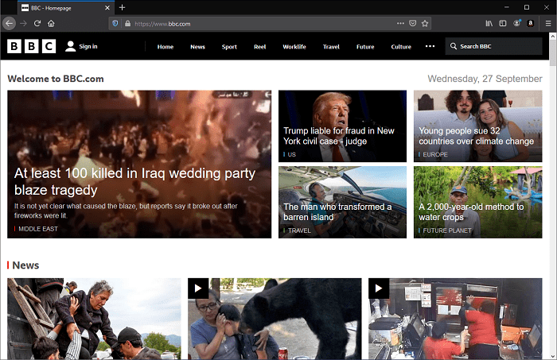
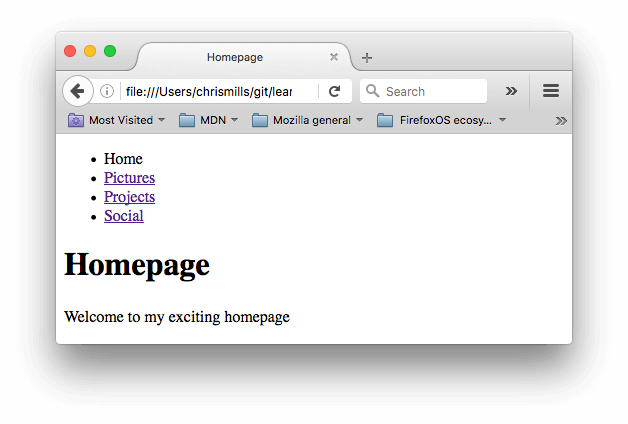

{{PreviousMenuNext("Learn_web_development/Core/Structuring_content/Structuring_documents", "Learn_web_development/Core/Structuring_content/Test_your_skills/Links", "Learn_web_development/Core/Structuring_content")}}

Links (also known as hyperlinks) are really important — they are what makes the Web _a web_.
This article shows the syntax required to make a link, and discusses link best practices.

<table>
  <tbody>
    <tr>
      <th scope="row">Prerequisites:</th>
      <td>
        Basic HTML familiarity, as covered in
        <a href="/en-US/docs/Learn_web_development/Core/Structuring_content/Basic_HTML_syntax"
          >Basic HTML Syntax</a
        >. Text-level semantics such as <a href="/en-US/docs/Learn_web_development/Core/Structuring_content/Headings_and_paragraphs"
          >headings and paragraphs</a
        > and <a href="/en-US/docs/Learn_web_development/Core/Structuring_content/Lists"
          >lists</a
        >.
      </td>
    </tr>
    <tr>
      <th scope="row">Learning outcomes:</th>
      <td>
        <ul>
          <li>Understand why links are the fundamental feature of the web. There is no web without links.</li>
          <li>The <code>href</code> attribute.</li>
          <li>Absolute and relative paths, and when to use them.</li>
          <li>Path syntax in detail — slashes, single dot, and double dot.</li>
          <li>Link states and why they are important — <code>:hover</code>, <code>:focus</code>, <code>:visited</code>, and <code>:active</code>.</li>
          <li>Inline and block-level links.</li>
          <li>Understanding the benefits of writing good link text, such as better accessibility for screen reader users, and potential positive SEO effects.</li>
        </ul>
      </td>
    </tr>
  </tbody>
</table>

## What is a hyperlink?

Hyperlinks are one of the most exciting innovations the Web has to offer.
They've been a feature of the Web since the beginning, and are what makes the Web _a web._
Hyperlinks allow us to link documents to other documents or resources, link to specific parts of documents, or make apps available at a web address.
Almost any web content can be converted to a link so that when clicked or otherwise activated the web browser goes to another web address ({{glossary("URL")}}).

> [!NOTE]
> A URL can point to HTML files, text files, images, text documents, video and audio files, or anything else that lives on the Web.
> If the web browser doesn't know how to display or handle the file, it will ask you if you want to open the file (in which case the duty of opening or handling the file is passed to a suitable native app on the device) or download the file (in which case you can try to deal with it later on).

For example, the BBC homepage contains many links that point not only to multiple news stories, but also different areas of the site (navigation functionality), login/registration pages (user tools), and more.



## Anatomy of a link

A basic link is created by wrapping the text or other content inside an {{htmlelement("a")}} element and using the [`href`](/en-US/docs/Web/HTML/Reference/Elements/a#href) attribute, also known as a **Hypertext Reference**, or **target**, that contains the web address.

```html
<p>
  I'm creating a link to
  <a href="https://www.mozilla.org/en-US/">the Mozilla homepage</a>.
</p>
```

This gives us the following result:

I'm creating a link to [the Mozilla homepage](https://www.mozilla.org/en-US/).

> [!NOTE]
> Scrimba's [Anchor tags](https://scrimba.com/learn-html-and-css-c0p/~0a?via=mdn) <sup>[_MDN learning partner_](/en-US/docs/MDN/Writing_guidelines/Learning_content#partner_links_and_embeds)</sup> scrim provides an interactive demonstration of how to create links using HTML, plus a challenge to get you creating your own links.

### Block level links

As mentioned before, almost any content can be made into a link, even {{Glossary("Block/CSS", "block-level elements")}}.
If you want to make a heading element a link then wrap it in an anchor (`<a>`) element as shown in the following code snippet:

```html
<a href="https://developer.mozilla.org/en-US/">
  <h1>MDN Web Docs</h1>
</a>
<p>
  Documenting web technologies, including CSS, HTML, and JavaScript, since 2005.
</p>
```

This turns the heading into a link:
{{EmbedLiveSample('Block level links', '100%', 150)}}

### Image links

To turn an image into a link, wrap the {{htmlelement("img")}} element with an {{htmlelement("a")}} element. The example below uses a relative path to reference a locally stored SVG image file.

```css hidden
img {
  height: 100px;
  width: 150px;
  border: 1px solid gray;
}
```

```html
<a href="https://developer.mozilla.org/en-US/">
  
</a>
```

This makes the MDN logo a link:
{{EmbedLiveSample('Image links', '100%', 150)}}

> [!NOTE]
> You'll find out more about using images on the Web in a future article.

### Adding supporting information with the title attribute

Another attribute you may want to add to your links is `title`.
The title contains additional information about the link, such as which kind of information the page contains, or things to be aware of on the website.

```html-nolint
<p>
  I'm creating a link to
  <a
    href="https://www.mozilla.org/en-US/"
    title="The best place to find more information about Mozilla's
          mission and how to contribute">
    the Mozilla homepage</a>.
</p>
```

This gives us the following result and hovering over the link displays the title as a tooltip:

{{EmbedLiveSample('Adding supporting information with the title attribute', '100%', 150)}}

> [!NOTE]
> A link title is only revealed on mouse hover, which means that people relying on keyboard controls or touchscreens to navigate web pages will have difficulty accessing title information.
> If a title's information is truly important to the usability of the page, then you should present it in a manner that will be accessible to all users, for example by putting it in the regular text.

### Creating your own example links

OK, now it's your turn!

1. Click **"Play"** in the code block below to edit the example in the MDN Playground, or make a copy of our [getting started template](https://github.com/mdn/learning-area/blob/main/html/introduction-to-html/getting-started/index.html) and copy the below code into there.
2. Link the "Red squirrel" and "Eastern gray squirrel" text to Wikipedia pages that describe the relevant species. Give each link a `title` attribute equal to the species' scientific name.
3. Link the "Wikipedia Squirrel page" text to the main Wikipedia page for squirrels.

If you make a mistake, you can clear your work using the _Reset_ button in the MDN Playground. If you get really stuck, you can view the solution below the code block.

```html live-sample___links-1
<h1>Squirrels</h1>

<p>
  Squirrels are commonly thought of as tree-dwelling mammals, but the squirrel
  family extends far beyond that to include ground-dwelling rodents such as
  chipmunks and prairie dogs, and flying squirrels.
</p>

<p>Two of the most common and best-known squirrel species are the:</p>

<ul>
  <li>Red squirrel</li>
  <li>Eastern gray squirrel</li>
</ul>

<p>
  For a good starting point on squirrel information, see the Wikipedia Squirrel
  page.
</p>
```

{{ EmbedLiveSample('links-1', "100%", 280) }}

<details>
<summary>Click here to show the solution</summary>

Your finished HTML should look like this:

```html
<h1>Squirrels</h1>

<p>
  Squirrels are commonly thought of as tree-dwelling mammals, but the squirrel
  family extends far beyond that to include ground-dwelling rodents such as
  chipmunks and prairie dogs, and flying squirrels.
</p>

<p>Two of the most common and best-known squirrel species are the:</p>

<ul>
  <li>
    <a
      href="https://en.wikipedia.org/wiki/Red_squirrel"
      title="Sciurus vulgaris">
      Red squirrel
    </a>
  </li>
  <li>
    <a
      href="https://en.wikipedia.org/wiki/Eastern_gray_squirrel"
      title="Sciurus carolinensis">
      Eastern gray squirrel
    </a>
  </li>
</ul>

<p>
  For a good starting point on squirrel information, see the
  <a href="https://en.wikipedia.org/wiki/Squirrel">Wikipedia Squirrel page</a>.
</p>
```

</details>

## A quick primer on URLs and paths

To fully understand link targets, you need to understand URLs and file paths.

A URL, or Uniform Resource Locator, is a string of text that defines where something is located on the Web. For example, Mozilla's English homepage is located at `https://www.mozilla.org/en-US/`.

URLs use paths to find files. Paths specify where the file you're interested in is located in the website's filesystem. Let's look at an example of a website directory structure:


The **root** of this directory structure is called `creating-hyperlinks`. When working locally with a website, you'll have one directory that contains the entire site. Inside the **root**, we have an `index.html` file and a `contacts.html`. In a real website, `index.html` would be our home page or landing page (a web page that serves as the entry point for a website or a particular section of a website.).

There are also two directories inside our root — `pdfs` and `projects`. These each have a single file inside them — a PDF (`project-brief.pdf`) and an `index.html` file, respectively. Note that you can have multiple `index.html` files in one project, as long as they're in different filesystem locations. The second `index.html` would perhaps be the main landing page for project-related information.

Let's look at some examples of links between some different files in this directory structure to demonstrate different path types.

### Same directory

If you want to include a hyperlink inside the top level `index.html` pointing to `contacts.html`, you can specify the path as just the filename that you want to link to, because it's in the same directory as the current file. The URL you would use is `contacts.html`:

```html
<p>
  Want to contact a specific staff member? Find details on our
  <a href="contacts.html">contacts page</a>.
</p>
```

You can also start a path to a file inside the same directory using a single dot followed by a slash: `./`. The following example is equivalent to the previous one, but some people like to include the `./` anyway because they feel it provides more clarity:

```html
<p>
  Want to contact a specific staff member? Find details on our
  <a href="./contacts.html">contacts page</a>.
</p>
```

> [!NOTE]
> There are some instances in which including `./` in your path will make a difference, for example when specifying paths for [JavaScript module](/en-US/docs/Web/JavaScript/Guide/Modules) imports, but you don't need to worry about this for static HTML and CSS links.

### Moving down into subdirectories

If you want to include a hyperlink inside the top level `index.html` pointing to `projects/index.html`, you need to go down into the `projects` directory before indicating the file you want to link to. This is done by specifying the directory's name, then a forward slash, then the name of the file. The URL you can use is `projects/index.html`:

```html
<p>Visit my <a href="projects/index.html">project homepage</a>.</p>
```

### Moving back up into parent directories

If you want to include a hyperlink inside `projects/index.html` pointing to `pdfs/project-brief.pdf`, you have to go up a directory level, then back down into the `pdfs` directory. To go up a directory, you use two dots — `..` — so the URL is `../pdfs/project-brief.pdf`:

```html
<p>A link to my <a href="../pdfs/project-brief.pdf">project brief</a>.</p>
```

> [!NOTE]
> You can combine multiple instances of these features into complex paths, if needed, for example: `../../../complex/path/to/my/file.html`.

### Linking relative to the root directory

The above URLs work, but bear in mind that if you move either the linking file or the linked file to a different location, you will break the link.

If you want to create a link to a specific location that won't break if you move the linking file, you can do so by putting a single slash at the start of the path — this indicates that the path starts in the root directory of the site. For example, the previous link inside `projects/index.html` could be rewritten as:

```html
<p>A link to my <a href="/pdfs/project-brief.pdf">project brief</a>.</p>
```

Now the path will always start from the root directory (`creating-hyperlinks`), travel to the `pdfs` directory, and find the `project-brief.pdf` file. This will still work if you move the linking file to a different location, for example `a/b/c/d/e/index.html`.

If you move the linked `project-brief.pdf` file to a different location, you will still break the link.

### Document fragments

It's possible to link to a specific part of an HTML document, known as a **document fragment**, rather than just to the top of the document.
To do this you first have to assign an [`id`](/en-US/docs/Web/HTML/Reference/Global_attributes/id) attribute to the element you want to link to.
It normally makes sense to link to a specific heading, so this would look something like the following:

```html
<h2 id="mailing_address">Mailing address</h2>
```

To link to that specific `id`, you include it at the end of the path, preceded by a hash/pound symbol (`#`), for example:

```html
<p>
  Want to write us a letter? Use our
  <a href="contacts.html#mailing_address">mailing address</a>.
</p>
```

You can even use the document fragment reference on its own to link to _another part of the current document_:

```html
<p>
  The <a href="mailing_address">company mailing address</a> can be found at the
  bottom of this page.
</p>
```

### Absolute versus relative paths

Two terms you'll come across on the web are **absolute path** and **relative path**.

- Absolute path: Points to a location defined by its absolute location in your site (or elsewhere on the web). For example, you can create an absolute link that always points to the same location relative to the site root directory using the single slash at the start of the path, as we saw earlier: `/pdfs/project-brief.pdf`.
- Relative path: Points to a location that is _relative_ to the file you are linking from. In our earlier example, we used `projects/index.html` to create a relative link between the current file and a file called `index.html` that is inside a `projects` subdirectory. If you were to move the current file to a different location, the path would still be relative to that file, but it would point to a different absolute location.

### How do paths translate into URLs?

When talking about static websites, the URL a file is available at is a combination of the location it is uploaded to on a web server, and the {{glossary("domain name")}} of the website.

> [!NOTE]
> With dynamic websites, for example, built with web frameworks, things are often not that simple as they generate files and URLs dynamically. Don't worry about this for now.

For example, if we upload our sample site directory structure to the root of a web server (not in some kind of subfolder) and the website {{glossary("domain name")}} is set to `example.com`, our `pdfs/project-brief.pdf` file would be available at `https://www.example.com/pdfs/project-brief.pdf`.

If we wanted to create a working link to this file:

- `/pdfs/project-brief.pdf` would always create a link to `https://www.example.com/pdfs/project-brief.pdf`, as it is an absolute path that always points to the same place on the site.
- `projects/index.html` would create a link to `https://www.example.com/projects/index.html`, but only when included in a file inside the root directory, such as the top-level `index.html` file, or `contacts.html`. If you included it, for example, inside an HTML file at `pdfs/index.html`, it would link to `https://www.example.com/pdfs/projects/index.html`, which doesn't exist, so you'd end up with a broken link.

#### The default `index.html` page

When referencing an `index.html` file, you generally don't need to include the `index.html` in the URL/path, because web servers look for a default landing page called `index.html` when a filename isn't specified.

Looking again at our `projects/index.html` path example, we could just write the path as `projects`, and this would create a link to `https://www.example.com/projects/index.html`. When navigating to the page, we could write the URL as `https://www.example.com/projects/` and it would still get us to the right place.

#### Specifying a URL as the path

You can specify a full URL as your path, which will always point to the same location on the web, no matter where it's used. For example:

```html
<a href="https://www.example.com/projects/">projects</a>
```

This link will always link to `https://www.example.com/projects/`, no matter where it appears in a site. In this context, the URL is a type of absolute path.

#### Internal versus external links

When a link points to a resource on _your_ site, it is referred to as an **internal link**. When a link points to a resource on a _different_ site, it is called an **external link**.

When specifying an external link, you always have to include the full URL as the path, for example:

```html
<a href="https://www.some-other-site.com">projects</a>
```

You can't reference a location on a different site with a path like `/pdfs/project-brief.pdf` or `projects/index.html`, as they are both relative to a location on your own site, and the browser needs the website's domain name to be able to find it.

When specifying an internal link, you can use a relative or absolute path, or a full URL. In our example, these links are equivalent:

```html
<a href="https://www.example.com/projects/">projects</a>

<a href="projects">projects</a>
```

However, there are a couple of good reasons why you shouldn't use full URLs for internal links:

- Efficiency: It takes more resources to look up a full URL. If you specify `https://www.example.com/projects/`, when a user clicks on the link the browser will first look up the server location, then look for the linked page. If you specify `projects`, the browser will immediately look for the linked page on the same server it is already on.
- Portability: As we've said before, if you specify `https://www.example.com/projects/`, it will always link to `https://www.example.com/projects/`. If you then move your website to a different domain, for example `another-example.com`, your full URL links will all need to be changed. If you specify paths such as `projects`, they will still work, as they are still relative to the directory structure.

## Link best practices

There are some best practices to follow when writing links. Let's look at these now.

### Use clear link wording

It's easy to throw links up on your page. That's not enough. We need to make our links _accessible_ to all readers, regardless of their current context and which tools they prefer. For example:

- Screen reader users like jumping around from link to link on the page, and reading links out of context.
- Search engines use link text to index target files, so it is a good idea to include keywords in your link text to effectively describe what is being linked to.
- Visual readers skim over the page rather than reading every word, and their eyes will be drawn to page features that stand out, like links. They will find descriptive link text useful.

Let's look at a specific example:

**Good** link text: [Download Firefox](https://www.firefox.com/en-US/?redirect_source=firefox-com)

```html example-good
<p><a href="https://www.firefox.com/en-US/">Download Firefox</a></p>
```

<!-- markdownlint-disable descriptive-link-text -->

**Bad** link text: [Click here](https://www.firefox.com/en-US/) to download Firefox

```html example-bad
<p>
  <a href="https://www.firefox.com/en-US/">Click here</a> to download Firefox
</p>
```

<!-- markdownlint-enable descriptive-link-text -->

Other tips:

- Don't repeat the URL as part of the link text — URLs look ugly, and sound even uglier when a screen reader reads them out letter by letter.
- Don't say "link" or "links to" in the link text — it's just noise. Screen readers tell people there's a link.
  Visual users will also know there's a link, because links are generally styled in a different color and underlined (this convention generally shouldn't be broken, as users are used to it).
- Keep your link text as short as possible — this is helpful because screen readers need to interpret the entire link text.
- Minimize instances where multiple copies of the same text are linked to different places.
  This can cause problems for screen reader users, if there's a list of links out of context that are labeled "click here", "click here", "click here".

### Linking to non-HTML resources — leave clear signposts

When linking to a resource that will not be opened in the current page as a "normal navigation", you should add clear wording to the link text about what is going to happen. For example, if you're downloading or streaming a resource, or if the link is going to open a popup or perform some other potentially unexpected effect, this should be stated in the text. This is important for users on low bandwidth connections, who might want to avoid downloading assets of multiple megabytes. It also helps to set up expectations for screen reader users, who may not be aware of what's happening otherwise.

Let's look at some examples, to see what kind of text can be used here:

```html
<p>
  <a href="/large-report.pdf" download>
    Download the sales report (PDF, 10MB)
  </a>
</p>

<p>
  <a href="https://www.example.com/video-stream/" target="_blank">
    Watch the video (stream opens in separate tab, HD quality)
  </a>
</p>
```

### Use the download attribute when linking to a download

When you are linking to a resource that's to be downloaded rather than opened in the browser, you can use the `download` attribute to provide a default save filename. Here's an example with a download link to the latest Windows version of Firefox:

```html
<a
  href="https://download.mozilla.org/?product=firefox-latest-ssl&os=win64&lang=en-US"
  download="firefox-latest-64bit-installer.exe">
  Download Latest Firefox for Windows (64-bit) (English, US)
</a>
```

### When to open links in a new tab

Links by default open in the same tab as the page they are on, which allows the user to navigate back to the previous page using the browser's back button. However, many sites (including MDN) choose to open certain links, especially external links, in a new tab. This is done by setting the [`target`](/en-US/docs/Web/HTML/Reference/Elements/a#target) attribute to `"_blank"`.

```html
Firefox is developed by the
<a href="https://www.mozilla.org/en-US/" target="_blank">Mozilla Foundation</a>.
```

Whether or not to open links in a new tab should be a conscious decision, based on user experience design considerations. Here are some things to think about:

- Opening links in a new tab presents the two documents simultaneously, which is useful for a "parallel" navigation experience. On the other hand, links that open in the same tab are more like a continuation of the current page.
- Opening links in a new tab can be disorienting for users who are accustomed to using the back button.
- Even when links are opened in the same tab by default, users can still choose to open them in a new tab, using keyboard shortcuts or context menu options. On the other hand, links that open in a new tab are hard to open in the same tab.
- Screen reader users may be confused by links that open in a new tab, as they may not realize that the new tab has opened, and they may lose context about their location on the page.

A common approach is to open external links in new tabs and internal links in the same tab.
Some designers prefer to open all links in the same tab.
If you do open links in new tabs, then it is recommended that you provide cues for these links, such as an icon next to the link text.

## Creating a navigation menu

For this exercise, we'd like you to link some pages together with a navigation menu to create a multipage website. This is one common way in which a website is created — the same page structure is used on every page, including the same navigation menu, so when links are clicked it gives the impression that you are staying in the same place, and different content is being brought up.

You'll need to make local copies of the following four pages, all in the same directory. For a complete file list, see the [navigation-menu-start](https://github.com/mdn/learning-area/tree/main/html/introduction-to-html/navigation-menu-start) directory:

- [index.html](https://github.com/mdn/learning-area/blob/main/html/introduction-to-html/navigation-menu-start/index.html)
- [projects.html](https://github.com/mdn/learning-area/blob/main/html/introduction-to-html/navigation-menu-start/projects.html)
- [pictures.html](https://github.com/mdn/learning-area/blob/main/html/introduction-to-html/navigation-menu-start/pictures.html)
- [social.html](https://github.com/mdn/learning-area/blob/main/html/introduction-to-html/navigation-menu-start/social.html)

You should:

1. Add an unordered list in the indicated place on one page that includes the names of the pages to link to.
   A navigation menu is usually just a list of links, so this is semantically OK.
2. Change each page name into a link to that page.
3. Copy the navigation menu across to each page.
4. On each page, remove just the link to that same page — it's confusing and unnecessary for a page to include a link to itself.
   And, the lack of a link acts a good visual reminder of which page you are currently on.

The finished example should look similar to the following page:



> [!NOTE]
> If you get stuck, or aren't sure if you have got it right, you can check the [navigation-menu-marked-up](https://github.com/mdn/learning-area/tree/main/html/introduction-to-html/navigation-menu-marked-up) directory to see the correct answer.

## Email links

It's possible to create links or buttons that, when clicked, open a new outgoing email message rather than linking to a resource or page.
This is done using the {{HTMLElement("a")}} element and the `mailto:` URL scheme.

In its most basic and commonly used form, a `mailto:` link indicates the email address of the intended recipient. For example:

```html
<a href="mailto:nowhere@mozilla.org">Send email to nowhere</a>
```

This results in a link that looks like this: [Send email to nowhere](mailto:nowhere@mozilla.org).

In fact, the email address is optional. If you omit it and your [`href`](/en-US/docs/Web/HTML/Reference/Elements/a#href) is "mailto:", a new outgoing email window will be opened by the user's email client with no destination address.
This is often useful as "Share" links that users can click to send an email to an address of their choosing.

### Specifying details

In addition to the email address, you can provide other information. In fact, any standard mail header fields can be added to the `mailto` URL you provide.
The most commonly used of these are "subject", "cc", and "body" (which is not a true header field, but allows you to specify a short content message for the new email).
Each field and its value is specified as a query term.

Here's an example that includes a cc, bcc, subject and body:

```html
<a
  href="mailto:nowhere@mozilla.org?cc=name2@rapidtables.com&bcc=name3@rapidtables.com&subject=The%20subject%20of%20the%20email&body=The%20body%20of%20the%20email">
  Send mail with cc, bcc, subject and body
</a>
```

> [!NOTE]
> The values of each field must be URL-encoded with non-printing characters (invisible characters like tabs, carriage returns, and page breaks) and spaces {{Glossary("Percent-encoding", "percent-escaped")}}.
> Also, note the use of the question mark (`?`) to separate the main URL from the field values, and ampersands (&) to separate each field in the `mailto:` URL.
> This is standard URL query notation.
> Read [The GET method](/en-US/docs/Learn_web_development/Extensions/Forms/Sending_and_retrieving_form_data#the_get_method) to understand what URL query notation is more commonly used for.

Here are a few other sample `mailto` URLs:

- <mailto:>
- <mailto:nowhere@mozilla.org>
- <mailto:nowhere@mozilla.org,nobody@mozilla.org>
- <mailto:nowhere@mozilla.org?cc=nobody@mozilla.org>
- <mailto:nowhere@mozilla.org?cc=nobody@mozilla.org&subject=This%20is%20the%20subject>

## Summary

That's it for links, for now anyway! You'll return to links later on in the course when you start to look at styling them. Next up, we'll give you some tests that you can use to check how well you've understood and retained the information we've provided on links.

{{PreviousMenuNext("Learn_web_development/Core/Structuring_content/Structuring_documents", "Learn_web_development/Core/Structuring_content/Test_your_skills/Links", "Learn_web_development/Core/Structuring_content")}}
