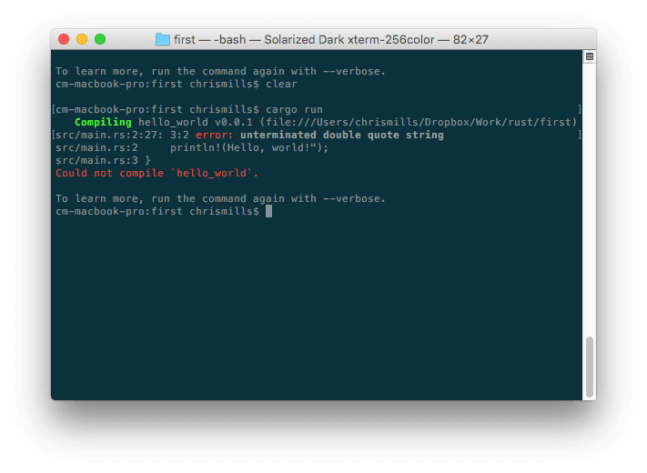
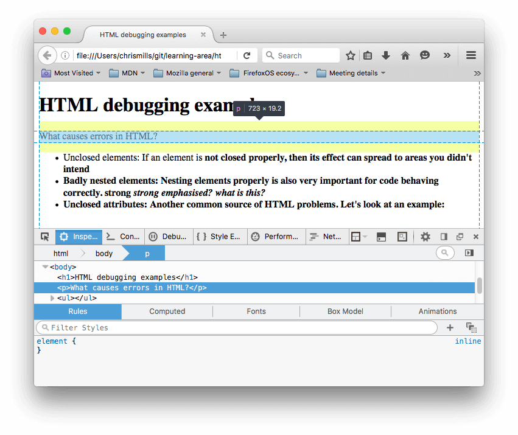
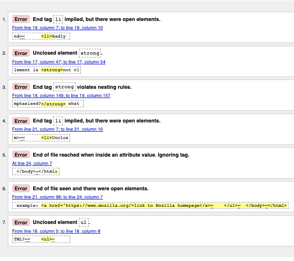

{{PreviousMenuNext("Learn_web_development/Core/Structuring_content/Forms_challenge", "Learn_web_development/Core/Styling_basics", "Learn_web_development/Core/Structuring_content")}}

Writing HTML is fine, but what if something goes wrong, and you can't work out where the error in the code is? This article will introduce you to some tools that can help you find and fix errors in HTML.

<table>
  <tbody>
    <tr>
      <th scope="row">Prerequisites:</th>
      <td>
        Basic HTML familiarity, as covered in
        <a href="/en-US/docs/Learn_web_development/Core/Structuring_content/Basic_HTML_syntax"
          >Basic HTML Syntax</a
        >. Text-level semantics such as <a href="/en-US/docs/Learn_web_development/Core/Structuring_content/Headings_and_paragraphs"
          >headings and paragraphs</a
        > and <a href="/en-US/docs/Learn_web_development/Core/Structuring_content/Lists"
          >lists</a
        >. <a href="/en-US/docs/Learn_web_development/Core/Structuring_content/Structuring_documents"
          >Structural HTML</a>.
      </td>
    </tr>
    <tr>
      <th scope="row">Learning outcomes:</th>
      <td>
        <ul>
          <li>The key background around debugging HTML</li>
          <li>Using the DOM inspector in your browser DevTools to dive deeper into your HTML code.</li>
          <li>Exploring common HTML error types.</li>
          <li>Using the <a href="https://validator.w3.org/">HTML validator</a> to detect HTML errors.</li>
        </ul>
      </td>
    </tr>
  </tbody>
</table>

## Debugging isn't scary

When writing code of some kind, everything is fine, until that dreaded moment when an error occurs — you've done something wrong, so your code doesn't work — either not at all, or not quite how you wanted it to. For example, the following shows an error reported when trying to {{glossary("compile")}} a simple program written in the [Rust](https://rust-lang.org/) language.



Here, the error message is relatively easy to understand — "unterminated double quote string". If you look at the listing, you can probably see how `println!(Hello, world!");` might logically be missing a double quote. However, error messages can quickly get more complicated and less easy to interpret as programs get bigger, and even simple cases can look a little intimidating to someone who doesn't know anything about Rust.

Debugging doesn't have to be scary though — the key to being comfortable with writing and debugging any code is familiarity with both the language and the associated tools.

## HTML and debugging

HTML is not as complicated to understand as Rust. HTML is not compiled into a different form before parsing (it is _interpreted_, not _compiled_). And HTML's {{glossary("element")}} syntax is arguably a lot easier to understand than a "real programming language" like Rust, {{glossary("JavaScript")}}, or {{glossary("Python")}}.

The way that browsers parse HTML is a lot more **permissive** than how most programming languages are parsed, which is both a good and a bad thing.

But first of all, what do we mean by permissive? Well, generally when you do something wrong in code, there are two main types of error that you'll come across:

- **Syntax errors**: These are typos in your code that cause the program not to run, like the Rust error shown earlier. These are usually easy to fix as long as you are familiar with the language's syntax and know what the error messages mean.
- **Logic errors**: These are errors where the syntax is actually correct, but the code is not doing what you intended it to, meaning that the program runs incorrectly. These are often harder to fix than syntax errors, as there isn't an error message to direct you to the source of the error.

HTML itself doesn't suffer from syntax errors because browsers parse it permissively, meaning that the page still displays even if there are syntax errors in the source code. Browsers have built-in rules to state how to interpret incorrectly-written HTML markup (often called **invalid** or **badly-formed** markup), changing it automatically to some valid markup.

For example, the following HTML snippet contains incorrectly nested elements:

```html example-bad
<p>I didn't expect to find the <em>next-door neighbor's <strong>cat</em></strong> here!</p>
```

The closing `</strong>` tag should be before the closing `</em>` tag, but it is not — it is after it.

If you load this HTML into a browser then look at the [rendered DOM](/en-US/docs/Learn_web_development/Getting_started/Web_standards/How_browsers_load_websites#handling_html), you'll see that the nesting has been corrected by the browser:

```html example-good
<p>
  I didn't expect to find the
  <em>next-door neighbor's <strong>cat</strong></em> here!
</p>
```

So why is this both good and bad? Well, in this case the browser has created the intended result, but as you'll see [later on](#your_turn_studying_html_using_the_dom_inspector), this is not always the case. You'll always get _something_ running, but the browser doesn't always get it right, which can cause problems. It is better to write correct markup in the first place.

> [!NOTE]
> HTML is parsed permissively because when the web was first created, it was decided that getting content published was more important than making sure the syntax was absolutely correct. The web would probably not be as popular as it is today if it had been more strict from the very beginning.

So how do you find markup errors? Later on we will show you how to find errors in HTML using a tool called the [HTML validator](#html_validation), but first we will show you how to inspect your HTML manually using a **DOM inspector**, and then explore what kinds of markup errors you might be looking for, and how the browser might interpret those.

## Using the DOM inspector

All modern browsers have a set of [developer tools](/en-US/docs/Learn_web_development/Howto/Tools_and_setup/What_are_browser_developer_tools) (devtools) built into them, which provide a set of functionality for examining the webpage loaded into the current tab. These can show you what HTML is rendered in the page, what CSS is applied to each DOM node, what JavaScript is running in the page, and more. They also allow you to edit the currently-running code and see the effect live on the page.

You can open the devtools in a similar way in each browser — see [How to open the devtools in your browser](/en-US/docs/Learn_web_development/Howto/Tools_and_setup/What_are_browser_developer_tools#how_to_open_the_devtools_in_your_browser) to learn how.

For this article, the only relevant devtools function is the **DOM inspector**, which shows the currently-rendered HTML DOM and allows you to edit it. Let's look at this now:

1. Open the devtools in your browser.
2. Open the DOM inspector. It is in the same place in each browser — the first tab in the devtools at the start of the row. In Firefox it is labelled _Inspector_, while in Safari, Edge, and Chrome it is labeled _Elements_. This should be the tab selected by default when you first open the devtools, but select it if it isn't.
3. Examine the DOM tree structure shown in the tab, and note how you can click the little expansion arrows at the start of each DOM node to expand and collapse them and reveal their descendant nodes. You can also use the up and down cursor keys to move up and down the nodes, and the right and left cursor keys to expand and collapse the nodes.
4. Also try hovering over the nodes (or selecting them with the cursor keys) and note how the currently-hovered (or selected) element is highlighted in the viewport.
5. You can also edit the rendered DOM. We won't use the editing functionality in this article, but take some time to look up how to do this if you are curious.

## Your turn: Studying HTML using the DOM inspector

In this section, you'll study some code using the DOM inspector and see how the browser handles common markup errors.

1. First, save the following HTML file listing as `debug-example.html`, somewhere on your local machine. This demo is deliberately written with some built-in errors for us to explore.

   ```html-nolint
   <!doctype html>
   <html lang="en-US">
     <head>
       <meta charset="utf-8">
       <title>HTML debugging examples</title>
     </head>

     <body>
       <h1>HTML debugging examples</h1>
       <p>What causes errors in HTML?
       <ul>
         <li>Unclosed elements: If an element is <strong>not closed properly,then its effect can spread to areas you didn't intend
         <li>Badly nested elements: Nesting elements properly is also very important for code behaving correctly. <strong>strong <em>strong emphasized?</strong> what is this?</em>
         <li>Unclosed attributes: Another common source of HTML problems. Let's look at an example: <a href="https://www.mozilla.org/>link to Mozilla homepage</a>
       </ul>
     </body>
   </html>
   ```

2. Next, open it in a browser. You will see something like this:
3. This immediately doesn't look great; let's look at the source code to see if we can work out why (only the body contents are shown):

   ```html
   <h1>HTML debugging examples</h1>

   <p>What causes errors in HTML?

   <ul>
     <li>Unclosed elements: If an element is <strong>not closed properly,
         then its effect can spread to areas you didn't intend

     <li>Badly nested elements: Nesting elements properly is also very important
         for code behaving correctly. <strong>strong <em>strong emphasized?</strong>
         what is this?</em>

     <li>Unclosed attributes: Another common source of HTML problems. Let's
         look at an example: <a href="https://www.mozilla.org/>link to Mozilla
         homepage</a>
   </ul>
   ```

4. Let's review the problems:
   - The {{htmlelement("p","paragraph")}} and {{htmlelement("li","list item")}} elements have no closing tags. Looking at the image above, this doesn't seem to have affected the markup rendering too badly, as it is easy to infer where one element should end and another should begin.
   - The first {{htmlelement("strong")}} element has no closing tag. This is a bit more problematic, as it isn't easy to tell where the element is supposed to end. In fact, the whole of the rest of the text has been rendered in bold.
   - This section is badly nested: `<strong>strong <em>strong emphasized?</strong> what is this?</em>`. It is not easy to tell how this has been interpreted because of the previous problem.
   - The [`href`](/en-US/docs/Web/HTML/Reference/Elements/a#href) attribute value is missing a closing double quote. This seems to have caused the biggest problem — the link has not been rendered at all.

5. Now let's examine the rendered DOM, as opposed to the source code. To do this, open your browser's DOM inspector. You will see a representation of the rendered markup: 
6. Look at how the browser has tried to fix our HTML errors (we did the review in Firefox; other modern browsers _should_ give the same result):
   - The paragraphs and list items have been given closing tags.
   - It isn't clear where the first `<strong>` element should be closed, so the browser has wrapped each separate block of text in its own `<strong>` element, right down to the bottom of the document!
   - The incorrect nesting has been fixed by the browser as shown here:

     ```html
     <strong>
       strong
       <em>strong emphasized?</em>
     </strong>
     <em> what is this?</em>
     ```

   - The link with the missing double quote has been deleted altogether. The last list item looks like this:

     ```html
     <li>
       <strong>
         Unclosed attributes: Another common source of HTML problems. Let's look
         at an example:
       </strong>
     </li>
     ```

## HTML validation

You can see from the above example that you really want to make sure your HTML is well-formed! But how? In a small example like the one seen above, it is easy to search through the lines and find the errors, but what about a huge, complex HTML document?

The tool for this job is the [Markup Validation Service](https://validator.w3.org/) (or **HTML validator**), which is created and maintained by the W3C (which you learned about in [The web standards model](/en-US/docs/Learn_web_development/Getting_started/Web_standards/The_web_standards_model)). The validator takes an HTML document as an input, goes through it, and gives you a report to tell you what is wrong with your HTML.


To specify the HTML to validate, you can provide a web address, upload an HTML file, or directly input some HTML code.

## Validating an HTML document

In this task, we'll get you to try out the HTML validator. You will validate our [sample document](https://github.com/mdn/learning-area/blob/main/html/introduction-to-html/debugging-html/debug-example.html) and see what results are returned. This example contains the same HTML that you studied with the DOM inspector earlier.

1. First, load the [Markup Validation Service](https://validator.w3.org/) in a new browser tab, if it isn't already open.
2. Switch to the [Validate by Direct Input](https://validator.w3.org/#validate_by_input) tab.
3. Copy all of the sample document's code (not just the body) and paste it into the large text area shown in the Markup Validation Service.
4. Press the _Check_ button.

This should give you a list of errors and other information.



### Interpreting the error messages

The error messages are usually helpful, but sometimes they are not so easy to understand. With a bit of practice, you can work out how to interpret these to fix your code. Let's go through the error messages and see what they mean. You'll see that each message comes with a line and column number to help you to locate the error easily.

- "End tag `li` implied, but there were open elements" (2 instances): These messages indicate that an element is open that should be closed. The ending tag is implied, but not actually there. The line/column information points to the first line after the line where the closing tag should really be, but this is a good enough clue to see what is wrong.
- "Unclosed element `strong`": This is easier to understand — a {{htmlelement("strong")}} element is unclosed, and the line/column information points right to where it is.
- "End tag `strong` violates nesting rules": This points out the incorrectly nested elements, and the line/column information points out where they are.
- "End of file reached when inside an attribute value. Ignoring tag": This one is rather cryptic; it refers to the fact that there is an attribute value not properly formed somewhere, possibly near the end of the file because the end of the file appears inside the attribute value. The fact that the browser doesn't render the link should give us a good clue as to what element is at fault.
- "End of file seen and there were open elements": This is a bit ambiguous, but basically refers to the fact there are open elements that need to be properly closed. The line numbers point to the last few lines of the file, and this error message comes with a line of code that points out an example of an open element:

  ```plain
  example: <a href="https://www.mozilla.org/>link to Mozilla homepage</a> ↩ </ul>↩ </body>↩</html>
  ```

  > [!NOTE]
  > An attribute missing a closing quote can result in an open element because the rest of the document is interpreted as the attribute's content.

- "Unclosed element `ul`": This is not very helpful, as the {{htmlelement("ul")}} element _is_ closed correctly. This error occurs because the {{htmlelement("a")}} element is not closed, due to the missing closing quote mark.

If you can't work out what every error message means, don't worry about it. A good strategy is to fix a few errors at a time, then revalidate your HTML after each set of fixes to show what errors are left. Sometimes, fixing an earlier error will also get rid of other error messages — several errors can often be caused by a single problem, in a domino effect.

You will know when all your errors are fixed when you see a nice little green banner telling you there are no errors to report. At the time of writing, it said "Document checking completed. No errors or warnings to show."

## Summary

So there we have it, an introduction to debugging HTML, which should give you some useful skills to count on when debugging HTML, but also CSS and JavaScript code later on in the course. This also marks the end of the _Structuring content with HTML_ module.

{{PreviousMenuNext("Learn_web_development/Core/Structuring_content/Forms_challenge", "Learn_web_development/Core/Styling_basics", "Learn_web_development/Core/Structuring_content")}}
