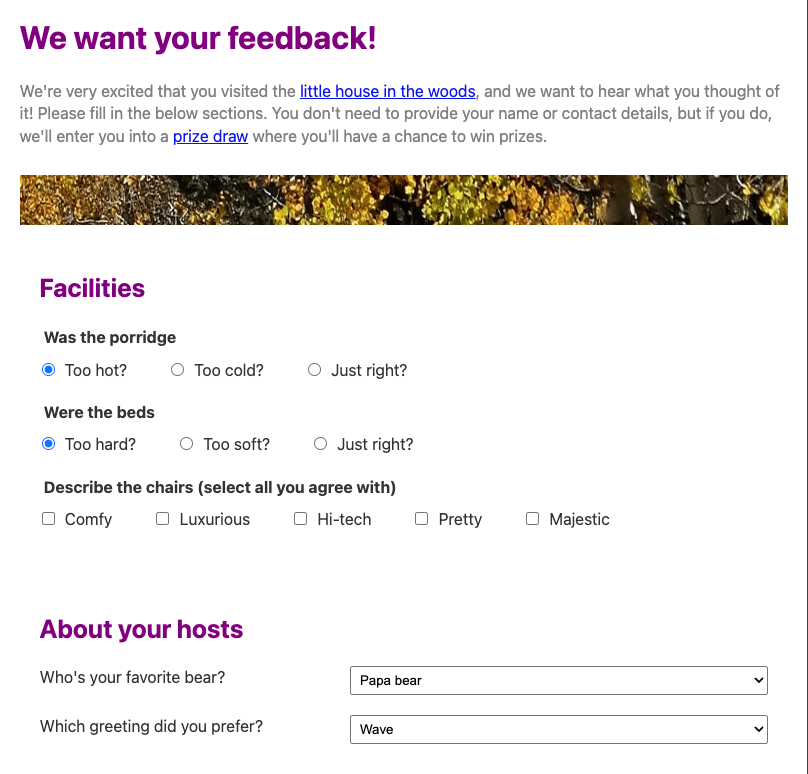

{{PreviousMenuNext("Learn_web_development/Core/Structuring_content/Test_your_skills/Forms_and_buttons", "Learn_web_development/Core/Structuring_content/Debugging_HTML", "Learn_web_development/Core/Structuring_content")}}

In this challenge, we are going to test your ability to create and structure a form, as well as add some other HTML features to it.

## Starting point

To solve this challenge we are expecting you to create a simple website project, either inside a folder on your computer's harddrive, or using an online editor such as [CodePen](https://codepen.io/) or [JSFiddle](https://jsfiddle.net/). Much of the code you need is already provided.

1. Create a new folder in an appropriate location on your computer called `forms-challenge` (or open an online editor and take the required steps to create a new project).
2. Save the following HTML listing inside a file inside your folder called `index.html` (or paste it into your online editor's HTML pane).

   ```html-nolint
   <!DOCTYPE html>
   <html lang="en">
     <head>
       <meta charset="utf-8" />
       <title>Forms challenge</title>
       <link href="style.css" rel="stylesheet" />
       <script defer src="index.js"></script>
     </head>
     <body>
       We want your feedback!

       We're very excited that you visited the little house in the woods,
       and we want to hear what you thought of it! Please fill in the below
       sections. You don't need to provide your name or contact details, but
       if you do, we'll enter you into a prize draw where you'll have a chance
       to win prizes.

       --

       Facilities

       Was the porridge
       Too hot?
       Too cold?
       Just right?

       Were the beds
       Too hard?
       Too soft?
       Just right?

       Describe the chairs (select all you agree with)
       Comfy
       Luxurious
       Hi tec
       Pretty
       Majestic

       --

       About your hosts

       Who's your favorite bear?
       Papa bear
       Mama bear
       Junior
       Dozer

       Which greeting did you prefer?
       Wave
       Friendly greeting
       Growl
       Claw marks in the door

       --

       Any other feedback?

       Give us your comments

       --

       Your details

       Name
       Email
       Phone

       --

       Submit

       --
     </body>
   </html>
   ```

3. Save the following CSS listing inside a file inside your folder called `style.css` (or paste it into your online editor's CSS pane).

   ```css
   /* Basic font styles */

   body {
     background-color: white;
     color: #333333;
     font: 1em / 1.4 system-ui;
     padding: 1em;
     width: 800px;
     margin: 0 auto;
   }

   h1 {
     font-size: 2rem;
   }

   h2 {
     font-size: 1.6rem;
   }

   h1,
   h2 {
     margin: 0 0 20px;
     color: purple;
   }

   * {
     box-sizing: border-box;
   }

   p {
     color: gray;
     margin: 0.5em 0;
   }

   /* Form structure */

   fieldset {
     border: 0;
     padding: 0;
   }

   legend {
     padding-bottom: 10px;
     font-weight: bold;
   }

   fieldset,
   .separator {
     margin-bottom: 20px;
   }

   .form-section {
     margin-bottom: 20px;
     padding: 20px;
   }

   img {
     max-width: 100%;
     height: 50px;
     margin: 20px 0;
   }

   /* Individual form items */

   fieldset input {
     margin: 0 10px 0 0;
   }

   label {
     margin-right: 40px;
   }

   textarea {
     margin-top: 10px;
     padding: 5px;
     width: 100%;
     height: 200px;
   }

   .separator {
     display: flex;
   }

   .separator label {
     flex: 2;
   }

   .separator input,
   .separator select {
     flex: 3;
     padding: 5px;
   }

   button {
     padding: 10px 20px;
     border-radius: 10px;
     border: 1px solid grey;
     background-color: #ddd;
     width: 50%;
     margin: 0 auto;
     display: block;
   }

   button:hover,
   button:focus {
     background-color: #eee;
     cursor: pointer;
   }
   ```

## Project brief

We'd like you to imagine that you have just been to stay at a hotel called the little house in the woods (well, at least you thought it was a hotel). We want you to help us create a fictional feedback form for the hotel. As well as marking up the required features and structuring the form, there are a few additional HTML features we want you to implement.

### Implementing form controls

1. In the "Facilities" section, we want you to turn the first two sets of lines into sets of radio buttons plus a label to describe each one and a legend describing the whole group. Add an attribute to make the first radio button in each case selected by default.
2. In the "Faciliates" section, turn the third set of lines into a set of checkboxes, with a label to describe each one and a legend describing the whole group.
3. In the "About your hosts" section, turn both sets of lines into a drop-down menu of options, with a label to describe each one.
4. In the "Any other feedback?" section, add a multi-line text entry box and turn the existing line into its descriptive label.
5. In the "Your details" section, add a suitable type of text input to collect each of the three listed values. Turn the existing lines into their labels.
6. Turn "Submit" into a submit button for the form.

### Structuring the form

1. Wrap the form in a suitable wrapper element to specify the whole thing as a form.
2. Add repeating structural elements inside the form, to wrap each form section. Give each form section element a `class` of `form-section`. To make things easier, each form section is surrounded by two sets of double-hyphens (`--`). You can remove the double-hyphens when you've added your structural elements.
3. You'll need to include additional structural elements around some of the control/label pairs to make them sit on their own separate lines. Add these now, giving each one a `class` of `separator`.
4. Add a line break element between the multi-line text entry box and its label to make the two sit on separate lines.

### Additional HTML features

1. There are several headings in the text that need marking up with suitable elements:
   1. The top level-heading: "We want your feedback!".
   2. Second level headings: "Facilities", "About your hosts", "Any other feedback?", and "Your details".
2. The opening paragraph below the top-level heading needs to be marked up appropriately.
3. Also in the opening paragraph, turn the text "little house in the woods" and "prize draw" into links. We don't have pages to link to yet, so for now, just set the target URL as `#`for a placeholder.
4. We want you to place a wide, flat image below the opening paragraph as a decoration. The image path is `https://mdn.github.io/shared-assets/images/examples/learn/woodland-strip.jpg`, and we'd like you to set the alternative text for it to an empty value, given that it is decorative only.
5. Following on from the previous point, as a stretch goal, research a better way to include the decorative image on the page, and have a go at doing so (this involves a different technology to HTML, which we haven't touched on in this module).

## Hints and tips

- Use the [W3C HTML validator](https://validator.w3.org/) to catch unintended mistakes in your HTML — so that you can fix them.
- If you are getting stuck and can't envisage what elements to put where, draw out a simple block diagram of the page layout, and write on the elements you think should wrap each block. This is extremely helpful.

## Example

The following screenshot shows an example of what the form might look like after being marked up. If you are getting stuck on how to achieve some of this, see the solution below the live example.



<details>
<summary>Click here to show the solution</summary>

Your finished HTML should look like this:

```html
<!DOCTYPE html>
<html lang="en">
  <head>
    <meta charset="utf-8" />
    <title>Forms challenge</title>
    <link href="style.css" rel="stylesheet" />
    <script defer src="index.js"></script>
  </head>
  <body>
    <h1>We want your feedback!</h1>

    <p>We're very excited that you visited the <a href="#">little house in the woods</a>, and we want to hear what
    you thought of it! Please fill in the below sections. You don't need to provide your name or
    contact details, but if you do, we'll enter you into a <a href="#">prize draw</a> where you'll have a chance
    to win prizes.</p>

    

    <form>

      <div class="form-section">
        <h2>Facilities</h2>

        <fieldset>
          <legend>Was the porridge</legend>
          <input type="radio" id="porridge-1" name="porridge" value="hot" checked><label for="porridge-1">Too hot?</label>
          <input type="radio" id="porridge-2" name="porridge" value="cold"><label for="porridge-2">Too cold?</label>
          <input type="radio" id="porridge-3" name="porridge" value="right"><label for="porridge-3">Just right?</label>
        </fieldset>

        <fieldset>
          <legend>Were the beds</legend>
          <input type="radio" id="beds-1" name="beds" value="hard" checked><label for=beds-1">Too hard?</label>
          <input type="radio" id="beds-2" name="beds" value="soft"><label for="beds-2">Too soft?</label>
          <input type="radio" id="beds-3" name="beds" value="right"><label for="beds-3">Just right?</label>
        </fieldset>

        <fieldset>
          <legend>Describe the chairs (select all you agree with)</legend>
          <input type="checkbox" id="comfy" name="comfy" /><label for="comfy">Comfy</label>
          <input type="checkbox" id="luxurious" name="luxurious" /><label for="luxurious">Luxurious</label>
          <input type="checkbox" id="hi-tech" name="hi-tech" /><label for="hi-tech">Hi-tech</label>
          <input type="checkbox" id="pretty" name="pretty" /><label for="pretty">Pretty</label>
          <input type="checkbox" id="majestic" name="majestic" /><label for="majestic">Majestic</label>
        </fieldset>
      </div>

      <div class="form-section">
        <h2>About your hosts</h2>

        <div class="separator">
          <label for="favorite">Who's your favorite bear?</label>
          <select name="favorite" id="favorite">
            <option value="papa">Papa bear</option>
            <option value="mama">Mama bear</option>
            <option value="junior">Junior</option>
            <option value="randy">Cousin Randy</option>
          </select>
        </div>

        <div class="separator">
          <label for="greeting">Which greeting did you prefer?</label>
          <select name="greeting" id="greeting">
            <option value="papa">Wave</option>
            <option value="mama">Friendly greeting</option>
            <option value="junior">Growl</option>
            <option value="randy">Claw marks in the door</option>
          </select>
        </div>
      </div>

      <div class="form-section">
        <h2>Any other feedback?</h2>

        <label for="comments">Give us your comments</label>
        <br>
        <textarea id="comments" name="comments"></textarea>
      </div>

      <div class="form-section">
        <h2>Your details</h2>

        <div class="separator">
          <label for="name">Name</label>
          <input type="text" id="name" name="name">
        </div>

        <div class="separator">
          <label for="email">Email</label>
          <input type="email" id="email" name="email">
        </div>

        <div class="separator">
          <label for="phone">Phone</label>
          <input type="tel" id="phone" name="phone">
        </div>
      </div>

      <div class="form-section">
        <button>Submit</button>
      </div>
    </form>
  </body>
</html>
```

For the stretch goal, arguably a better way to add decorative images to a web page is using [CSS background images](/en-US/docs/Learn_web_development/Core/Styling_basics/Backgrounds_and_borders#background_images). Delete the `` element and use the CSS {{cssxref("background")}} property to place the image on the page instead. A good element to place the background image on would be the `<form>` element, and you need to tell the browser not to repeat the image. You also need to provide some {{cssxref("margin")}} and {{cssxref("padding")}} to space out the background image so it doesn't overlap the text.

```css
form {
  background: url("https://mdn.github.io/shared-assets/images/examples/learn/woodland-strip.jpg")
    no-repeat;
  margin-top: 20px;
  padding-top: 50px;
}
```

</details>

{{PreviousMenuNext("Learn_web_development/Core/Structuring_content/Test_your_skills/Forms_and_buttons", "Learn_web_development/Core/Structuring_content/Debugging_HTML", "Learn_web_development/Core/Structuring_content")}}
