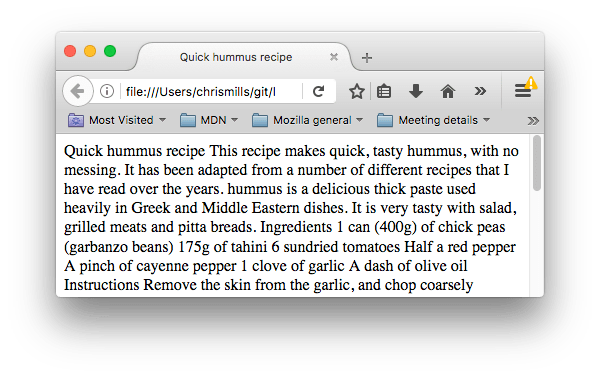

{{LearnSidebar}}

{{PreviousMenuNext("Learn_web_development/Core/Structuring_content/Webpage_metadata", "Learn_web_development/Core/Structuring_content/Emphasis_and_importance", "Learn_web_development/Core/Structuring_content")}}

One of HTML's main jobs is to give text structure so that a browser can display an HTML document the way its developer intends. This article explains how {{glossary("HTML")}} can be used to provide fundamental page structure by defining headings and paragraphs.

<table>
  <tbody>
    <tr>
      <th scope="row">Prerequisites:</th>
      <td>
        Basic HTML familiarity, as covered in
        <a href="/en-US/docs/Learn_web_development/Core/Structuring_content/Basic_HTML_syntax"
          >Basic HTML Syntax</a
        >.
      </td>
    </tr>
    <tr>
      <th scope="row">Learning outcomes:</th>
      <td>
        <li>How to create a good document structure with headings and content beneath those headings.</li>
        <li>Using semantic HTML rather than presentational HTML, and why this is important.</li>
        <li>The need for heading levels to be used logically, i.e. no skipping levels or using them arbitrarily because you want to achieve a certain font size (that's a job for CSS).</li>
        <li>SEO benefits: for example, keywords are boosted in headings.</li>
        <li>Accessibility benefits: Assistive technology (AT) such as screen readers use headings (and other landmarks) as signposts to navigate content. HTML documents are very difficult for AT users to use without headings.</li>
      </td>
    </tr>
  </tbody>
</table>

## Headings and paragraphs

Most structured text consists of headings and paragraphs, whether you are reading a story, a newspaper, a college textbook, a magazine, etc.


Structured content makes the reading experience easier and more enjoyable.

In HTML, each paragraph has to be wrapped in a {{htmlelement("p")}} element, like so:

```html
<p>I am a paragraph, oh yes I am.</p>
```

Each heading has to be wrapped in a heading element:

```html
<h1>I am the title of the story.</h1>
```

There are six heading elements: {{htmlelement("Heading_Elements", "h1")}}, {{htmlelement("Heading_Elements", "h2")}}, {{htmlelement("Heading_Elements", "h3")}}, {{htmlelement("Heading_Elements", "h4")}}, {{htmlelement("Heading_Elements", "h5")}}, and {{htmlelement("Heading_Elements", "h6")}}. Each element represents a different level of content in the document; `<h1>` represents the main heading, `<h2>` represents subheadings, `<h3>` represents sub-subheadings, and so on.

## Implementing structural hierarchy

For example, in this story, the `<h1>` element represents the title of the story, the `<h2>` elements represent the title of each chapter, and the `<h3>` elements represent subsections of each chapter:

```html
<h1>The Crushing Bore</h1>

<p>By Chris Mills</p>

<h2>Chapter 1: The dark night</h2>

<p>
  It was a dark night. Somewhere, an owl hooted. The rain lashed down on the…
</p>

<h2>Chapter 2: The eternal silence</h2>

<p>Our protagonist could not so much as a whisper out of the shadowy figure…</p>

<h3>The specter speaks</h3>

<p>
  Several more hours had passed, when all of a sudden the specter sat bolt
  upright and exclaimed, "Please have mercy on my soul!"
</p>
```

It's really up to you what the elements involved represent, as long as the hierarchy makes sense. You just need to bear in mind a few best practices as you create such structures:

- Preferably, you should use a single `<h1>` per page—this is the top level heading, and all others sit below this in the hierarchy.
- Make sure you use the headings in the correct order in the hierarchy. Don't use `<h3>` elements to represent subheadings, followed by `<h2>` elements to represent sub-subheadings—that doesn't make sense and will lead to weird results.
- Of the six heading levels available, you should aim to use no more than three per page, unless you feel it is necessary. Documents with many levels (for example, a deep heading hierarchy) become unwieldy and difficult to navigate. On such occasions, it is advisable to spread the content over multiple pages if possible.

## Why do we need structure?

To answer this question, let's take a look at [text-start.html](https://github.com/mdn/learning-area/blob/main/html/introduction-to-html/html-text-formatting/text-start.html)—the starting point of our running example for this article (a nice hummus recipe). You should save a copy of this file on your local machine, as you'll need it for exercises in subsequent lessons. This document's body currently contains multiple pieces of content. They aren't marked up in any way, but they are separated with line breaks (Enter/Return pressed to go onto the next line).

However, when you open the document in your browser, you'll see that the text appears as a big chunk!



This is because there are no elements to give the content structure, so the browser does not know what is a heading and what is a paragraph. Furthermore:

- Users looking at a web page tend to scan quickly to find relevant content, often just reading the headings, to begin with. (We usually [spend a very short time on a web page](https://www.nngroup.com/articles/how-long-do-users-stay-on-web-pages/).) If they can't see anything useful within a few seconds, they'll likely get frustrated and go somewhere else.
- Search engines indexing your page consider the contents of headings as important keywords for influencing the page's search rankings. Without headings, your page will perform poorly in terms of {{glossary("SEO")}} (Search Engine Optimization).
- Severely visually impaired people often don't read web pages; they listen to them instead. This is done with software called a [screen reader](https://en.wikipedia.org/wiki/Screen_reader). This software provides ways to get fast access to given text content. Among the various techniques used, they provide an outline of the document by reading out the headings, allowing their users to find the information they need quickly. If headings are not available, they will be forced to listen to the whole document read out loud.
- To style content with {{glossary("CSS")}}, or make it do interesting things with {{glossary("JavaScript")}}, you need to have elements wrapping the relevant content, so CSS/JavaScript can effectively target it.

Therefore, we need to give our content structural markup.

## Active learning: Giving our content structure

Let's jump straight in with a live example. In the example below, add elements to the raw text in the _Input_ field so that it appears as a heading and two paragraphs in the _Output_ field.

If you make a mistake, you can always reset it using the _Reset_ button. If you get stuck, press the _Show solution_ button to see the answer.

```html hidden
<h2>Live output</h2>

<div class="output" style="min-height: 50px;"></div>

<h2>Editable code</h2>
<p class="a11y-label">
  Press Esc to move focus away from the code area (Tab inserts a tab character).
</p>

<textarea id="code" class="input" style="min-height: 100px; width: 95%">
My short story I am a statistician and my name is Trish.

My legs are made of cardboard and I am married to a fish.
</textarea>

<div class="playable-buttons">
  <input id="reset" type="button" value="Reset" />
  <input id="solution" type="button" value="Show solution" />
</div>
```

```css hidden
html {
  font-family: sans-serif;
}

h2 {
  font-size: 16px;
}

.a11y-label {
  margin: 0;
  text-align: right;
  font-size: 0.7rem;
  width: 98%;
}

body {
  margin: 10px;
  background: #f5f9fa;
}
```

```js hidden
const textarea = document.getElementById("code");
const reset = document.getElementById("reset");
const solution = document.getElementById("solution");
const output = document.querySelector(".output");
const code = textarea.value;
let userEntry = textarea.value;

function updateCode() {
  output.innerHTML = textarea.value;
}

const htmlSolution = `<h1>My short story</h1>
<p>
  I am a statistician and my name is Trish.
</p>
<p>
  My legs are made of cardboard and I am married to a fish.
</p>`;

let solutionEntry = htmlSolution;

reset.addEventListener("click", () => {
  textarea.value = code;
  userEntry = textarea.value;
  solutionEntry = htmlSolution;
  solution.value = "Show solution";
  updateCode();
});

solution.addEventListener("click", () => {
  if (solution.value === "Show solution") {
    textarea.value = solutionEntry;
    solution.value = "Hide solution";
  } else {
    textarea.value = userEntry;
    solution.value = "Show solution";
  }
  updateCode();
});

textarea.addEventListener("input", updateCode);
window.addEventListener("load", updateCode);

// Stop tab key tabbing out of textarea and
// make it write a tab at the caret position instead
textarea.onkeydown = (e) => {
  if (e.code === "Tab") {
    e.preventDefault();
    insertAtCaret("\t");
  }

  if (e.code === "Escape") {
    textarea.blur();
  }
};

function insertAtCaret(text) {
  const scrollPos = textarea.scrollTop;
  let caretPos = textarea.selectionStart;

  const front = textarea.value.substring(0, caretPos);
  const back = textarea.value.substring(
    textarea.selectionEnd,
    textarea.value.length,
  );
  textarea.value = front + text + back;
  caretPos += text.length;
  textarea.selectionStart = caretPos;
  textarea.selectionEnd = caretPos;
  textarea.focus();
  textarea.scrollTop = scrollPos;
}

// Update the saved userCode every time the user updates the text area code
textarea.onkeyup = function () {
  // We only want to save the state when the user code is being shown,
  // not the solution, so that solution is not saved over the user code
  if (solution.value === "Show solution") {
    userEntry = textarea.value;
  } else {
    solutionEntry = textarea.value;
  }

  updateCode();
};
```

{{ EmbedLiveSample('Active_learning_Giving_our_content_structure', 700, 400, "", "") }}

## Why do we need semantics?

Semantics are relied on everywhere around us—we rely on previous experience to tell us what the function of an everyday object is; when we see something, we know what its function will be. So, for example, we expect a red traffic light to mean "stop," and a green traffic light to mean "go." Things can get tricky very quickly if the wrong semantics are applied. (Do any countries use red to mean "go"? We hope not.)

In a similar way, we need to make sure we are using the correct elements, giving our content the correct meaning, function, or appearance. In this context, the {{htmlelement("Heading_Elements", "h1")}} element is also a semantic element, which gives the text it wraps around the role (or meaning) of "a top level heading on your page."

```html
<h1>This is a top level heading</h1>
```

By default, the browser will give it a large font size to make it look like a heading (although you could style it to look like anything you wanted using CSS). More importantly, its semantic value will be used in multiple ways, for example by search engines and screen readers (as mentioned above).

On the other hand, you could make any element _look_ like a top level heading. Consider the following:

```html
<span style="font-size: 32px; margin: 21px 0; display: block;">
  Is this a top level heading?
</span>
```

This is a {{htmlelement("span")}} element. It has no semantics. You use it to wrap content when you want to apply CSS to it (or do something to it with JavaScript) without giving it any extra meaning. (You'll find out more about these later on in the course.) We've applied some CSS to it to make it look like a top level heading, but since it has no semantic value, it will not get any of the extra benefits described above. It is a good idea to use the relevant HTML element for the job.

## Summary

This concludes our study of HTML headings and paragraphs. Next, we will look at more aspects of semantic HTML: giving words emphasis.

{{PreviousMenuNext("Learn_web_development/Core/Structuring_content/Webpage_metadata", "Learn_web_development/Core/Structuring_content/Emphasis_and_importance", "Learn_web_development/Core/Structuring_content")}}
