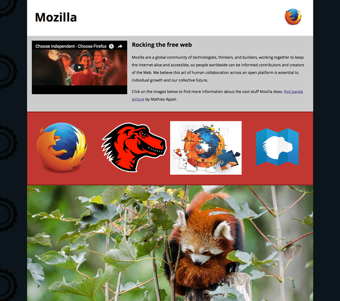

{{LearnSidebar}}

{{PreviousMenuNext("Learn_web_development/Core/Structuring_content/HTML_video_and_audio", "Learn_web_development/Core/Structuring_content/HTML_table_basics", "Learn_web_development/Core/Structuring_content")}}

In this challenge, we'll test your knowledge of some of the techniques discussed in the last couple of lessons, getting you to add some images and video to a funky splash page all about Mozilla!

## Starting point

To start off this assessment, you need to grab the HTML and all the images available in the [mdn-splash-page-start](https://github.com/mdn/learning-area/tree/main/html/multimedia-and-embedding/mdn-splash-page-start) directory on GitHub. Save the contents of [index.html](https://github.com/mdn/learning-area/blob/main/html/multimedia-and-embedding/mdn-splash-page-start/index.html) in a file called `index.html` on your local drive, in a new directory. Then save [pattern.png](https://github.com/mdn/learning-area/blob/main/html/multimedia-and-embedding/mdn-splash-page-start/pattern.png) in the same directory (right click on the image to get an option to save it.)

Access the different images in the [originals](https://github.com/mdn/learning-area/tree/main/html/multimedia-and-embedding/mdn-splash-page-start/originals) directory and save them in the same way; you'll want to save them in a different directory for now, as you'll need to manipulate (some of) them using a graphics editor before they're ready to be used.

Alternatively, you could use an online editor such as [CodePen](https://codepen.io/), [JSFiddle](https://jsfiddle.net/), or [Glitch](https://glitch.com/).

> [!NOTE]
> The example HTML file contains quite a lot of CSS, to style the page. You don't need to touch the CSS, just the HTML inside the {{htmlelement("body")}} element — as long as you insert the correct markup, the styling will make it look correct.
>
> If you get stuck, you can reach out to us in one of our [communication channels](/en-US/docs/MDN/Community/Communication_channels).

## Project brief

In this assessment we are presenting you with a mostly-finished Mozilla splash page, which aims to say something nice and interesting about what Mozilla stands for, and provide some links to further resources. Unfortunately, no images or video have been added yet — this is your job! You need to add some media to make the page look nice and make more sense. The following subsections detail what you need to do:

### Preparing images

Using your favorite image editor, create 400px wide versions of:

- `firefox_logo-only_RGB.png`
- `firefox-addons.jpg`
- `mozilla-dinosaur-head.png`

Along with `mdn.svg`, these images will be your icons to link to further resources, inside the `further-info` area. You'll also link to the Firefox logo in the site header. Save copies of all these inside the same directory as `index.html`.

Next, create a 1200px wide landscape version of `red-panda.jpg`, Call it something sensible so you can easily identify it. Save a copy inside the same directory as `index.html`.

> [!NOTE]
> You should optimize your JPG and PNG images to make them as small as possible, while still looking OK. [tinypng.com](https://tinypng.com/) is a great service for doing this easily.

### Adding a logo to the header

Inside the {{htmlelement("header")}} element, add an {{htmlelement("img")}} element that will embed the small version of the Firefox logo in the header.

### Adding a video to the main article content

Just inside the {{htmlelement("article")}} element (right below the opening tag), embed the YouTube video found at <https://www.youtube.com/watch?v=ojcNcvb1olg>, using the appropriate YouTube tools to generate the code. The video should be 400px wide.

> [!NOTE]
> This is a bit of a stretch goal, as we haven't discussed the code required to embed YouTube videos in our course. Try looking up how to embed a YouTube video online.

### Adding images to the further info links

Inside the {{htmlelement("div")}} with the class of `further-info` you will find four {{htmlelement("a")}} elements — each one linking to an interesting Mozilla-related page. To complete this section you'll need to insert an {{htmlelement("img")}} element inside each one to embed the appropriate image.

Make sure you match the correct images with the correct links!

### Adding the red panda

Inside the {{htmlelement("div")}} with the class of `red-panda`, we want to insert an {{htmlelement("img")}} element that displays the red panda image.

## Hints and tips

- You can use the [W3C Nu HTML Checker](https://validator.w3.org/nu/) to catch mistakes in your HTML.
- You don't need to know any CSS to do this assessment; you just need the provided HTML file. The CSS part is already done for you.
- The provided HTML (including the CSS styling) already does most of the work for you, so you can just focus on the media embedding.

## Example

The following screenshots show what the splash page should look like.

{{PreviousMenuNext("Learn_web_development/Core/Structuring_content/HTML_video_and_audio", "Learn_web_development/Core/Structuring_content/HTML_table_basics", "Learn_web_development/Core/Structuring_content")}}
