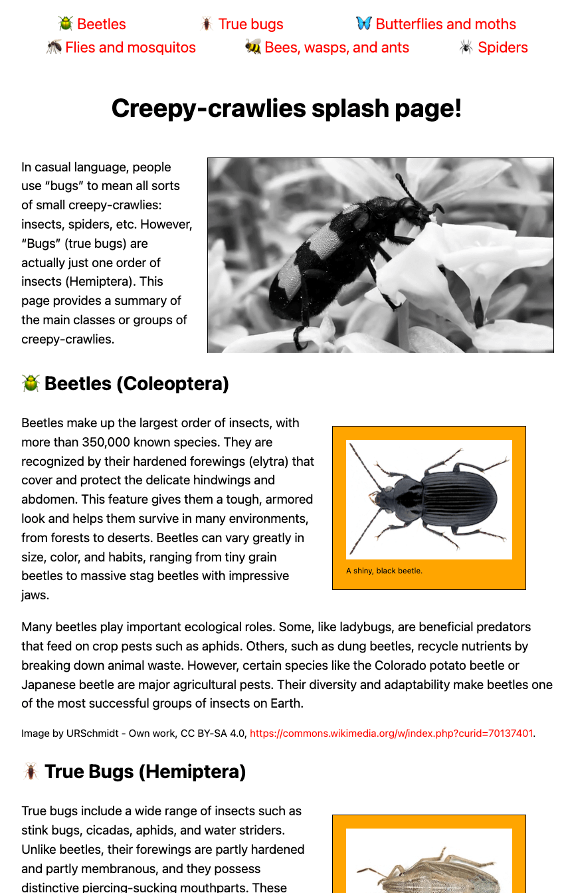

{{PreviousMenuNext("Learn_web_development/Core/Structuring_content/Test_your_skills/Audio_and_video", "Learn_web_development/Core/Structuring_content/HTML_table_basics", "Learn_web_development/Core/Structuring_content")}}

In this challenge, we'll test your knowledge of some of the techniques discussed in the last couple of lessons, getting you to add some images and a video to a splash page all about bugs and other creepy crawlies.

## Starting point

To solve this challenge we are expecting you to create a simple website project, either inside a folder on your computer's harddrive, or using an online editor such as [CodePen](https://codepen.io/) or [JSFiddle](https://jsfiddle.net/). Much of the code you need is already provided.

1. Create a new folder in an appropriate location on your computer called `splash-page-challenge` (or open an online editor and take the required steps to create a new project).
2. Save the following HTML listing inside a file inside your folder called `index.html` (or paste it into your online editor's HTML pane).

   ```html
   <!DOCTYPE html>
   <html lang="en">
     <head>
       <meta charset="utf-8" />
       <title>Creepy crawlies!</title>
       <link href="style.css" rel="stylesheet" />
     </head>
     <body>
       <header>
         <nav>
           <ul>
             <li><a href="#beetles">Beetles</a></li>
             <li><a href="#true_bugs">True bugs</a></li>
             <li><a href="#butterflies_moths">Butterflies and moths</a></li>
             <li><a href="#flies_mosquitos">Flies and mosquitos</a></li>
             <li><a href="#bees_wasps_ants">Bees, wasps, and ants</a></li>
             <li><a href="#spiders">Spiders</a></li>
           </ul>
         </nav>
         <section>
           <h1>Creepy-crawlies splash page!</h1>

           <p>
             In casual language, people use “bugs” to mean all sorts of small
             creepy-crawlies: insects, spiders, etc. However, “Bugs” (true bugs)
             are actually just one order of insects (Hemiptera). This page
             provides a summary of the main classes or groups of
             creepy-crawlies.
           </p>
         </section>
       </header>
       <main>
         <section id="beetles">
           <h2>Beetles (Coleoptera)</h2>

           <p>
             Beetles make up the largest order of insects, with more than
             350,000 known species. They are recognized by their hardened
             forewings (elytra) that cover and protect the delicate hindwings
             and abdomen. This feature gives them a tough, armored look and
             helps them survive in many environments, from forests to deserts.
             Beetles can vary greatly in size, color, and habits, ranging from
             tiny grain beetles to massive stag beetles with impressive jaws.
           </p>
           <p>
             Many beetles play important ecological roles. Some, like ladybugs,
             are beneficial predators that feed on crop pests such as aphids.
             Others, such as dung beetles, recycle nutrients by breaking down
             animal waste. However, certain species like the Colorado potato
             beetle or Japanese beetle are major agricultural pests. Their
             diversity and adaptability make beetles one of the most successful
             groups of insects on Earth.
           </p>

           <p class="copyright">
             Image by URSchmidt - Own work, CC BY-SA 4.0,
             <a href="https://commons.wikimedia.org/w/index.php?curid=70137401"
               >https://commons.wikimedia.org/w/index.php?curid=70137401</a
             >.
           </p>
         </section>
         <section id="true_bugs">
           <h2>True Bugs (Hemiptera)</h2>

           <p>
             True bugs include a wide range of insects such as stink bugs,
             cicadas, aphids, and water striders. Unlike beetles, their
             forewings are partly hardened and partly membranous, and they
             possess distinctive piercing-sucking mouthparts. These mouthparts
             are adapted for feeding on plant sap, blood, or other insects. Many
             true bugs have scent glands that produce strong odors as a defense
             mechanism, which is why some are called “stink bugs.”
           </p>

           <p>
             True bugs are found worldwide and occupy a variety of habitats,
             including plants, soil, and water. While some species are harmless
             or even beneficial predators, others are destructive agricultural
             pests that weaken plants by draining their sap. Certain bugs, like
             bed bugs and kissing bugs, can also affect humans directly by
             biting or transmitting diseases.
           </p>

           <p class="copyright">
             Image created by user B. Schoenmakers at Waarneming.nl, a source of
             nature observations in the Netherlands. - This image is uploaded as
             image number 29046158 at Waarneming.nl, a source of nature
             observations in the Netherlands.This tag does not indicate the
             copyright status of the attached work. A normal copyright tag is
             still required. See Commons:Licensing for more information., This
             site now requires authentication, however, the same image and
             copyright information is also available via
             <a href="https://world.observation.org/foto/view/29046158"
               >https://world.observation.org/foto/view/29046158</a
             >
             since it uses the same data, CC BY 3.0,
             <a href="https://commons.wikimedia.org/w/index.php?curid=92410673"
               >https://commons.wikimedia.org/w/index.php?curid=92410673</a
             >.
           </p>
         </section>
         <section id="butterflies_moths">
           <h2>Butterflies & Moths (Lepidoptera)</h2>

           <p>
             Butterflies and moths are some of the most recognizable insects
             thanks to their large, often colorful wings covered in tiny scales.
             These scales give their wings shimmering, patterned appearances and
             are one of the defining traits of this group. Butterflies are
             usually active by day, while moths are mostly nocturnal, though
             there are exceptions. Both undergo complete metamorphosis, with a
             dramatic transformation from caterpillar to winged adult.
           </p>

           <p>
             As caterpillars, they primarily feed on leaves, sometimes causing
             damage to crops and plants. As adults, butterflies and many moths
             are important pollinators, transferring pollen as they sip nectar
             from flowers. They are also ecologically vital as food sources for
             birds, bats, and other animals. Their beauty and ecological
             importance make them a favorite group for nature enthusiasts and
             scientists alike.
           </p>

           <p class="copyright">
             Image by Didier Descouens - Own work, CC BY-SA 4.0,
             <a href="https://commons.wikimedia.org/w/index.php?curid=19303857"
               >https://commons.wikimedia.org/w/index.php?curid=19303857</a
             >.
           </p>
         </section>
         <section id="flies_mosquitos">
           <h2>Flies & Mosquitoes (Diptera)</h2>

           <p>
             Flies and mosquitoes belong to the order Diptera, meaning “two
             wings.” Unlike most other insects, they have only one functional
             pair of wings; the hind pair has evolved into tiny balancing organs
             called halteres. This adaptation gives them incredible agility in
             flight. Their mouthparts vary widely: some species have sponging
             mouthparts (like houseflies), while others have piercing-sucking
             ones (like mosquitoes).
           </p>

           <p>
             These insects are among the most ecologically and medically
             significant. Many flies are decomposers, helping break down waste
             and recycle nutrients. Mosquitoes, however, are infamous as disease
             vectors, spreading malaria, dengue, and other illnesses. Despite
             their negative reputation, flies and mosquitoes are essential in
             ecosystems, serving as pollinators and as a major food source for
             many animals.
           </p>

           <p class="copyright">
             Image created by user Dick Belgers at Waarneming.nl, a source of
             nature observations in the Netherlands. - This image is uploaded as
             image number 5105758 at Waarneming.nl, a source of nature
             observations in the Netherlands.This tag does not indicate the
             copyright status of the attached work. A normal copyright tag is
             still required. See Commons:Licensing for more information., CC BY
             3.0,
             <a href="https://commons.wikimedia.org/w/index.php?curid=27659589"
               >https://commons.wikimedia.org/w/index.php?curid=27659589</a
             >.
           </p>
         </section>
         <section id="bees_wasps_ants">
           <h2>Bees, Wasps, Ants (Hymenoptera)</h2>

           <p>
             Bees, wasps, and ants are a diverse group known for their complex
             behaviors and social structures. Many species live in colonies with
             distinct roles for workers, queens, and males. Bees are especially
             famous for pollination, producing honey, and communicating with
             each other through dances. Wasps are often predators or
             parasitoids, while ants are skilled builders and cooperative
             foragers.
           </p>

           <p>
             This group has a huge ecological impact. Bees and wasps contribute
             to pollination, supporting food crops and wild plants. Some wasps
             help control pest populations by preying on or parasitizing other
             insects. Ants are critical soil engineers, aerating the ground and
             recycling nutrients. While stings and aggressive behaviors make
             some species feared, they are vital players in natural and
             agricultural systems.
           </p>

           <p class="copyright">
             Image by Trounce - Own work, CC BY-SA 2.5,
             <a href="https://commons.wikimedia.org/w/index.php?curid=1997709"
               >https://commons.wikimedia.org/w/index.php?curid=1997709</a
             >.
           </p>
         </section>
         <section id="spiders">
           <h2>Spiders (Araneae)</h2>

           <p>
             Spiders are arachnids, not insects, and are easily distinguished by
             their eight legs and lack of antennae. Almost all spiders are
             predators, using venom and silk to capture prey. Many build
             intricate webs to trap insects, while others are active hunters
             that chase or ambush their food. Their silk is an incredibly strong
             and versatile material, used for webs, egg sacs, or safety lines.
           </p>

           <p>
             Spiders are found in nearly every habitat on Earth, from deserts to
             caves to homes. While some people fear them, very few species pose
             a danger to humans. In fact, spiders are highly beneficial because
             they help control insect populations, including pests. They play a
             crucial role in balancing ecosystems, making them one of the most
             important non-insect “bugs” people commonly encounter.
           </p>

           <p class="copyright">
             Image by AJC ajcann.wordpress.com from UK, CC BY-SA 2.0
             <a href="https://creativecommons.org/licenses/by-sa/2.0"
               >https://creativecommons.org/licenses/by-sa/2.0</a
             >, via Wikimedia Commons.
           </p>
         </section>
       </main>
     </body>
   </html>
   ```

3. Save the following CSS listing inside a file inside your folder called `style.css` (or paste it into your online editor's CSS pane).

   ```css
   /* type */

   body {
     font: 1.2em / 1.5 system-ui;
     margin: 0 auto;
     width: 90%;
     min-width: 800px;
     max-width: 1200px;
   }

   h1 {
     text-align: center;
   }

   .copyright {
     font-size: 0.8em;
   }

   /* nav menu */

   ul {
     padding: 0;
     list-style-type: none;
     text-align: center;
     display: flex;
     flex-flow: row wrap;
     justify-content: center;
     align-items: center;
   }

   li {
     flex: auto;
   }

   nav a {
     font-size: 1.2em;
     padding: 0 20px;
   }

   /* General link styles */

   a {
     text-decoration: none;
     color: red;
   }

   a:hover,
   a:focus {
     text-decoration: underline;
   }

   /* header section layout */

   header section {
     display: grid;
     grid-template-areas:
       "heading heading"
       "text video"
       "text video";
     grid-template-columns: 1fr 2fr;
     gap: 20px;
   }

   h1 {
     grid-area: heading;
   }

   header p {
     grid-area: text;
     margin: 0;
   }

   video {
     grid-area: video;
     width: 100%;
     border: 1px solid black;
   }

   /* image floats */

   figure {
     float: right;
     margin-left: 20px;
     padding: 20px;
     background: orange;
     border: 1px solid black;
   }

   figcaption {
     font-size: 0.6em;
   }
   ```

Later on, you will need to include the following URLs in your page.

- `bee.jpg`: [Image for the "Bees, Wasps, Ants (Hymenoptera)" section](https://mdn.github.io/shared-assets/images/examples/learn/crawlies/bee.jpg).
- `beetle.png`: [Image for the "Beetles (Coleoptera)" section](https://mdn.github.io/shared-assets/images/examples/learn/crawlies/beetle.png).
- `butterfly.jpg`: [Image for the "Butterflies & Moths (Lepidoptera)" section](https://mdn.github.io/shared-assets/images/examples/learn/crawlies/butterfly.jpg).
- `mosquito.jpg`: [Image for the "Flies & Mosquitoes (Diptera)" section](https://mdn.github.io/shared-assets/images/examples/learn/crawlies/mosquito.jpg).
- `spider.jpg`: [Image for the "Spiders (Araneae)" section](https://mdn.github.io/shared-assets/images/examples/learn/crawlies/spider.jpg).
- `true_bug.jpg`: [Image for the "True Bugs (Hemiptera)" section](https://mdn.github.io/shared-assets/images/examples/learn/crawlies/true_bug.jpg).
- `bug_video_640.mp4`: [header video](https://mdn.github.io/shared-assets/videos/learn/bug_video_640.mp4).

## Project brief

In this assessment we are presenting you with a mostly-finished splash page about different creepy-crawlies. Unfortunately, no images or video have been added yet — this is your job! You need to add some media to make the page look more interesting. The following subsections detail what you need to do.

### Adding a video to the header

Just below the `<h1>`, add a `<video>` element that embeds our header video into the page. We'd like it to do the following:

- Specify the [media type](/en-US/docs/Web/HTTP/Guides/MIME_types) of the video.
- Autoplay the video on load (for this to work in at least some broewsers, you'll also need to specify that the video should be muted).
- Loop endlessly rather than playing once.
- Preload the video content.
- Not show any controls.

### Adding section images

In the expanded information sections on each type of bug, below each `<h2>`, we'd like you to add an image element that embeds the appropriate image for each section. Give each image some appropriate alternative text for the benefit of screenreader users (and in case the image doesn't load), and constrain each image to dimensions of 250 x 180.

In addition, we'd like you to include a caption for each image; think about what container element is needed to semantically associate the two together. Don't just make the caption repeat the alternative text; it should work alongside the alternative text and the image.

### Add bug emojis or icons to the nav menu and `<h2>`s

For a bit of fun, we'd like you to add icons to the start of each nav list item, and the same icon to the start of each corresponding `<h2>`. You could do this using embedded images, but it's easier to just find appropriate emojis and add them to the HTML text itself.

## Hints and tips

- You can use the [W3C HTML validator](https://validator.w3.org/) to catch mistakes in your HTML.
- You don't need to know any CSS to do this assessment; you just need to edit the provided HTML file. The CSS part is already done for you.

## Example

The following screenshot shows what the splash page should look like. If you are getting stuck on how to achieve some of this, see the solution below the live example.



<details>
<summary>Click here to show the solution</summary>

Your finished HTML should look something like this:

```html
<!DOCTYPE html>
<html lang="en">
  <head>
    <meta charset="utf-8" />
    <title>Creepy crawlies!</title>
    <link href="style.css" rel="stylesheet" />
  </head>
  <body>
    <header>
      <nav>
        <ul>
          <li><a href="#beetles">🪲 Beetles</a></li>
          <li><a href="#true_bugs">🪳 True bugs</a></li>
          <li><a href="#butterflies_moths">🦋 Butterflies and moths</a></li>
          <li><a href="#flies_mosquitos">🦟 Flies and mosquitos</a></li>
          <li><a href="#bees_wasps_ants">🐝 Bees, wasps, and ants</a></li>
          <li><a href="#spiders">🕷️ Spiders</a></li>
        </ul>
      </nav>
      <section>
        <h1>Creepy-crawlies splash page!</h1>

        <video
          src="https://mdn.github.io/shared-assets/videos/learn/bug_video_640.mp4"
          type="video/mp4"
          autoplay
          loop
          muted
          preload="auto"></video>

        <p>
          In casual language, people use “bugs” to mean all sorts of small
          creepy-crawlies: insects, spiders, etc. However, “Bugs” (true bugs)
          are actually just one order of insects (Hemiptera). This page provides
          a summary of the main classes or groups of creepy-crawlies.
        </p>
      </section>
    </header>
    <main>
      <section id="beetles">
        <h2>🪲 Beetles (Coleoptera)</h2>

        <figure>
          
          <figcaption>A shiny, black beetle.</figcaption>
        </figure>

        <p>
          Beetles make up the largest order of insects, with more than 350,000
          known species. They are recognized by their hardened forewings
          (elytra) that cover and protect the delicate hindwings and abdomen.
          This feature gives them a tough, armored look and helps them survive
          in many environments, from forests to deserts. Beetles can vary
          greatly in size, color, and habits, ranging from tiny grain beetles to
          massive stag beetles with impressive jaws.
        </p>
        <p>
          Many beetles play important ecological roles. Some, like ladybugs, are
          beneficial predators that feed on crop pests such as aphids. Others,
          such as dung beetles, recycle nutrients by breaking down animal waste.
          However, certain species like the Colorado potato beetle or Japanese
          beetle are major agricultural pests. Their diversity and adaptability
          make beetles one of the most successful groups of insects on Earth.
        </p>

        <p class="copyright">
          Image by URSchmidt - Own work, CC BY-SA 4.0,
          <a href="https://commons.wikimedia.org/w/index.php?curid=70137401"
            >https://commons.wikimedia.org/w/index.php?curid=70137401</a
          >.
        </p>
      </section>
      <section id="true_bugs">
        <h2>🪳 True Bugs (Hemiptera)</h2>

        <figure>
          
          <figcaption>A green stripey bug.</figcaption>
        </figure>

        <p>
          True bugs include a wide range of insects such as stink bugs, cicadas,
          aphids, and water striders. Unlike beetles, their forewings are partly
          hardened and partly membranous, and they possess distinctive
          piercing-sucking mouthparts. These mouthparts are adapted for feeding
          on plant sap, blood, or other insects. Many true bugs have scent
          glands that produce strong odors as a defense mechanism, which is why
          some are called “stink bugs.”
        </p>

        <p>
          True bugs are found worldwide and occupy a variety of habitats,
          including plants, soil, and water. While some species are harmless or
          even beneficial predators, others are destructive agricultural pests
          that weaken plants by draining their sap. Certain bugs, like bed bugs
          and kissing bugs, can also affect humans directly by biting or
          transmitting diseases.
        </p>

        <p class="copyright">
          Image created by user B. Schoenmakers at Waarneming.nl, a source of
          nature observations in the Netherlands. - This image is uploaded as
          image number 29046158 at Waarneming.nl, a source of nature
          observations in the Netherlands.This tag does not indicate the
          copyright status of the attached work. A normal copyright tag is still
          required. See Commons:Licensing for more information., This site now
          requires authentication, however, the same image and copyright
          information is also available via
          <a href="https://world.observation.org/foto/view/29046158"
            >https://world.observation.org/foto/view/29046158</a
          >
          since it uses the same data, CC BY 3.0,
          <a href="https://commons.wikimedia.org/w/index.php?curid=92410673"
            >https://commons.wikimedia.org/w/index.php?curid=92410673</a
          >.
        </p>
      </section>
      <section id="butterflies_moths">
        <h2>🦋 Butterflies & Moths (Lepidoptera)</h2>

        <figure>
          
          <figcaption>A typical butterfly.</figcaption>
        </figure>

        <p>
          Butterflies and moths are some of the most recognizable insects thanks
          to their large, often colorful wings covered in tiny scales. These
          scales give their wings shimmering, patterned appearances and are one
          of the defining traits of this group. Butterflies are usually active
          by day, while moths are mostly nocturnal, though there are exceptions.
          Both undergo complete metamorphosis, with a dramatic transformation
          from caterpillar to winged adult.
        </p>

        <p>
          As caterpillars, they primarily feed on leaves, sometimes causing
          damage to crops and plants. As adults, butterflies and many moths are
          important pollinators, transferring pollen as they sip nectar from
          flowers. They are also ecologically vital as food sources for birds,
          bats, and other animals. Their beauty and ecological importance make
          them a favorite group for nature enthusiasts and scientists alike.
        </p>

        <p class="copyright">
          Image by Didier Descouens - Own work, CC BY-SA 4.0,
          <a href="https://commons.wikimedia.org/w/index.php?curid=19303857"
            >https://commons.wikimedia.org/w/index.php?curid=19303857</a
          >.
        </p>
      </section>
      <section id="flies_mosquitos">
        <h2>🦟 Flies & Mosquitoes (Diptera)</h2>

        <figure>
          
          <figcaption>A mosquito.</figcaption>
        </figure>

        <p>
          Flies and mosquitoes belong to the order Diptera, meaning “two wings.”
          Unlike most other insects, they have only one functional pair of
          wings; the hind pair has evolved into tiny balancing organs called
          halteres. This adaptation gives them incredible agility in flight.
          Their mouthparts vary widely: some species have sponging mouthparts
          (like houseflies), while others have piercing-sucking ones (like
          mosquitoes).
        </p>

        <p>
          These insects are among the most ecologically and medically
          significant. Many flies are decomposers, helping break down waste and
          recycle nutrients. Mosquitoes, however, are infamous as disease
          vectors, spreading malaria, dengue, and other illnesses. Despite their
          negative reputation, flies and mosquitoes are essential in ecosystems,
          serving as pollinators and as a major food source for many animals.
        </p>

        <p class="copyright">
          Image created by user Dick Belgers at Waarneming.nl, a source of
          nature observations in the Netherlands. - This image is uploaded as
          image number 5105758 at Waarneming.nl, a source of nature observations
          in the Netherlands.This tag does not indicate the copyright status of
          the attached work. A normal copyright tag is still required. See
          Commons:Licensing for more information., CC BY 3.0,
          <a href="https://commons.wikimedia.org/w/index.php?curid=27659589"
            >https://commons.wikimedia.org/w/index.php?curid=27659589</a
          >.
        </p>
      </section>
      <section id="bees_wasps_ants">
        <h2>🐝 Bees, Wasps, Ants (Hymenoptera)</h2>

        <figure>
          
          <figcaption>A bumblebee.</figcaption>
        </figure>

        <p>
          Bees, wasps, and ants are a diverse group known for their complex
          behaviors and social structures. Many species live in colonies with
          distinct roles for workers, queens, and males. Bees are especially
          famous for pollination, producing honey, and communicating with each
          other through dances. Wasps are often predators or parasitoids, while
          ants are skilled builders and cooperative foragers.
        </p>

        <p>
          This group has a huge ecological impact. Bees and wasps contribute to
          pollination, supporting food crops and wild plants. Some wasps help
          control pest populations by preying on or parasitizing other insects.
          Ants are critical soil engineers, aerating the ground and recycling
          nutrients. While stings and aggressive behaviors make some species
          feared, they are vital players in natural and agricultural systems.
        </p>

        <p class="copyright">
          Image by Trounce - Own work, CC BY-SA 2.5,
          <a href="https://commons.wikimedia.org/w/index.php?curid=1997709"
            >https://commons.wikimedia.org/w/index.php?curid=1997709</a
          >.
        </p>
      </section>
      <section id="spiders">
        <h2>🕷️ Spiders (Araneae)</h2>

        <figure>
          
          <figcaption>A spider.</figcaption>
        </figure>

        <p>
          Spiders are arachnids, not insects, and are easily distinguished by
          their eight legs and lack of antennae. Almost all spiders are
          predators, using venom and silk to capture prey. Many build intricate
          webs to trap insects, while others are active hunters that chase or
          ambush their food. Their silk is an incredibly strong and versatile
          material, used for webs, egg sacs, or safety lines.
        </p>

        <p>
          Spiders are found in nearly every habitat on Earth, from deserts to
          caves to homes. While some people fear them, very few species pose a
          danger to humans. In fact, spiders are highly beneficial because they
          help control insect populations, including pests. They play a crucial
          role in balancing ecosystems, making them one of the most important
          non-insect “bugs” people commonly encounter.
        </p>

        <p class="copyright">
          Image by AJC ajcann.wordpress.com from UK, CC BY-SA 2.0
          <a href="https://creativecommons.org/licenses/by-sa/2.0"
            >https://creativecommons.org/licenses/by-sa/2.0</a
          >, via Wikimedia Commons.
        </p>
      </section>
    </main>
  </body>
</html>
```

</details>

{{PreviousMenuNext("Learn_web_development/Core/Structuring_content/Test_your_skills/Audio_and_video", "Learn_web_development/Core/Structuring_content/HTML_table_basics", "Learn_web_development/Core/Structuring_content")}}
