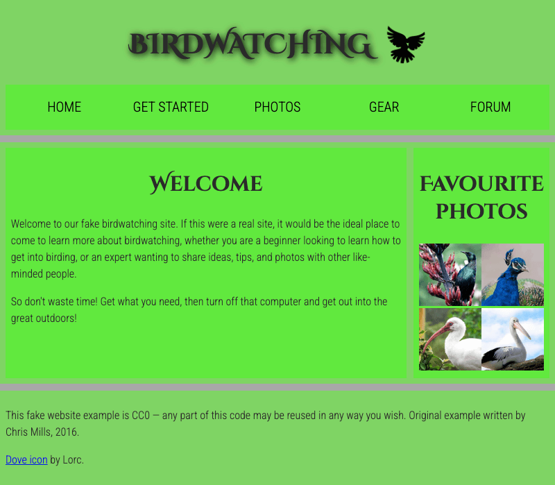

{{PreviousMenuNext("Learn_web_development/Core/Structuring_content/Test_your_skills/Links", "Learn_web_development/Core/Structuring_content/HTML_images", "Learn_web_development/Core/Structuring_content")}}

Structuring a page of content ready for laying it out using CSS is a very important skill to master, so in this challenge you'll be tested on your ability to think about how a page might end up looking, and choose appropriate structural semantics to build a layout on top of.

## Starting point

To solve this challenge we are expecting you to create a simple website project, either inside a folder on your computer's hard drive, or using an online editor such as [CodePen](https://codepen.io/) or [JSFiddle](https://jsfiddle.net/). Much of the code you need is already provided.

1. Create a new folder in an appropriate location on your computer called `structuring-html-challenge` (or open an online editor and take the required steps to create a new project).
2. Save the following HTML listing inside a file inside your folder called `index.html` (or paste it into your online editor's HTML pane).

   ```html
   <!DOCTYPE html>
   <html lang="en">
     <head>
       <meta charset="utf-8" />
       <title>Birdwatching</title>
       <link
         href="https://fonts.googleapis.com/css?family=Roboto+Condensed:300%7CCinzel+Decorative:700"
         rel="stylesheet" />
     </head>

     <body>
       <h1>Birdwatching</h1>

       Home Get started Photos Gear Forum

       <h2>Welcome</h2>

       <p>
         Welcome to our fake birdwatching site. If this were a real site, it
         would be the ideal place to come to learn more about birdwatching,
         whether you are a beginner looking to learn how to get into birding, or
         an expert wanting to share ideas, tips, and photos with other
         like-minded people.
       </p>

       <p>
         So don't waste time! Get what you need, then turn off that computer and
         get out into the great outdoors!
       </p>

       <h2>Favorite photos</h2>

       <!-- Link images here. -->

       <p>
         This fake website example is CC0 — any part of this code may be reused
         in any way you wish. Original example written by Chris Mills, 2016.
       </p>

       <p>
         <a href="http://game-icons.net/lorc/originals/dove.html">Dove icon</a>
         by Lorc.
       </p>
     </body>
   </html>
   ```

3. Save the following CSS listing inside a file inside your folder called `style.css` (or paste it into your online editor's CSS pane).

   ```css
   /* || General setup */

   body {
     margin: 0;
   }

   html {
     font-size: 10px;
     background-color: darkgrey;
   }

   body {
     width: 70%;
     min-width: 800px;
     margin: 0 auto;
   }

   /* || typography */

   h1,
   h2 {
     font-family: "Cinzel Decorative", cursive;
     color: #2a2a2a;
   }

   p,
   li {
     font-family: "Roboto Condensed", sans-serif;
     color: #2a2a2a;
   }

   h1 {
     font-size: 4rem;
     text-align: center;
     text-shadow: 2px 2px 10px black;
   }

   h2 {
     font-size: 3rem;
     text-align: center;
   }

   p,
   li {
     font-size: 1.6rem;
     line-height: 1.5;
   }

   /* || header layout */

   header {
     margin-bottom: 10px;
   }

   main,
   header,
   nav,
   article,
   aside,
   footer,
   section {
     background-color: #00ff0080;
     padding: 1%;
   }

   h1 {
     text-transform: uppercase;
     display: flex;
     align-items: center;
     justify-content: center;
     gap: 20px;
   }

   header img {
     height: 60px;
   }

   nav ul {
     padding: 0;
     list-style-type: none;
     display: flex;
   }

   nav li {
     text-align: center;
     flex: 1;
   }

   nav a {
     font-size: 2rem;
     text-transform: uppercase;
     text-decoration: none;
     color: black;
   }

   nav a:hover,
   nav a:focus {
     color: red;
   }

   /* || main layout */

   main {
     display: flex;
     gap: 10px;
   }

   article {
     flex: 4;
   }

   aside {
     flex: 1;
   }

   aside a {
     display: block;
     float: left;
     width: 50%;
   }

   aside img {
     max-width: 100%;
   }

   footer {
     margin-top: 10px;
   }
   ```

Later on, you will need to include the following URLs in your page.

- `dove.png`: [The site logo](https://mdn.github.io/shared-assets/images/examples/learn/birds/dove.png)
- `favorite-bird-1.jpg`: [Full-size version of the first sidebar image](https://mdn.github.io/shared-assets/images/examples/learn/birds/favorite-bird-1.jpg)
- `favorite-bird-1_th.jpg`: [Thumbnail of the first sidebar image](https://mdn.github.io/shared-assets/images/examples/learn/birds/favorite-bird-1_th.jpg)
- `favorite-bird-2.jpg`: [Full-size version of the second sidebar image](https://mdn.github.io/shared-assets/images/examples/learn/birds/favorite-bird-2.jpg)
- `favorite-bird-2_th.jpg`: [Thumbnail of the second sidebar image](https://mdn.github.io/shared-assets/images/examples/learn/birds/favorite-bird-2_th.jpg)
- `favorite-bird-3.jpg`: [Full-size version of the third sidebar image](https://mdn.github.io/shared-assets/images/examples/learn/birds/favorite-bird-3.jpg)
- `favorite-bird-3_th.jpg`: [Thumbnail of the third sidebar image](https://mdn.github.io/shared-assets/images/examples/learn/birds/favorite-bird-3_th.jpg)
- `favorite-bird-4.jpg`: [Full-size version of the fourth sidebar image](https://mdn.github.io/shared-assets/images/examples/learn/birds/favorite-bird-4.jpg)
- `favorite-bird-4_th.jpg`: [Thumbnail of the fourth sidebar image](https://mdn.github.io/shared-assets/images/examples/learn/birds/favorite-bird-4_th.jpg)

## Project brief

For this project, your task is to take the content for the homepage of a bird watching website and add structural elements to it so it can have a page layout applied to it. You also need to make a few additions to the content.

### Content additions

1. Inside the `<h1>` element, add an `` element that includes the dove logo on the page. Give it blank alternative text ("").
2. The "Home", "Get started", "Photos", "Gear", and "Forum" text items should be turned into a navigation menu.
   1. Mark them up as an unordered list.
   2. Inside each list item, wrap the text inside an `<a>` element that points to a URL of `#` (which creates a dummy link).
3. Remove the `<!-- Link images here. -->` comment. Replace it with a set of four thumbnail images of the "favorite birds". Each one should include some appropriate alternative text to describe the image, and be wrapped in an `<a>` element that links to the full-sized equivalent.

### Structural requirements

The site structure needs to consist of the following:

1. A header that wraps the top-level page heading and the navigation menu list.
2. An additional wrapper around the navigation menu list.
3. A main content area containing two columns — a main article to contain the welcome text, and a sidebar (aside) to contain the image thumbnails.
4. A footer containing the copyright information and credits.

In other words, you need to add a suitable wrapper for:

- The header
- The navigation menu
- The main content
- The welcome article
- The image aside
- The footer

### Styling the page

If required, apply the provided CSS to the page by adding another {{htmlelement("link")}} element just below the existing one provided in the starting HTML (some online code editors will apply the CSS automatically).

## Hints and tips

- Use the [W3C HTML validator](https://validator.w3.org/) to catch unintended mistakes in your HTML — so that you can fix them.
- You don't need to know any CSS to do this challenge; you just need to apply the provided CSS to your HTML.
- If you are getting stuck and can't envisage what elements to put where, draw out a simple block diagram of the page layout, and write on the elements you think should wrap each block. This is extremely helpful.

## Example

The following screenshot shows an example of what the homepage might look like after being marked up. If you are getting stuck on how to achieve some of this, see the solution below the live example.



<details>
<summary>Click here to show the solution</summary>

Your finished HTML should look like this:

```html
<!DOCTYPE html>
<html lang="en">
  <head>
    <meta charset="utf-8" />
    <title>Birdwatching</title>
    <link
      href="https://fonts.googleapis.com/css?family=Roboto+Condensed:300%7CCinzel+Decorative:700"
      rel="stylesheet" />
    <link href="style.css" rel="stylesheet" />
  </head>

  <body>
    <header>
      <h1>
        Birdwatching
        
      </h1>

      <nav>
        <ul>
          <li><a href="#">Home</a></li>
          <li><a href="#">Get started</a></li>
          <li><a href="#">Photos</a></li>
          <li><a href="#">Gear</a></li>
          <li><a href="#">Forum</a></li>
        </ul>
      </nav>
    </header>

    <main>
      <article>
        <h2>Welcome</h2>

        <p>
          Welcome to our fake birdwatching site. If this were a real site, it
          would be the ideal place to come to learn more about birdwatching,
          whether you are a beginner looking to learn how to get into birding,
          or an expert wanting to share ideas, tips, and photos with other
          like-minded people.
        </p>

        <p>
          So don't waste time! Get what you need, then turn off that computer
          and get out into the great outdoors!
        </p>
      </article>

      <aside>
        <h2>Favorite photos</h2>

        <a
          href="https://mdn.github.io/shared-assets/images/examples/learn/birds/favorite-bird-1.jpg">
          
        </a>
        <a
          href="https://mdn.github.io/shared-assets/images/examples/learn/birds/favorite-bird-2.jpg">
          
        </a>
        <a
          href="https://mdn.github.io/shared-assets/images/examples/learn/birds/favorite-bird-3.jpg">
          
        </a>
        <a
          href="https://mdn.github.io/shared-assets/images/examples/learn/birds/favorite-bird-4.jpg">
          
        </a>
      </aside>
    </main>

    <footer>
      <p>
        This fake website example is CC0 — any part of this code may be reused
        in any way you wish. Original example written by Chris Mills, 2016.
      </p>

      <p>
        <a href="http://game-icons.net/lorc/originals/dove.html">Dove icon</a>
        by Lorc.
      </p>
    </footer>
  </body>
</html>
```

</details>

{{PreviousMenuNext("Learn_web_development/Core/Structuring_content/Test_your_skills/Links", "Learn_web_development/Core/Structuring_content/HTML_images", "Learn_web_development/Core/Structuring_content")}}
