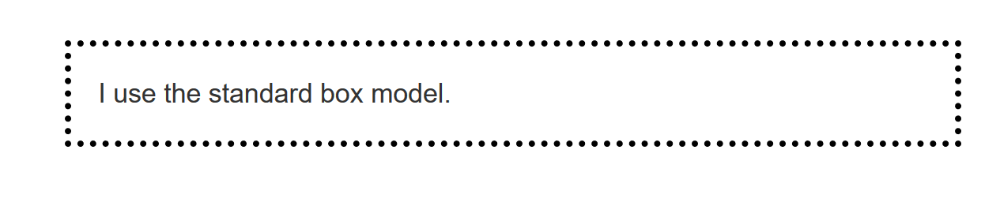
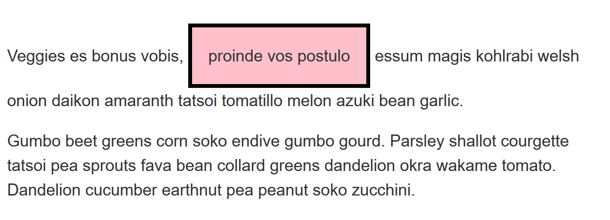

{{LearnSidebar}}

The aim of this skill test is to assess whether you understand the [CSS box model](/en-US/docs/Learn_web_development/Core/Styling_basics/Box_model).

> [!NOTE]
> Click **"Play"** in the code blocks below to edit the examples in the MDN Playground.
> You can also copy the code (click the clipboard icon) and paste it into an online editor such as [CodePen](https://codepen.io/), [JSFiddle](https://jsfiddle.net/), or [Glitch](https://glitch.com/).
> If you get stuck, you can reach out to us in one of our [communication channels](/en-US/docs/MDN/Community/Communication_channels).

## Task 1

In this task, there are two boxes below, one is using the standard box model, the other the alternate box model. Change the width of the second box by adding declarations to the `.alternate` class, so that it matches the visual width of the first box.

Your final result should look like the image below:


Try to update the code below to recreate the finished example:

```html live-sample___box-models
<div class="box">I use the standard box model.</div>
<div class="box alternate">I use the alternate box model.</div>
```

```css live-sample___box-models
body {
  font: 1.2em / 1.5 sans-serif;
}
.box {
  border: 5px solid rebeccapurple;
  background-color: lightgray;
  padding: 40px;
  margin: 40px;
  width: 300px;
  height: 150px;
}

.alternate {
  box-sizing: border-box;
}
```

{{EmbedLiveSample("box-models", "", "540px")}}

<details>
<summary>Click here to show the solution</summary>

You will need to increase the width of the second block, to add the size of the padding and border:

```css
.alternate {
  box-sizing: border-box;
  width: 390px;
}
```

</details>

## Task 2

In this task, add the following things to the box:

- A 5px, black, dotted border.
- A top margin of 20px.
- A right margin of 1em.
- A bottom margin of 40px.
- A left margin of 2em.
- Padding on all sides of 1em.

Your final result should look like the image below:



Try to update the code below to recreate the finished example:

```html live-sample___mbp
<div class="box">I use the standard box model.</div>
```

```css live-sample___mbp
body {
  font: 1.2em / 1.5 sans-serif;
}

.box {
}
```

{{EmbedLiveSample("mbp")}}

<details>
<summary>Click here to show the solution</summary>

This task involves using the margin, border and padding properties correctly.
You might choose to use the longhand properties ({{cssxref("margin-top")}}, {{cssxref("margin-right")}}, etc.), however when setting a margin and padding on all sides, the shorthand is probably the better choice:

```css
.box {
  border: 5px dotted black;
  margin: 20px 1em 40px 2em;
  padding: 1em;
}
```

</details>

## Task 3

In this task, the inline element has a margin, padding and border. However, the lines above and below are overlapping it. What can you add to your CSS to cause the size of the margin, padding, and border to be respected by the other lines, while still keeping the element inline?

Your final result should look like the image below:



Try to update the code below to recreate the finished example:

```html live-sample___inline-block
<div class="box">
  <p>
    Veggies es bonus vobis, <span>proinde vos postulo</span> essum magis
    kohlrabi welsh onion daikon amaranth tatsoi tomatillo melon azuki bean
    garlic.
  </p>

  <p>
    Gumbo beet greens corn soko endive gumbo gourd. Parsley shallot courgette
    tatsoi pea sprouts fava bean collard greens dandelion okra wakame tomato.
    Dandelion cucumber earthnut pea peanut soko zucchini.
  </p>
</div>
```

```css live-sample___inline-block
body {
  font: 1.2em / 1.5 sans-serif;
}

.box span {
  background-color: pink;
  border: 5px solid black;
  padding: 1em;
}
```

{{EmbedLiveSample("inline-block")}}

<details>
<summary>Click here to show the solution</summary>

Solving this task requires that you understand when to use different {{cssxref("display")}} values.
After adding `display: inline-block`, the block direction margin, border and padding will cause the other lines to be pushed away from the element:

```css
.box span {
  background-color: pink;
  border: 5px solid black;
  padding: 1em;
  display: inline-block;
}
```

</details>

## See also

- [CSS styling basics](/en-US/docs/Learn_web_development/Core/Styling_basics)
