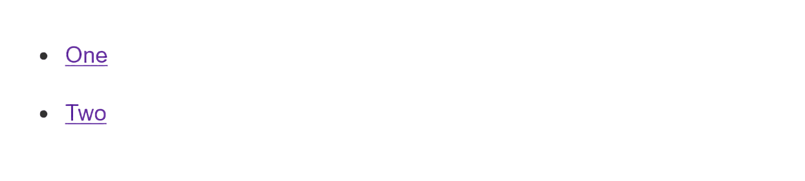

{{LearnSidebar}}

The aim of this skill test is to assess whether you understand universal property values for [controlling inheritance in CSS](/en-US/docs/Learn_web_development/Core/Styling_basics/Handling_conflicts).

> [!NOTE]
> Click **"Play"** in the code blocks below to edit the examples in the MDN Playground.
> You can also copy the code (click the clipboard icon) and paste it into an online editor such as [CodePen](https://codepen.io/), [JSFiddle](https://jsfiddle.net/), or [Glitch](https://glitch.com/).
> If you get stuck, you can reach out to us in one of our [communication channels](/en-US/docs/MDN/Community/Communication_channels).

## Task 1

In this task, we want you to use one of the special values we looked at in the [controlling inheritance](/en-US/docs/Learn_web_development/Core/Styling_basics/Handling_conflicts#controlling_inheritance) section. To write a declaration in a new rule that will reset the background color back to white, without using an actual color value.

Your final result should look like the image below:



Try to update the code below to recreate the finished example:

```html live-sample___cascade
<div class="container" id="outer">
  <div class="container" id="inner">
    <ul>
      <li class="nav"><a href="#">One</a></li>
      <li class="nav"><a href="#">Two</a></li>
    </ul>
  </div>
</div>
```

```css live-sample___cascade
#outer div ul .nav a {
  background-color: powderblue;
  padding: 5px;
  display: inline-block;
  margin-bottom: 10px;
}

div div li a {
  color: rebeccapurple;
}
```

{{EmbedLiveSample("cascade")}}

<details>
<summary>Click here to show the solution</summary>

One possible solution is as follows:

```css
#outer #inner a {
  background-color: initial;
}
```

There are two things you need to do in this task. First, write a selector for the `a` element which is more specific than the selector used to turn the background powderblue. In this solution, this is achieved by using the `id` selector, which has very high specificity.

Then you need to remember there are special keyword values for all properties. In this case, using `inherit` sets the background color back to be the same as its parent element.

</details>

## Task 2

In this task, we want you to make your changes by leveraging the [order of cascade layers](/en-US/docs/Learn_web_development/Core/Styling_basics/Handling_conflicts#order_of_cascade_layers) section. Edit an existing declaration, without touching the lightgreen declaration, using the cascade layer order to make the links rebeccapurple.

Your final result should look like the image below:


Try to update the code below to recreate the finished example:

```html live-sample___cascade-layer
<div class="container" id="outer">
  <div class="container" id="inner">
    <ul>
      <li class="nav"><a href="#">One</a></li>
      <li class="nav"><a href="#">Two</a></li>
    </ul>
  </div>
</div>
```

```css live-sample___cascade-layer
@layer yellow, purple, green;

@layer yellow {
  #outer div ul .nav a {
    padding: 5px;
    display: inline-block;
    margin-bottom: 10px;
  }
}
@layer purple {
  div div li a {
    color: rebeccapurple;
  }
}
@layer green {
  a {
    color: lightgreen;
  }
}
```

{{EmbedLiveSample("cascade-layer")}}

<details>
<summary>Click here to show the solution</summary>

One possible solution is as follows:

```css
@layer yellow, green, purple;
```

There is one thing you need to do in this task: change the order of precedence so the declaration for the desired color is in the last declared layer, which is what his solution shows.

You need to remember that unlayered normal styles take precedence over layered normal styles. But, if all styles are within layers — as in the case of this task — styles in later declared layers take precedence over styles declared in earlier layers. Moving the purple layer to the end means it has precedence over the green and yellow layers.

</details>

## See also

- [CSS styling basics](/en-US/docs/Learn_web_development/Core/Styling_basics)
