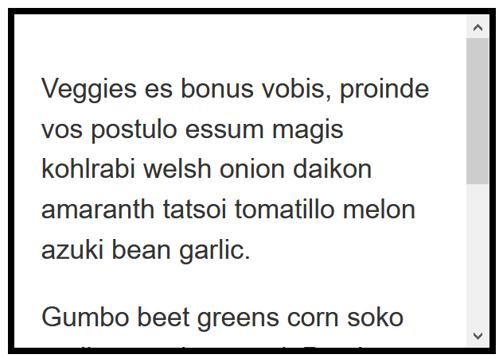

{{LearnSidebar}}

The aim of this skill test is to assess whether you understand [overflow in CSS and how to manage it](/en-US/docs/Learn_web_development/Core/Styling_basics/Overflow).

> [!NOTE]
> Click **"Play"** in the code blocks below to edit the examples in the MDN Playground.
> You can also copy the code (click the clipboard icon) and paste it into an online editor such as [CodePen](https://codepen.io/), [JSFiddle](https://jsfiddle.net/), or [Glitch](https://glitch.com/).
> If you get stuck, you can reach out to us in one of our [communication channels](/en-US/docs/MDN/Community/Communication_channels).

## Task 1

In this task, the content is overflowing the box because it has a fixed height. Keep the height but cause the box to have scrollbars only if there is enough text to cause an overflow. Test by removing some of the text from the HTML, that if there is only a small amount of text that does not overflow, no scrollbar appears.



Try to update the code below to recreate the finished example:

```html live-sample___overflow-scroll
<div class="box">
  <p>
    Veggies es bonus vobis, proinde vos postulo essum magis kohlrabi welsh onion
    daikon amaranth tatsoi tomatillo melon azuki bean garlic.
  </p>

  <p>
    Gumbo beet greens corn soko endive gumbo gourd. Parsley shallot courgette
    tatsoi pea sprouts fava bean collard greens dandelion okra wakame tomato.
    Dandelion cucumber earthnut pea peanut soko zucchini.
  </p>
</div>
```

```css live-sample___overflow-scroll
body {
  font: 1.2em / 1.5 sans-serif;
}

.box {
  border: 5px solid black;
  padding: 1em;
  height: 200px;
  width: 300px;
}
```

{{EmbedLiveSample("overflow-scroll", "", "450px")}}

<details>
<summary>Click here to show the solution</summary>

You should add `overflow: auto` so that the box will only gain scrollbars when the content is too large:

```css
.box {
  overflow: auto;
}
```

</details>

## Task 2

In this task, there is an image in the box that is bigger than the dimensions of the box so that it overflows visibly. Change it so that any image outside of the box is hidden.

Your final result should look like the image below:


Try to update the code below to recreate the finished example:

```html live-sample___overflow-hidden
<div class="box">
  
</div>
```

```css live-sample___overflow-hidden
body {
  font: 1.2em / 1.5 sans-serif;
}
.box {
  border: 5px solid black;
  height: 200px;
  width: 300px;
}
```

{{EmbedLiveSample("overflow-hidden", "", "300px")}}

<details>
<summary>Click here to show the solution</summary>

You should add `overflow: hidden` to the `.box` selector:

```css
.box {
  overflow: hidden;
}
```

</details>

## See also

- [CSS styling basics](/en-US/docs/Learn_web_development/Core/Styling_basics)
