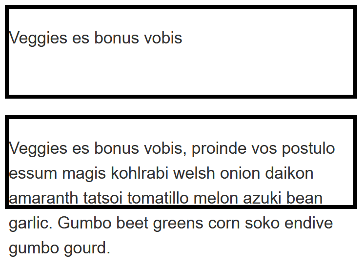
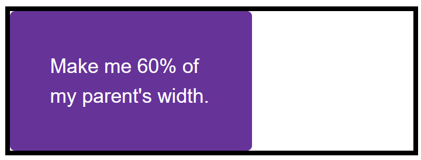
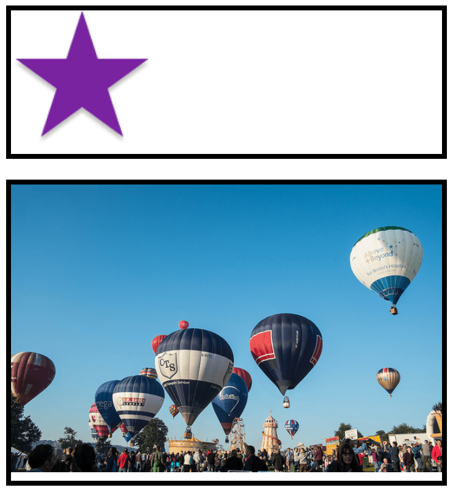

{{LearnSidebar}}

The aim of this skill test is to assess whether you understand the different ways of [sizing items in CSS](/en-US/docs/Learn_web_development/Core/Styling_basics/Sizing).

> [!NOTE]
> Click **"Play"** in the code blocks below to edit the examples in the MDN Playground.
> You can also copy the code (click the clipboard icon) and paste it into an online editor such as [CodePen](https://codepen.io/), [JSFiddle](https://jsfiddle.net/), or [Glitch](https://glitch.com/).
> If you get stuck, you can reach out to us in one of our [communication channels](/en-US/docs/MDN/Community/Communication_channels).

## Task 1

In this task, you have two boxes. The first should be sized so that the height will be at least 100 pixels tall, even if there is less content that would cause it to grow to that height. However, the content should not overflow if there is more content than fits in 100 pixels. Test this box by removing the content from the HTML to make sure you still get a 100 pixel tall box even with no content.

The second box should be fixed at 100 pixels tall, so that content will overflow if there is too much.



Try to update the code below to recreate the finished example:

```html live-sample___height-min-height
<div class="box box1">
  <p>
    Veggies es bonus vobis, proinde vos postulo essum magis kohlrabi welsh onion
    daikon amaranth tatsoi tomatillo melon azuki bean garlic. Gumbo beet greens
    corn soko endive gumbo gourd.
  </p>
</div>

<div class="box box2">
  <p>
    Veggies es bonus vobis, proinde vos postulo essum magis kohlrabi welsh onion
    daikon amaranth tatsoi tomatillo melon azuki bean garlic. Gumbo beet greens
    corn soko endive gumbo gourd.
  </p>
</div>
```

```css hidden live-sample___height-min-height
body {
  font: 1.2em / 1.5 sans-serif;
  padding: 1em;
}

.box {
  border: 5px solid #000;
  width: 400px;
  margin-bottom: 1em;
}
```

```css live-sample___height-min-height
.box1 {
  /* Add styles here */
}

.box2 {
  /* Add styles here */
}
```

{{EmbedLiveSample("height-min-height", "", "500px")}}

<details>
<summary>Click here to show the solution</summary>

There are two boxes, the first should be given a minimum height, in which case it will expand to take the additional content but if you remove some content, the box will be at least as tall as the `min-height`. The second is given a fixed height which will cause content to overflow.

```css
.box1 {
  min-height: 100px;
}

.box2 {
  height: 100px;
}
```

</details>

## Task 2

In this task, you have a box, which contains another box. Your task is to make the inner box 60% of the width of the outer box. The value of the {{cssxref("box-sizing")}} property is set to `border-box`, which means that the total width includes any padding and border. You should also give the inner box padding of 10% using the width (or inline size) as the size from which that percentage is calculated.

Your final result should look like the image below:



Try to update the code below to recreate the finished example:

```html live-sample___percentages
<div class="box">
  <div class="inner">Make me 60% of my parent's width.</div>
</div>
```

```css hidden live-sample___percentages
body {
  font: 1.2em / 1.5 sans-serif;
  padding: 1em;
}
.box {
  border: 5px solid #000;
  width: 400px;
  margin-bottom: 1em;
}

.inner {
  background-color: rebeccapurple;
  color: white;
  border-radius: 5px;
}
```

```css live-sample___percentages
* {
  box-sizing: border-box;
}
.inner {
  /* Add styles here */
}
```

{{EmbedLiveSample("percentages", "", "250px")}}

<details>
<summary>Click here to show the solution</summary>

Make the box 60% of the container and give it 10% of padding on all sides.
All elements already have `box-sizing: border-box` to save you from worrying about which width you are using:

```css
* {
  box-sizing: border-box;
}
.inner {
  width: 60%;
  padding: 10%;
}
```

</details>

## Task 3

In this task, you have two images in boxes. One image is smaller than the box, the other is larger and breaking out of the box. If you imagine that the box is responsive and therefore could grow and shrink, which property would you apply to the image so that the large image shrinks down into the box but the small image does not stretch.

Your final result should look like the images below:



Try to update the code below to recreate the finished example:

```html live-sample___max-width
<div class="box">
  
</div>

<div class="box">
  
</div>
```

```css hidden live-sample___max-width
body {
  font: 1.2em / 1.5 sans-serif;
  padding: 1em;
}
.box {
  border: 5px solid #000;
  margin-bottom: 1em;
  width: 500px;
}
```

```css live-sample___max-width
img {
  /* Add styles here */
}
```

{{EmbedLiveSample("max-width", "", "700px")}}

<details>
<summary>Click here to show the solution</summary>

The example has an image which is breaking out of the box and one which is smaller than the box, you need to use `max-width` set to 100% to cause the larger image to grow only as large as the box. If you use `width: 100%`, the small image will stretch.

```css
img {
  max-width: 100%;
}
```

</details>

## See also

- [CSS styling basics](/en-US/docs/Learn_web_development/Core/Styling_basics)
