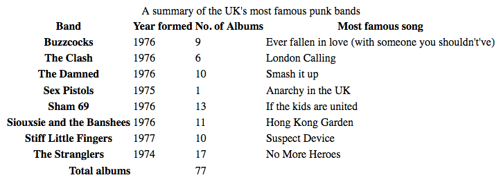
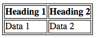
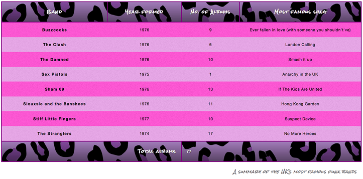

{{LearnSidebar}}

{{PreviousMenuNext("Learn_web_development/Core/Styling_basics/Images_media_forms", "Learn_web_development/Core/Styling_basics/Debugging_CSS", "Learn_web_development/Core/Styling_basics")}}

Styling an HTML table isn't the most glamorous job in the world, but sometimes we all have to do it. This article explains how to make HTML tables look good, with some specific table styling techniques highlighted.

<table>
  <tbody>
    <tr>
      <th scope="row">Prerequisites:</th>
      <td>
        <a href="/en-US/docs/Learn_web_development/Core/Structuring_content/Basic_HTML_syntax"
          >Basic HTML syntax</a
        > and <a href="/en-US/docs/Learn_web_development/Core/Structuring_content/HTML_table_basics"
          >HTML tables</a
        >, CSS <a href="/en-US/docs/Learn_web_development/Core/Styling_basics/Values_and_units">Values and units</a> and <a href="/en-US/docs/Learn_web_development/Core/Styling_basics/Sizing">Sizing</a>.
      </td>
    </tr>
    <tr>
      <th scope="row">Learning outcomes:</th>
      <td>
        <ul>
          <li>Handling spacing in tables, including border collapsing.</li>
          <li>Clearly highlighting different table regions including headings, caption, header, body, and footer.</li>
          <li>How to implement zebra striping, and why it is useful.</li>
        </ul>
      </td>
    </tr>
  </tbody>
</table>

## A typical HTML table

Let's start by looking at a typical HTML table. Well, I say typical — most HTML table examples are about shoes, or the weather, or employees; we decided to make things more interesting by making it about famous punk bands from the UK. The markup looks like so:

```html
<table>
  <caption>
    A summary of the UK's most famous punk bands
  </caption>
  <thead>
    <tr>
      <th scope="col">Band</th>
      <th scope="col">Year formed</th>
      <th scope="col">No. of Albums</th>
      <th scope="col">Most famous song</th>
    </tr>
  </thead>
  <tbody>
    <tr>
      <th scope="row">Buzzcocks</th>
      <td>1976</td>
      <td>9</td>
      <td>Ever fallen in love (with someone you shouldn't've)</td>
    </tr>
    <tr>
      <th scope="row">The Clash</th>
      <td>1976</td>
      <td>6</td>
      <td>London Calling</td>
    </tr>

    <!-- several other great bands -->

    <tr>
      <th scope="row">The Stranglers</th>
      <td>1974</td>
      <td>17</td>
      <td>No More Heroes</td>
    </tr>
  </tbody>
  <tfoot>
    <tr>
      <th scope="row" colspan="2">Total albums</th>
      <td colspan="2">77</td>
    </tr>
  </tfoot>
</table>
```

The table is nicely marked up, easily stylable, and accessible, thanks to features such as [`scope`](/en-US/docs/Web/HTML/Element/th#scope), {{htmlelement("caption")}}, {{htmlelement("thead")}}, {{htmlelement("tbody")}}, etc. Unfortunately, it doesn't look good when rendered on the screen (see it live at [punk-bands-unstyled.html](https://mdn.github.io/learning-area/css/styling-boxes/styling-tables/punk-bands-unstyled.html)):



With only the default browser styling it looks cramped, hard to read, and boring. We need to use some CSS to fix this up.

## Getting started with styling our table

Let's work through styling our table example together.

1. To start with, make a local copy of the [sample markup](https://github.com/mdn/learning-area/blob/main/css/styling-boxes/styling-tables/punk-bands-unstyled.html), download both images ([noise](https://github.com/mdn/learning-area/blob/main/css/styling-boxes/styling-tables/noise.png) and [leopardskin](https://github.com/mdn/learning-area/blob/main/css/styling-boxes/styling-tables/leopardskin.jpg)), and put the three resulting files in a working directory somewhere on your local computer.
2. Next, create a new file called `style.css` and save it in the same directory as your other files.
3. Link the CSS to the HTML by placing the following line of HTML inside your {{htmlelement("head")}}:

   ```html
   <link href="style.css" rel="stylesheet" />
   ```

## Spacing and layout

The first thing we need to do is sort out the spacing/layout — default table styling is so cramped! To do this, add the following CSS to your `style.css` file:

```css
/* spacing */

table {
  table-layout: fixed;
  width: 100%;
  border-collapse: collapse;
  border: 3px solid purple;
}

thead th:nth-child(1) {
  width: 30%;
}

thead th:nth-child(2) {
  width: 20%;
}

thead th:nth-child(3) {
  width: 15%;
}

thead th:nth-child(4) {
  width: 35%;
}

th,
td {
  padding: 20px;
}
```

The most important parts to note are as follows:

- A {{cssxref("table-layout")}} value of `fixed` is generally a good idea to set on your table, as it makes the table behave a bit more predictably by default. Normally, table columns tend to be sized according to how much content they contain, which produces some strange results. With `table-layout: fixed`, you can size your columns according to the width of their headings, and then deal with their content as appropriate. This is why we've selected the four different headings with the `thead th:nth-child(n)` ({{cssxref(":nth-child")}}) selector ("Select the n-th child that is a {{htmlelement("th")}} element in a sequence, inside a {{htmlelement("thead")}} element") and given them set percentage widths. The entire column width follows the width of its heading, making for a nice way to size your table columns. Chris Coyier discusses this technique in more detail in [Fixed Table Layouts](https://css-tricks.com/fixing-tables-long-strings/).

  We've coupled this with a {{cssxref("width")}} of 100%, meaning that the table will fill any container it is put in, and be nicely responsive (although it would still need some more work to get it looking good on narrow screen widths).

- A {{cssxref("border-collapse")}} value of `collapse` is standard best practice for any table styling effort. By default, when you set borders on table elements, they will all have spacing between them, as the below image illustrates:  This doesn't look very nice (although it might be the look you want, who knows?). With `border-collapse: collapse;` set, the borders collapse down into one, which looks much better: 
- We've put a {{cssxref("border")}} around the whole table, which is needed because we'll be putting some borders around the table header and footer later on — it looks really odd and disjointed when you don't have a border around the whole outside of the table and end up with gaps.
- We've set some {{cssxref("padding")}} on the {{htmlelement("th")}} and {{htmlelement("td")}} elements — this gives the data items some space to breathe, making the table look a lot more legible.

At this point, our table already looks a lot better:


## Some simple typography

Now we'll get our text sorted out a bit.

First of all, we've found a font on [Google Fonts](https://fonts.google.com/) that is suitable for a table about punk bands. You can go there and find a different one if you like; you'll just have to replace our provided {{htmlelement("link")}} element and custom {{cssxref("font-family")}} declaration with the ones Google Fonts gives you.

First, add the following {{htmlelement("link")}} element into your HTML head, just above your existing `<link>` element:

```html
<link
  href="https://fonts.googleapis.com/css?family=Rock+Salt"
  rel="stylesheet"
  type="text/css" />
```

Now add the following CSS into your `style.css` file, below the previous addition:

```css
/* typography */

html {
  font-family: "helvetica neue", helvetica, arial, sans-serif;
}

thead th,
tfoot th {
  font-family: "Rock Salt", cursive;
}

th {
  letter-spacing: 2px;
}

td {
  letter-spacing: 1px;
}

tbody td {
  text-align: center;
}

tfoot th {
  text-align: right;
}
```

There is nothing really specific to tables here; we are generally tweaking the font styling to make things easier to read:

- We have set a global sans-serif font stack; this is purely a stylistic choice. We've also set our custom font on the headings inside the {{htmlelement("thead")}} and {{htmlelement("tfoot")}} elements, for a nice grungy, punky look.
- We've set some {{cssxref("letter-spacing")}} on the headings and cells, as we feel it aids readability. Again, mostly a stylistic choice.
- We've center-aligned the text in the table cells inside the {{htmlelement("tbody")}} so that they line up with the headings. By default, cells are given a {{cssxref("text-align")}} value of `left`, and headings are given a value of `center`, but generally it looks better to have the alignments set the same for both. The default bold weight on the heading fonts is enough to differentiate their look.
- We've right-aligned the heading inside the {{htmlelement("tfoot")}} so that it is visually associated better with its data point.

The result looks a bit neater:


## Graphics and colors

Now onto graphics and colors! Because the table is full of punk and attitude, we need to give it some bright imposing styling to suit it. Don't worry, you don't have to make your tables this loud — you can opt for something more subtle and tasteful.

Start by adding the following CSS to your `style.css` file, again at the bottom:

```css
/* graphics and colors */

thead,
tfoot {
  background: url(leopardskin.jpg);
  color: white;
  text-shadow: 1px 1px 1px black;
}

thead th,
tfoot th,
tfoot td {
  background: linear-gradient(to bottom, rgb(0 0 0 / 10%), rgb(0 0 0 / 50%));
  border: 3px solid purple;
}
```

Again, there's nothing specific to tables here, but it is worthwhile to note a few things.

We've added a {{cssxref("background-image")}} to the {{htmlelement("thead")}} and {{htmlelement("tfoot")}}, and changed the {{cssxref("color")}} of all the text inside the header and footer to white (and given it a {{cssxref("text-shadow")}}) so it is readable. You should always make sure your text contrasts well with your background, so it is readable.

We've also added a linear gradient to the {{htmlelement("th")}} and {{htmlelement("td")}} elements inside the header and footer for a nice bit of texture, as well as giving those elements a bright purple border. It is useful to have multiple nested elements available so you can layer styles on top of one another. Yes, we could have put both the background image and the linear gradient on the {{htmlelement("thead")}} and {{htmlelement("tfoot")}} elements using multiple background images, but we decided to do it separately for the benefit of older browsers that don't support multiple background images or linear gradients.

### Zebra striping

We wanted to dedicate a separate section to showing you how to implement **zebra stripes** — alternating rows of color that make the different data rows in your table easier to parse and read. Add the following CSS to the bottom of your `style.css` file:

```css
/* zebra striping */

tbody tr:nth-child(odd) {
  background-color: #ff33cc;
}

tbody tr:nth-child(even) {
  background-color: #e495e4;
}

tbody tr {
  background-image: url(noise.png);
}

table {
  background-color: #ff33cc;
}
```

- Earlier on you saw the {{cssxref(":nth-child")}} selector being used to select specific child elements. It can also be given a formula as a parameter, so it will select a sequence of elements. The formula `2n+1` would select all the odd numbered children (1, 3, 5, etc.) and the formula `2n` would select all the even numbered children (2, 4, 6, etc.) We've used the `odd` and `even` keywords in our code, which do exactly the same things as the aforementioned formulae. In this case we are giving the odd and even rows different (lurid) colors.
- We've also added a repeating background tile to all the body rows, which is just a bit of noise (a semi-transparent `.png` with a bit of visual distortion on it) to provide some texture.
- Lastly, we've given the entire table a solid background color so that browsers that don't support the `:nth-child` selector still have a background for their body rows.

This color explosion results in the following look:


Now, this may be a bit over the top and not to your taste, but the point we are trying to make here is that tables don't have to be boring and academic.

## Styling the caption

There is one last thing to do with our table — style the caption. To do this, add the following to the bottom of your `style.css` file:

```css
/* caption */

caption {
  font-family: "Rock Salt", cursive;
  padding: 20px;
  font-style: italic;
  caption-side: bottom;
  color: #666;
  text-align: right;
  letter-spacing: 1px;
}
```

There is nothing remarkable here, except for the {{cssxref("caption-side")}} property, which has been given a value of `bottom`. This causes the caption to be positioned on the bottom of the table, which along with the other declarations gives us this final look (see it live at [punk-bands-complete.html](https://mdn.github.io/learning-area/css/styling-boxes/styling-tables/punk-bands-complete.html)):



## Table styling quick tips

Before moving on, we thought we'd provide you with a quick list of the most useful points illustrated above:

- Make your table markup as simple as possible, and keep things flexible, e.g. by using percentages, so the design is more responsive.
- Use {{cssxref("table-layout", "table-layout: fixed")}} to create a more predictable table layout that allows you to easily set column widths by setting {{cssxref("width")}} on their headings ({{htmlelement("th")}}).
- Use {{cssxref("border-collapse", "border-collapse: collapse")}} to make table elements borders collapse into each other, producing a neater and easier to control look.
- Use {{htmlelement("thead")}}, {{htmlelement("tbody")}}, and {{htmlelement("tfoot")}} to break up your table into logical chunks and provide extra places to apply CSS to, so it is easier to layer styles on top of one another if required.
- Use zebra striping to make alternative rows easier to read.
- Use {{cssxref("text-align")}} to line up your {{htmlelement("th")}} and {{htmlelement("td")}} text, to make things neater and easier to follow.

## Test your skills!

You've reached the end of this article, but can you remember the most important information? You can find some further tests to verify that you've retained this information before you move on — see [Test your skills: Tables](/en-US/docs/Learn_web_development/Core/Styling_basics/Tables_tasks).

## Summary

With styling tables now behind us, we need something else to occupy our time. The next article explores debugging CSS — how to solve problems such as layouts not looking like they should, or properties not applying when you think they should. This includes information on using browser DevTools to find solutions to your problems.

{{PreviousMenuNext("Learn_web_development/Core/Styling_basics/Images_media_forms", "Learn_web_development/Core/Styling_basics/Debugging_CSS", "Learn_web_development/Core/Styling_basics")}}
