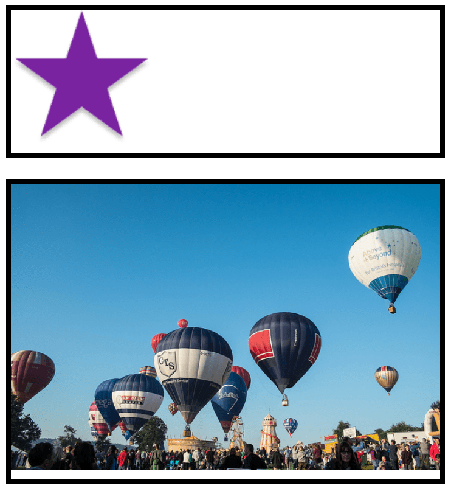

{{PreviousMenuNext("Learn_web_development/Core/Styling_basics/Sizing", "Learn_web_development/Core/Styling_basics/Backgrounds_and_borders", "Learn_web_development/Core/Styling_basics")}}

The aim of this skill test is to help you assess whether you understand the different ways of [sizing items in CSS](/en-US/docs/Learn_web_development/Core/Styling_basics/Sizing).

> [!NOTE]
> To get help, read our [Test your skills](/en-US/docs/Learn_web_development#test_your_skills) usage guide. You can also reach out to us using one of our [communication channels](/en-US/docs/MDN/Community/Communication_channels).

## Task 1

In this task, you have two boxes.

To complete the task:

1. Size the first box so that the height will be at least `100px`, even if there is less content that would cause it to grow to that height. The content should not overflow if it doesn't fit into the box.
2. To test this, remove the content from the HTML to make sure you still get a `100px` tall box even with no content.
3. Size the second box so that it is fixed at `100px` tall. In this case, the content should overflow.

Your final result should look like the image below:


```html live-sample___height-min-height
<div class="box box1">
  <p>
    Veggies es bonus vobis, proinde vos postulo essum magis kohlrabi welsh onion
    daikon amaranth tatsoi tomatillo melon azuki bean garlic. Gumbo beet greens
    corn soko endive gumbo gourd.
  </p>
</div>

<div class="box box2">
  <p>
    Veggies es bonus vobis, proinde vos postulo essum magis kohlrabi welsh onion
    daikon amaranth tatsoi tomatillo melon azuki bean garlic. Gumbo beet greens
    corn soko endive gumbo gourd.
  </p>
</div>
```

```css live-sample___height-min-height
body {
  font: 1.2em / 1.5 sans-serif;
  padding: 1em;
}

.box {
  border: 5px solid black;
  width: 400px;
  margin-bottom: 1em;
}

.box1 {
  /* Add styles here */
}

.box2 {
  /* Add styles here */
}
```

{{EmbedLiveSample("height-min-height", "", "500px")}}

<details>
<summary>Click here to show the solution</summary>

There are two boxes. The first one should be given a `min-height` so it expands to hold the additional content, but will not shrink below `100px` tall if the content is removed. The second box is given a fixed height, which will cause content to overflow.

```css
.box1 {
  min-height: 100px;
}

.box2 {
  height: 100px;
}
```

</details>

## Task 2

In this task, you have a box that contains another box.

To complete the task:

1. Make the inner box width `60%` of the width of the outer box. The {{cssxref("box-sizing")}} property is set to `border-box`, which means that the total width includes any `padding` and `border`.
2. Give the inner box `10%` padding on all sides.

Your final result should look like the image below:


```html live-sample___percentages
<div class="box">
  <div class="inner">Make me 60% of my parent's width.</div>
</div>
```

```css live-sample___percentages
body {
  font: 1.2em / 1.5 sans-serif;
  padding: 1em;
}

.box {
  border: 5px solid black;
  width: 400px;
  margin-bottom: 1em;
}

.inner {
  background-color: rebeccapurple;
  color: white;
  border-radius: 5px;
}

* {
  box-sizing: border-box;
}
.inner {
  /* Add styles here */
}
```

{{EmbedLiveSample("percentages", "", "250px")}}

<details>
<summary>Click here to show the solution</summary>

Set the box `width` to `60%`, and give it a `padding` value of `10%`.
All elements already have `box-sizing: border-box` set to save you from worrying about calculating the `60%` width value:

```css
* {
  box-sizing: border-box;
}
.inner {
  width: 60%;
  padding: 10%;
}
```

</details>

## Task 3

In this task, you have two images in boxes. One image is smaller than the box, while the other is larger, causing it to break out of the box.

To complete the task, imagine that the box is responsive and therefore could grow and shrink. Apply a declaration to the images so that the large image shrinks down into the box, but the small image does not stretch.

Your final result should look like this:



```html live-sample___max-width
<div class="box">
  
</div>

<div class="box">
  
</div>
```

```css live-sample___max-width
body {
  font: 1.2em / 1.5 sans-serif;
  padding: 1em;
}
.box {
  border: 5px solid black;
  margin-bottom: 1em;
  width: 500px;
}

img {
  /* Add styles here */
}
```

{{EmbedLiveSample("max-width", "", "700px")}}

<details>
<summary>Click here to show the solution</summary>

Set the images' `max-width` property to `100%` to contain the large image inside its box. If you use `width: 100%`, the small image will stretch.

```css
img {
  max-width: 100%;
}
```

</details>

{{PreviousMenuNext("Learn_web_development/Core/Styling_basics/Sizing", "Learn_web_development/Core/Styling_basics/Backgrounds_and_borders", "Learn_web_development/Core/Styling_basics")}}
