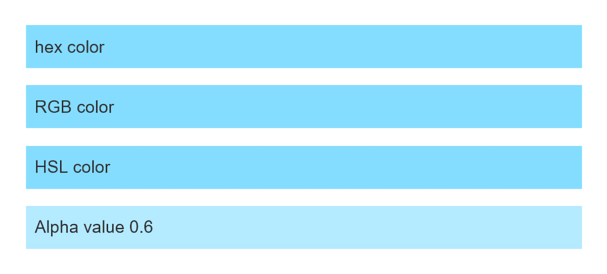
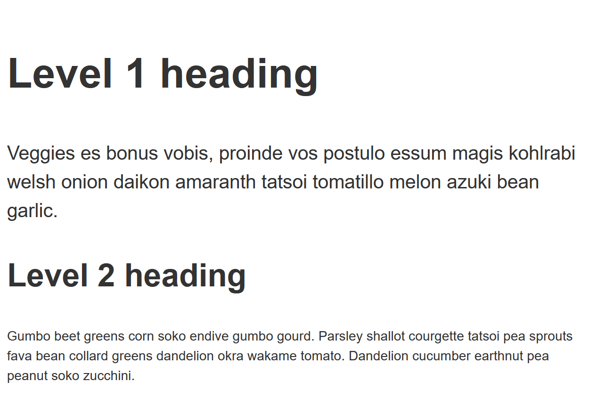
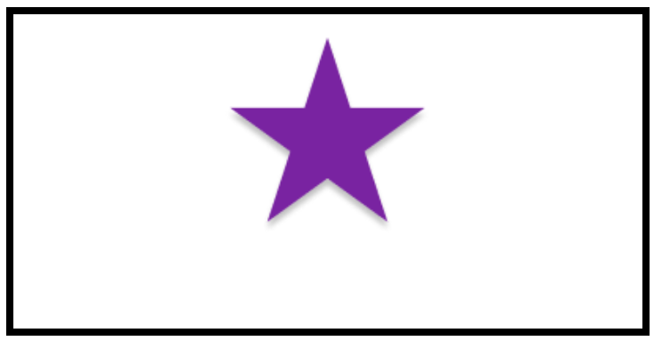

{{PreviousMenuNext("Learn_web_development/Core/Styling_basics/Values_and_units", "Learn_web_development/Core/Styling_basics/Sizing", "Learn_web_development/Core/Styling_basics")}}

The aim of this skill test is to help you assess whether you understand different types of [values and units used in CSS properties](/en-US/docs/Learn_web_development/Core/Styling_basics/Values_and_units).

> [!NOTE]
> To get help, read our [Test your skills](/en-US/docs/Learn_web_development#test_your_skills) usage guide. You can also reach out to us using one of our [communication channels](/en-US/docs/MDN/Community/Communication_channels).

## Task 1

In this task, the first list item has been given a background color using a hex color code. Complete the CSS using the same color in different formats, plus a final list item where you should make the background semi-opaque.

- The second list item should use RGB color.
- The third should use HSL color.
- The fourth should use RGB color but with the alpha channel set to `0.6`.

You [can convert the hex color at convertingcolors.com](https://convertingcolors.com/hex-color-86DEFA.html). You need to figure out how to use the values in CSS. Your final result should look like the image below:



```html live-sample___color
<ul>
  <li class="hex">hex color</li>
  <li class="rgb">RGB color</li>
  <li class="hsl">HSL color</li>
  <li class="transparency">Alpha value 0.6</li>
</ul>
```

```css live-sample___color
body {
  font: 1.2em / 1.5 sans-serif;
}
ul {
  list-style: none;
  margin: 0;
  padding: 0;
}

li {
  margin: 1em;
  padding: 0.5em;
}

.hex {
  background-color: #86defa;
}

/* Add styles here */
```

{{EmbedLiveSample("color", "", "300px")}}

<details>
<summary>Click here to show the solution</summary>

By using [a color conversion tool](https://convertingcolors.com/hex-color-86DEFA.html), you should be equipped to use different [color functions](/en-US/docs/Web/CSS/Reference/Values/color_value#syntax) to define the same color in different ways:

```css
.hex {
  background-color: #86defa;
}

.rgb {
  background-color: rgb(134 222 250);
}

.hsl {
  background-color: hsl(194 92% 75%);
}

.transparency {
  background-color: rgb(134 222 250 / 60%);
}
```

</details>

## Task 2

In this task, we want you to set the font size of various items of text:

- The `<h1>` element should be `50px`.
- The `<h2>` element should be `2em`.
- All `<p>` elements should be `16px`.
- A `<p>` element that is directly after an `<h1>` should be `120%`.

Your final result should look like the image below:



```html live-sample___length
<h1>Level 1 heading</h1>
<p>
  Veggies es bonus vobis, proinde vos postulo essum magis kohlrabi welsh onion
  daikon amaranth tatsoi tomatillo melon azuki bean garlic.
</p>
<h2>Level 2 heading</h2>
<p>
  Gumbo beet greens corn soko endive gumbo gourd. Parsley shallot courgette
  tatsoi pea sprouts fava bean collard greens dandelion okra wakame tomato.
  Dandelion cucumber earthnut pea peanut soko zucchini.
</p>
```

```css live-sample___length
body {
  font: 1.2em / 1.5 sans-serif;
}

h1 {
  /* Add styles here */
}

h2 {
  /* Add styles here */
}

p {
  /* Add styles here */
}

h1 + p {
  /* Add styles here */
}
```

{{EmbedLiveSample("length", "", "420px")}}

<details>
<summary>Click here to show the solution</summary>

You can use the following length values:

```css
h1 {
  font-size: 50px;
}

h2 {
  font-size: 2em;
}

p {
  font-size: 16px;
}

h1 + p {
  font-size: 120%;
}
```

</details>

## Task 3

To complete the task, update the CSS to move the background image so that it is centered horizontally and is `20%` from the top of the box.

Your final result should look like the image below:



```html live-sample___position
<div class="box"></div>
```

```css live-sample___position
.box {
  border: 5px solid black;
  height: 350px;
}

.box {
  background-image: url("https://mdn.github.io/shared-assets/images/examples/purple-star.png");
  background-repeat: no-repeat;
}
```

{{EmbedLiveSample("position", "", "400px")}}

<details>
<summary>Click here to show the solution</summary>

Use `background-position` with the `center` keyword and a percentage:

```css
.box {
  background-image: url("https://mdn.github.io/shared-assets/images/examples/purple-star.png");
  background-repeat: no-repeat;
  background-position: center 20%;
}
```

</details>

{{PreviousMenuNext("Learn_web_development/Core/Styling_basics/Values_and_units", "Learn_web_development/Core/Styling_basics/Sizing", "Learn_web_development/Core/Styling_basics")}}
