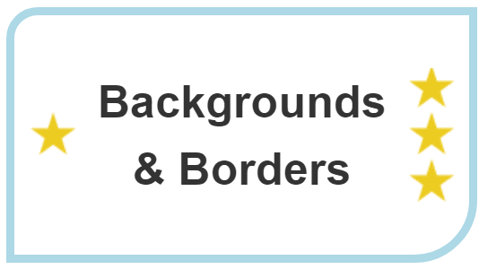

{{learnsidebar}}

The aim of this skill test is to assess whether you understand [backgrounds and borders of boxes in CSS](/en-US/docs/Learn_web_development/Core/Styling_basics/Backgrounds_and_borders).

> [!NOTE]
> Click **"Play"** in the code blocks below to edit the examples in the MDN Playground.
> You can also copy the code (click the clipboard icon) and paste it into an online editor such as [CodePen](https://codepen.io/), [JSFiddle](https://jsfiddle.net/), or [Glitch](https://glitch.com/).
> If you get stuck, you can reach out to us in one of our [communication channels](/en-US/docs/MDN/Community/Communication_channels).

## Task 1

In this task, we want you to add a background, border, and some basic styles to a page header:

1. Give the box a 5px black solid border, with rounded corners of 10px.
2. Give the `<h2>` a semi-transparent black background color, and make the text white.
3. Add a background image and size it so that it covers the box. You can use the following image:

   ```plain
   https://mdn.github.io/shared-assets/images/examples/balloons.jpg
   ```

Your final result should look like the image below:


Try to update the code below to recreate the finished example:

```html live-sample___backgrounds1
<div class="box">
  <h2>Backgrounds & Borders</h2>
</div>
```

```css hidden live-sample___backgrounds1
body {
  padding: 1em;
  font: 1.2em / 1.5 sans-serif;
}
* {
  box-sizing: border-box;
}
.box {
  padding: 0.5em;
}
```

```css live-sample___backgrounds1
.box {
  /* Add styles here */
}

h2 {
  /* Add styles here */
}
```

{{EmbedLiveSample("backgrounds1", "", "200px")}}

<details>
<summary>Click here to show the solution</summary>

You should use `border`, `border-radius`, `background-image`, and `background-size` and understand how to use RGB colors to make a background color partly transparent:

```css
.box {
  border: 5px solid #000;
  border-radius: 10px;
  background-image: url(https://mdn.github.io/shared-assets/images/examples/balloons.jpg);
  background-size: cover;
}

h2 {
  background-color: rgb(0 0 0 / 50%);
  color: #fff;
}
```

</details>

## Task 2

In this task, we want you to add background images, a border, and some other styling to a decorative box:

1. Give the box a 5px lightblue border and round the top left corner 20px and the bottom right corner 40px.

2. The heading uses the `star.png` image as a background image, with a single centered star on the left and a repeating pattern of stars on the right.
   You can use the following image:

   ```plain
   https://mdn.github.io/shared-assets/images/examples/star.png
   ```

3. Make sure that the heading text does not overlay the image, and that it is centered — you will need to use techniques learned in previous lessons to achieve this.

Your final result should look like the image below:



Try to update the code below to recreate the finished example:

```html live-sample___backgrounds2
<div class="box">
  <h2>Backgrounds & Borders</h2>
</div>
```

```css hidden live-sample___backgrounds2
body {
  padding: 1em;
  font: 1.2em / 1.5 sans-serif;
}
* {
  box-sizing: border-box;
}
.box {
  width: 300px;
  padding: 0.5em;
}
```

```css live-sample___backgrounds2
.box {
  /* Add styles here */
}

h2 {
  /* Add styles here */
}
```

{{EmbedLiveSample("backgrounds2", "", "220px")}}

<details>
<summary>Click here to show the solution</summary>

You need to add padding to the heading so that it doesn't overlay the star image - this links back to learning from the earlier [Box Model lesson](/en-US/docs/Learn_web_development/Core/Styling_basics/Box_model).
The text should be aligned with the `text-align` property:

```css
.box {
  border: 5px solid lightblue;
  border-top-left-radius: 20px;
  border-bottom-right-radius: 40px;
}

h2 {
  padding: 0 40px;
  text-align: center;
  background:
    url(https://mdn.github.io/shared-assets/images/examples/star.png) no-repeat
      left center,
    url(https://mdn.github.io/shared-assets/images/examples/star.png) repeat-y
      right center;
}
```

</details>

## See also

- [CSS styling basics](/en-US/docs/Learn_web_development/Core/Styling_basics)
