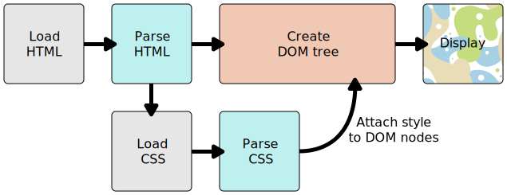

{{LearnSidebar}}

{{NextMenu("Learn_web_development/Core/Styling_basics/Getting_started", "Learn_web_development/Core/Styling_basics")}}

**{{Glossary("CSS")}}** (Cascading Style Sheets) allows you to create great-looking web pages, but how does it work under the hood? This article explains what CSS, what the basic syntax looks like, and how your browser applies CSS to HTML to style it.

<table>
  <tbody>
    <tr>
      <th scope="row">Prerequisites:</th>
      <td>
        <a
          href="/en-US/docs/Learn_web_development/Getting_started/Environment_setup/Installing_software"
          >Basic software installed</a
        >, basic knowledge of
        <a
          href="/en-US/docs/Learn_web_development/Getting_started/Environment_setup/Dealing_with_files"
          >working with files</a
        >, and HTML familiarity (study the
        <a href="/en-US/docs/Learn_web_development/Core/Structuring_content"
          >Structuring content with HTML</a
        > module.)
      </td>
    </tr>
    <tr>
      <th scope="row">Learning outcomes:</th>
      <td>
        <ul>
          <li>The purpose of CSS.</li>
          <li>That HTML has nothing to do with styling.</li>
          <li>The concept of default browser styles.</li>
          <li>What CSS code looks like.</li>
          <li>How CSS is applied to HTML.</li>
        <ul>
      </td>
    </tr>
  </tbody>
</table>

## Browser default styles

In the [Structuring content with HTML](/en-US/docs/Learn_web_development/Core/Structuring_content) module, we covered what HTML is and how it is used to mark up documents. These documents will be readable in a web browser. Headings will look larger than regular text, paragraphs break onto a new line and have space between them. Links are colored and underlined to distinguish them from the rest of the text.

What you are seeing are the browser's default styles — very basic styling that the browser applies to HTML to make sure that the page will be basically readable even if no explicit styling is specified by the author of the page. These styles are defined in default CSS stylesheets contained within the browser — they have nothing to do with HTML.


The web would be a boring place if all websites looked like that. This is why you need to learn about CSS.

## What is CSS for?

Using CSS, you can control exactly how HTML elements look in the browser, presenting your documents to your users with whatever design and layout you like.

A **document** is usually a text file structured using a markup language — {{Glossary("HTML")}} is the most common markup language, but you may also come across other markup languages such as {{Glossary("SVG")}} or {{Glossary("XML")}}.

**Presenting** a document to a user means converting it into a form usable by your audience. {{Glossary("browser","Browsers")}}, like {{Glossary("Mozilla Firefox","Firefox")}}, {{Glossary("Google Chrome","Chrome")}}, or {{Glossary("Microsoft Edge","Edge")}}, are designed to present documents visually, for example, on a computer screen, projector, or printer.

> [!NOTE]
> A browser is sometimes called a {{Glossary("User agent","user agent")}}, which basically means a computer program that represents a person inside a computer system.

CSS can be used for text styling — for example, for changing the [color](/en-US/docs/Web/CSS/color_value) and [size](/en-US/docs/Web/CSS/font-size) of headings and links. It can be used to create a layout — for example, [turning a single column of text into a layout](/en-US/docs/Web/CSS/Layout_cookbook/Column_layouts) with a main content area and a sidebar for related information. It can even be used for effects such as [animation](/en-US/docs/Web/CSS/CSS_animations). Have a look at the links in this paragraph for specific examples.

The CSS language is organized into _modules_ that contain related functionality. For example, take a look at the MDN reference pages for the [Backgrounds and Borders](/en-US/docs/Web/CSS/CSS_backgrounds_and_borders) module to find out what its purpose is and the properties and features it contains. In that module, you will also find a link to _Specifications_ that defines the technology.

## CSS syntax basics

CSS is a rule-based language — you define rules by specifying groups of styles that should be applied to particular elements or groups of elements on your web page.

For example, you can decide to style the main heading on your page as large red text. The following code shows a very simple CSS rule that would achieve this:

```css
h1 {
  color: red;
  font-size: 5em;
}
```

- In the above example, the CSS rule opens with a {{Glossary("CSS Selector", "selector")}}. This _selects_ the HTML element that we are going to style. In this case, we are styling level one headings (`{{htmlelement("Heading_Elements", "&lt;h1>")}}`).
- We then have a set of curly braces — `{ }`.
- The braces contain one or more **declarations**, which take the form of **property** and **value** pairs. We specify the property (for example, `color` in the above example) before the colon, and we specify the value of the property after the colon (`red` is the value being set for the `color` property).
- This example contains two declarations, one for `color` and another for `font-size`.

Different CSS {{Glossary("property/CSS","properties")}} have different allowable values. In our example, we have the `color` property, which can take various [color values](/en-US/docs/Learn_web_development/Core/Styling_basics/Values_and_units#color). We also have the `font-size` property. This property can take various [size units](/en-US/docs/Learn_web_development/Core/Styling_basics/Values_and_units#numbers_lengths_and_percentages) as a value.

A CSS stylesheet contains many such rules, written one after the other.

```css
h1 {
  color: red;
  font-size: 5em;
}

p {
  color: black;
}
```

You will find that you quickly learn some values, whereas others you will need to look up. The individual property pages on MDN give you a quick way to look up properties and their values.

> [!NOTE]
> You can find links to all the CSS property pages (along with other CSS features) listed on the MDN [CSS reference](/en-US/docs/Web/CSS/Reference). Alternatively, you should get used to searching for "mdn _css-feature-name_" in your favorite search engine whenever you need to find out more information about a CSS feature. For example, try searching for "mdn color" or "mdn font-size"!

## How is CSS applied to HTML?

When a browser displays a document, it must combine the document's content with its style information. It processes the document in a number of stages, which we've listed below. Bear in mind that this is a very simplified version of what happens when a browser loads a webpage, and that different browsers will handle the process in different ways.

1. The browser loads the HTML.
2. It converts the HTML into a tree-like structure called a {{Glossary("DOM")}} (_Document Object Model_) tree. The DOM represents the document in the computer's memory.
3. The browser then fetches most of the resources that are linked to by the HTML document, such as embedded images, videos, and CSS! JavaScript is handled a bit later on in the process, and we won't talk about it here to keep things simpler.
4. The browser parses the fetched CSS, and sorts the different rules into different "buckets" based on which HTML elements (represented in the DOM as **nodes**) they will be applied to. The browser then attaches styles to different elements as required (this intermediate step is called a **render tree**).
5. The render tree is laid out in the structure it should appear in after the rules have been applied.
6. The visual display of the page is shown on the screen (this stage is called painting).

The following diagram also offers a simple view of the process.



### More on the DOM

As mentioned above, the DOM has a tree-like structure. Each element, attribute, and piece of text in the markup language becomes a {{Glossary("Node/DOM","DOM node")}} in the tree structure. The nodes are defined by their relationship to other DOM nodes. Some elements are parents of child nodes, and child nodes have siblings.

Understanding the DOM will help you design, debug, and maintain your CSS because the DOM is where your CSS and the document's content meet up. When you use browser DevTools you navigate the DOM as you select items in order to see which rules apply.

Let's look at an example to see how a real HTML snippet is converted into a DOM.

Take the following HTML code:

```html
<p>
  Let's use:
  <span>Cascading</span>
  <span>Style</span>
  <span>Sheets</span>
</p>
```

The browser parses the HTML and creates a DOM from it, which looks like this:

```plain
P
├─ "Let's use:"
├─ SPAN
|  └─ "Cascading"
├─ SPAN
|  └─ "Style"
└─ SPAN
    └─ "Sheets"
```

In the DOM, the node corresponding to our `<p>` element is a parent. Its children are a text node and the three nodes corresponding to our `<span>` elements. The `SPAN` nodes are also parents, with text nodes as their children. When the browser renders the above DOM tree, it will look like so:

{{EmbedLiveSample('More on the DOM', '100%', 55)}}

```css hidden
p {
  margin: 0;
}
```

### Applying CSS to the DOM

Let's say we modify our code to apply the following CSS to our document, to style it:

```html hidden
<p>
  Let's use:
  <span>Cascading</span>
  <span>Style</span>
  <span>Sheets</span>
</p>
```

```css
span {
  border: 1px solid black;
  background-color: lime;
}
```

In this case, the browser will first create a DOM tree, as in the previous section. Next, it parses the CSS. Since the only rule available in the CSS has a `span` selector, the browser sorts the CSS very quickly! It applies that rule to each one of the three `<span>`s, then paints the final visual representation to the screen.

The updated output is as follows:

{{EmbedLiveSample('Applying CSS to the DOM', '100%', 90)}}

## Summary

Now that you have some understanding of what CSS is and how it works, let's move on to getting you started with writing some CSS yourself.

{{NextMenu("Learn_web_development/Core/Styling_basics/Getting_started", "Learn_web_development/Core/Styling_basics")}}
