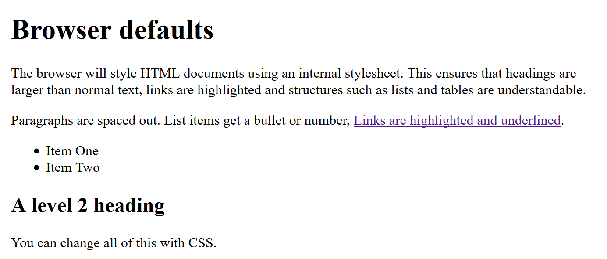

{{LearnSidebar}}

{{NextMenu("Learn_web_development/Core/Styling_basics/Getting_started", "Learn_web_development/Core/Styling_basics")}}

**{{Glossary("CSS")}}** (Cascading Style Sheets) allows you to create great-looking web pages, but how does it work under the hood? This article explains what CSS, what the basic syntax looks like, and how your browser applies CSS to HTML to style it.

<table>
  <tbody>
    <tr>
      <th scope="row">Prerequisites:</th>
      <td>
        <a
          href="/en-US/docs/Learn_web_development/Getting_started/Environment_setup/Installing_software"
          >Basic software installed</a
        >, basic knowledge of
        <a
          href="/en-US/docs/Learn_web_development/Getting_started/Environment_setup/Dealing_with_files"
          >working with files</a
        >, and HTML familiarity (study the
        <a href="/en-US/docs/Learn_web_development/Core/Structuring_content"
          >Structuring content with HTML</a
        > module.)
      </td>
    </tr>
    <tr>
      <th scope="row">Learning outcomes:</th>
      <td>
        <ul>
          <li>The purpose of CSS.</li>
          <li>That HTML has nothing to do with styling.</li>
          <li>The concept of default browser styles.</li>
          <li>What CSS code looks like.</li>
          <li>How CSS is applied to HTML.</li>
        <ul>
      </td>
    </tr>
  </tbody>
</table>

## Browser default styles

In the [Structuring content with HTML](/en-US/docs/Learn_web_development/Core/Structuring_content) module, we covered what HTML is and how it is used to mark up documents. These documents will be readable in a web browser. Headings will look larger than regular text, paragraphs break onto a new line and have space between them. Links are colored and underlined to distinguish them from the rest of the text.

What you are seeing are the browser's default styles — very basic styling that the browser applies to HTML to make sure that the page will be basically readable even if no explicit styling is specified by the author of the page. These styles are defined in default CSS stylesheets contained within the browser — they have nothing to do with HTML.



The web would be a boring place if all websites looked like that. This is why you need to learn about CSS.

## What is CSS for?

Using CSS, you can control exactly how HTML elements look in the browser, presenting your documents to your users with whatever design and layout you like.

- A **document** is usually a text file structured using a markup language, most commonly {{Glossary("HTML")}} (these are termed _HTML documents_). You may also come across documents written in other markup languages such as {{Glossary("SVG")}} or {{Glossary("XML")}}. Where previously we've talked about web pages, an HTML document contains the web page's content and specifies its structure.
- **Presenting** a document to a user means converting it into a form usable by your audience. {{Glossary("browser","Browsers")}} like {{Glossary("Mozilla Firefox","Firefox")}}, {{Glossary("Google Chrome","Chrome")}}, {{Glossary("Apple_Safari","Safari")}}, and {{Glossary("Microsoft Edge","Edge")}} are designed to present documents visually, for example, on a computer screen, projector, mobile device, or printer. In a web context, this is generally referred to as _rendering_; we provided a simplified description of the process by which a web page is rendered in [How browsers load websites](/en-US/docs/Learn_web_development/Getting_started/Web_standards/How_browsers_load_websites).

> [!NOTE]
> A browser is sometimes called a {{Glossary("User agent","user agent")}}, which basically means a computer program that represents a person inside a computer system.

CSS can be used for many purposes related to the look and feel of your web page. The most important are:

- Text styling, for example, for changing the [color](/en-US/docs/Web/CSS/color_value) and [size](/en-US/docs/Web/CSS/font-size) of headings and links.
- Creating layouts, for example, [turning a single column of text into a multiple-column layout](/en-US/docs/Web/CSS/Layout_cookbook/Column_layouts).
- Special effects such as [animation](/en-US/docs/Web/CSS/CSS_animations).

The CSS language is organized into _modules_ that contain related functionality. For example, take a look at the MDN reference pages for the [Backgrounds and Borders](/en-US/docs/Web/CSS/CSS_backgrounds_and_borders) module to find out what its purpose is and the properties and features it contains. In that module, you will also find a link to _Specifications_ that defines the technology.

## CSS syntax basics

CSS is a rule-based language — you define rules by specifying groups of styles that should be applied to particular element or groups of elements on your web page.

For example, you might decide to style the main heading on your page as large red text. The following code shows a very simple CSS rule that would achieve this:

```css
h1 {
  color: red;
  font-size: 2.5em;
}
```

- In the above example, the CSS rule opens with a {{Glossary("CSS Selector", "selector")}}. This _selects_ the HTML elements that we are going to style. In this case, we are styling level one headings (`{{htmlelement("Heading_Elements", "&lt;h1>")}}`).
- We then have a set of curly braces — `{ }`.
- The braces contain one or more **declarations**, which take the form of **property** and **value** pairs. We specify the property (for example, `color` in the above example) before the colon, and we specify the value of the property after the colon (`red` is the value being set for the `color` property).
- This example contains two declarations, one for `color` and another for `font-size`.

Different CSS {{Glossary("property/CSS","properties")}} have different allowable values. In our example, we have the `color` property, which can take various [color values](/en-US/docs/Learn_web_development/Core/Styling_basics/Values_and_units#color). We also have the `font-size` property. This property can take various [size units](/en-US/docs/Learn_web_development/Core/Styling_basics/Values_and_units#numbers_lengths_and_percentages) as a value.

A CSS stylesheet contains many such rules, written one after the other.

```css
h1 {
  color: red;
  font-size: 2.5em;
}

p {
  color: aqua;
  padding: 5px;
  background: midnightblue;
}
```

You will find that you quickly learn some values, whereas others you will need to look up. The individual property pages on MDN give you a quick way to look up properties and their values.

> [!NOTE]
> You can find links to all the CSS property pages (along with other CSS features) listed on the MDN [CSS reference](/en-US/docs/Web/CSS/Reference). Alternatively, you should get used to searching for "mdn _css-feature-name_" in your favorite search engine whenever you need to find out more information about a CSS feature. For example, try searching for "mdn color" or "mdn font-size"!

## How is CSS applied to HTML?

As explained in [How browsers load websites](/en-US/docs/Learn_web_development/Getting_started/Web_standards/How_browsers_load_websites), when you navigate to a web page, the browser first receives the HTML document containing the web page content and converts it to a **DOM tree**.

After that, any CSS rules found in the web page (either inserted directly in the HTML, or in referenced external `.css` files) are sorted into different "buckets", based on the different elements they will be applied to (as specified by their selectors). The CSS rules are then applied to the DOM tree, resulting in a **render tree**, which is then painted to the browser window.

Let's look at an example. First of all, we'll define an HTML snippet that the CSS could be applied to:

```html
<h1>CSS is great</h1>

<p>You can style text.</p>

<p>And create layouts and special effects.</p>
```

Now, our CSS, repeated from the previous section:

```css
h1 {
  color: red;
  font-size: 2.5em;
}

p {
  color: aqua;
  padding: 5px;
  background: midnightblue;
}
```

This CSS:

- Selects all `<h1>` elements on the page, coloring their text red and making them bigger than their default size. Since there is only one `<h1>` in our example HTML, only that element will get the styling.
- Selects all `<p>` elements on the page, giving them a custom text and background color and some spacing around the text. There are two `<p>` elements in our example HTML, and they both get the styling.

When the CSS is applied to the HTML, the rendered output is as follows:

{{EmbedLiveSample('How is CSS applied to HTML?', '100%', 200)}}

> [!CALLOUT]
>
> **Try it out**
>
> Try playing with the above example. To do so, press the "Play" button in the top-right corner to load it in our Playground editor. Try the following:
>
> 1. Add another paragraph of text below the two existing ones, and note how the second CSS rule is automatically applied to the new paragraph.
> 2. Add an `<h2>` subheading somewhere below the `<h1>`, maybe after one of the paragraphs. Try giving it a different color by adding a new rule to the CSS. Make a copy of the `h1` rule, change the selector to `h2`, and change the `color` value from `red` to `purple`, for example.
> 3. If you are feeling adventurous, try looking up some new CSS properties and values in the MDN [CSS reference](/en-US/docs/Web/CSS/Reference) to add to your rules!

## Summary

Now that you have some understanding of what CSS is and how it works, let's move on to giving you some practice with writing CSS yourself and explaining the syntax in more detail.

{{NextMenu("Learn_web_development/Core/Styling_basics/Getting_started", "Learn_web_development/Core/Styling_basics")}}
