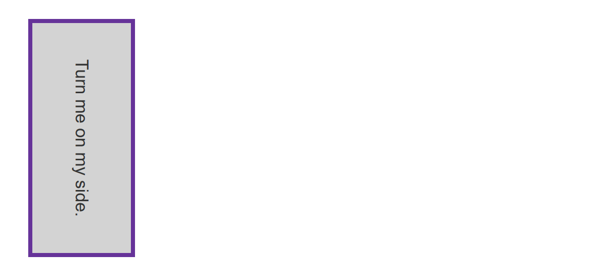
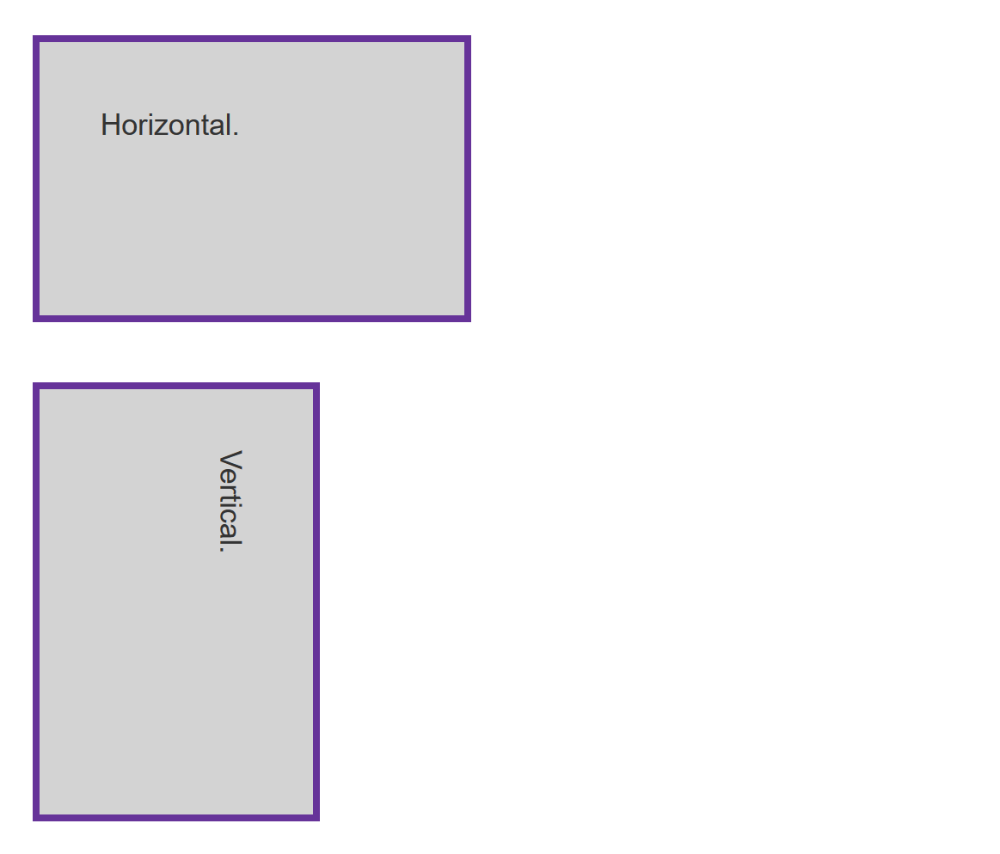
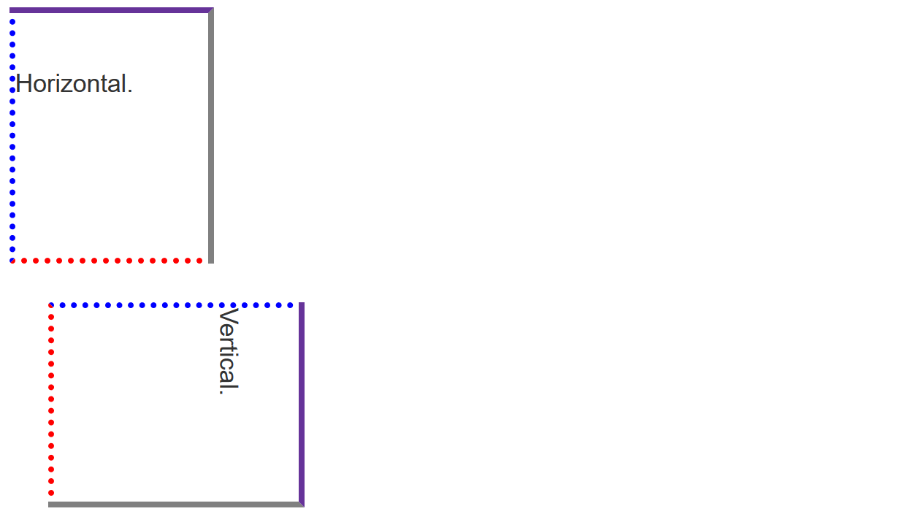

{{LearnSidebar}}

The aim of this skill test is to assess whether you understand how to [handle different text directions using writing modes and logical properties in CSS](/en-US/docs/Learn_web_development/Core/Styling_basics/Handling_different_text_directions).

> [!NOTE]
> Click **"Play"** in the code blocks below to edit the examples in the MDN Playground.
> You can also copy the code (click the clipboard icon) and paste it into an online editor such as [CodePen](https://codepen.io/), [JSFiddle](https://jsfiddle.net/), or [Glitch](https://glitch.com/).
> If you get stuck, you can reach out to us in one of our [communication channels](/en-US/docs/MDN/Community/Communication_channels).

## Task 1

In this task, the box is displayed with a horizontal writing mode. Can you add a line of CSS to change it so it uses a vertical writing mode with right to left text?

Your final result should look like the image below:



Try to update the code below to recreate the finished example:

```html live-sample___writing-mode
<div class="box">Turn me on my side.</div>
```

```css hidden live-sample___writing-mode
body {
  font: 1.2em / 1.5 sans-serif;
}
```

```css live-sample___writing-mode
.box {
  border: 5px solid rebeccapurple;
  background-color: lightgray;
  padding: 40px;
  margin: 40px;
}
```

{{EmbedLiveSample("writing-mode", "", "250px")}}

<details>
<summary>Click here to show the solution</summary>

You should use the `writing-mode` property with a value of `vertical-rl` for vertical right-to-left script:

```css
.box {
  border: 5px solid rebeccapurple;
  background-color: lightgray;
  padding: 40px;
  margin: 40px;
  writing-mode: vertical-rl;
}
```

</details>

## Task 2

In this task, we want you to use logical properties to replace `width` and `height` in order to maintain the {{glossary("aspect ratio")}} of the box as it is turned vertically.

Your final result should look like the image below:



Try to update the code below to recreate the finished example:

```html live-sample___logical-width-height
<div class="box">Horizontal.</div>
<div class="box vertical">Vertical.</div>
```

```css hidden live-sample___logical-width-height
body {
  font: 1.2em / 1.5 sans-serif;
}
```

```css live-sample___logical-width-height
.box {
  border: 5px solid rebeccapurple;
  background-color: lightgray;
  padding: 40px;
  margin: 40px;
  width: 200px;
  height: 100px;
}
```

{{EmbedLiveSample("logical-width-height", "", "500px")}}

<details>
<summary>Click here to show the solution</summary>

As well as setting `writing-mode: vertical-rl` on the `.vertical` box, you need to apply the `inline-size` and `block-size` properties to replace `width` and `height`:

```css
.box {
  border: 5px solid rebeccapurple;
  background-color: lightgray;
  padding: 40px;
  margin: 40px;
  inline-size: 200px;
  block-size: 100px;
}
.vertical {
  writing-mode: vertical-rl;
}
```

</details>

## Task 3

In this task, we want you to use logical versions of the margin, border, and padding properties so that the edges of the box relate to the text rather than following top, left, bottom and right.

Your final result should look like the image below:



Try to update the code below to recreate the finished example:

```html live-sample___logical-mbp
<div class="box">Horizontal.</div>
<div class="box vertical">Vertical.</div>
```

```css hidden live-sample___logical-mbp
body {
  font: 1.2em / 1.5 sans-serif;
}
```

```css hidden live-sample___logical-mbp
.vertical {
  writing-mode: vertical-rl;
}
```

```css live-sample___logical-mbp
.box {
  width: 150px;
  height: 150px;
  border-top: 5px solid rebeccapurple;
  border-right: 5px solid grey;
  border-bottom: 5px dotted red;
  border-left: 5px dotted blue;
  padding-top: 40px;
  margin-bottom: 30px;
}
```

{{EmbedLiveSample("logical-mbp", "", "500px")}}

<details>
<summary>Click here to show the solution</summary>

To solve this, you need an understanding of the logical, flow relative mappings for margin, border and padding physical properties:

```css
.box {
  width: 150px;
  height: 150px;
  border-block-start: 5px solid rebeccapurple;
  border-inline-end: 5px solid grey;
  border-block-end: 5px dotted red;
  border-inline-start: 5px dotted blue;
  padding-block-start: 40px;
  margin-block-end: 30px;
}
```

</details>

## See also

- [CSS styling basics](/en-US/docs/Learn_web_development/Core/Styling_basics)
