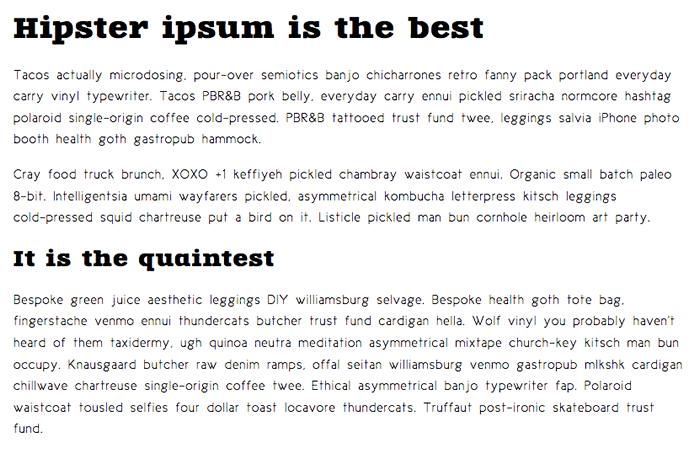

{{LearnSidebar}}

{{PreviousMenuNext("Learn_web_development/Core/Text_styling/Styling_links", "Learn_web_development/Core/Text_styling/Typesetting_a_homepage", "Learn_web_development/Core/Text_styling")}}

In the first article of the module, we explored the basic CSS features available for styling fonts and text. In this article we will go further, exploring web fonts in detail. We'll see how to use custom fonts with your web page to allow for more varied, custom text styling.

<table>
  <tbody>
    <tr>
      <th scope="row">Prerequisites:</th>
      <td>
        <a href="/en-US/docs/Learn_web_development/Core/Structuring_content"
          >Structuring content with HTML</a
        >,
        <a href="/en-US/docs/Learn_web_development/Core/Styling_basics">CSS Styling basics</a>,
        <a href="/en-US/docs/Learn_web_development/Core/Text_styling/Fundamentals">Fundamental text and font styling</a>.
      </td>
    </tr>
    <tr>
      <th scope="row">Objective:</th>
      <td>
       <ul>
         <li>Understand that web fonts allow developers to go beyond the web safe font set and use custom fonts on their web apps.</li>
         <li>Basic setup — the <code>@font-face</code> at-rule, and common descriptors.</li>
         <li>Using a web font with the <code>font-family</code> property.</li>
         <li>Using an online service to find web fonts and generate web font code, for example, <a href="https://www.fontsquirrel.com/">Font Squirrel</a> or <a href="https://fonts.google.com/">Google Fonts</a>.</li>
       </ul>
      </td>
    </tr>
  </tbody>
</table>

## Font families recap

As we looked at in [Fundamental text and font styling](/en-US/docs/Learn_web_development/Core/Text_styling/Fundamentals), the fonts applied to your HTML can be controlled using the {{cssxref("font-family")}} property. This takes one or more font family names. When displaying a webpage, a browser will travel down a list of font-family values until it finds a font available on the system it is running on:

```css
p {
  font-family: Helvetica, "Trebuchet MS", Verdana, sans-serif;
}
```

This system works well, but traditionally web developers' font choices were limited. There are only a handful of fonts that you can guarantee to be available across all common systems — the so-called [Web-safe fonts](/en-US/docs/Learn_web_development/Core/Text_styling/Fundamentals#web_safe_fonts). You can use the font stack to specify preferred fonts, followed by web-safe alternatives, followed by the default system font. However, this increases your workload because of the testing required to make sure that your designs work with each font.

## Web fonts

There is an alternative that works well. CSS allows you to specify font files, available on the web, to be downloaded along with your website as it's accessed. This means that any browser supporting this CSS feature can display the fonts you've specifically chosen. Amazing! The syntax required looks something like this:

First of all, you have a {{cssxref("@font-face")}} ruleset at the start of the CSS, which specifies the font file(s) to download:

```css
@font-face {
  font-family: "myFont";
  src: url("myFont.woff2");
}
```

Below this you use the font family name specified inside {{cssxref("@font-face")}} to apply your custom font to anything you like, as normal:

```css
html {
  font-family: "myFont", "Bitstream Vera Serif", serif;
}
```

The syntax does get a bit more complex than this. We'll go into more detail below.

Here are some important things to bear in mind about web fonts:

1. Fonts generally aren't free to use without restrictions. You have to pay for them and/or follow other license conditions, such as crediting the font creator in your code (or on your site). You shouldn't steal fonts and use them without giving proper credit.
2. All major browsers support WOFF/WOFF2 (Web Open Font Format versions 1 and 2). Even older browsers such as IE9 (released in 2011) support the WOFF format.
3. WOFF2 supports the entirety of the TrueType and OpenType specifications, including variable fonts, chromatic fonts, and font collections.
4. The order in which you list font files is important. If you provide the browser with a list of multiple font files to download, the browser will choose the first font file it's able to use. That's why the format you list first should be the preferred format — that is, WOFF2 — with the older formats listed after that. Browsers that don't understand one format will then fall back to the next format in the list.
5. If you need to work with legacy browsers, you should provide EOT (Embedded Open Type), TTF (TrueType Font), and SVG web fonts for download. This article explains how to use the Fontsquirrel Webfont Generator to generate the required files.

You can use the [Firefox Font Editor](https://firefox-source-docs.mozilla.org/devtools-user/page_inspector/how_to/edit_fonts/index.html) to investigate and manipulate the fonts in use on your page, whether they are web fonts or not.

## Active learning: A web font example

With this in mind, let's build up a basic web font example from first principles. It's difficult to demonstrate this using an embedded live example. So instead we would like you to follow the steps detailed in the below sections to get an idea of the process.

You should use the [web-font-start.html](https://github.com/mdn/learning-area/blob/main/css/styling-text/web-fonts/web-font-start.html) and [web-font-start.css](https://github.com/mdn/learning-area/blob/main/css/styling-text/web-fonts/web-font-start.css) files as a starting point to add your code to (see the [live example](https://mdn.github.io/learning-area/css/styling-text/web-fonts/web-font-start.html)). Make a copy of these files in a new directory on your computer now. In the `web-font-start.css` file, you'll find some minimal CSS to deal with the basic layout and typesetting of the example.

### Finding fonts

For this example, we'll use two web fonts: one for the headings and one for the body text. To start with, we need to find the font files that contain the fonts. Fonts are created by font foundries and are stored in different file formats. There are generally three types of sites where you can obtain fonts:

- A free font distributor: This is a site that makes free fonts available for download (there may still be some license conditions, such as crediting the font creator). Examples include [Font Squirrel](https://www.fontsquirrel.com/), [DaFont](https://www.dafont.com/), and [Everything Fonts](https://everythingfonts.com/).
- A paid font distributor: This is a site that makes fonts available for a charge, such as [fonts.com](https://www.fonts.com/) or [myfonts.com](https://www.myfonts.com/). You can also buy fonts directly from font foundries, for example [Linotype](https://www.linotype.com/), [Monotype](https://www.monotype.com/), or [Exljbris](https://www.exljbris.com/).
- An online font service: This is a site that stores and serves the fonts for you, making the whole process easier. See the [Using an online font service](#using_an_online_font_service) section for more details.

Let's find some fonts! Go to [Font Squirrel](https://www.fontsquirrel.com/) and choose two fonts: a nice interesting font for the headings (maybe a nice display or slab serif font), and a slightly less flashy and more readable font for the paragraphs. When you've found a font, press the download button and save the file inside the same directory as the HTML and CSS files you saved earlier. It doesn't matter whether they are TTF (True Type Fonts) or OTF (Open Type Fonts).

Unzip the two font packages (Web fonts are usually distributed in ZIP files containing the font file(s) and licensing information). You may find multiple font files in the package — some fonts are distributed as a family with different variants available, for example thin, medium, bold, italic, thin italic, etc. For this example, we just want you to concern yourself with a single font file for each choice.

> [!NOTE]
> In Font Squirrel, under the "Find fonts" section in the right-hand column, you can click on the different tags and classifications to filter the displayed choices.

### Generating the required code

Now you'll need to generate the required code (and font formats). For each font, follow these steps:

1. Make sure you have satisfied any licensing requirement if you are going to use this in a commercial and/or Web project.
2. Go to the Fontsquirrel [Webfont Generator](https://www.fontsquirrel.com/tools/webfont-generator).
3. Upload your two font files using the _Upload Fonts_ button.
4. Check the checkbox labeled "Yes, the fonts I'm uploading are legally eligible for web embedding."
5. Click _Download your kit_.

After the generator has finished processing, you should get a ZIP file to download. Save it in the same directory as your HTML and CSS.

### Implementing the code in your demo

At this point, unzip the webfont kit you just generated. Inside the unzipped directory you'll see some useful items:

- Two versions of each font: the `.woff`, `.woff2` files.
- A demo HTML file for each font — load these in your browser to see what the font will look like in different usage contexts.
- A `stylesheet.css` file, which contains the generated @font-face code you'll need.

To implement these fonts in your demo, follow these steps:

1. Rename the unzipped directory to something easy and simple, like `fonts`.
2. Open up the `stylesheet.css` file and copy the two `@font-face` rulesets into your `web-font-start.css` file — you need to put them at the very top, before any of your CSS, as the fonts need to be imported before you can use them on your site.
3. Each of the `url()` functions points to a font file that we want to import into our CSS. We need to make sure the paths to the files are correct, so add `fonts/` to the start of each path (adjust as necessary).
4. Now you can use these fonts in your font stacks, just like any web safe or default system font. For example:

   ```css
   @font-face {
     font-family: "zantrokeregular";
     src:
       url("fonts/zantroke-webfont.woff2") format("woff2"),
       url("fonts/zantroke-webfont.woff") format("woff");
     font-weight: normal;
     font-style: normal;
   }
   ```

   ```css
   font-family: "zantrokeregular", serif;
   ```

You should end up with a demo page with some nice fonts implemented on them. Because different fonts are created at different sizes, you may have to adjust the size, spacing, etc., to sort out the look and feel.



> [!NOTE]
> If you have any problems getting this to work, feel free to compare your version to our finished files — see [web-font-finished.html](https://github.com/mdn/learning-area/blob/main/css/styling-text/web-fonts/web-font-finished.html) and [web-font-finished.css](https://github.com/mdn/learning-area/blob/main/css/styling-text/web-fonts/web-font-finished.css). You can also download the [code from GitHub](https://github.com/mdn/learning-area/tree/main/css/styling-text/web-fonts) or [run the finished example live](https://mdn.github.io/learning-area/css/styling-text/web-fonts/web-font-finished.html).

## Using an online font service

Online font services generally store and serve fonts for you so you don't have to worry about writing the `@font-face` code. Instead, you generally just need to insert a simple line or two of code into your site to make everything work. Examples include [Adobe Fonts](https://fonts.adobe.com/) and [Cloud.typography](https://www.typography.com/webfonts). Most of these services are subscription-based, with the notable exception of [Google Fonts](https://fonts.google.com/), a useful free service, especially for rapid testing work and writing demos.

Most of these services are easy to use, so we won't cover them in great detail. Let's have a quick look at Google Fonts so you can get the idea. Again, use copies of `web-font-start.html` and `web-font-start.css` as your starting point.

1. Go to [Google Fonts](https://fonts.google.com/).
2. Search for your favorite fonts or use the filters at the top of the page to display the kinds of fonts you want to choose and select a couple of fonts that you like.
3. To select a font family, click on the font preview and press the ⊕ button alongside the font.
4. When you've chosen the font families, press the _View your selected families_ button in the top right corner of the page.
5. In the resulting screen, you first need to copy the line of HTML code shown and paste it into the head of your HTML file. Put it above the existing {{htmlelement("link")}} element, so that the font is imported before you try to use it in your CSS.
6. You then need to copy the CSS declarations listed into your CSS as appropriate, to apply the custom fonts to your HTML.

> [!NOTE]
> You can find a completed version at [google-font.html](https://github.com/mdn/learning-area/blob/main/css/styling-text/web-fonts/google-font.html) and [google-font.css](https://github.com/mdn/learning-area/blob/main/css/styling-text/web-fonts/google-font.css), if you need to check your work against ours ([see it live](https://mdn.github.io/learning-area/css/styling-text/web-fonts/google-font.html)).

## @font-face in more detail

Let's explore that `@font-face` syntax generated for you by Fontsquirrel. The rulesets will look something like this:

```css
@font-face {
  font-family: "zantrokeregular";
  src:
    url("zantroke-webfont.woff2") format("woff2"),
    url("zantroke-webfont.woff") format("woff");
  font-weight: normal;
  font-style: normal;
}
```

Let's go through it to see what it does:

- `font-family`: This line specifies the name you want to refer to the font as. This can be anything you like as long as you use it consistently throughout your CSS.
- `src`: These lines specify the paths to the font files to be imported into your CSS (the `url` part), and the format of each font file (the `format` part). The latter part in each case is optional, but is useful to declare because it allows browsers to more quickly determine which font they can use. Multiple declarations can be listed, separated by commas. Because the browser will search through them according to the rules of the cascade, it's best to state your preferred formats, like WOFF2, at the beginning.
- {{cssxref("font-weight")}}/{{cssxref("font-style")}}: These lines specify what weight the font has and whether it is italic or not. If you are importing multiple weights of the same font, you can specify what their weight/style is and then use different values of {{cssxref("font-weight")}}/{{cssxref("font-style")}} to choose between them, rather than having to call all the different members of the font family different names. [@font-face tip: define font-weight and font-style to keep your CSS simple](https://www.456bereastreet.com/archive/201012/font-face_tip_define_font-weight_and_font-style_to_keep_your_css_simple/) by Roger Johansson shows what to do in more detail.

> [!NOTE]
> You can also specify particular {{cssxref("font-variant")}} and {{cssxref("font-stretch")}} values for your web fonts. In newer browsers, you can also specify a {{cssxref("@font-face/unicode-range", "unicode-range")}} value, which is a specific range of characters you might want to use out of the web font. In supporting browsers, the font will only be downloaded if the page contains those specified characters, saving unnecessary downloading. [Creating Custom Font Stacks with Unicode-Range](https://24ways.org/2011/creating-custom-font-stacks-with-unicode-range/) by Drew McLellan provides some useful ideas on how to make use of this.

## Summary

Now that you have worked through our articles on text styling fundamentals, it's time to test your comprehension with our challenge for the module: Typesetting a community school homepage.

## See also

- [Variable fonts guide](/en-US/docs/Web/CSS/CSS_fonts/Variable_fonts_guide)
- [Fonts knowledge](https://fonts.google.com/knowledge), Google Fonts

{{PreviousMenuNext("Learn_web_development/Core/Text_styling/Styling_links", "Learn_web_development/Core/Text_styling/Typesetting_a_homepage", "Learn_web_development/Core/Text_styling")}}
