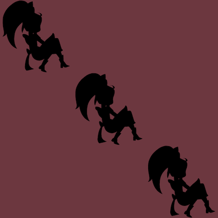

{{LearnSidebar}}

{{PreviousMenu("Learn_web_development/Extensions/Async_JS/Introducing_workers", "Learn_web_development/Extensions/Async_JS")}}

In this challenge you'll update a page to play a series of animations in a sequence. To do this you'll use some of the techniques we learned in the [How to use Promises](/en-US/docs/Learn_web_development/Extensions/Async_JS/Promises) article.

<table>
  <tbody>
    <tr>
      <th scope="row">Prerequisites:</th>
      <td>
        A reasonable understanding of JavaScript
        fundamentals, how to use promise-based APIs.
      </td>
    </tr>
    <tr>
      <th scope="row">Objective:</th>
      <td>To test understanding of how to use promise-based APIs.</td>
    </tr>
  </tbody>
</table>

## Starting point

Make a local copy of the files at <https://github.com/mdn/learning-area/tree/main/javascript/asynchronous/sequencing-animations/start>. It contains four files:

- alice.svg
- index.html
- main.js
- style.css

The only file you'll need to edit is "main.js".

If you open "index.html" in a browser you'll see three images arranged diagonally:



The images are taken from our guide to [Using the Web Animations API](/en-US/docs/Web/API/Web_Animations_API/Using_the_Web_Animations_API).

> [!NOTE]
> If you get stuck, you can reach out to us in one of our [communication channels](/en-US/docs/MDN/Community/Communication_channels).

## Project brief

We want to update this page so we apply an animation to all three images, one after the other. So when the first has finished we animate the second, and when the second has finished we animate the third.

The animation is already defined in "main.js": it just rotates the image and shrinks it until it disappears.

To give you more of an idea of how we want the page to work, [have a look at the finished example](https://mdn.github.io/learning-area/javascript/asynchronous/sequencing-animations/finished/). Note that the animations only run once: to see them run again, reload the page.

## Steps to complete

### Animating the first image

We're using the [Web Animations API](/en-US/docs/Web/API/Web_Animations_API) to animate the images, specifically the {{domxref("Element/animate", "element.animate()")}} method.

Update "main.js" to add a call to `alice1.animate()`, like this:

```js
const aliceTumbling = [
  { transform: "rotate(0) scale(1)" },
  { transform: "rotate(360deg) scale(0)" },
];

const aliceTiming = {
  duration: 2000,
  iterations: 1,
  fill: "forwards",
};

const alice1 = document.querySelector("#alice1");
const alice2 = document.querySelector("#alice2");
const alice3 = document.querySelector("#alice3");

alice1.animate(aliceTumbling, aliceTiming);
```

Reload the page, and you should see the first image rotate and shrink.

### Animating all the images

Next, we want to animate `alice2` when `alice1` has finished, and `alice3` when `alice2` has finished.

The `animate()` method returns an {{domxref("Animation")}} object. This object has a `finished` property, which is a `Promise` that is fulfilled when the animation has finished playing. So we can use this promise to know when to start the next animation.

We'd like you to try a few different ways to implement this, to reinforce different ways of using promises.

1. First, implement something that works, but has the promise version of the "callback hell" problem we saw in our [discussion of using callbacks](/en-US/docs/Learn_web_development/Extensions/Async_JS/Introducing#callbacks).

2. Next, implement it as a [promise chain](/en-US/docs/Learn_web_development/Extensions/Async_JS/Promises#chaining_promises). Note that there are a few different ways you can write this, because of the different forms you can use for an [arrow function](/en-US/docs/Learn_web_development/Core/Scripting/Functions#arrow_functions). Try some different forms. Which is the most concise? Which do you find the most readable?

3. Finally, implement it using [`async` and `await`](/en-US/docs/Learn_web_development/Extensions/Async_JS/Promises#async_and_await).

Remember that `element.animate()` does _not_ return a `Promise`: it returns an `Animation` object with a `finished` property that is a `Promise`.

{{PreviousMenu("Learn_web_development/Extensions/Async_JS/Introducing_workers", "Learn_web_development/Extensions/Async_JS")}}
