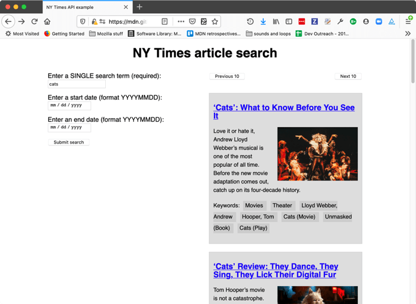

{{LearnSidebar}}

{{PreviousMenu("Learn_web_development/Extensions/Client-side_APIs/Client-side_storage", "Learn_web_development/Extensions/Client-side_APIs")}}

The APIs we've covered so far are built into the browser, but not all APIs are. Many large websites and services such as Google Maps, Twitter, Facebook, PayPal, etc. provide APIs allowing developers to make use of their data (e.g. displaying your twitter stream on your blog) or services (e.g. using Facebook login to log in your users). This article looks at the difference between browser APIs and 3rd party APIs and shows some typical uses of the latter.

<table>
  <tbody>
    <tr>
      <th scope="row">Prerequisites:</th>
      <td>
        Familiarity with <a href="/en-US/docs/Learn_web_development/Core/Structuring_content">HTML</a>, <a href="/en-US/docs/Learn_web_development/Core/Styling_basics">CSS</a>, and <a href="/en-US/docs/Learn_web_development/Core/Scripting">JavaScript</a>, especially <a href="/en-US/docs/Learn_web_development/Core/Scripting/Object_basics">JavaScript object basics</a> and core API coverage such as <a href="/en-US/docs/Learn_web_development/Core/Scripting/DOM_scripting">DOM scripting</a> and <a href="/en-US/docs/Learn_web_development/Core/Scripting/Network_requests">Network requests</a>.
      </td>
    </tr>
    <tr>
      <th scope="row">Learning outcomes:</th>
      <td>
        <ul>
          <li>The concepts behind third-party APIs and associated patterns such as API keys.</li>
          <li>Using a third-party map API.</li>
          <li>Using a RESTful API.</li>
          <li>Using Google's YouTube APIs.</li>
        </ul>
      </td>
    </tr>
  </tbody>
</table>

## What are third party APIs?

Third party APIs are APIs provided by third parties — generally companies such as Facebook, Twitter, or Google — to allow you to access their functionality via JavaScript and use it on your site. One of the most obvious examples is using mapping APIs to display custom maps on your pages.

Let's look at a [Simple Mapquest API example](https://github.com/mdn/learning-area/tree/main/javascript/apis/third-party-apis/mapquest), and use it to illustrate how third-party APIs differ from browser APIs.

### They are found on third-party servers

Browser APIs are built into the browser — you can access them from JavaScript immediately. For example, the Web Audio API we [saw in the Introductory article](/en-US/docs/Learn_web_development/Extensions/Client-side_APIs/Introduction#how_do_apis_work) is accessed using the native {{domxref("AudioContext")}} object. For example:

```js
const audioCtx = new AudioContext();
// …
const audioElement = document.querySelector("audio");
// …
const audioSource = audioCtx.createMediaElementSource(audioElement);
// etc.
```

Third party APIs, on the other hand, are located on third party servers. To access them from JavaScript you first need to connect to the API functionality and make it available on your page. This typically involves first linking to a JavaScript library available on the server via a {{htmlelement("script")}} element, as seen in our Mapquest example:

```html
<script
  src="https://api.mqcdn.com/sdk/mapquest-js/v1.3.2/mapquest.js"
  defer></script>
<link
  rel="stylesheet"
  href="https://api.mqcdn.com/sdk/mapquest-js/v1.3.2/mapquest.css" />
```

You can then start using the objects available in that library. For example:

```js
const map = L.mapquest.map("map", {
  center: [53.480759, -2.242631],
  layers: L.mapquest.tileLayer("map"),
  zoom: 12,
});
```

Here we are creating a variable to store the map information in, then creating a new map using the `mapquest.map()` method, which takes as its parameters the ID of a {{htmlelement("div")}} element you want to display the map in ('map'), and an options object containing the details of the particular map we want to display. In this case we specify the coordinates of the center of the map, a map layer of type `map` to show (created using the `mapquest.tileLayer()` method), and the default zoom level.

This is all the information the Mapquest API needs to plot a simple map. The server you are connecting to handles all the complicated stuff, like displaying the correct map tiles for the area being shown, etc.

> [!NOTE]
> Some APIs handle access to their functionality slightly differently, requiring the developer to make an HTTP request to a specific URL pattern to retrieve data. These are called [RESTful APIs — we'll show an example later on](#a_restful_api_%e2%80%94_nytimes).

### They usually require API keys

Security for browser APIs tends to be handled by permission prompts, as [discussed in our first article](/en-US/docs/Learn_web_development/Extensions/Client-side_APIs/Introduction#they_have_additional_security_mechanisms_where_appropriate). The purpose of these is so that the user knows what is going on in the websites they visit and is less likely to fall victim to someone using an API in a malicious way.

Third party APIs have a slightly different permissions system — they tend to use developer keys to allow developers access to the API functionality, which is more to protect the API vendor than the user.

You'll find a line similar to the following in the Mapquest API example:

```js
L.mapquest.key = "YOUR-API-KEY-HERE";
```

This line specifies an API or developer key to use in your application — the developer of the application must apply to get a key, and then include it in their code to be allowed access to the API's functionality. In our example we've just provided a placeholder.

> [!NOTE]
> When creating your own examples, you'll use your own API key in place of any placeholder.

Other APIs may require that you include the key in a slightly different way, but the pattern is relatively similar for most of them.

Requiring a key enables the API provider to hold users of the API accountable for their actions. When the developer has registered for a key, they are then known to the API provider, and action can be taken if they start to do anything malicious with the API (such as tracking people's location or trying to spam the API with loads of requests to stop it working, for example). The easiest action would be to just revoke their API privileges.

## Extending the Mapquest example

Let's add some more functionality to the Mapquest example to show how to use some other features of the API.

1. To start this section, make yourself a copy of the [mapquest starter file](https://github.com/mdn/learning-area/blob/main/javascript/apis/third-party-apis/mapquest/start/index.html), in a new directory. If you've already cloned the [examples repository](https://github.com/mdn/learning-area), you'll already have a copy of this file, which you can find in the _javascript/apis/third-party-apis/mapquest/start_ directory.
2. Next, you need to go to the [Mapquest developer site](https://developer.mapquest.com/), create an account, and then create a developer key to use with your example. (At the time of writing, it was called a "consumer key" on the site, and the key creation process also asked for an optional "callback URL". You don't need to fill in a URL here: just leave it blank.)
3. Open up your starting file, and replace the API key placeholder with your key.

### Changing the type of map

There are a number of different types of map that can be shown with the Mapquest API. To do this, find the following line:

```js
layers: L.mapquest.tileLayer("map");
```

Try changing `'map'` to `'hybrid'` to show a hybrid-style map. Try some other values too. The [`tileLayer` reference page](https://developer.mapquest.com/documentation/mapquest-js/v1.3/l-mapquest-tile-layer/) shows the different available options, plus a lot more information.

### Adding different controls

The map has a number of different controls available; by default it just shows a zoom control. You can expand the controls available using the `map.addControl()` method; add this to your code:

```js
map.addControl(L.mapquest.control());
```

The [`mapquest.control()` method](https://developer.mapquest.com/documentation/mapquest-js/v1.3/l-mapquest-control/) just creates a simple full-featured control set, and it is placed in the top-right-hand corner by default. You can adjust the position by specifying an options object as a parameter for the control containing a `position` property, the value of which is a string specifying a position for the control. Try this, for example:

```js
map.addControl(L.mapquest.control({ position: "bottomright" }));
```

There are other types of control available, for example [`mapquest.searchControl()`](https://developer.mapquest.com/documentation/mapquest-js/v1.3/l-mapquest-search-control/) and [`mapquest.satelliteControl()`](https://developer.mapquest.com/documentation/mapquest-js/v1.3/l-mapquest-satellite-control/), and some are quite complex and powerful. Have a play around and see what you can come up with.

### Adding a custom marker

Adding a marker (icon) at a certain point on the map is easy — you just use the [`L.marker()`](https://leafletjs.com/reference.html#marker) method (which seems to be documented in the related Leaflet.js docs). Add the following code to your example, again inside `window.onload`:

```js
L.marker([53.480759, -2.242631], {
  icon: L.mapquest.icons.marker({
    primaryColor: "#22407F",
    secondaryColor: "#3B5998",
    shadow: true,
    size: "md",
    symbol: "A",
  }),
})
  .bindPopup("This is Manchester!")
  .addTo(map);
```

As you can see, this at its simplest takes two parameters, an array containing the coordinates at which to display the marker, and an options object containing an `icon` property that defines the icon to display at that point.

The icon is defined using an [`mapquest.icons.marker()`](https://developer.mapquest.com/documentation/mapquest-js/v1.3/l-mapquest-icons/) method, which as you can see contains information such as color and size of marker.

Onto the end of the first method call we chain `.bindPopup('This is Manchester!')`, which defines content to display when the marker is clicked.

Finally, we chain `.addTo(map)` to the end of the chain to actually add the marker to the map.

Have a play with the other options shown in the documentation and see what you can come up with! Mapquest provides some pretty advanced functionality, such as directions, searching, etc.

> [!NOTE]
> If you have trouble getting the example to work, check your code against our [finished version](https://github.com/mdn/learning-area/blob/main/javascript/apis/third-party-apis/mapquest/finished/script.js).

## A RESTful API — NYTimes

Now let's look at another API example — the [New York Times API](https://developer.nytimes.com/). This API allows you to retrieve New York Times news story information and display it on your site. This type of API is known as a **RESTful API** — instead of getting data using the features of a JavaScript library like we did with Mapquest, we get data by making HTTP requests to specific URLs, with data like search terms and other properties encoded in the URL (often as URL parameters). This is a common pattern you'll encounter with APIs.

Below we'll take you through an exercise to show you how to use the NYTimes API, which also provides a more general set of steps to follow that you can use as an approach for working with new APIs.

### Find the documentation

When you want to use a third party API, it is essential to find out where the documentation is, so you can find out what features the API has, how you use them, etc. The New York Times API documentation is at <https://developer.nytimes.com/>.

### Get a developer key

Most APIs require you to use some kind of developer key, for reasons of security and accountability. To sign up for an NYTimes API key, following the instructions at <https://developer.nytimes.com/get-started>.

1. Let's request a key for the Article Search API — create a new app, selecting this as the API you want to use (fill in a name and description, toggle the switch under the "Article Search API" to the on position, and then click "Create").
2. Get the API key from the resulting page.
3. Now, to start the example off, make a copy of all the files in the [nytimes/start](https://github.com/mdn/learning-area/tree/main/javascript/apis/third-party-apis/nytimes/start) directory. If you've already cloned the [examples repository](https://github.com/mdn/learning-area), you'll already have a copy of these files, which you can find in the _javascript/apis/third-party-apis/nytimes/start_ directory. Initially the `script.js` file contains a number of variables needed for the setup of the example; below we'll fill in the required functionality.

The app will end up allowing you to type in a search term and optional start and end dates, which it will then use to query the Article Search API and display the search results.



### Connect the API to your app

First, you'll need to make a connection between the API and your app. In the case of this API, you need to include the API key as a [get](/en-US/docs/Web/HTTP/Methods/GET) parameter every time you request data from the service at the correct URL.

1. Find the following line:

   ```js
   const key = "INSERT-YOUR-API-KEY-HERE";
   ```

   Replace the existing API key with the actual API key you got in the previous section.

2. Add the following line to your JavaScript, below the `// Event listeners to control the functionality` comment. This runs a function called `submitSearch()` when the form is submitted (the button is pressed).

   ```js
   searchForm.addEventListener("submit", submitSearch);
   ```

3. Now add the `submitSearch()` and `fetchResults()` function definitions, below the previous line:

   ```js
   function submitSearch(e) {
     pageNumber = 0;
     fetchResults(e);
   }

   function fetchResults(e) {
     // Use preventDefault() to stop the form submitting
     e.preventDefault();

     // Assemble the full URL
     let url = `${baseURL}?api-key=${key}&page=${pageNumber}&q=${searchTerm.value}&fq=document_type:("article")`;

     if (startDate.value !== "") {
       url = `${url}&begin_date=${startDate.value}`;
     }

     if (endDate.value !== "") {
       url = `${url}&end_date=${endDate.value}`;
     }
   }
   ```

`submitSearch()` sets the page number back to 0 to begin with, then calls `fetchResults()`. This first calls [`preventDefault()`](/en-US/docs/Web/API/Event/preventDefault) on the event object, to stop the form actually submitting (which would break the example). Next, we use some string manipulation to assemble the full URL that we will make the request to. We start off by assembling the parts we deem as mandatory for this demo:

- The base URL (taken from the `baseURL` variable).
- The API key, which has to be specified in the `api-key` URL parameter (the value is taken from the `key` variable).
- The page number, which has to be specified in the `page` URL parameter (the value is taken from the `pageNumber` variable).
- The search term, which has to be specified in the `q` URL parameter (the value is taken from the value of the `searchTerm` text {{htmlelement("input")}}).
- The document type to return results for, as specified in an expression passed in via the `fq` URL parameter. In this case, we want to return articles.

Next, we use a couple of [`if ()`](/en-US/docs/Web/JavaScript/Reference/Statements/if...else) statements to check whether the `startDate` and `endDate` elements have had values filled in on them. If they do, we append their values to the URL, specified in `begin_date` and `end_date` URL parameters respectively.

So, a complete URL would end up looking something like this:

```url
https://api.nytimes.com/svc/search/v2/articlesearch.json?api-key=YOUR-API-KEY-HERE&page=0&q=cats&fq=document_type:("article")&begin_date=20170301&end_date=20170312
```

> [!NOTE]
> You can find more details of what URL parameters can be included at the [NYTimes developer docs](https://developer.nytimes.com/).

> [!NOTE]
> The example has rudimentary form data validation — the search term field has to be filled in before the form can be submitted (achieved using the `required` attribute), and the date fields have `pattern` attributes specified, which means they won't submit unless their values consist of 8 numbers (`pattern="[0-9]{8}"`). See [Form data validation](/en-US/docs/Learn_web_development/Extensions/Forms/Form_validation) for more details on how these work.

### Requesting data from the API

Now we've constructed our URL, let's make a request to it. We'll do this using the [Fetch API](/en-US/docs/Web/API/Fetch_API/Using_Fetch).

Add the following code block inside the `fetchResults()` function, just above the closing curly brace:

```js
// Use fetch() to make the request to the API
fetch(url)
  .then((response) => response.json())
  .then((json) => displayResults(json))
  .catch((error) => console.error(`Error fetching data: ${error.message}`));
```

Here we run the request by passing our `url` variable to [`fetch()`](/en-US/docs/Web/API/Window/fetch), convert the response body to JSON using the [`json()`](/en-US/docs/Web/API/Response/json) function, then pass the resulting JSON to the `displayResults()` function so the data can be displayed in our UI. We also catch and log any errors that might be thrown.

### Displaying the data

OK, let's look at how we'll display the data. Add the following function below your `fetchResults()` function.

```js
function displayResults(json) {
  while (section.firstChild) {
    section.removeChild(section.firstChild);
  }

  const articles = json.response.docs;

  nav.style.display = articles.length === 10 ? "block" : "none";

  if (articles.length === 0) {
    const para = document.createElement("p");
    para.textContent = "No results returned.";
    section.appendChild(para);
  } else {
    for (const current of articles) {
      const article = document.createElement("article");
      const heading = document.createElement("h2");
      const link = document.createElement("a");
      const img = document.createElement("img");
      const para1 = document.createElement("p");
      const keywordPara = document.createElement("p");
      keywordPara.classList.add("keywords");

      console.log(current);

      link.href = current.web_url;
      link.textContent = current.headline.main;
      para1.textContent = current.snippet;
      keywordPara.textContent = "Keywords: ";
      for (const keyword of current.keywords) {
        const span = document.createElement("span");
        span.textContent = `${keyword.value} `;
        keywordPara.appendChild(span);
      }

      if (current.multimedia.length > 0) {
        img.src = `http://www.nytimes.com/${current.multimedia[0].url}`;
        img.alt = current.headline.main;
      }

      article.appendChild(heading);
      heading.appendChild(link);
      article.appendChild(img);
      article.appendChild(para1);
      article.appendChild(keywordPara);
      section.appendChild(article);
    }
  }
}
```

There's a lot of code here; let's explain it step by step:

- The [`while`](/en-US/docs/Web/JavaScript/Reference/Statements/while) loop is a common pattern used to delete all of the contents of a DOM element, in this case, the {{htmlelement("section")}} element. We keep checking to see if the `<section>` has a first child, and if it does, we remove the first child. The loop ends when `<section>` no longer has any children.
- Next, we set the `articles` variable to equal `json.response.docs` — this is the array holding all the objects that represent the articles returned by the search. This is done purely to make the following code a bit simpler.
- The first [`if ()`](/en-US/docs/Web/JavaScript/Reference/Statements/if...else) block checks to see if 10 articles are returned (the API returns up to 10 articles at a time.) If so, we display the {{htmlelement("nav")}} that contains the _Previous 10_/_Next 10_ pagination buttons. If fewer than 10 articles are returned, they will all fit on one page, so we don't need to show the pagination buttons. We will wire up the pagination functionality in the next section.
- The next `if ()` block checks to see if no articles are returned. If so, we don't try to display any — we create a {{htmlelement("p")}} containing the text "No results returned." and insert it into the `<section>`.
- If some articles are returned, we, first of all, create all the elements that we want to use to display each news story, insert the right contents into each one, and then insert them into the DOM at the appropriate places. To work out which properties in the article objects contained the right data to show, we consulted the Article Search API reference (see [NYTimes APIs](https://developer.nytimes.com/apis)). Most of these operations are fairly obvious, but a few are worth calling out:

  - We used a [`for...of`](/en-US/docs/Web/JavaScript/Reference/Statements/for...of) loop to go through all the keywords associated with each article, and insert each one inside its own {{htmlelement("span")}}, inside a `<p>`. This was done to make it easy to style each one.
  - We used an `if ()` block (`if (current.multimedia.length > 0) { }`) to check whether each article has any images associated with it, as some stories don't. We display the first image only if it exists; otherwise, an error would be thrown.

### Wiring up the pagination buttons

To make the pagination buttons work, we will increment (or decrement) the value of the `pageNumber` variable, and then re-rerun the fetch request with the new value included in the page URL parameter. This works because the NYTimes API only returns 10 results at a time — if more than 10 results are available, it will return the first 10 (0-9) if the `page` URL parameter is set to 0 (or not included at all — 0 is the default value), the next 10 (10-19) if it is set to 1, and so on.

This allows us to write a simplistic pagination function.

1. Below the existing [`addEventListener()`](/en-US/docs/Web/API/EventTarget/addEventListener) call, add these two new ones, which cause the `nextPage()` and `previousPage()` functions to be invoked when the relevant buttons are clicked:

   ```js
   nextBtn.addEventListener("click", nextPage);
   previousBtn.addEventListener("click", previousPage);
   ```

2. Below your previous addition, let's define the two functions — add this code now:

   ```js
   function nextPage(e) {
     pageNumber++;
     fetchResults(e);
   }

   function previousPage(e) {
     if (pageNumber > 0) {
       pageNumber--;
     } else {
       return;
     }
     fetchResults(e);
   }
   ```

   The first function increments the `pageNumber` variable, then run the `fetchResults()` function again to display the next page's results.

   The second function works nearly exactly the same way in reverse, but we also have to take the extra step of checking that `pageNumber` is not already zero before decrementing it — if the fetch request runs with a minus `page` URL parameter, it could cause errors. If the `pageNumber` is already 0, we [`return`](/en-US/docs/Web/JavaScript/Reference/Statements/return) out of the function — if we are already at the first page, we don't need to load the same results again.

> [!NOTE]
> You can find our [finished NYTimes API example code on GitHub](https://github.com/mdn/learning-area/blob/main/javascript/apis/third-party-apis/nytimes/finished/index.html) (also [see it running live here](https://mdn.github.io/learning-area/javascript/apis/third-party-apis/nytimes/finished/)).

## YouTube example

We also built another example for you to study and learn from — see our [YouTube video search example](https://mdn.github.io/learning-area/javascript/apis/third-party-apis/youtube/). This uses two related APIs:

- The [YouTube Data API](https://developers.google.com/youtube/v3/docs/) to search for YouTube videos and return results.
- The [YouTube IFrame Player API](https://developers.google.com/youtube/iframe_api_reference) to display the returned video examples inside IFrame video players so you can watch them.

This example is interesting because it shows two related third-party APIs being used together to build an app. The first one is a RESTful API, while the second one works more like Mapquest (with API-specific methods, etc.). It is worth noting however that both of the APIs require a JavaScript library to be applied to the page. The RESTful API has functions available to handle making the HTTP requests and returning the results.


We are not going to say too much more about this example in the article — [the source code](https://github.com/mdn/learning-area/tree/main/javascript/apis/third-party-apis/youtube) has detailed comments inserted inside it to explain how it works.

To get it running, you'll need to:

- Read the [YouTube Data API Overview](https://developers.google.com/youtube/v3/getting-started) documentation.
- Make sure you visit the [Enabled APIs page](https://console.cloud.google.com/apis/enabled), and in the list of APIs, make sure the status is ON for the YouTube Data API v3.
- Get an API key from [Google Cloud](https://cloud.google.com/).
- Find the string `ENTER-API-KEY-HERE` in the source code, and replace it with your API key.
- Run the example through a web server. It won't work if you just run it directly in the browser (i.e. via a `file://` URL).

## Summary

This article has given you a useful introduction to using third-party APIs to add functionality to your websites.

{{PreviousMenu("Learn_web_development/Extensions/Client-side_APIs/Client-side_storage", "Learn_web_development/Extensions/Client-side_APIs")}}
