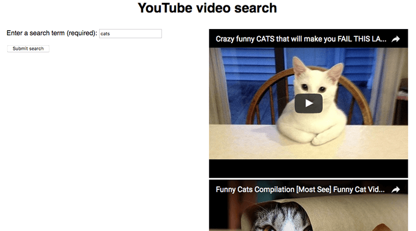

{{PreviousMenu("Learn_web_development/Extensions/Client-side_APIs/Client-side_storage", "Learn_web_development/Extensions/Client-side_APIs")}}

The APIs we've covered so far are built into the browser, but not all APIs are. Many large websites and services such as Google, GitHub, YouTube, Spotify, etc. provide APIs allowing developers to make use of their data (e.g., displaying information about your repositories on your blog) or services (e.g., using Google login to log in your users). This article explains the difference between browser APIs and third-party APIs and shows some typical uses of the latter.

<table>
  <tbody>
    <tr>
      <th scope="row">Prerequisites:</th>
      <td>
        Familiarity with <a href="/en-US/docs/Learn_web_development/Core/Structuring_content">HTML</a>, <a href="/en-US/docs/Learn_web_development/Core/Styling_basics">CSS</a>, and <a href="/en-US/docs/Learn_web_development/Core/Scripting">JavaScript</a>, especially <a href="/en-US/docs/Learn_web_development/Core/Scripting/Object_basics">JavaScript object basics</a> and core API coverage such as <a href="/en-US/docs/Learn_web_development/Core/Scripting/DOM_scripting">DOM scripting</a> and <a href="/en-US/docs/Learn_web_development/Core/Scripting/Network_requests">Network requests</a>.
      </td>
    </tr>
    <tr>
      <th scope="row">Learning outcomes:</th>
      <td>
        <ul>
          <li>The concepts behind third-party APIs and associated patterns such as API keys.</li>
          <li>Using a RESTful API.</li>
          <li>Using Google's YouTube APIs.</li>
        </ul>
      </td>
    </tr>
  </tbody>
</table>

## What are third-party APIs?

Third-party APIs are APIs provided by third parties — generally companies such as Spotify or Google — to allow you to access their functionality via JavaScript and use it on your site. One example is YouTube's APIs, which can search for videos and display them on your pages.

Let's look at how third-party APIs differ from browser APIs.

### They are found on third-party servers

Browser APIs are built into the browser — you can access them from JavaScript immediately. For example, the Web Audio API we [saw in the Introductory article](/en-US/docs/Learn_web_development/Extensions/Client-side_APIs/Introduction#how_do_apis_work) is accessed using the native {{domxref("AudioContext")}} object. For example:

```js
const audioCtx = new AudioContext();
// …
const audioElement = document.querySelector("audio");
// …
const audioSource = audioCtx.createMediaElementSource(audioElement);
// etc.
```

Third-party APIs, on the other hand, are located on third-party servers. To access them from JavaScript, you first need to connect to the API functionality and make it available on your page.

All third-party APIs ultimately connect to their servers using HTTP. But manually making {{domxref("Window/fetch", "fetch()")}} calls is awkward and prone to breaking changes, so usually they provide functionality wrapped in functions, known as a Software Development Kit (SDK). The SDK constructs the HTTP payload, sends the request to the right endpoint, parses the response, etc., so you write as little code as possible and only supply the necessary data.

Traditionally, the SDK is provided by embedding an external script in a {{htmlelement("script")}} element, which registers the library as a global variable. More modern APIs usually provide them as [modules](/en-US/docs/Web/JavaScript/Guide/Modules) that you can import, sometimes distributed through package managers like [npm](https://docs.npmjs.com/).

For example, Google's JavaScript client library exposes a global `gapi` object when you load its script:

```html
<script src="https://apis.google.com/js/api.js"></script>
```

After initializing the client for the Google Drive API and obtaining the user's authorization, you can list files with a method call:

```js
async function listDriveFiles() {
  try {
    const response = await gapi.client.drive.files.list({
      pageSize: 10,
      fields: "files(id, name)",
    });

    for (const file of response.result.files) {
      console.log(`${file.name} (${file.id})`);
    }
  } catch (error) {
    console.error("Could not list Drive files:", error);
  }
}
```

The library translates `gapi.client.drive.files.list()` into an HTTP request and makes the parsed response available through `response.result`. Of course, there's a lot of setup required to use Google APIs, as introduced by Google's [Drive API JavaScript quickstart](https://developers.google.com/workspace/drive/api/quickstart/js)—you need to register the app with its permissions, configure OAuth, etc.

### They usually require API keys

Security for browser APIs tends to be handled by permission prompts, as [discussed in our first article](/en-US/docs/Learn_web_development/Extensions/Client-side_APIs/Introduction#they_have_additional_security_mechanisms_where_appropriate). The purpose of these is to let the user know what is happening on the websites they visit and to make them less likely to fall victim to someone maliciously using an API.

Third-party APIs have a slightly different permissions system — they tend to use developer keys to allow developers access to the API functionality, which is more to protect the API vendor than the user.

Requiring a key enables the API provider to hold developers using the API accountable for their actions. When the developer registers a key, the API provider can identify them and can take action if the developer starts to do anything malicious with the API (such as tracking people's location or spamming the API with loads of requests to stop it from working). The easiest action is to revoke the developer's API privileges.

You'll find a line similar to the following in the YouTube API example:

```js
gapi.client.setApiKey("YOUR-API-KEY-HERE");
```

This line specifies an API or developer key to use in your application — the application developer must apply to get a key, and then include it in their code to be allowed access to the API's functionality. In our example, we've just provided a placeholder.

Other APIs may require that you include the key in a slightly different way, but the pattern is relatively similar for most of them.

> [!WARNING]
> Protect API keys like you would protect your passwords. Unless explicitly permitted by the API vendor's documentation, never, ever, embed API keys in your frontend code. Otherwise, any visitor to your website can extract the API key and abuse it, possibly leaking sensitive information or getting you banned from using the API. Always set up your own backend and _proxy_ the request—that is, your server communicates with the third-party API using the API key, while your user communicates with your own server. The API key only lives on your server.
>
> It also goes without saying that you should never commit them to your public GitHub repositories. If you accidentally expose a key, immediately revoke it and get a new one.

Not all APIs need API keys. Some APIs provide open-access, high-volume functionality, so granting API access doesn't really add much to the server load (although they may still be rate-limited). Examples include [GitHub REST API](https://docs.github.com/en/rest) (see next), [Wikipedia's APIs](https://www.mediawiki.org/wiki/API:Main_page) for article content, and the [Stack Exchange API](https://api.stackexchange.com/docs) for questions and answers.

## A RESTful API — GitHub

As already mentioned, all APIs ultimately become HTTP requests, but some APIs provide SDKs while others expect you to handle the request yourself.

For the latter case, the APIs are usually designed in a [**RESTful**](https://en.wikipedia.org/wiki/REST) fashion. This is a paradigm where the client is _stateless_ (i.e., each request is made in isolation), sends requests to specific URLs using specific HTTP verbs (`GET`, `POST`, etc.) to carry out specific actions, and sends the input for each action via URL parameters or the request body.

Let's look at the [GitHub REST API](https://docs.github.com/en/rest). This API allows you to retrieve information about GitHub repositories and display it on your site.

### Find the documentation

When you want to use a third-party API, find the documentation so you can review the API's features and how to use them. For this example, we'll use GitHub's [Search repositories endpoint](https://docs.github.com/en/rest/search/search#search-repositories).

When reading documentation for REST APIs, focus on these five questions:

1. What [HTTP method](/en-US/docs/Web/HTTP/Reference/Methods) to use for the task
2. What URL endpoint to request for the task
3. What payload the endpoint expects, and in which format (JSON body, XML body, query parameters, etc.)
4. What [status codes](/en-US/docs/Web/HTTP/Reference/Status) it may return, and what each one means
5. What's contained in the response body, and in which format

### Get a personal access token

For this exercise, create a **personal access token (PAT)** to authenticate your requests:

1. Sign in to your GitHub account, or [sign up for one](https://github.com/signup) if you don't already have one.
2. Follow GitHub's instructions for [creating a fine-grained personal access token](https://docs.github.com/en/authentication/keeping-your-account-and-data-secure/managing-your-personal-access-tokens#creating-a-fine-grained-personal-access-token). Give it a descriptive name (such as "MDN 3rd party API lesson") and a short expiration (if you don't expect to continue using it after this lesson), and select your own account as the resource owner.
3. Under **Repository access**, select **Public repositories**. Leave additional permissions unset: searching public repositories doesn't require any.
4. Click **Generate token** and copy the token. You'll enter it in the form in the [live example](#try_the_example), rather than adding it to your source code.

This example uses API keys differently from their typical usage: the website asks the user to submit their own key and perform the action on their behalf, so it doesn't need its own API key or a server to proxy requests.

> [!WARNING]
> Once again, treat this PAT like your password. Only share your PAT with websites you trust, and give it really narrowly-scoped permissions and a short expiration date so it won't get abused. Our example sends the token directly from your browser to GitHub and does not save it in browser storage or send it to other servers.

GitHub also allows unauthenticated searches of public repositories, with a lower [search rate limit](https://docs.github.com/en/rest/search/search#rate-limit). We'll make the token field optional so you can try the example without one, then enter your token to see how authentication is added to a request.

### Set up the example

The app allows you to type in a search term and optional start and end dates for repository creation, then displays matching repositories.

The HTML defines the search form, a status message, a results section, and pagination buttons:

```html live-sample___github-search
<form>
  <fieldset>
    <legend>Search public repositories</legend>
    <p>
      <label for="token">Personal access token (optional):</label>
      <input id="token" type="password" autocomplete="off" />
    </p>
    <p>
      <label for="search">Search term:</label>
      <input id="search" type="search" required />
    </p>
    <p>
      <label for="start-date">Created on or after:</label>
      <input id="start-date" type="date" />
    </p>
    <p>
      <label for="end-date">Created on or before:</label>
      <input id="end-date" type="date" />
    </p>
    <button type="submit">Search</button>
  </fieldset>
</form>
<p id="status" role="status"></p>
<section aria-label="Search results"></section>
<nav aria-label="Result pages">
  <button id="previous" type="button" disabled>Previous page</button>
  <button id="next" type="button" disabled>Next page</button>
</nav>
```

The JavaScript starts by storing references to the HTML elements and setting up the pagination state:

```js live-sample___github-search
const baseURL = "https://api.github.com/search/repositories";
const perPage = 10;
const searchForm = document.querySelector("form");
const searchFields = document.querySelector("fieldset");
const tokenInput = document.querySelector("#token");
const searchTerm = document.querySelector("#search");
const startDate = document.querySelector("#start-date");
const endDate = document.querySelector("#end-date");
const section = document.querySelector("section");
const status = document.querySelector("#status");
const nextBtn = document.querySelector("#next");
const previousBtn = document.querySelector("#previous");

let pageNumber = 1;
let query = "";
let hasNextPage = false;
```

### Connect the API to your app

When the form is submitted, we assemble the search query:

```js live-sample___github-search
searchForm.addEventListener("submit", submitSearch);

function submitSearch(e) {
  e.preventDefault();

  query = `${searchTerm.value.trim()} is:public`;
  if (startDate.value !== "") {
    query = `${query} created:>=${startDate.value}`;
  }
  if (endDate.value !== "") {
    query = `${query} created:<=${endDate.value}`;
  }

  pageNumber = 1;
  hasNextPage = false;
  section.textContent = "";
  fetchResults(pageNumber);
}
```

`submitSearch()` calls [`preventDefault()`](/en-US/docs/Web/API/Event/preventDefault) to stop the form actually submitting and reloading the page. It then combines the search term with GitHub's [search qualifiers](https://docs.github.com/en/search-github/searching-on-github/searching-for-repositories): `is:public` limits results to public repositories, and the `created:` qualifiers filter by creation date. We save this query as a top-level variable, so flipping pages will reuse the same query even if the search form has been edited.

### Requesting data from the API

Now let's make a request using the [Fetch API](/en-US/docs/Web/API/Fetch_API/Using_Fetch). The `fetchResults()` function requests a page of search results:

```js live-sample___github-search
async function fetchResults(page) {
  const url = new URL(baseURL);
  url.searchParams.set("q", query);
  url.searchParams.set("page", page);
  url.searchParams.set("per_page", perPage);

  const headers = {
    Accept: "application/vnd.github+json",
    "X-GitHub-Api-Version": "2026-03-10",
  };
  const token = tokenInput.value.trim();
  if (token !== "") {
    headers.Authorization = `Bearer ${token}`;
  }

  searchFields.disabled = true;
  nextBtn.disabled = true;
  previousBtn.disabled = true;
  status.textContent = "Loading…";

  try {
    const response = await fetch(url, { headers });
    if (!response.ok) {
      throw new Error(`HTTP error: ${response.status}`);
    }
    const json = await response.json();
    displayResults(json);
    pageNumber = page;
    hasNextPage = pageNumber * perPage < Math.min(json.total_count, 1000);
    status.textContent = `Page ${pageNumber}.`;
    if (json.incomplete_results) {
      status.textContent +=
        " The search returned incomplete results. Try a narrower search.";
    }
  } catch (error) {
    status.textContent = `Could not fetch results: ${error.message}`;
  } finally {
    searchFields.disabled = false;
    previousBtn.disabled = pageNumber === 1;
    nextBtn.disabled = !hasNextPage;
  }
}
```

GitHub's REST API uses standard HTTP verbs to distinguish action types. Because this is a read operation, we perform a `GET` request (the default for `fetch()`). The `GET` request has no body, so input is provided via query parameters. We add them via the {{domxref("URL")}} object's `searchParams` property: the search query (`q`), page number (`page`), and number of results per page (`per_page`).

For example, searching for `cats` without dates produces a URL like this:

```url
https://api.github.com/search/repositories?q=cats+is%3Apublic&page=1&per_page=10
```

The `headers` object specifies the response format and API version. The {{HTTPHeader("Authorization")}} header is worthy of your attention: this is the standard way to transfer API keys. Here we use the `Bearer` scheme.

The REST API returns data in JSON format because we requested it with `Accept: "application/vnd.github+json"`; we then parse it using [`response.json()`](/en-US/docs/Web/API/Response/json). The JSON's shape can also be found in GitHub's [Search repositories endpoint documentation](https://docs.github.com/en/rest/search/search#search-repositories).

> [!NOTE]
> If you receive a `401` error, check for a mistyped, expired, or revoked token. A `403` or `429` error can indicate a rate limit, in which case you should wait before trying again rather than repeatedly clicking Search, which only worsens the situation. See GitHub's [troubleshooting guidance](https://docs.github.com/en/rest/using-the-rest-api/troubleshooting-the-rest-api).

After a successful request, `fetchResults()` updates `pageNumber` and enables the appropriate buttons. The Previous page button is disabled on the first page. The search endpoint exposes at most 1,000 results, so `fetchResults()` uses this limit and `total_count` to decide when to disable the Next page button.

### Displaying the data

The `displayResults()` function displays the returned repositories:

```js live-sample___github-search
function displayResults(json) {
  section.textContent = "";

  const repositories = json.items;

  if (repositories.length === 0) {
    const para = document.createElement("p");
    para.textContent = "No results returned.";
    section.appendChild(para);
    return;
  }
  for (const current of repositories) {
    const article = document.createElement("article");
    const heading = document.createElement("h2");
    const link = document.createElement("a");
    const para = document.createElement("p");
    const details = document.createElement("p");

    link.href = current.html_url;
    link.textContent = current.full_name;
    para.textContent = current.description ?? "No description provided.";
    details.textContent = `Stars: ${current.stargazers_count}`;

    heading.appendChild(link);
    article.appendChild(heading);
    article.appendChild(para);
    article.appendChild(details);
    section.appendChild(article);
  }
}
```

The code reads the JSON response body and converts the result to a DOM tree.

- It first clears the section's content.
- The repositories are in the response's `items` array. If it is empty, we display a message saying that no results were returned.
- Otherwise, we create elements for each repository's name, link, description, and star count, then insert them into the DOM.

### Wiring up the pagination buttons

We provide event listeners that listen for the "Previous page" and "Next page" buttons being clicked, and request the next or previous results page as appropriate:

```js live-sample___github-search
nextBtn.addEventListener("click", () => {
  fetchResults(pageNumber + 1);
});

previousBtn.addEventListener("click", () => {
  fetchResults(pageNumber - 1);
});
```

GitHub's page numbers start at 1. We've requested 10 results per page, so page 2 contains the next 10 results, and so on. The current page number is recorded in `pageNumber` and updated only after a successful request.

### Try the example

Enter a search term such as `javascript` and submit the form. Try searching with and without your token, adding dates, and navigating between pages.

```css hidden live-sample___github-search
body {
  font-family: sans-serif;
}

label {
  display: block;
}

input {
  box-sizing: border-box;
  max-width: 100%;
}

section {
  max-height: 300px;
  overflow: auto;
  overflow-wrap: anywhere;
}

article {
  border-bottom: 1px solid #cccccc;
}

nav {
  margin-top: 1rem;
}
```

{{EmbedLiveSample("github-search", "100%", 750)}}

## YouTube example

We also built another example for you to study and learn from — see our [YouTube video search example](https://mdn.github.io/learning-area/javascript/apis/third-party-apis/youtube/).

> [!NOTE]
> The linked example doesn't work because it doesn't contain a valid API key; as we said, you should never share API keys in published frontend code. To run the demo, set up a local copy with your own API key as described below.

This uses two related APIs:

- The [YouTube Data API](https://developers.google.com/youtube/v3/docs/) to search for YouTube videos and return results.
- The [YouTube IFrame Player API](https://developers.google.com/youtube/iframe_api_reference) to display the returned video examples inside iframe video players so you can watch them.

This example is interesting because it shows two related third-party APIs being used together to build an app. The first one is a RESTful API, while the second one provides JavaScript methods to control a video player. This example uses JavaScript libraries for both APIs: the client library for the Data API handles the HTTP requests and returns the results.



We are not going to say too much more about this example in the article — [the source code](https://github.com/mdn/learning-area/tree/main/javascript/apis/third-party-apis/youtube) has detailed comments inserted inside it to explain how it works.

The Data API provides a default daily [quota](https://developers.google.com/youtube/v3/getting-started#quota) for projects that enable it. Requests consume this quota, so you can perform a limited number of searches.

To get it running, you'll need to:

- Read the [YouTube Data API Overview](https://developers.google.com/youtube/v3/getting-started) documentation.
- Make sure you visit the [Enabled APIs page](https://console.cloud.google.com/apis/enabled), and in the list of APIs, make sure the status is ON for the YouTube Data API v3.
- Get an API key from [Google Cloud](https://cloud.google.com/).
- Find the string `YOUR-API-KEY-HERE` in the source code, and replace it with your API key.
- Run the example through a web server. It won't work if you just run it directly in the browser (i.e., via a `file://` URL).

## Summary

This article has given you a useful introduction to using third-party APIs to add functionality to your websites.

{{PreviousMenu("Learn_web_development/Extensions/Client-side_APIs/Client-side_storage", "Learn_web_development/Extensions/Client-side_APIs")}}
