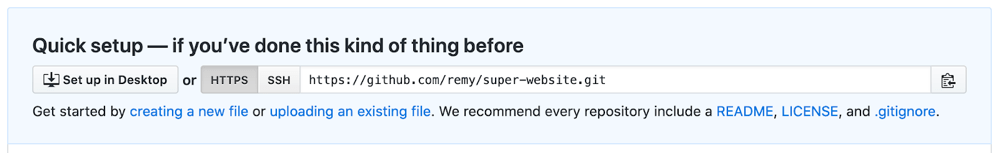
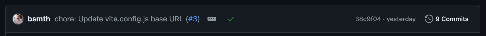

{{PreviousMenu("Learn_web_development/Extensions/Client-side_tools/Introducing_complete_toolchain", "Learn_web_development/Extensions/Client-side_tools")}}

In the final article in our series, we take the example toolchain we built up in the previous article and add to it so that we can deploy our sample app. We push the code to GitHub, deploy it using GitHub Pages, and even show you how to add a simple test into the process.

<table>
  <tbody>
    <tr>
      <th scope="row">Prerequisites:</th>
      <td>
        Familiarity with the core <a href="/en-US/docs/Learn_web_development/Core/Structuring_content">HTML</a>,
        <a href="/en-US/docs/Learn_web_development/Core/Styling_basics">CSS</a>, and
        <a href="/en-US/docs/Learn_web_development/Core/Scripting">JavaScript</a> languages.
      </td>
    </tr>
    <tr>
      <th scope="row">Objective:</th>
      <td>
        To finish working through our complete toolchain case study, focusing on
        deploying the app.
      </td>
    </tr>
  </tbody>
</table>

## Post development

There's potentially a large range of problems to be solved in this section of the project's lifecycle. As such, it's important to create a toolchain that handles these problems in a way that requires as little manual intervention as possible.

Here's just a few things to consider for this particular project:

- Generating a production build: Ensuring files are minimized, chunked, have tree-shaking applied, and that versions are "cache busted".
- Running tests: These can range from "is this code formatted properly?" to "does this thing do what I expect?", and ensuring failing tests prevent deployment.
- Actually deploying the updated code to a live URL: Or potentially a staging URL so it can be reviewed first.

> [!NOTE]
> Cache busting is a new term that we haven't met before in the module. This is the strategy of breaking a browser's own caching mechanism, which forces the browser to download a new copy of your code. Vite (and indeed many other tools) will generate filenames that are unique to each new build. This unique filename "busts" your browser's cache, thereby making sure the browser downloads the fresh code each time an update is made to the deployed code.

The above tasks also break down into further tasks; note that most web development teams will have their own terms and processes for at least some part of the post-development phase.

For this project, we're going to use [GitHub Pages](https://pages.github.com/)'s free static hosting offering to host our project. It not only serves our website on the Internet but also gives us a URL to our website. It's great — many MDN example websites are hosted on GitHub Pages.

Deploying to hosting tends to be at the tail-end of the project life cycle, but with services such as GitHub Pages bringing down the cost of deployments (both in financial terms and also the time required to actually deploy) it's possible to deploy during development to either share work in progress or to have a pre-release for some other purpose.

GitHub provides a smooth workflow to turn new code into a live website:

- You push your code to GitHub.
- You define a [GitHub Action](https://docs.github.com/en/actions) that gets triggered when there's a new push to the main branch, which builds the code and puts it at a specific location.
- GitHub Pages then serves the code at a specific URL.

It's exactly these kinds of connected services that we would encourage you to look for when deciding on your own build toolchain. We can commit our code and push to GitHub and the updated code will automatically trigger the entire build routine. If all is well, we get a live change deployed automatically. The _only_ action we need to perform is that initial "push".

However, we do have to set these steps up, and we'll look at that now.

## The build process

Again, because we're using Vite for development, the build option is extremely simple to add. As we saw earlier, we already have a custom script `npm run build` that will let Vite build everything ready for production instead of just running it for development and testing purposes. This includes doing [minification](/en-US/docs/Glossary/Minification) and [tree-shaking](/en-US/docs/Glossary/Tree_shaking) of code, and cache-busting on filenames.

It is a good best practice to always define a `build` script in your project, so we can then rely on `npm run build` to always do the complete build step, without needing to remember the specific build command arguments for each project.

The newly-created production code is placed in a new directory called `dist`, which contains _all_ the files required to run the website, ready for you to upload to a server.

However, doing this step manually isn't our final aim — what we want is for the build to happen automatically and the result of the `dist` directory to be deployed live on our website.

## Committing changes to GitHub

This section will get you over the line to storing your code in a git repository, but it is a far cry from a git tutorial. There are many great tutorials and books available, and our [Git and GitHub](/en-US/docs/Learn_web_development/Core/Version_control) page is a good place to start.

We initialized our working directory as a git working directory earlier on. A quick way to verify this is to run the following command:

```bash
git status
```

You should get a status report of what files are being tracked, what files are staged, and so on — all terms that are part of the git grammar. If you get the error `fatal: not a git repository` returned, then the working directory is not a git working directory and you'll need to initialize git using `git init`.

Now we have three tasks ahead of us:

- Add any changes we've made to the stage (a special name for the place that git will commit files from).
- Commit the changes to the repository.
- Push the changes to GitHub.

1. To add changes, run the following command:

   ```bash
   git add .
   ```

   Note the period at the end, it means "everything in this directory". The `git add .` command is a bit of a sledgehammer approach — it will add all local changes you've worked on in one go. If you want finer control over what you add, then use `git add -p` for an interactive process, or add individual files using `git add path/to/file`.

2. Now all the code is staged, we can commit; run the following command:

   ```bash
   git commit -m 'committing initial code'
   ```

   > [!NOTE]
   > Although you're free to write whatever you wish in the commit message, there's some useful tips around the web on good commit messages. Keep them short, concise, and descriptive, so they clearly describe what the change does.

3. Finally, the code needs to be pushed to your GitHub-hosted repository. Let's do that now.

   Over at GitHub, visit <https://github.com/new> and create your own repository to host this code.

4. Give your repository a short, memorable name, without spaces in it (use hyphens to separate words), and a description, then click _Create repository_ at the bottom of the page.

   You should now have a "remote" URL that points to your new GitHub repo.

   

5. This remote location needs to be added to our local git repository before we can push it up there, otherwise it won't be able to find it. You'll need to run a command with the following structure (use the provided HTTPS option for now — especially if you are new to GitHub — not the SSH option):

   ```bash
   git remote add origin https://github.com/your-name/repo-name.git
   ```

   So if your remote URL was `https://github.com/remy/super-website.git`, as in the screenshot above, your command would be

   ```bash
   git remote add origin https://github.com/remy/super-website.git
   ```

   Change the URL to your own repository, and run it now.

   > [!NOTE]
   > After you've chosen your repository name, make sure the `base` option in your `vite.config.js` reflects this name, as mentioned in [the previous chapter](/en-US/docs/Learn_web_development/Extensions/Client-side_tools/Introducing_complete_toolchain#javascript_transformation). Otherwise, the JavaScript and CSS assets will not be linked correctly.

6. Now we're ready to push our code to GitHub; run the following command now:

   ```bash
   git push origin main
   ```

   At this point, you'll be prompted to enter a username and password before Git will allow the push to be sent. This is because we used the HTTPS option rather than the SSH option, as seen in the screenshot earlier. For this, you need your GitHub username and then — if you do not have two-factor authentication (2FA) turned on — your GitHub password. We would always encourage you to use 2FA if possible, but bear in mind that if you do, you'll also need to use a "personal access token". GitHub help pages has an [excellent and simple walkthrough covering how to get one](https://docs.github.com/en/authentication/keeping-your-account-and-data-secure/managing-your-personal-access-tokens).

> [!NOTE]
> If you are interested in using the SSH option, thereby avoiding the need to enter your username and password every time you push to GitHub, [this tutorial walks you through how](https://docs.github.com/en/authentication/connecting-to-github-with-ssh).

This final command instructs git to push the code to the "remote" location that we called `origin` (that's the repository hosted on github.com — we could have called it anything we like) using the branch `main`. We've not encountered branches at all, but the "main" branch is the default place for our work and it's what git starts on. When we define the action triggered to build the website, we'll also let it watch for changes on the "main" branch.

> [!NOTE]
> Until October 2020 the default branch on GitHub was `master`, which for various social reasons was switched to `main`. You should be aware that this older default branch may appear in various projects you encounter, but we'd suggest using `main` for your own projects.

So with our project committed in git and pushed to our GitHub repository, the next step in the toolchain is to define a build action so our project can be deployed live on the web!

## Using GitHub Actions for deployment

GitHub Actions, like ESLint configuration, is another deep rabbit hole to dive into. It's not easy to get right on your first try, but for popular tasks like "build a static website and deploy it to GitHub Pages", there are many examples to copy and paste from. You can follow the instructions in [Publishing with a custom GitHub Actions workflow](https://docs.github.com/en/pages/getting-started-with-github-pages/configuring-a-publishing-source-for-your-github-pages-site#publishing-with-a-custom-github-actions-workflow). You can check [our GitHub Action file](https://github.com/mdn/client-toolchain-example/blob/main/.github/workflows/github-pages.yml) for a working example. (The name of the file doesn't matter.)

After you commit this file to the main branch, you should see a little green tick next to the commit title:



If you see a yellow dot, it means the action is running, and if you see a red cross, it means the action failed. Click on the icon and you can see the status and the logs of your own build action (named "Deploy build" in our case).

After waiting for a few more minutes, you can visit your GitHub Pages URL to see your website live on the web. The link looks like `https://<your-name>.github.io/<repo-name>`. For our example, it's at <https://mdn.github.io/client-toolchain-example/>.

Now for one final link in our toolchain: a test to ensure our code works.

## Testing

Testing itself is a vast subject, even within the realm of front-end development. I'll show you how to add an initial test to your project and how to use the test to prevent or to allow the project deployment to happen.

When approaching tests there are a good deal of ways to approach the problem:

- End-to-end testing, which involves your visitor clicking a thing and some other thing happening.
- Integration testing, which basically says "does one block of code still work when connected to another block?"
- Unit testing, where small and specific bits of functionality are tested to see if they do what they are supposed to do.
- [And many more types](https://en.wikipedia.org/wiki/Functional_testing). Also, see our [cross browser testing module](/en-US/docs/Learn_web_development/Extensions/Testing) for a bunch of useful testing information.

Remember also that tests are not limited to JavaScript; tests can be run against the rendered DOM, user interactions, CSS, and even how a page looks.

However, for this project we're going to create a small test that will check if the GitHub API data is in the correct format. If not, the test will fail and will prevent the project from going live. To do anything else would be beyond the scope of this module — testing is a huge subject that really requires its own separate module. We are hoping that this section will at least make you aware of the need for testing, and will plant the seed that inspires you to go and learn more.

The test itself isn't what is important. What is important is how the failure or success is handled. Because we are writing a custom build action already, we can add a step before the build that runs the test. If the test fails, the build will fail, and the deployment will not happen.

The good news is: because we are using Vite, Vite already offers a good integrated tool for testing: [Vitest](https://vitest.dev/guide/).

Let's get started.

1. Install Vitest:

   ```bash
   npm install --save-dev vitest
   ```

2. In your package.json, find your `scripts` member, and update it so that it contains the following test and build commands:

   ```json
   "scripts": {
     // …
     "test": "vitest"
   }
   ```

   > [!NOTE]
   > Here's the good part of using Vite alongside Vitest: if you use other testing frameworks, you need to add another configuration that describes how the test files need to be transformed, but Vitest will automatically use the Vite configuration.

3. Now of course we need to add the test to our codebase. Normally, if you are testing the functionality of a file, say `App.jsx`, you would add a file called `App.test.jsx` next to it. In this case, we are just testing the data, so let's create another directory to hold our tests. You can open the example repository you downloaded in the previous chapter, and copy the `tests` folder over.

4. Now to manually run the test, from the command line we can run:

   ```bash
   npm run test
   ```

   You should see output like this:

   ```plain
   > client-toolchain-example@1.0.0 test
   > vitest


   DEV  v1.6.0 /Users/joshcena/Desktop/work/Tech/projects/mdn/client-toolchain-example

   ✓ tests/api.test.js (1) 896ms
     ✓ GitHub API returns the right response 896ms

   Test Files  1 passed (1)
        Tests  1 passed (1)
     Start at  23:12:25
     Duration  1.03s (transform 15ms, setup 0ms, collect 5ms, tests 896ms, environment 0ms, prepare 38ms)


   PASS  Waiting for file changes...
         press h to show help, press q to quit
   ```

   This means the test passed. Like Vite, it will watch for changes and re-run the tests when you save a file. We can quit by pressing <kbd>q</kbd>.

5. We still need to wire the test to our build action, so it blocks the build if the test fails. Open the `.github/workflows/github-pages.yml` file (or whatever file name you gave to your build action) and add the following step, right before the step that runs `npm run build`:

   ```yaml
   - name: Install deps
     run: npm ci

   # Add this
   - name: Run tests
     run: npm run test

   - name: Build
     run: npm run build
   ```

   This will run the test before the build step. If the test fails, the build will fail, and the deployment will not happen.

6. Now let's upload the new code to GitHub, using similar commands to what you used before:

   ```bash
   git add .
   git commit -m 'adding test'
   git push origin main
   ```

   In some cases you might want to test the result of the built code (since this isn't quite the original code we wrote), so the test might need to be run after the build command. You'll need to consider all these individual aspects whilst you're working on your own projects.

Finally, a minute or so after pushing, GitHub Pages will deploy the project update. But only if it passes the test that was introduced.

## Summary

That's it for our sample case study, and for the module! We hope you found it useful. While there is a long way to go before you can consider yourself a client-side tooling wizard, we are hoping that this module has given you that first important step towards understanding client-side tooling, and the confidence to learn more and try out new things.

Let's summarize all the parts of the toolchain:

- Code quality and maintenance are performed by ESLint and Prettier. These tools are added as `devDependencies` to the project via `npm install --dev eslint prettier eslint-plugin-react ...` (the ESLint plugin is needed because this particular project uses React).
- There are two configuration files that the code quality tools read: `eslint.config.js` and `.prettierrc`.
- During development, we continue to add dependencies using npm. The Vite development server is running in the background to watch for changes and to automatically build our source.
- Deployment is handled by pushing our changes to GitHub (on the "main" branch), which triggers a build and deployment using GitHub Actions to publish the project. For our instance this URL is <https://mdn.github.io/client-toolchain-example/>; you will have your own unique URL.
- We also have a simple test that blocks the building and deployment of the site if the GitHub API feed isn't giving us the correct data format.

For those of you wanting a challenge, consider whether you can optimize some part of this toolchain. Some questions to ask yourself:

- Can we extract only the features of plotly.js that we need? This will reduce the JavaScript bundle size.
- Maybe you want to add other tools, such as TypeScript for type checking, or stylelint for CSS linting?
- Could React be swapped out for [something smaller](https://preactjs.com/)?
- Could you add more tests to prevent a bad build from deploying, such as [performance audits](https://developer.chrome.com/docs/lighthouse/performance/performance-scoring)?
- Could you set up a notification to let you know when a new deploy succeeded or failed?

{{PreviousMenu("Learn_web_development/Extensions/Client-side_tools/Introducing_complete_toolchain", "Learn_web_development/Extensions/Client-side_tools")}}
