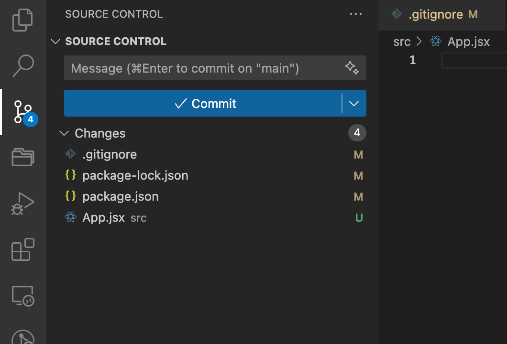
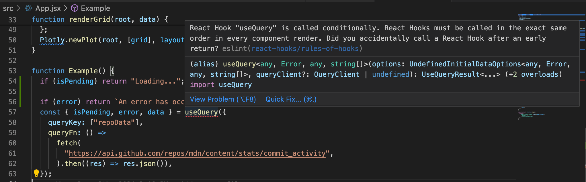
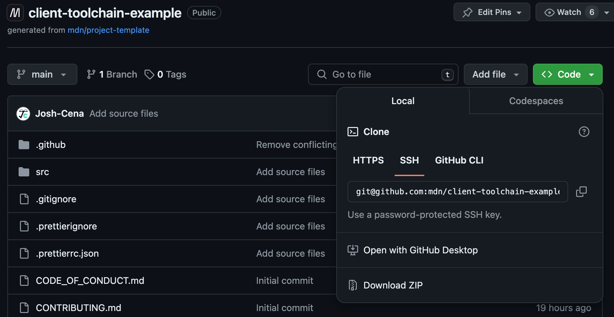

{{LearnSidebar}}{{PreviousMenuNext("Learn_web_development/Extensions/Client-side_tools/Package_management","Learn_web_development/Extensions/Client-side_tools/Deployment", "Learn_web_development/Extensions/Client-side_tools")}}

In the final couple of articles in the series, we will solidify your tooling knowledge by walking you through the process of building up a sample case study toolchain. We'll go all the way from setting up a sensible development environment and putting transformation tools in place to actually deploying your app. In this article, we'll introduce the case study, set up our development environment, and set up our code transformation tools.

<table>
  <tbody>
    <tr>
      <th scope="row">Prerequisites:</th>
      <td>
        Familiarity with the core <a href="/en-US/docs/Learn_web_development/Core/Structuring_content">HTML</a>,
        <a href="/en-US/docs/Learn_web_development/Core/Styling_basics">CSS</a>, and
        <a href="/en-US/docs/Learn_web_development/Core/Scripting">JavaScript</a> languages.
      </td>
    </tr>
    <tr>
      <th scope="row">Objective:</th>
      <td>
        To solidify what we've learnt so far by working through a complete
        toolchain case study.
      </td>
    </tr>
  </tbody>
</table>

There really are unlimited combinations of tools and ways to use them, what you see in this article and the next is only _one_ way that the featured tools can be used for a project.

> [!NOTE]
> It's also worth repeating that not all of these tools need to be run on the command line. Many of today's code editors (such as VS Code) have integration support for a _lot_ of tools via plugins.

## Introducing our case study

The toolchain that we are creating in this article will be used to build and deploy a mini-site that displays data about the [mdn/content](https://github.com/mdn/content) repository, sourcing its data from the [GitHub API](https://docs.github.com/en/rest/metrics/community).

## Tools used in our toolchain

In this article we're going to use the following tools and features:

- [JSX](https://react.dev/learn/writing-markup-with-jsx), a [React](https://react.dev/)-related set of syntax extensions that allow you to do things like defining component structures inside JavaScript. You won't need to know React to follow this tutorial, but we've included this to give you an idea of how a non-native web language could be integrated into a toolchain.
- The latest built-in JavaScript features (at the time of writing), such as [`import`](/en-US/docs/Web/JavaScript/Reference/Statements/import).
- Useful development tools such as [Prettier](https://prettier.io/) for formatting and [ESLint](https://eslint.org/) for linting.
- [PostCSS](https://postcss.org/) to provide CSS nesting capabilities.
- [Vite](https://vite.dev/) to build and minify our code, and to write a bunch of configuration file content automatically for us.
- [GitHub](/en-US/docs/Learn_web_development/Core/Version_control) to manage our source code control as well as to eventually deploy our site (using GitHub Pages).

You may not be familiar with all the above features and tools or what they are doing, but don't panic — we'll explain each part as we move through this article.

## Toolchains and their inherent complexity

As with any chain, the more links you have in your toolchain, the more complex and potentially brittle it is — for example it might be more complex to configure, and easier to break. Conversely, the fewer links, the more resilient the toolchain is likely to be.

All web projects will be different, and you need to consider what parts of your toolchain are necessary and consider each part carefully.

The smallest toolchain is one that has no links at all. You would hand code the HTML, use "vanilla JavaScript" (meaning no frameworks or intermediary languages), and manually upload it all to a server for hosting.

However, more complicated software requirements will likely benefit from the usage of tools to help simplify the development process. In addition, you should include tests before you deploy to your production server to ensure your software works as intended — this already sounds like a necessary toolchain.

For our sample project, we'll be using a toolchain specifically designed to aid our software development and support the technical choices made during the software design phase. We will however be avoiding any superfluous tooling, with the aim of keeping complexity to a minimum.

## Checking prerequisites

You should have most of the pieces of software already if you've been following along with the previous chapters. Here's what you should have before proceeding to the real setup steps. They only need to be done once and you don't need to repeat these again for future projects.

### Creating a GitHub account

Besides the tools we're going to install that contribute to our toolchain, you will need to create an account with GitHub if you wish to complete the tutorial. However, you can still follow the local development part without it. As mentioned previously, GitHub is a source code repository service that adds community features such as issue tracking, following project releases, and much more. In the next chapter, we will push to a GitHub code repository, which will cause a cascade effect that (should) deploy all the software to a home on the web.

Sign up for [GitHub](https://github.com/) by clicking the _Sign Up_ link on the homepage if you don't already have an account, and follow the instructions.

### Installing git

We'll install another software, git, to help with revision control.

It's possible you've heard of "git" before. [Git](https://git-scm.com/) is currently the most popular source code revision control tool available to developers — revision control provides many advantages, such as a way to backup your work in a remote place, and a mechanism to work in a team on the same project without fear of overwriting each other's code.

It might be obvious to some, but it bears repeating: Git is not the same thing as GitHub. Git is the revision control tool, whereas [GitHub](https://github.com/) is an online store for git repositories (plus a number of useful tools for working with them). Note that, although we're using GitHub in this chapter, there are several alternatives including [GitLab](https://about.gitlab.com/) and [Bitbucket](https://www.atlassian.com/software/bitbucket), and you could even host your own git repositories.

Using revision control in your projects and including it as part of the toolchain will help manage the evolution of your code. It offers a way to "commit" blocks of work as you progress, along with comments such as "X new feature implemented", or "Bug Z now fixed due to Y changes".

Revision control can also allow you to _branch_ out your project code, creating a separate version, and trying out new functionality on, without those changes affecting your original code.

Finally, it can help you undo changes or revert your code back to a time "when it was working" if a mistake has been introduced somewhere and you are having trouble fixing it — something all developers need to do once in a while!

Git can be [downloaded and installed via the git-scm website](https://git-scm.com/downloads) — download the relevant installer for your system, run it, and follow the on-screen prompts. This is all you need to do for now.

You can interact with git in a number of different ways, from using the command line to issue commands, to using a [git GUI app](https://git-scm.com/downloads/guis) to issue the same commands by pushing buttons, or even from directly inside your code editor, as seen in the Visual Studio Code example below:



### Existing project

We'll be building on the project we already started in the previous chapter, so make sure you follow the instructions in [Package management](/en-US/docs/Learn_web_development/Extensions/Client-side_tools/Package_management) to get the project set up first. To recap, here's what you should have:

- Node.js and npm installed.
- A new project called `npm-experiment` (or some other name).
- Vite installed as a dev dependency.
- The `plotly.js-dist-min` package installed as a dependency.
- Some custom scripts defined in package.json.
- The `index.html` and `src/main.jsx` files created.

As we talked about in [Chapter 1](/en-US/docs/Learn_web_development/Extensions/Client-side_tools/Overview), the toolchain will be structured into the following phases:

- **Development environment**: The tools that are most fundamental to running your code. This part is already set up in the previous chapter.
- **Safety net**: Making the software development experience stable and more efficient. We might also refer to this as our development environment.
- **Transformation**: Tooling that allows us to use the latest features of a language (e.g. JavaScript) or another language entirely (e.g. JSX or TypeScript) in our development process, and then transforms our code so that the production version still runs on a wide variety of browsers, modern and older.
- **Post development**: Tooling that comes into play after you are done with the body of development to ensure that your software makes it to the web and continues to run. In this case study we'll look at adding tests to your code, and deploying your app using GitHub Pages so it is available for all the web to see.

Let's start working on these, beginning with our development environment. We will follow the same steps as how a real project would be set up, so in the future, if you are setting up a new project, you can refer back to this chapter and follow the steps again.

## Creating a development environment

This part of the toolchain is sometimes seen to be delaying the actual work, and it can be very easy to fall into a "rabbit hole" of tooling where you spend a lot of time trying to get the environment "just right".

But you can look at this in the same way as setting up your physical work environment. The chair needs to be comfortable, and set up in a good position to help with your posture. You need power, Wi-Fi, and USB ports! There might be important decorations or music that help with your mental state — these are all important to do your best work possible, and they should also only need to be set up once, if done properly.

In the same way, setting up your development environment, if done well, needs to be done only once and should be reusable in many future projects. You will probably want to review this part of the toolchain semi-regularly and consider if there are any upgrades or changes you should introduce, but this shouldn't be required too often.

Your toolchain will depend on your own needs, but for this example of a fairly complete toolchain, the tools that will be installed/initialized up front will be:

- Library installation tools — for adding dependencies.
- Code revision control.
- Code tidying tools — for tidying JavaScript, CSS, and HTML.
- Code linting tools — for linting our code.

### Library installation tools

You have already done this, but for easy reference, here are the commands (run at the root of the `npm-experiment` directory) to initialize an npm package and install the necessary dependencies:

```bash
npm init
npm install --save-dev vite
npm install plotly.js-dist-min
```

### Code revision control

Enter the following command to start git's source control functionality working on the directory:

```bash
git init
```

By default, git tracks the changes of all files. However, there are some generated files we don't need to track, as they are not code that we have written and can be regenerated any time. We can tell git to ignore these files by creating a `.gitignore` file in the root of the project directory. Add the following contents to the file:

```plain
node_modules
dist
```

### Code tidying tools

We'll be using Prettier, which we first met in Chapter 2, to tidy our code in this project. We'll install Prettier again in this project. Install it using the following command:

```bash
npm install --save-dev prettier
```

Note again that we are using `--save-dev` to add it as a dev dependency, because we only use it during development.

Like many tools made more recently Prettier comes with "sensible defaults". That means that you'll be able to use Prettier without having to configure anything (if you are happy with the [defaults](https://prettier.io/docs/en/configuration.html)). This lets you get on with what's important: the creative work. For demonstration, we'll add a config file. Create a file in the root of your `npm-experiment` directory called `.prettierrc.json`. Add the following contents:

```json
{
  "bracketSameLine": true
}
```

With this setting, Prettier will print the `>` of a multi-line HTML (HTML, JSX, Vue, Angular) opening tag at the end of the last line instead of being alone on the next line. This is the format the MDN itself uses. You can find more about [configuring Prettier](https://prettier.io/docs/en/configuration.html) in its documentation.

By default, Prettier formats all files that you specify. However, again, we don't need to format generated files, or there may be certain legacy code that we don't want to touch. We can tell Prettier to always ignore these files by creating a `.prettierignore` file in the root of the project directory. Add the following contents to the file:

```plain
node_modules
dist
```

It has the same content of `.gitignore`, but in a real project, you might want to ignore different files for Prettier than you do for git.

Now that Prettier is installed and configured, running and tidying your code can be done on the command line, for example:

```bash
npx prettier --write ./index.html
```

> [!NOTE]
> In the command above, we use Prettier with the `--write` flag. Prettier understands this to mean "if there's any problem in my code format, go ahead and fix them, then save my file". This is fine for our development process, but we can also use `prettier` without the flag and it will only check the file. Checking the file (and not saving it) is useful for purposes like checks that run before a release - i.e. "don't release any code that's not been properly formatted."

You can also replace `./index.html` with any other file or folder to format them. For example, `.` will format everything in the current directory. In case you may forget the syntax, you can add it as a custom script in your package.json too:

```json
"scripts": {
  // ...
  "format": "prettier --write ."
},
```

Now you can run the following to format the directory:

```bash
npm run format
```

It can still be arduous to run the command every time we change something, and there are a few ways to automate this process:

- Using special "git hooks" to test if the code is formatted before a commit.
- Using code editor plugins to run Prettier commands each time a file is saved.

> [!NOTE]
> What is a git hook? Git (not GitHub) provides a system that lets us attach pre- and post- actions to the tasks we perform with git (such as committing your code). Although git hooks can be a bit overly complicated (in this author's opinion), once they're in place they can be very powerful. If you're interested in using hooks, [Husky](https://github.com/typicode/husky) is a greatly simplified route into using hooks.

For VS Code, one useful extension is the [Prettier Code Formatter by Esben Petersen](https://marketplace.visualstudio.com/items?itemName=esbenp.prettier-vscode), which lets VS Code automatically format code upon saving. This means that any file in the project we are working on gets formatted nicely, including HTML, CSS, JavaScript, JSON, markdown, and more. All the editor needs is "Format On Save" enabled.

### Code linting tools

Linting helps with code quality but also is a way to catch potential errors earlier during development. It's a key ingredient of a good toolchain and one that many development projects will include by default.

Web development linting tools mostly exist for JavaScript (though there are a few available for HTML and CSS). This makes sense: if an unknown HTML element or invalid CSS property is used, due to the resilient nature of these two languages nothing is likely to break. JavaScript is a lot more fragile — mistakenly calling a function that doesn't exist for example causes your JavaScript to break; linting JavaScript is therefore very important, especially for larger projects.

The go-to tool for JavaScript linting is [ESLint](https://eslint.org/). It's an extremely powerful and versatile tool but can be tricky to configure correctly and you could easily consume many hours trying to get a configuration _just right_!

ESLint is installed via npm, so as per discussions in Chapter 2, you have the choice to install this tool locally or globally, but a local installation is highly recommended, because you need to have a configuration file for each project anyway. Remember the command to run:

```bash
npm install --save-dev eslint@8 @eslint/js globals
```

> **Note:** `eslint@8` installs the version 8 of ESLint, while the latest is v9. This is because `eslint-plugin-react`, which we will use later, [does not support v9 yet](https://github.com/jsx-eslint/eslint-plugin-react/issues/3699).

The `@eslint/js` package provides predefined ESLint configuration, while the `globals` package provides a list of known global names in each environment. We will use them later in the configuration. Out of the box, ESLint is going to complain that it can't find the configuration file if you run it with `npx eslint`:

```plain
Oops! Something went wrong! :(

ESLint: 8.57.0

ESLint couldn't find a configuration file. To set up a configuration file for this project, please run:

...
```

Here's a minimal example that works (in a file called `eslint.config.js`, at the root of the project):

```js
import js from "@eslint/js";
import globals from "globals";

export default [
  js.configs.recommended,
  {
    ignores: ["node_modules", "dist"],
  },
  {
    files: ["**/*.{js,jsx}"],
    languageOptions: {
      globals: {
        ...globals.browser,
      },
    },
  },
];
```

The above ESLint configuration:

- Enables the "recommended" ESLint settings
- Tells ESLint to ignore the generated files as we have already done for the other tools
- Tells ESLint to include `.js` and `.jsx` files in linting
- Tells ESLint about the existence of the browser global variables (used by lint rules such as `no-undef` for checking non-existent variables).

The ESLint parser doesn't understand JSX by default, and its recommended rules don't handle React-specific semantics. Therefore, we will add some more configuration to make it support JSX and React properly. First, install `eslint-plugin-react` and `eslint-plugin-react-hooks`, which provide rules for writing correct and idiomatic React:

```bash
npm install --save-dev eslint-plugin-react eslint-plugin-react-hooks
```

Then, update the ESLint configuration file to include the recommended config of these plugins, which both loads the recommended rules and sets the parser options for JSX:

```js
import js from "@eslint/js";
import globals from "globals";
import reactRecommended from "eslint-plugin-react/configs/recommended.js";
import reactJSXRuntime from "eslint-plugin-react/configs/jsx-runtime.js";
import reactHooksPlugin from "eslint-plugin-react-hooks";

export default [
  js.configs.recommended,
  {
    ignores: ["node_modules", "dist"],
  },
  {
    files: ["**/*.{js,jsx}"],
    languageOptions: {
      globals: {
        ...globals.browser,
      },
    },
    settings: {
      react: {
        version: "detect",
      },
    },
  },
  reactRecommended,
  reactJSXRuntime,
  {
    plugins: {
      "react-hooks": reactHooksPlugin,
    },
    rules: reactHooksPlugin.configs.recommended.rules,
  },
];
```

> [!NOTE]
> Our configuration for `eslint-plugin-react-hooks` is a bit awkward, compared to the one-line additions for `eslint-plugin-react` configurations. This is because `eslint-plugin-react-hooks` doesn't support the new ESLint config format yet. See [facebook/react#28313](https://github.com/facebook/react/issues/28313) for more information.

There's a complete [list of ESLint rules](https://eslint.org/docs/latest/rules/) that you can tweak and configure to your heart's content and many companies and teams have published their [own ESLint configurations](https://www.npmjs.com/search?q=keywords:eslintconfig), which can sometimes be useful either to get inspiration or to select one that you feel suits your own standards. A forewarning though: ESLint configuration is a very deep rabbit hole!

For the sake of simplicity, in this chapter, we're not going to explore all the features of ESLint, since this configuration works for our particular project and its requirements. However, bear in mind that if you want to refine and enforce a rule about how your code looks (or validates), it's very likely that it can be done with the right ESLint configuration.

As with other tools, code editor integration support is typically good for ESLint, and potentially more useful as it can give us real-time feedback when issues crop up:



That's our dev environment setup complete at this point. Now, finally we're (very nearly) ready to code.

## Build and transformation tools

### JavaScript transformation

For this project, as mentioned above, React is going to be used, which also means that JSX will be used in the source code. The project will also use the latest JavaScript features. An immediate issue is that no browser has native support for JSX; it is an intermediate language that is meant to be compiled into languages the browser understands in the production code. If the browser tries to run the source JavaScript it will immediately complain; the project needs a build tool to transform the source code to something the browser can consume without issue.

There's a number of choices for transform tools and though Babel is a particularly popular one, in Vite, we will use an integrated plugin: `@vitejs/plugin-react`. Install it using the following command:

```bash
npm install --save-dev @vitejs/plugin-react
```

We don't have a Vite config yet! Add one at `vite.config.js` in the root of the project directory:

```js
import { defineConfig } from "vite";
import react from "@vitejs/plugin-react";

export default defineConfig({
  plugins: [react()],
  base: "/npm-experiment/",
});
```

Read the [Vite documentation](https://vite.dev/guide/) for more information on how to configure Vite. Because our site is deployed on GitHub pages, it will be hosted at `https://your-username.github.io/your-repo-name`, so you should set the `base` option according to your GitHub repository's name—but you can always adjust it later when we get to [deployment](/en-US/docs/Learn_web_development/Extensions/Client-side_tools/Deployment).

### CSS transformation

Our CSS may also be using syntax not understood by browsers. For example, you may use a syntax that was only implemented in the last few browser versions, which means older browsers will fail on it and display broken style. We can use a tool to transform our CSS into a format that all browsers that we target can understand.

[PostCSS](https://postcss.org/) is a CSS postprocessor tool. Compared to build tools like [Sass](https://sass-lang.com/), PostCSS is intended to write _standard_ CSS (that is, CSS syntax that may get into browsers one day), while Sass is a custom language by itself that compiles to CSS. PostCSS is closer to the web and has a much lower learning curve. [Vite supports PostCSS by default](https://vite.dev/guide/features.html#postcss), so you just need to [configure PostCSS](https://github.com/postcss/postcss#usage) if you want to compile any features. Check out the [cssdb](https://preset-env.cssdb.org/features/) for what features are supported.

For our purposes, we are going to demonstrate another CSS transformation: [CSS modules](https://vite.dev/guide/features.html#css-modules). It is one of the ways to achieve _CSS modularization_. Remember that CSS selectors are all global, so if you have a class name like `.button`, all elements with the class name `button` will be styled the same way. This often leads to naming conflicts — imagine all your JavaScript variables being defined at the global scope! CSS modules solve this problem by making the class name unique to the pages that use them. To understand how it works, after you've downloaded the source code, you can check how we use the `.module.css` files, and also read the [CSS modules documentation](https://github.com/css-modules/css-modules).

Although this stage of our toolchain can be quite painful, because we've chosen a tool that purposely tries to reduce configuration and complexity, there's really nothing more we need to do during the development phase. Modules are correctly imported, nested CSS is correctly transformed to "regular CSS", and our development is unimpeded by the build process.

Now our software is ready to be written!

## Writing the source code

Now we have the full development toolchain set up, it's usually time to start writing real code — the part that you should actually invest the most time in. For our purpose though, we are just going to copy some existing source code and pretend that we wrote it. We won't teach you how they work, as that is not the point of this chapter. They are merely here to run the tools on, to teach you about how _they_ work.

To get hold of the code files, visit <https://github.com/mdn/client-toolchain-example> and download and unzip the contents of this repo onto your local drive somewhere. You can download the entire project as a zip file by selecting _Clone or download_ > _Download ZIP_.



Now copy the contents of the project's `src` directory and use it to replace your current `src` directory. You don't need to worry about the other files.

Also install a few dependencies that the source code uses:

```bash
npm install react react-dom @tanstack/react-query
```

We have our project files in place. That's all we need to do for now!

## Running the transformation

To start working with our project, we'll run the Vite server on the command line. In its default mode it will watch for changes in your code and refresh the server. This is nice because we don't have to flit back and forth between the code and the command line.

1. To start Vite off in the background, go to your terminal and run the following command (using the custom script we defined earlier):

   ```bash
   npm run dev
   ```

   You should see an output like this (once the dependencies have been installed):

   ```plain
   > client-toolchain-example@1.0.0 dev
   > vite

   Re-optimizing dependencies because lockfile has changed

     VITE v5.2.13  ready in 157 ms

     ➜  Local:   http://localhost:5173/
     ➜  Network: use --host to expose
     ➜  press h + enter to show help
   ```

   The server is now running on the URL that was printed (in this case localhost:5173).

2. Go to this URL in your browser and you will see the example app running!

Now we can make a few changes and view their effects live.

1. Load up the file `src/App.jsx` in your favorite text editor.
2. Replace all occurrences of `mdn/content` with your favorite GitHub repo, such as `facebook/react`.
3. Save the file, then go straight back to the app running in your browser. You'll notice that the browser has automatically refreshed, and the graphs have changed!

You could also try using ESLint and Prettier too — try deliberately removing a load of the whitespace from one of your files and running Prettier on it to clean it up, or introduce a syntax error into one of your JavaScript files and see what errors ESLint gives you when you run the `eslint` command, or in your editor.

## Summary

We've come a long way in this chapter, building up a rather nice local development environment to create an application in.

At this point during web software development you would usually be crafting your code for the software you intend to build. Since this module is all about learning the tools around web development, not web development code itself, we won't be teaching you any actual coding — you'll find that information in the rest of MDN!

Instead, we've written an example project for you to use your tools on. We'd suggest that you work through the rest of the chapter using our example code, and then you can try changing the contents of the src directory to your own project and publishing that on GitHub Pages instead! And indeed, deploying to GitHub Pages will be the end goal of the next chapter!

{{PreviousMenuNext("Learn_web_development/Extensions/Client-side_tools/Package_management","Learn_web_development/Extensions/Client-side_tools/Deployment", "Learn_web_development/Extensions/Client-side_tools")}}
