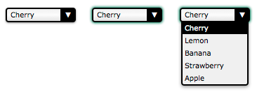

There are some cases where the available native HTML form controls may seem like they are not enough. For example, if you need to [perform advanced styling](/en-US/docs/Learn_web_development/Extensions/Forms/Advanced_form_styling) on some controls such as the {{HTMLElement("select")}} element, or if you want to provide custom behaviors, you may consider building your own controls.

In this article, we will discuss how to build a custom control. To that end, we will work with an example: rebuilding the {{HTMLElement("select")}} element. We will also discuss how, when, and whether building your own control makes sense, and what to consider when building a control is a requirement.

> [!NOTE]
> We'll focus on building the control, not on how to make the code generic and reusable; that would involve some non-trivial JavaScript code and DOM manipulation in an unknown context, and that is out of the scope of this article.

## Design, structure, and semantics

Before building a custom control, you should start by figuring out exactly what you want. This will save you some precious time. In particular, it's important to clearly define all the states of your control. To do this, it's good to start with an existing control whose states and behavior are well known, so that you can mimic those as much as possible.

In our example, we will rebuild the {{HTMLElement("select")}} element. Here is the result we want to achieve:



This screenshot shows the three main states of our control: the normal state (on the left); the active state (in the middle) and the open state (on the right).

In terms of behavior, we are recreating a native HTML element. Therefore it should have the same behaviors and semantics as the native HTML element. We require our control to be usable with a mouse as well as with a keyboard, and comprehensible to a screen reader, just like any native control. Let's start by defining how the control reaches each state:

**The control is in its normal state when:**

- the page loads.
- the control was active and the user clicks anywhere outside it.
- the control was active and the user moves the focus to another control using the keyboard (e.g., the <kbd>Tab</kbd> key).

**The control is in its active state when:**

- the user clicks on it or touches it on a touch screen.
- the user hits the tab key and it gains focus.
- the control was in its open state and the user clicks on it.

**The control is in its open state when:**

- the control is in any other state than open and the user clicks on it.

Once we know how to change states, it is important to define how to change the control's value:

**The value changes when:**

- the user clicks on an option when the control is in the open state.
- the user hits the up or down arrow keys when the control is in its active state.

**The value does not change when:**

- the user hits the up arrow key when the first option is selected.
- the user hits the down arrow key when the last option is selected.

Finally, let's define how the control's options will behave:

- When the control is opened, the selected option is highlighted
- When the mouse is over an option, the option is highlighted and the previously highlighted option is returned to its normal state

> [!NOTE]
> This specification is provisional. It describes the early stages of the lesson, where the goal is to recreate a familiar native-like interaction in plain JavaScript. When accessibility semantics and explicit keyboard behavior are added later — in the [Making it accessible](#making_it_accessible) section and the [Keyboard interaction](#keyboard_interaction) subsection — this model is refined: a separate _active option_ can move through the list without committing, and the committed value changes only on defined commit paths, rather than during navigation. The later code therefore replaces the bidirectional toggle with explicit open, commit, close, and cancel operations.

For the purposes of our example, we'll stop with that; however, if you're a careful reader, you'll notice that some behaviors are missing. For example, what do you think will happen if the user hits the tab key while the control is in its open state? The answer is _nothing_. OK, the right behavior seems obvious but the fact is, because it's not defined in our specs, it is very easy to overlook this behavior. This is especially true in a team environment when the people who design the control's behavior are different from the ones who implement it.

Another fun example: what will happen if the user hits the up or down arrow keys while the control is in the open state? This one is a little bit trickier. If you consider that the active state and the open state are completely different, the answer is again "nothing will happen" because we did not define any keyboard interactions for the opened state. On the other hand, if you consider that the active state and the open state overlap a bit, the value may change but the option will definitely not be highlighted accordingly, once again because we did not define any keyboard interactions over options when the control is in its opened state (we have only defined what should happen when the control is opened, but nothing after that).

We have to think a little further: what about the escape key? Pressing <kbd>Esc</kbd> key closes an open select. Remember, if you want to provide the same general functionality as the existing native {{htmlelement('select')}}, the visible and committed behaviors should be familiar across keyboard, mouse, touch, and screen reader. The final accessible stage of this lesson deliberately aligns the demonstrated navigation and value-commit interactions with the [WAI-ARIA APG Select-Only Combobox Example](https://www.w3.org/WAI/ARIA/apg/patterns/combobox/examples/combobox-select-only/) rather than every native implementation detail — extended interactions such as type-ahead, <kbd>PageUp</kbd>/<kbd>PageDown</kbd>, and <kbd>Alt</kbd>+<kbd>Arrow</kbd> are outside the scope of what this lesson demonstrates.

In our example, the missing specifications are obvious so we will handle them, but it can be a real problem for exotic new controls. When it comes to standardized elements, of which the {{htmlelement('select')}} is one, the specification authors spent an inordinate amount of time specifying all interactions for every use case for every input device. Creating new controls is not that easy, especially if you are creating something that has not been done before, and therefore
nobody has the slightest idea of what the expected behaviors and interactions are. At least select has been done before, so we know how it should behave!

Designing new interactions is generally only an option for very large industry players who have enough reach that an interaction they create can become a standard. For example, Apple introduced the scroll wheel with the iPod in 2001. They had the market share to successfully introduce a completely new way of interacting with a device, something most device companies can't do.

It is best not to invent new user interactions. For any interaction you do add, it is vital to spend time in the design stage; if you define a behavior poorly, or forget to define one, it will be very hard to redefine it once the users have gotten used to it. If you have doubts, ask for the opinions of others, and if you have the budget for it, do not hesitate to [perform user tests](https://en.wikipedia.org/wiki/Usability_testing). This process is called UX Design. If you want to learn more about this topic, you should check out the following helpful resources:

- [UXMatters.com](https://www.uxmatters.com/)
- [The UX Design section of SmashingMagazine](https://www.smashingmagazine.com/)

> [!NOTE]
> Also, in most systems there is a way to open the {{HTMLElement("select")}} element with the keyboard to look at all the available choices (this is the same as clicking the {{HTMLElement("select")}} element with a mouse). This is achieved with <kbd>Alt</kbd> + <kbd>Down</kbd> on Windows. We didn't implement this in our example, but it would be easy to do so, as the mechanism has already been implemented for the `click` event.

## Defining the HTML structure and (some) semantics

Now that the control's basic functionality has been decided upon, it's time to start building it. The first step is to define its HTML structure and give it some basic semantics. Here is what we need to rebuild a {{HTMLElement("select")}} element:

```html
<!-- This is our main container for our control.
     The tabindex attribute is what allows the user to focus on the control.
     We'll see later that it's better to set it through JavaScript. -->
<div class="select" tabindex="0">
  <!-- This container will be used to display the current value of the control -->
  <span class="value">Cherry</span>

  <!-- This container will contain all the options available for our control.
       Because it's a list, it makes sense to use the ul element. -->
  <ul class="optList">
    <!-- Each option only contains the value to be displayed, we'll see later
         how to handle the real value that will be sent with the form data -->
    <li class="option">Cherry</li>
    <li class="option">Lemon</li>
    <li class="option">Banana</li>
    <li class="option">Strawberry</li>
    <li class="option">Apple</li>
  </ul>
</div>
```

Note the use of class names; these identify each relevant part regardless of the actual underlying HTML elements used. This is important to make sure that we don't bind our CSS and JavaScript to a strong HTML structure, so that we can make implementation changes later without breaking code that uses the control. For example, what if you wish to implement the equivalent of the {{HTMLElement("optgroup")}} element later on?

Class names, however, provide no semantic value. In this current state, the screen reader user only "sees" an unordered list. We will add ARIA semantics in a bit.

## Creating the look and feel using CSS

Now that we have a structure, we can start designing our control. The whole point of building this custom control is to be able to style it exactly how we want. To that end, we will split our CSS work into two parts: the first part will be the CSS rules absolutely necessary to make our control behave like a {{HTMLElement("select")}} element, and the second part will consist of the fancy styles used to make it look the way we want.

### Required styles

The required styles are those necessary to handle the three states of our control.

```css
.select {
  /* This will create a positioning context for the list of options;
     adding this to `.select:focus-within` will be a better option when fully supported
  */
  position: relative;

  /* This will make our control become part of the text flow and sizable at the same time */
  display: inline-block;
}
```

We need an extra class `active` to define the look and feel of our control when it is in its active state. Because our control is focusable, we double this custom style with the {{cssxref(":focus")}} pseudo-class in order to be sure they will behave the same.

```css
.select.active,
.select:focus {
  outline-color: transparent;

  /* This box-shadow property is not exactly required, however it's imperative to ensure
     active state is visible, especially to keyboard users, that we use it as a default value. */
  box-shadow: 0 0 3px 1px #227755;
}
```

Now, let's handle the list of options:

```css
/* The .select selector here helps to make sure we only select
   element inside our control. */
.select .optList {
  /* This will make sure our list of options will be displayed below the value
     and out of the HTML flow */
  position: absolute;
  top: 100%;
  left: 0;
}
```

We need an extra class to handle when the list of options is hidden. This is necessary in order to manage the differences between the active state and the open state that do not exactly match.

```css
.select .optList.hidden {
  /* This is a simple way to hide the list in an accessible way;
     we will talk more about accessibility in the end */
  max-height: 0;
  visibility: hidden;
}
```

> [!NOTE]
> We could also have used `transform: scale(1, 0)` to give the option list no height and full width.

### Beautification

So now that we have the basic functionality in place, the fun can start. The following is just an example of what is possible, and will match the screenshot at the beginning of this article. However, you should feel free to experiment and see what you can come up with.

```css
.select {
  /* The computations are made assuming 1em equals 16px which is the default value in most browsers.
     If you are lost with px to em conversion, try https://nekocalc.com/px-to-em-converter */
  font-size: 0.625em; /* this (10px) is the new font size context for em value in this context */
  font-family: "Verdana", "Arial", sans-serif;

  box-sizing: border-box;

  /* We need extra room for the down arrow we will add */
  padding: 0.1em 2.5em 0.2em 0.5em;
  width: 10em; /* 100px */

  border: 0.2em solid black;
  border-radius: 0.4em;
  box-shadow: 0 0.1em 0.2em rgb(0 0 0 / 45%);

  background: linear-gradient(0deg, #e3e3e3, #fcfcfc 50%, #f0f0f0);
}

.select .value {
  /* Because the value can be wider than our control, we have to make sure it will not
     change the control's width. If the content overflows, we display an ellipsis */
  display: inline-block;
  width: 100%;
  overflow: hidden;
  white-space: nowrap;
  text-overflow: ellipsis;
  vertical-align: top;
}
```

We don't need an extra element to design the down arrow; instead, we're using the {{cssxref("::after")}} pseudo-element. It could also be implemented using a simple background image on the `select` class.

```css
.select::after {
  content: "▼"; /* We use the unicode character U+25BC; make sure to set a charset meta tag */
  position: absolute;
  z-index: 1; /* This will be important to keep the arrow from overlapping the list of options */
  top: 0;
  right: 0;

  box-sizing: border-box;

  height: 100%;
  width: 2em;
  padding-top: 0.1em;

  border-left: 0.2em solid black;
  border-radius: 0 0.1em 0.1em 0;

  background-color: black;
  color: white;
  text-align: center;
}
```

Next, let's style the list of options:

```css
.select .optList {
  z-index: 2; /* We explicitly said the list of options will always be on top of the down arrow */

  /* this will reset the default style of the ul element */
  list-style: none;
  margin: 0;
  padding: 0;

  box-sizing: border-box;

  /* If the values are smaller than the control, the list of options
     will be as wide as the control itself */
  min-width: 100%;

  /* In case the list is too long, its content will overflow vertically
     (which will add a vertical scrollbar automatically) but never horizontally
     (because we haven't set a width, the list will adjust its width automatically.
     If it can't, the content will be truncated) */
  max-height: 10em; /* 100px */
  overflow-y: auto;
  overflow-x: hidden;

  border: 0.2em solid black;
  border-top-width: 0.1em;
  border-radius: 0 0 0.4em 0.4em;

  box-shadow: 0 0.2em 0.4em rgb(0 0 0 / 40%);
  background: #f0f0f0;
}
```

For the options, we need to add a `highlight` class to be able to identify the value the user will pick (or has picked).

```css
.select .option {
  padding: 0.2em 0.3em; /* 2px 3px */
}

.select .highlight {
  background: black;
  color: white;
}
```

So here's the result with our three states ([check out the source code here](/en-US/docs/Learn_web_development/Extensions/Forms/How_to_build_custom_form_controls/Example_1)):

#### Basic state

```html hidden
<div class="select">
  <span class="value">Cherry</span>
  <ul class="optList hidden">
    <li class="option">Cherry</li>
    <li class="option">Lemon</li>
    <li class="option">Banana</li>
    <li class="option">Strawberry</li>
    <li class="option">Apple</li>
  </ul>
</div>
```

```css hidden
.select {
  position: relative;
  display: inline-block;
}

.select.active,
.select:focus {
  box-shadow: 0 0 3px 1px #227755;
  outline-color: transparent;
}

.select .optList {
  position: absolute;
  top: 100%;
  left: 0;
}

.select .optList.hidden {
  max-height: 0;
  visibility: hidden;
}

.select {
  font-size: 0.625em; /* 10px */
  font-family: "Verdana", "Arial", sans-serif;

  box-sizing: border-box;

  padding: 0.1em 2.5em 0.2em 0.5em; /* 1px 25px 2px 5px */
  width: 10em; /* 100px */

  border: 0.2em solid black; /* 2px */
  border-radius: 0.4em; /* 4px */

  box-shadow: 0 0.1em 0.2em rgb(0 0 0 / 45%); /* 0 1px 2px */

  background: linear-gradient(0deg, #e3e3e3, #fcfcfc 50%, #f0f0f0);
}

.select .value {
  display: inline-block;
  width: 100%;
  overflow: hidden;

  white-space: nowrap;
  text-overflow: ellipsis;
  vertical-align: top;
}

.select::after {
  content: "▼";
  position: absolute;
  z-index: 1;
  height: 100%;
  width: 2em; /* 20px */
  top: 0;
  right: 0;

  padding-top: 0.1em;

  box-sizing: border-box;

  text-align: center;

  border-left: 0.2em solid black;
  border-radius: 0 0.1em 0.1em 0;

  background-color: black;
  color: white;
}

.select .optList {
  z-index: 2;

  list-style: none;
  margin: 0;
  padding: 0;

  background: #f0f0f0;
  border: 0.2em solid black;
  border-top-width: 0.1em;
  border-radius: 0 0 0.4em 0.4em;

  box-shadow: 0 0.2em 0.4em rgb(0 0 0 / 40%);

  box-sizing: border-box;

  min-width: 100%;
  max-height: 10em; /* 100px */
  overflow-y: auto;
  overflow-x: hidden;
}

.select .option {
  padding: 0.2em 0.3em;
}

.select .highlight {
  background: black;
  color: white;
}
```

{{EmbedLiveSample("Basic_state",120,130)}}

#### Active state

```html hidden
<div class="select active">
  <span class="value">Cherry</span>
  <ul class="optList hidden">
    <li class="option">Cherry</li>
    <li class="option">Lemon</li>
    <li class="option">Banana</li>
    <li class="option">Strawberry</li>
    <li class="option">Apple</li>
  </ul>
</div>
```

```css hidden
.select {
  position: relative;
  display: inline-block;
}

.select.active,
.select:focus {
  box-shadow: 0 0 3px 1px #227755;
  outline-color: transparent;
}

.select .optList {
  position: absolute;
  top: 100%;
  left: 0;
}

.select .optList.hidden {
  max-height: 0;
  visibility: hidden;
}

.select {
  font-size: 0.625em; /* 10px */
  font-family: "Verdana", "Arial", sans-serif;

  box-sizing: border-box;

  padding: 0.1em 2.5em 0.2em 0.5em; /* 1px 25px 2px 5px */
  width: 10em; /* 100px */

  border: 0.2em solid black; /* 2px */
  border-radius: 0.4em; /* 4px */

  box-shadow: 0 0.1em 0.2em rgb(0 0 0 / 45%); /* 0 1px 2px */

  background: linear-gradient(0deg, #e3e3e3, #fcfcfc 50%, #f0f0f0);
}

.select .value {
  display: inline-block;
  width: 100%;
  overflow: hidden;

  white-space: nowrap;
  text-overflow: ellipsis;
  vertical-align: top;
}

.select::after {
  content: "▼";
  position: absolute;
  z-index: 1;
  height: 100%;
  width: 2em; /* 20px */
  top: 0;
  right: 0;

  padding-top: 0.1em;

  box-sizing: border-box;

  text-align: center;

  border-left: 0.2em solid black;
  border-radius: 0 0.1em 0.1em 0;

  background-color: black;
  color: white;
}

.select .optList {
  z-index: 2;

  list-style: none;
  margin: 0;
  padding: 0;

  background: #f0f0f0;
  border: 0.2em solid black;
  border-top-width: 0.1em;
  border-radius: 0 0 0.4em 0.4em;

  box-shadow: 0 0.2em 0.4em rgb(0 0 0 / 40%);

  box-sizing: border-box;

  min-width: 100%;
  max-height: 10em; /* 100px */
  overflow-y: auto;
  overflow-x: hidden;
}

.select .option {
  padding: 0.2em 0.3em;
}

.select .highlight {
  background: black;
  color: white;
}
```

{{EmbedLiveSample("Active_state",120,130)}}

#### Open state

```html hidden
<div class="select active">
  <span class="value">Cherry</span>
  <ul class="optList">
    <li class="option highlight">Cherry</li>
    <li class="option">Lemon</li>
    <li class="option">Banana</li>
    <li class="option">Strawberry</li>
    <li class="option">Apple</li>
  </ul>
</div>
```

```css hidden
.select {
  position: relative;
  display: inline-block;
}

.select.active,
.select:focus {
  box-shadow: 0 0 3px 1px #227755;
  outline-color: transparent;
}

.select .optList {
  position: absolute;
  top: 100%;
  left: 0;
}

.select .optList.hidden {
  max-height: 0;
  visibility: hidden;
}

.select {
  font-size: 0.625em; /* 10px */
  font-family: "Verdana", "Arial", sans-serif;

  box-sizing: border-box;

  padding: 0.1em 2.5em 0.2em 0.5em; /* 1px 25px 2px 5px */
  width: 10em; /* 100px */

  border: 0.2em solid black; /* 2px */
  border-radius: 0.4em; /* 4px */

  box-shadow: 0 0.1em 0.2em rgb(0 0 0 / 45%); /* 0 1px 2px */

  background: linear-gradient(0deg, #e3e3e3, #fcfcfc 50%, #f0f0f0);
}

.select .value {
  display: inline-block;
  width: 100%;
  overflow: hidden;

  white-space: nowrap;
  text-overflow: ellipsis;
  vertical-align: top;
}

.select::after {
  content: "▼";
  position: absolute;
  z-index: 1;
  height: 100%;
  width: 2em; /* 20px */
  top: 0;
  right: 0;

  padding-top: 0.1em;

  box-sizing: border-box;

  text-align: center;

  border-left: 0.2em solid black;
  border-radius: 0 0.1em 0.1em 0;

  background-color: black;
  color: white;
}

.select .optList {
  z-index: 2;

  list-style: none;
  margin: 0;
  padding: 0;

  background: #f0f0f0;
  border: 0.2em solid black;
  border-top-width: 0.1em;
  border-radius: 0 0 0.4em 0.4em;

  box-shadow: 0 0.2em 0.4em rgb(0 0 0 / 40%);

  box-sizing: border-box;

  min-width: 100%;
  max-height: 10em; /* 100px */
  overflow-y: auto;
  overflow-x: hidden;
}

.select .option {
  padding: 0.2em 0.3em;
}

.select .highlight {
  background: black;
  color: white;
}
```

{{EmbedLiveSample("Open_state",120,130)}}

## Bringing your control to life with JavaScript

Now that our design and structure are ready, we can write the JavaScript code to make the control actually work.

> [!WARNING]
> The following is educational code, not production code, and should not be used as-is. It is neither future-proof nor will work on legacy browsers. It also has redundant parts that should be optimized in production code.

### Why isn't it working?

Before starting, it's important to remember **JavaScript in the browser is an unreliable technology**. Custom controls rely on JavaScript to tie everything together. However, there are cases in which JavaScript isn't able to run in the browser:

- The user has turned off JavaScript: This is unusual; very few people turn off JavaScript nowadays.
- The script did not load: This is one of the most common cases, especially in the mobile world where the network is not very reliable.
- The script is buggy: You should always consider this possibility.
- The script conflicts with a third-party script: This can happen with tracking scripts or any bookmarklets the user uses.
- The script conflicts with or is affected by a browser extension such as Firefox's [NoScript](https://addons.mozilla.org/en-US/firefox/addon/noscript/) extension.
- The user is using a legacy browser, and one of the features you require is not supported: This will happen frequently when you make use of cutting-edge APIs.
- The user is interacting with the content before the JavaScript has been fully downloaded, parsed, and executed.

Because of these risks, it's really important to seriously consider what will happen if your JavaScript doesn't work. We'll discuss options to consider and cover the basics in our example (a full discussion of solving this issue for all scenarios would require a book). Just remember, it is vital to make your script generic and reusable.

In our example, if our JavaScript code isn't running, we'll fall back to displaying a standard {{HTMLElement("select")}} element. We include our control and the {{HTMLElement("select")}}; which one is displayed depends on the class of the body element, with the class of the body element being updated by the script that makes the control function, when it loads successfully.

To achieve this, we need two things:

First, we need to add a regular {{HTMLElement("select")}} element before each instance of our custom control. There is a benefit to having this "extra" select even if our JavaScript works as hoped: we will use this select to send data from our custom control along with the rest of our form data. We will discuss this in greater depth later.

```html
<body class="no-widget">
  <form>
    <select name="myFruit">
      <option>Cherry</option>
      <option>Lemon</option>
      <option>Banana</option>
      <option>Strawberry</option>
      <option>Apple</option>
    </select>

    <div class="select">
      <span class="value">Cherry</span>
      <ul class="optList hidden">
        <li class="option">Cherry</li>
        <li class="option">Lemon</li>
        <li class="option">Banana</li>
        <li class="option">Strawberry</li>
        <li class="option">Apple</li>
      </ul>
    </div>
  </form>
</body>
```

Second, we need two new classes to let us hide the unneeded element: we visually hide the custom control if our script isn't running, or the "real" {{HTMLElement("select")}} element if it is running. Note that, by default, our HTML code hides our custom control.

```css
.widget select,
.no-widget .select {
  /* This CSS selector basically says:
     - either we have set the body class to "widget" and thus we hide the actual <select> element
     - or we have not changed the body class, therefore the body class is still "no-widget",
       so the elements whose class is "select" must be hidden */
  position: absolute;
  left: -5000em;
  height: 0;
  overflow: hidden;
}
```

This CSS visually hides one of the elements, but it is still available to screen readers.

> [!NOTE]
> This tutorial retains the earlier visual-hiding technique. Before
> JavaScript runs, the native select is the intended fallback, but the
> visually hidden custom control may also remain exposed to assistive
> technologies. The final accessible example below keeps the inactive
> control out of the accessibility tree in both the fallback and enhanced
> states.

Now we need a JavaScript switch to determine if the script is running or not. This switch is a couple of lines: if at page load time our script is running, it will remove the `no-widget` class and add the `widget` class, thereby swapping the visibility of the {{HTMLElement("select")}} element and the custom control.

```js
document.body.classList.remove("no-widget");
document.body.classList.add("widget");
```

#### Without JS

Check out the [full source code](/en-US/docs/Learn_web_development/Extensions/Forms/How_to_build_custom_form_controls/Example_2#no_js).

```html hidden
<form class="no-widget">
  <select name="myFruit">
    <option>Cherry</option>
    <option>Lemon</option>
    <option>Banana</option>
    <option>Strawberry</option>
    <option>Apple</option>
  </select>

  <div class="select">
    <span class="value">Cherry</span>
    <ul class="optList hidden">
      <li class="option">Cherry</li>
      <li class="option">Lemon</li>
      <li class="option">Banana</li>
      <li class="option">Strawberry</li>
      <li class="option">Apple</li>
    </ul>
  </div>
</form>
```

```css hidden
.widget select,
.no-widget .select {
  position: absolute;
  left: -5000em;
  height: 0;
  overflow: hidden;
}
```

{{EmbedLiveSample("Without_JS",120,130)}}

#### With JS

Check out the [full source code](/en-US/docs/Learn_web_development/Extensions/Forms/How_to_build_custom_form_controls/Example_2#js).

```html hidden
<form class="no-widget">
  <select name="myFruit">
    <option>Cherry</option>
    <option>Lemon</option>
    <option>Banana</option>
    <option>Strawberry</option>
    <option>Apple</option>
  </select>

  <div class="select">
    <span class="value">Cherry</span>
    <ul class="optList hidden">
      <li class="option">Cherry</li>
      <li class="option">Lemon</li>
      <li class="option">Banana</li>
      <li class="option">Strawberry</li>
      <li class="option">Apple</li>
    </ul>
  </div>
</form>
```

```css hidden
.widget select,
.no-widget .select {
  position: absolute;
  left: -5000em;
  height: 0;
  overflow: hidden;
}

.select {
  position: relative;
  display: inline-block;
}

.select.active,
.select:focus {
  box-shadow: 0 0 3px 1px #227755;
  outline-color: transparent;
}

.select .optList {
  position: absolute;
  top: 100%;
  left: 0;
}

.select .optList.hidden {
  max-height: 0;
  visibility: hidden;
}

.select {
  font-size: 0.625em; /* 10px */
  font-family: "Verdana", "Arial", sans-serif;

  box-sizing: border-box;

  padding: 0.1em 2.5em 0.2em 0.5em; /* 1px 25px 2px 5px */
  width: 10em; /* 100px */

  border: 0.2em solid black; /* 2px */
  border-radius: 0.4em; /* 4px */

  box-shadow: 0 0.1em 0.2em rgb(0 0 0 / 45%); /* 0 1px 2px */

  background: linear-gradient(0deg, #e3e3e3, #fcfcfc 50%, #f0f0f0);
}

.select .value {
  display: inline-block;
  width: 100%;
  overflow: hidden;

  white-space: nowrap;
  text-overflow: ellipsis;
  vertical-align: top;
}

.select::after {
  content: "▼";
  position: absolute;
  z-index: 1;
  height: 100%;
  width: 2em; /* 20px */
  top: 0;
  right: 0;

  padding-top: 0.1em;

  box-sizing: border-box;

  text-align: center;

  border-left: 0.2em solid black;
  border-radius: 0 0.1em 0.1em 0;

  background-color: black;
  color: white;
}

.select .optList {
  z-index: 2;

  list-style: none;
  margin: 0;
  padding: 0;

  background: #f0f0f0;
  border: 0.2em solid black;
  border-top-width: 0.1em;
  border-radius: 0 0 0.4em 0.4em;

  box-shadow: 0 0.2em 0.4em rgb(0 0 0 / 40%);

  box-sizing: border-box;

  min-width: 100%;
  max-height: 10em; /* 100px */
  overflow-y: auto;
  overflow-x: hidden;
}

.select .option {
  padding: 0.2em 0.3em;
}

.select .highlight {
  background: black;
  color: white;
}
```

```js hidden
const form = document.querySelector("form");

form.classList.remove("no-widget");
form.classList.add("widget");
```

{{EmbedLiveSample("With_JS",120,130)}}

> [!NOTE]
> If you really want to make your code generic and reusable, instead of doing a class switch it's far better to just add the widget class to hide the {{HTMLElement("select")}} elements, and to dynamically add the DOM tree representing the custom control after every {{HTMLElement("select")}} element in the page.

### Making the job easier

In the code we are about to build, we will use the standard JavaScript and DOM APIs to do all the work we need. The features we plan to use are the following:

1. {{domxref("element.classList","classList")}}
2. {{domxref("EventTarget.addEventListener","addEventListener()")}}
3. {{domxref("NodeList.forEach()")}}
4. {{domxref("element.querySelector","querySelector()")}} and {{domxref("element.querySelectorAll","querySelectorAll()")}}

### Building event callbacks

The groundwork is done. We can now start to define all the functions that will be used each time the user interacts with our control.

```js
// This function will be used each time we want to deactivate a custom control
// It takes one parameter
// select : the DOM node with the `select` class to deactivate
function deactivateSelect(select) {
  // If the control is not active there is nothing to do
  if (!select.classList.contains("active")) return;

  // We need to get the list of options for the custom control
  const optList = select.querySelector(".optList");

  // We close the list of option
  optList.classList.add("hidden");

  // and we deactivate the custom control itself
  select.classList.remove("active");
}

// This function will be used each time the user wants to activate the control
// (which, in turn, will deactivate other select controls)
// It takes two parameters:
// select : the DOM node with the `select` class to activate
// selectList : the list of all the DOM nodes with the `select` class
function activeSelect(select, selectList) {
  // If the control is already active there is nothing to do
  if (select.classList.contains("active")) return;

  // We have to turn off the active state on all custom controls
  // Because the deactivateSelect function fulfills all the requirements of the
  // forEach callback function, we use it directly without using an intermediate
  // anonymous function.
  selectList.forEach(deactivateSelect);

  // And we turn on the active state for this specific control
  select.classList.add("active");
}

// This function will be used each time the user wants to open/closed the list of options
// It takes one parameter:
// select : the DOM node with the list to toggle
function toggleOptList(select) {
  // The list is kept from the control
  const optList = select.querySelector(".optList");

  // We change the class of the list to show/hide it
  optList.classList.toggle("hidden");
}

// This function will be used each time we need to highlight an option
// It takes two parameters:
// select : the DOM node with the `select` class containing the option to highlight
// option : the DOM node with the `option` class to highlight
function highlightOption(select, option) {
  // We get the list of all option available for our custom select element
  const optionList = select.querySelectorAll(".option");

  // We remove the highlight from all options
  optionList.forEach((other) => {
    other.classList.remove("highlight");
  });

  // We highlight the right option
  option.classList.add("highlight");
}
```

You need these to handle the various states of custom control.

Next, we bind these functions to the appropriate events:

```js
const selectList = document.querySelectorAll(".select");

// Each custom control needs to be initialized
selectList.forEach((select) => {
  // as well as all its `option` elements
  const optionList = select.querySelectorAll(".option");

  // Each time a user hovers their mouse over an option, we highlight the given option
  optionList.forEach((option) => {
    option.addEventListener("mouseover", () => {
      // Note: the `select` and `option` variable are closures
      // available in the scope of our function call.
      highlightOption(select, option);
    });
  });

  // Each times the user clicks on or taps a custom select element
  select.addEventListener("click", (event) => {
    // Note: the `select` variable is a closure
    // available in the scope of our function call.

    // We toggle the visibility of the list of options
    toggleOptList(select);
  });

  // In case the control gains focus
  // The control gains the focus each time the user clicks on it or each time
  // they use the tabulation key to access the control
  select.addEventListener("focus", (event) => {
    // Note: the `select` and `selectList` variable are closures
    // available in the scope of our function call.

    // We activate the control
    activeSelect(select, selectList);
  });

  // In case the control loses focus
  select.addEventListener("blur", (event) => {
    // Note: the `select` variable is a closure
    // available in the scope of our function call.

    // We deactivate the control
    deactivateSelect(select);
  });

  // Lose focus if the user hits `esc`
  select.addEventListener("keyup", (event) => {
    // deactivate on keyup of `esc`
    if (event.key === "Escape") {
      deactivateSelect(select);
    }
  });
});
```

At that point, our control will change state according to our design, but its value doesn't get updated yet. We'll handle that next.

> [!NOTE]
> The helpers introduced above — `toggleOptList()`, `deactivateSelect()`, and `activeSelect()` — belong to the early teaching stage of this article. The progressive [Example 3](/en-US/docs/Learn_web_development/Extensions/Forms/How_to_build_custom_form_controls/Example_3) and [Example 4](/en-US/docs/Learn_web_development/Extensions/Forms/How_to_build_custom_form_controls/Example_4) intentionally keep these names and behaviors so each example builds on the previous one. In the final accessible stage, the bidirectional `toggleOptList()` is replaced with explicit `openOptList()`, `commitActiveOption()`, `closeOptList()`, and `cancelSelection()` operations, and `activeSelect()` is renamed to `deactivateOtherSelects()` because it now only needs to close any other open custom controls on focus.

#### Live example

Check out the [full source code](/en-US/docs/Learn_web_development/Extensions/Forms/How_to_build_custom_form_controls/Example_3).

```html hidden
<form class="no-widget">
  <select name="myFruit" tabindex="-1">
    <option>Cherry</option>
    <option>Lemon</option>
    <option>Banana</option>
    <option>Strawberry</option>
    <option>Apple</option>
  </select>

  <div class="select" tabindex="0">
    <span class="value">Cherry</span>
    <ul class="optList hidden">
      <li class="option">Cherry</li>
      <li class="option">Lemon</li>
      <li class="option">Banana</li>
      <li class="option">Strawberry</li>
      <li class="option">Apple</li>
    </ul>
  </div>
</form>
```

```css hidden
.widget select,
.no-widget .select {
  position: absolute;
  left: -5000em;
  height: 0;
  overflow: hidden;
}

.select {
  position: relative;
  display: inline-block;
}

.select.active,
.select:focus {
  box-shadow: 0 0 3px 1px #227755;
  outline-color: transparent;
}

.select .optList {
  position: absolute;
  top: 100%;
  left: 0;
}

.select .optList.hidden {
  max-height: 0;
  visibility: hidden;
}

.select {
  font-size: 0.625em; /* 10px */
  font-family: "Verdana", "Arial", sans-serif;

  box-sizing: border-box;

  padding: 0.1em 2.5em 0.2em 0.5em; /* 1px 25px 2px 5px */
  width: 10em; /* 100px */

  border: 0.2em solid black; /* 2px */
  border-radius: 0.4em; /* 4px */

  box-shadow: 0 0.1em 0.2em rgb(0 0 0 / 45%); /* 0 1px 2px */

  background: linear-gradient(0deg, #e3e3e3, #fcfcfc 50%, #f0f0f0);
}

.select .value {
  display: inline-block;
  width: 100%;
  overflow: hidden;

  white-space: nowrap;
  text-overflow: ellipsis;
  vertical-align: top;
}

.select::after {
  content: "▼";
  position: absolute;
  z-index: 1;
  height: 100%;
  width: 2em; /* 20px */
  top: 0;
  right: 0;

  padding-top: 0.1em;

  box-sizing: border-box;

  text-align: center;

  border-left: 0.2em solid black;
  border-radius: 0 0.1em 0.1em 0;

  background-color: black;
  color: white;
}

.select .optList {
  z-index: 2;

  list-style: none;
  margin: 0;
  padding: 0;

  background: #f0f0f0;
  border: 0.2em solid black;
  border-top-width: 0.1em;
  border-radius: 0 0 0.4em 0.4em;

  box-shadow: 0 0.2em 0.4em rgb(0 0 0 / 40%);

  box-sizing: border-box;

  min-width: 100%;
  max-height: 10em; /* 100px */
  overflow-y: auto;
  overflow-x: hidden;
}

.select .option {
  padding: 0.2em 0.3em;
}

.select .highlight {
  background: black;
  color: white;
}
```

```js hidden
function deactivateSelect(select) {
  if (!select.classList.contains("active")) return;

  const optList = select.querySelector(".optList");

  optList.classList.add("hidden");
  select.classList.remove("active");
}

function activeSelect(select, selectList) {
  if (select.classList.contains("active")) return;

  selectList.forEach(deactivateSelect);
  select.classList.add("active");
}

function toggleOptList(select, show) {
  const optList = select.querySelector(".optList");

  optList.classList.toggle("hidden");
}

function highlightOption(select, option) {
  const optionList = select.querySelectorAll(".option");

  optionList.forEach((other) => {
    other.classList.remove("highlight");
  });

  option.classList.add("highlight");
}

const form = document.querySelector("form");

form.classList.remove("no-widget");
form.classList.add("widget");

const selectList = document.querySelectorAll(".select");

selectList.forEach((select) => {
  const optionList = select.querySelectorAll(".option");

  optionList.forEach((option) => {
    option.addEventListener("mouseover", () => {
      highlightOption(select, option);
    });
  });

  select.addEventListener("click", (event) => {
    toggleOptList(select);
  });

  select.addEventListener("focus", (event) => {
    activeSelect(select, selectList);
  });

  select.addEventListener("blur", (event) => {
    deactivateSelect(select);
  });

  select.addEventListener("keyup", (event) => {
    if (event.key === "Escape") {
      deactivateSelect(select);
    }
  });
});
```

{{EmbedLiveSample("Live_example",120,130)}}

### Handling the control's value

Now that our control is working, we have to add code to update its value according to user input and make it possible to send the value along with form data.

The easiest way to do this is to use a native control under the hood. Such a control will keep track of the value with all the built-in controls provided by the browser, and the value will be sent as usual when a form is submitted. There's no point in reinventing the wheel when we can have all this done for us.

As seen previously, we already use a native select control as a fallback for accessibility reasons; we can synchronize its value with that of our custom control:

```js
// This function updates the displayed value and synchronizes it with the native control.
// It takes two parameters:
// select : the DOM node with the class `select` containing the value to update
// index  : the index of the value to be selected
function updateValue(select, index) {
  // We need to get the native control for the given custom control
  // In our example, that native control is a sibling of the custom control
  const nativeWidget = select.previousElementSibling;

  // We also need to get the value placeholder of our custom control
  const value = select.querySelector(".value");

  // And we need the whole list of options
  const optionList = select.querySelectorAll(".option");

  // We set the selected index to the index of our choice
  nativeWidget.selectedIndex = index;

  // We update the value placeholder accordingly
  value.textContent = optionList[index].textContent;

  // And we highlight the corresponding option of our custom control
  highlightOption(select, optionList[index]);
}

// This function returns the current selected index in the native control
// It takes one parameter:
// select : the DOM node with the class `select` related to the native control
function getIndex(select) {
  // We need to access the native control for the given custom control
  // In our example, that native control is a sibling of the custom control
  const nativeWidget = select.previousElementSibling;

  return nativeWidget.selectedIndex;
}
```

With these two functions, we can bind the native controls to the custom ones:

```js
const selectList = document.querySelectorAll(".select");

// Each custom control needs to be initialized
selectList.forEach((select) => {
  const optionList = select.querySelectorAll(".option");
  const selectedIndex = getIndex(select);

  // We make our custom control focusable
  select.tabIndex = 0;

  // We make the native control no longer focusable
  select.previousElementSibling.tabIndex = -1;

  // We make sure that the default selected value is correctly displayed
  updateValue(select, selectedIndex);

  // Each time a user clicks on an option, we update the value accordingly
  optionList.forEach((option, index) => {
    option.addEventListener("click", (event) => {
      updateValue(select, index);
    });
  });

  // Each time a user uses their keyboard on a focused control, we update the value accordingly
  select.addEventListener("keyup", (event) => {
    let index = getIndex(select);
    // When the user hits the Escape key, deactivate the custom control
    if (event.key === "Escape") {
      deactivateSelect(select);
    }

    // When the user hits the down arrow, we jump to the next option
    if (event.key === "ArrowDown" && index < optionList.length - 1) {
      index++;
      // Prevent the default action of the ArrowDown key press.
      // Without this, the page would scroll down when the ArrowDown key is pressed.
      event.preventDefault();
    }

    // When the user hits the up arrow, we jump to the previous option
    if (event.key === "ArrowUp" && index > 0) {
      index--;
      // Prevent the default action of the ArrowUp key press.
      event.preventDefault();
    }
    if (event.key === "Enter" || event.key === " ") {
      // If Enter or Space is pressed, toggle the option list
      toggleOptList(select);
    }

    updateValue(select, index);
  });
});
```

In the code above, it's worth noting the use of the [`tabIndex`](/en-US/docs/Web/API/HTMLElement/tabIndex) property. Setting `select.previousElementSibling.tabIndex = -1` removes the native control from sequential keyboard navigation, and setting `select.tabIndex = 0` makes the custom control focusable so that it gains focus when the user uses their keyboard or mouse. A negative tabindex removes an element from sequential keyboard navigation, but it does not prevent the element from being focused programmatically.

With that, we're done!

#### Live example

Check out the [source code here](/en-US/docs/Learn_web_development/Extensions/Forms/How_to_build_custom_form_controls/Example_4).

```html hidden
<form class="no-widget">
  <select name="myFruit">
    <option>Cherry</option>
    <option>Lemon</option>
    <option>Banana</option>
    <option>Strawberry</option>
    <option>Apple</option>
  </select>

  <div class="select">
    <span class="value">Cherry</span>
    <ul class="optList hidden">
      <li class="option">Cherry</li>
      <li class="option">Lemon</li>
      <li class="option">Banana</li>
      <li class="option">Strawberry</li>
      <li class="option">Apple</li>
    </ul>
  </div>
</form>
```

```css hidden
.widget select,
.no-widget .select {
  position: absolute;
  left: -5000em;
  height: 0;
  overflow: hidden;
}

.select {
  position: relative;
  display: inline-block;
}

.select.active,
.select:focus {
  box-shadow: 0 0 3px 1px #227755;
  outline-color: transparent;
}

.select .optList {
  position: absolute;
  top: 100%;
  left: 0;
}

.select .optList.hidden {
  max-height: 0;
  visibility: hidden;
}

.select {
  font-size: 0.625em; /* 10px */
  font-family: "Verdana", "Arial", sans-serif;

  box-sizing: border-box;

  padding: 0.1em 2.5em 0.2em 0.5em; /* 1px 25px 2px 5px */
  width: 10em; /* 100px */

  border: 0.2em solid black; /* 2px */
  border-radius: 0.4em; /* 4px */

  box-shadow: 0 0.1em 0.2em rgb(0 0 0 / 45%); /* 0 1px 2px */

  background: linear-gradient(0deg, #e3e3e3, #fcfcfc 50%, #f0f0f0);
}

.select .value {
  display: inline-block;
  width: 100%;
  overflow: hidden;

  white-space: nowrap;
  text-overflow: ellipsis;
  vertical-align: top;
}

.select::after {
  content: "▼";
  position: absolute;
  z-index: 1;
  height: 100%;
  width: 2em; /* 20px */
  top: 0;
  right: 0;

  padding-top: 0.1em;

  box-sizing: border-box;

  text-align: center;

  border-left: 0.2em solid black;
  border-radius: 0 0.1em 0.1em 0;

  background-color: black;
  color: white;
}

.select .optList {
  z-index: 2;

  list-style: none;
  margin: 0;
  padding: 0;

  background: #f0f0f0;
  border: 0.2em solid black;
  border-top-width: 0.1em;
  border-radius: 0 0 0.4em 0.4em;

  box-shadow: 0 0.2em 0.4em rgb(0 0 0 / 40%);

  box-sizing: border-box;

  min-width: 100%;
  max-height: 10em; /* 100px */
  overflow-y: auto;
  overflow-x: hidden;
}

.select .option {
  padding: 0.2em 0.3em;
}

.select .highlight {
  background: black;
  color: white;
}
```

```js hidden
function deactivateSelect(select) {
  if (!select.classList.contains("active")) return;

  const optList = select.querySelector(".optList");

  optList.classList.add("hidden");
  select.classList.remove("active");
}

function activeSelect(select, selectList) {
  if (select.classList.contains("active")) return;

  selectList.forEach(deactivateSelect);
  select.classList.add("active");
}

function toggleOptList(select, show) {
  const optList = select.querySelector(".optList");

  optList.classList.toggle("hidden");
}

function highlightOption(select, option) {
  const optionList = select.querySelectorAll(".option");

  optionList.forEach((other) => {
    other.classList.remove("highlight");
  });

  option.classList.add("highlight");
}

function updateValue(select, index) {
  const nativeWidget = select.previousElementSibling;
  const value = select.querySelector(".value");
  const optionList = select.querySelectorAll(".option");

  nativeWidget.selectedIndex = index;
  value.textContent = optionList[index].textContent;
  highlightOption(select, optionList[index]);
}

function getIndex(select) {
  const nativeWidget = select.previousElementSibling;

  return nativeWidget.selectedIndex;
}

const form = document.querySelector("form");

form.classList.remove("no-widget");
form.classList.add("widget");

const selectList = document.querySelectorAll(".select");

selectList.forEach((select) => {
  const optionList = select.querySelectorAll(".option");

  optionList.forEach((option) => {
    option.addEventListener("mouseover", () => {
      highlightOption(select, option);
    });
  });

  select.addEventListener("click", (event) => {
    toggleOptList(select);
  });

  select.addEventListener("focus", (event) => {
    activeSelect(select, selectList);
  });

  select.addEventListener("blur", (event) => {
    deactivateSelect(select);
  });
});

const selectList = document.querySelectorAll(".select");

selectList.forEach((select) => {
  const optionList = select.querySelectorAll(".option");
  const selectedIndex = getIndex(select);

  select.tabIndex = 0;
  select.previousElementSibling.tabIndex = -1;

  updateValue(select, selectedIndex);

  optionList.forEach((option, index) => {
    option.addEventListener("click", (event) => {
      updateValue(select, index);
    });
  });

  select.addEventListener("keyup", (event) => {
    let index = getIndex(select);

    if (event.key === "Escape") {
      deactivateSelect(select);
    }
    if (event.key === "ArrowDown" && index < optionList.length - 1) {
      index++;
    }
    if (event.key === "ArrowUp" && index > 0) {
      index--;
    }

    updateValue(select, index);
  });
});
```

{{EmbedLiveSample("live_example_2",120,130)}}

But wait a second, are we really done?

## Making it accessible

We have built something that works, and though we're far from a fully-featured select box, it works nicely. But what we've done is nothing more than fiddle with the DOM. It has no real semantics, and even though it looks like a select box, from the browser's point of view it isn't one, so assistive technologies won't be able to understand that it is a select box. In short, this pretty new select box isn't accessible!

Fortunately, there is a solution and it's called [ARIA](/en-US/docs/Web/Accessibility/ARIA). ARIA stands for "Accessible Rich Internet Applications", and it's [a W3C specification](https://w3c.github.io/aria/) specifically designed for what we are doing here: making web applications and custom controls accessible. It's basically a set of attributes that extend HTML so that we can better describe roles, states, and properties as though the element we've just devised was the native element it tries to pass for. Some of these are added in the HTML, while others are kept up to date with JavaScript.

### The `role` attribute

The key attribute used by [ARIA](/en-US/docs/Web/Accessibility/ARIA) is the [`role`](/en-US/docs/Web/Accessibility/ARIA/Guides/Techniques) attribute. The [`role`](/en-US/docs/Web/Accessibility/ARIA/Guides/Techniques) attribute accepts a value that defines what an element is used for. Each role defines its own requirements and behaviors.

In our example, the outer `<div>` container uses [`role="combobox"`](/en-US/docs/Web/Accessibility/ARIA/Reference/Roles/combobox_role), which indicates that the element presents a list of options that can be expanded or collapsed. We also add [`aria-haspopup="listbox"`](/en-US/docs/Web/Accessibility/ARIA/Reference/Attributes/aria-haspopup) to declare the type of popup, and [`aria-controls`](/en-US/docs/Web/Accessibility/ARIA/Reference/Attributes/aria-controls) to point to the option list's `id`.
Because the initialized form can contain more than one custom control, we don't hardcode these IDs in the HTML — duplicate IDs would break the ARIA references. Instead, the JavaScript generates a unique `id` for each control's listbox and each of its options during initialization, and sets `aria-controls` to point to the generated listbox `id`.

The `<ul>` element uses [`role="listbox"`](/en-US/docs/Web/Accessibility/ARIA/Reference/Roles/listbox_role), which tells assistive technologies that the element presents a list of selectable items. Each `<li>` element uses [`role="option"`](/en-US/docs/Web/Accessibility/ARIA/Reference/Roles/option_role).

Both the native `<select>` and the custom `<div>` receive an [`aria-label="Fruit"`](/en-US/docs/Web/Accessibility/ARIA/Reference/Attributes/aria-label) attribute so that assistive technologies can announce a meaningful name for the control. The popup listbox also uses `aria-label="Fruit"` to provide the accessible name required by the `listbox` role.

The native `<select>` keeps its accessible name as a no-JavaScript fallback. When JavaScript enables the custom widget, the final CSS shown below removes the native control from rendering, focus navigation, and the accessibility tree, leaving the custom combobox as the exposed accessible control.

To support these roles, we update our HTML like this:

```html
<form class="no-widget">
  <select name="myFruit" aria-label="Fruit">
    <option>Cherry</option>
    <!-- ... -->
  </select>

  <div
    class="select"
    role="combobox"
    aria-label="Fruit"
    aria-haspopup="listbox"
    aria-expanded="false">
    <span class="value">Cherry</span>
    <ul class="optList hidden" role="listbox" aria-label="Fruit">
      <li class="option" role="option" aria-selected="true">Cherry</li>
      <li class="option" role="option" aria-selected="false">Lemon</li>
      <!-- ... -->
    </ul>
  </div>
</form>
```

> [!NOTE]
> In this tutorial, we keep both the `role` attribute and the `class`
> attribute: the role provides semantics for assistive technologies, while
> the class names are used by the CSS and JavaScript. In a more generic
> implementation, you could instead use selectors such as
> `[role="option"]`, provided that you update the CSS and JavaScript
> consistently.

In the earlier stages, the inactive custom control is moved off-screen. At
those stages, it has not yet acquired the final ARIA widget semantics, so
exposing it does not create a second named form control. In this final
accessible version, the custom control has combobox semantics and an
accessible name. Leaving it in the accessibility tree before JavaScript
runs would therefore expose both the native `<select>` and an inactive
custom combobox. To avoid that duplication, the final example hides
whichever control is inactive with `display: none`:

```css
.widget select,
.no-widget .select {
  display: none;
}
```

The native `<select>` remains associated with the form, and `updateValue()`
keeps its selected value synchronized for form submission.

### The `aria-selected` and `aria-activedescendant` attributes

Using the [`role`](/en-US/docs/Web/Accessibility/ARIA/Guides/Techniques) attribute is not enough. [ARIA](/en-US/docs/Web/Accessibility/ARIA) also provides many states and property attributes. The more and better you use them, the better your control will be understood by assistive technologies.

The `aria-selected` attribute identifies the option the user has committed to as the current selection; this lets assistive technologies inform the user what the current selection is. The [`aria-activedescendant`](/en-US/docs/Web/Accessibility/ARIA/Reference/Attributes/aria-activedescendant) attribute on the combobox container identifies the option that is currently active and visually highlighted, but only while the listbox is expanded. Because both attributes refer to a specific option, each option has a unique `id`.

The following functions cooperate to keep these states in sync:

- `openOptList(select, activeIndex)` opens the listbox and establishes the active option as part of opening: it sets `aria-expanded` to `"true"`, removes the `hidden` class, adds the `active` class, and uses `highlightOption()` to align the visual highlight and `aria-activedescendant` with the option at `activeIndex`.
- `commitActiveOption(select)` commits the currently active option by calling `updateValue()`. It is a no-op when the listbox is closed and falls back to a defensive no-op if the active option cannot be resolved; it does not close the listbox itself.
- `closeOptList(select)` performs the shared presentational close: it restores the committed selected option's visual highlight via `highlightOption()`, sets `aria-expanded` to `"false"`, and removes `aria-activedescendant`.
- `cancelSelection(select)` is the Escape path: it leaves the committed value unchanged and closes via `closeOptList()`, which restores the committed option as the active visual highlight before collapsing the listbox.
- `highlightOption(select, option)` updates the visual active highlight on the chosen option, and — while the listbox is expanded — also updates `aria-activedescendant`. It does not by itself change `aria-selected` or the native `<select>`'s `selectedIndex`; those are only changed through `updateValue()`.
- `updateValue()` is the only place where the committed selection changes: it updates `aria-selected`, the native `selectedIndex`, the visible value, the visual highlight, and (while expanded) `aria-activedescendant`.

Open-state keyboard navigation moves the logical active highlight and `aria-activedescendant` through `highlightOption()`; it never calls `updateValue()` and therefore never changes `aria-selected` or the native `<select>`'s value. Pointer hover is a CSS-only presentation feedback that does not change `aria-activedescendant`, `aria-selected`, native `selectedIndex`, or the committed visible value. The hover feedback lives in one CSS rule, on options that are not currently the logical active option:

```css
.select .option:not(.highlight):hover {
  background-color: rgb(0 0 0 / 10%);
}
```

See [Updating the expanded state](#updating_the_expanded_state) below for the code.

`updateValue()` is the only place where the committed selection changes:

```js
function updateValue(select, index) {
  const nativeWidget = select.previousElementSibling;
  const value = select.querySelector(".value");
  const optionList = select.querySelectorAll(".option");

  nativeWidget.selectedIndex = index;
  value.textContent = optionList[index].textContent;

  optionList.forEach((option, optionIndex) => {
    const isSelected = optionIndex === index;
    option.classList.toggle("highlight", isSelected);
    option.setAttribute("aria-selected", String(isSelected));

    if (isSelected) {
      if (select.getAttribute("aria-expanded") === "true") {
        select.setAttribute("aria-activedescendant", option.id);
      } else {
        select.removeAttribute("aria-activedescendant");
      }
    }
  });
}
```

`highlightOption()` keeps `aria-activedescendant` synchronized with the visual highlight while the listbox is open:

```js
function highlightOption(select, option) {
  const optionList = select.querySelectorAll(".option");

  optionList.forEach((other) => {
    other.classList.remove("highlight");
  });

  option.classList.add("highlight");

  if (select.getAttribute("aria-expanded") === "true") {
    select.setAttribute("aria-activedescendant", option.id);
  }
}
```

It might have seemed simpler to let a screen reader focus on the off-screen select and ignore our stylized one, but you should not rely on an off-screen native select as the only accessible control. Screen readers are not limited to blind people; people with low vision and even perfect vision use them as well. For this reason, keeping the ARIA attributes in sync with the visual state is important.

### Updating the expanded state

The [`aria-expanded`](/en-US/docs/Web/Accessibility/ARIA/Reference/Attributes/aria-expanded) attribute indicates whether the option list is currently open or closed. Popup state is changed through two explicit helpers, `openOptList()` and `closeOptList()`, instead of a single bidirectional toggle. `openOptList()` opens the list directly, sets `aria-expanded` to `"true"`, and uses `highlightOption()` to align the visual highlight and `aria-activedescendant` with the option at the `activeIndex` it was given. `closeOptList()` sets `aria-expanded` to `"false"` and removes `aria-activedescendant`. Because `openOptList()` always establishes the active option as part of opening, the invariant `POPUP_OPEN ⇒ active option exists` holds at the moment the popup becomes open:

```js
function openOptList(select, activeIndex) {
  const optionList = select.querySelectorAll(".option");

  // Validate the requested active option BEFORE any popup state mutation.
  // If the requested index is invalid, leave the popup closed so the
  // POPUP_OPEN ⇒ valid active option invariant cannot be violated.
  if (
    !Number.isInteger(activeIndex) ||
    activeIndex < 0 ||
    activeIndex >= optionList.length
  ) {
    return;
  }

  const optList = select.querySelector(".optList");

  optList.classList.remove("hidden");
  select.classList.add("active");
  select.setAttribute("aria-expanded", "true");

  highlightOption(select, optionList[activeIndex]);
}

function commitActiveOption(select) {
  if (select.getAttribute("aria-expanded") !== "true") {
    return;
  }

  const optionList = select.querySelectorAll(".option");
  const activeId = select.getAttribute("aria-activedescendant");
  const activeIndex = [...optionList].findIndex(
    (option) => option.id === activeId,
  );

  if (activeIndex === -1) {
    return;
  }

  updateValue(select, activeIndex);
}

function closeOptList(select) {
  // aria-expanded is the single canonical source of truth for popup state.
  // The .active and .hidden classes are presentation mirrors maintained by
  // openOptList()/closeOptList() and are not consulted to authorize a state
  // transition.
  if (select.getAttribute("aria-expanded") !== "true") {
    return;
  }

  const optionList = select.querySelectorAll(".option");
  const committedOption = optionList[getIndex(select)];
  if (committedOption) {
    highlightOption(select, committedOption);
  }

  const optList = select.querySelector(".optList");

  optList.classList.add("hidden");
  select.classList.remove("active");
  select.setAttribute("aria-expanded", "false");
  select.removeAttribute("aria-activedescendant");
}

function cancelSelection(select) {
  if (select.getAttribute("aria-expanded") !== "true") {
    return;
  }

  closeOptList(select);
}
```

Close paths are no longer all semantically identical. Accept paths — pressing <kbd>Enter</kbd> or <kbd>Space</kbd>, pressing <kbd>Tab</kbd>, the control losing focus, or clicking an option — first commit the active option via `commitActiveOption()` and then close via `closeOptList()`. <kbd>Escape</kbd> is a cancel path: it routes through `cancelSelection()`, which leaves the committed value unchanged and closes via `closeOptList()`. Clicking the body of an already-open combobox is a common presentational close that only calls `closeOptList()`. In every close path, `closeOptList()` restores the committed selected option as the logical active highlight, collapses the popup by adding the `hidden` class, sets `aria-expanded` to `"false"`, and removes `aria-activedescendant`, so that the collapsed combobox does not reference an option inside a hidden listbox.

The `active` class follows the expanded state: `openOptList()` sets it on open and `closeOptList()` removes it on close. The companion helper `deactivateOtherSelects()` — the renamed successor of the earlier `activeSelect()` helper — still serves the same purpose it did in the early teaching stage: when one control receives focus, it closes any other open custom controls on the page by calling `closeOptList()` on each of them:

```js
function deactivateOtherSelects(select, selectList) {
  selectList.forEach((other) => {
    if (other !== select) {
      closeOptList(other);
    }
  });
}
```

### Keyboard interaction

To support keyboard accessibility, the control must be operable via keyboard. We listen for `keydown` events and use a `switch` statement to handle the following keys:

- <kbd>ArrowDown</kbd> — when collapsed, open the listbox with the currently committed option as the active option; when expanded, move the active option to the next option without changing the committed value
- <kbd>ArrowUp</kbd> — when collapsed, open the listbox with the first option as the active option; when expanded, move the active option to the previous option without changing the committed value
- <kbd>Home</kbd> — when collapsed, open the listbox with the first option as the active option; when expanded, move the active option to the first option without changing the committed value
- <kbd>End</kbd> — when collapsed, open the listbox with the last option as the active option; when expanded, move the active option to the last option without changing the committed value
- <kbd>Enter</kbd> / <kbd>Space</kbd> — when collapsed, open the listbox with the currently committed option as the active option; when expanded, commit the active option and close
- <kbd>Tab</kbd> — when expanded, commit the active option and close; otherwise, allow normal focus movement
- <kbd>Escape</kbd> — retain the previously committed value, restore the active/highlight state to the committed option, and close

Navigation keys (<kbd>ArrowDown</kbd>, <kbd>ArrowUp</kbd>, <kbd>Home</kbd>, <kbd>End</kbd>) and the navigation accept keys (<kbd>Enter</kbd>, <kbd>Space</kbd>) call `event.preventDefault()` to prevent the browser's default scrolling or form submission behavior. When the custom select is collapsed, these keys open the listbox through `openOptList()` without changing the committed value. Once the listbox is open, <kbd>ArrowDown</kbd> and <kbd>ArrowUp</kbd> start from the currently highlighted active option rather than from the committed selection, so keyboard navigation continues from the currently active option established by opening or previous keyboard navigation. The starting index is derived by a small helper, `getActiveIndex()`, which falls back to the committed selection returned by `getIndex()` while the listbox is collapsed or when the active descendant is missing or no longer matches an option:

```js
function getActiveIndex(select, optionList) {
  if (select.getAttribute("aria-expanded") === "true") {
    const activeId = select.getAttribute("aria-activedescendant");
    const index = [...optionList].findIndex((option) => option.id === activeId);

    if (index !== -1) {
      return index;
    }
  }

  return getIndex(select);
}
```

The supported navigation and value-commit semantics above are aligned with the [WAI-ARIA APG Select-Only Combobox Example](https://www.w3.org/WAI/ARIA/apg/patterns/combobox/examples/combobox-select-only/): a popup that opens with a chosen starting option, navigation keys that move the active option without committing, and accept keys that commit and close. This lesson focuses on those core interactions; extended interactions such as type-ahead, <kbd>PageUp</kbd>/<kbd>PageDown</kbd>, and <kbd>Alt</kbd>+<kbd>Arrow</kbd> are outside the demonstrated implementation.

The `keydown` handler uses the helper above to derive its starting index. Open-state navigation only moves the active option through `highlightOption()`; it never calls `updateValue()` and therefore never changes the committed value:

```js
select.addEventListener("keydown", (event) => {
  if (event.key === "Tab") {
    if (select.getAttribute("aria-expanded") === "true") {
      commitActiveOption(select);
      closeOptList(select);
    }
    return;
  }

  let index = getActiveIndex(select, optionList);
  const expanded = select.getAttribute("aria-expanded") === "true";

  switch (event.key) {
    case "ArrowDown":
      event.preventDefault();

      if (!expanded) {
        openOptList(select, getIndex(select));
        break;
      }

      if (index < optionList.length - 1) {
        index++;
        highlightOption(select, optionList[index]);
      }
      break;

    case "ArrowUp":
      event.preventDefault();

      if (!expanded) {
        openOptList(select, 0);
        break;
      }

      if (index > 0) {
        index--;
        highlightOption(select, optionList[index]);
      }
      break;

    case "Home":
      event.preventDefault();

      if (!expanded) {
        openOptList(select, 0);
        break;
      }

      highlightOption(select, optionList[0]);
      break;

    case "End":
      event.preventDefault();

      if (!expanded) {
        openOptList(select, optionList.length - 1);
        break;
      }

      highlightOption(select, optionList[optionList.length - 1]);
      break;

    case "Enter":
    case " ":
      event.preventDefault();

      if (!expanded) {
        openOptList(select, getIndex(select));
        break;
      }

      commitActiveOption(select);
      closeOptList(select);
      break;

    case "Escape":
      event.preventDefault();
      cancelSelection(select);
      break;
    default:
      // Ignore all other keys
      return;
  }
});
```

### Focus and click handling

Proper focus management ensures that the option list opens and closes predictably. When the custom control receives focus, we deactivate any other open selects. On blur, if the listbox is open, we commit the active option and close it; if the listbox is already closed, we leave the value alone.

For mouse interaction, pointer hover is presentational CSS only (`.select .option:not(.highlight):hover`); it does not change the logical active state or the committed value. We attach a `mousedown` handler on each option that calls `event.preventDefault()` to prevent the click from triggering a `blur` event on the container. The `click` handler on each option calls `event.stopPropagation()` to prevent the container's own click handler from running, explicitly calls `highlightOption()` on the clicked option to make it the logical active option, then calls `commitActiveOption()` and `closeOptList()`, and returns focus to the control. Because leaving the control commits the current logical active option, moving focus away after a mere pointer hover commits the previously active option (the one established by opening or keyboard navigation), not the option that was hovered:

```js
optionList.forEach((option, index) => {
  option.addEventListener("mousedown", (event) => {
    event.preventDefault();
  });

  option.addEventListener("click", (event) => {
    event.stopPropagation();
    highlightOption(select, optionList[index]);
    commitActiveOption(select);
    closeOptList(select);
    select.focus();
  });
});

select.addEventListener("click", () => {
  if (select.getAttribute("aria-expanded") === "true") {
    closeOptList(select);
    return;
  }
  openOptList(select, getIndex(select));
});
```

Opening with a pointer follows the same starting-point principle as <kbd>ArrowDown</kbd> because neither interaction expresses a navigation direction: both open the listbox with the currently committed option as the active option.

The native `<select>` element is kept in sync via `nativeWidget.selectedIndex = index` inside `updateValue()`, ensuring that the form data remains accurate even when the custom control is used.

Below is the final result of all these changes (you'll get a better feel for this by trying it with an assistive technology such as [NVDA](https://www.nvaccess.org/) or [VoiceOver](https://www.apple.com/accessibility/features/?vision)).

The form switches to the `widget` state only after every custom select has been initialized. If synchronous initialization stops before that point, the original `no-widget` state keeps the native controls available.

#### Live example

Check out the [full source code here](/en-US/docs/Learn_web_development/Extensions/Forms/How_to_build_custom_form_controls/Example_5).

```html hidden
<form class="no-widget">
  <select name="myFruit" aria-label="Fruit">
    <option>Cherry</option>
    <option>Lemon</option>
    <option>Banana</option>
    <option>Strawberry</option>
    <option>Apple</option>
  </select>

  <div
    class="select"
    role="combobox"
    aria-label="Fruit"
    aria-haspopup="listbox"
    aria-expanded="false">
    <span class="value">Cherry</span>
    <ul class="optList hidden" role="listbox" aria-label="Fruit">
      <li class="option" role="option" aria-selected="true">Cherry</li>
      <li class="option" role="option" aria-selected="false">Lemon</li>
      <li class="option" role="option" aria-selected="false">Banana</li>
      <li class="option" role="option" aria-selected="false">Strawberry</li>
      <li class="option" role="option" aria-selected="false">Apple</li>
    </ul>
  </div>
</form>
```

```css hidden
.widget select,
.no-widget .select {
  display: none;
}

.select {
  position: relative;
  display: inline-block;
}

.select.active,
.select:focus {
  box-shadow: 0 0 3px 1px #227755;
  outline-color: transparent;
}

.select .optList {
  position: absolute;
  top: 100%;
  left: 0;
}

.select .optList.hidden {
  max-height: 0;
  visibility: hidden;
}

.select {
  font-size: 0.625em; /* 10px */
  font-family: "Verdana", "Arial", sans-serif;

  box-sizing: border-box;

  padding: 0.1em 2.5em 0.2em 0.5em; /* 1px 25px 2px 5px */
  width: 10em; /* 100px */

  border: 0.2em solid black; /* 2px */
  border-radius: 0.4em; /* 4px */

  box-shadow: 0 0.1em 0.2em rgb(0 0 0 / 45%); /* 0 1px 2px */

  background: linear-gradient(0deg, #e3e3e3, #fcfcfc 50%, #f0f0f0);
}

.select .value {
  display: inline-block;
  width: 100%;
  overflow: hidden;

  white-space: nowrap;
  text-overflow: ellipsis;
  vertical-align: top;
}

.select::after {
  content: "▼";
  position: absolute;
  z-index: 1;
  height: 100%;
  width: 2em; /* 20px */
  top: 0;
  right: 0;

  padding-top: 0.1em;

  box-sizing: border-box;

  text-align: center;

  border-left: 0.2em solid black;
  border-radius: 0 0.1em 0.1em 0;

  background-color: black;
  color: white;
}

.select .optList {
  z-index: 2;

  list-style: none;
  margin: 0;
  padding: 0;

  background: #f0f0f0;
  border: 0.2em solid black;
  border-top-width: 0.1em;
  border-radius: 0 0 0.4em 0.4em;

  box-shadow: 0 0.2em 0.4em rgb(0 0 0 / 40%);

  box-sizing: border-box;

  min-width: 100%;
  max-height: 10em; /* 100px */
  overflow-y: auto;
  overflow-x: hidden;
}

.select .option {
  padding: 0.2em 0.3em;
}

.select .highlight {
  background: black;
  color: white;
}

.select .option:not(.highlight):hover {
  background-color: rgb(0 0 0 / 10%);
}
```

```js hidden
// -------------------- //
// Function definitions //
// -------------------- //

function openOptList(select, activeIndex) {
  const optionList = select.querySelectorAll(".option");

  // Validate the requested active option BEFORE any popup state mutation.
  // If the requested index is invalid, leave the popup closed so the
  // POPUP_OPEN ⇒ valid active option invariant cannot be violated.
  if (
    !Number.isInteger(activeIndex) ||
    activeIndex < 0 ||
    activeIndex >= optionList.length
  ) {
    return;
  }

  const optList = select.querySelector(".optList");

  optList.classList.remove("hidden");
  select.classList.add("active");
  select.setAttribute("aria-expanded", "true");

  highlightOption(select, optionList[activeIndex]);
}

function commitActiveOption(select) {
  if (select.getAttribute("aria-expanded") !== "true") {
    return;
  }

  const optionList = select.querySelectorAll(".option");
  const activeId = select.getAttribute("aria-activedescendant");
  const activeIndex = [...optionList].findIndex(
    (option) => option.id === activeId,
  );

  if (activeIndex === -1) {
    return;
  }

  updateValue(select, activeIndex);
}

function closeOptList(select) {
  // aria-expanded is the single canonical source of truth for popup state.
  // The .active and .hidden classes are presentation mirrors maintained by
  // openOptList()/closeOptList() and are not consulted to authorize a state
  // transition.
  if (select.getAttribute("aria-expanded") !== "true") {
    return;
  }

  const optionList = select.querySelectorAll(".option");
  const committedOption = optionList[getIndex(select)];
  if (committedOption) {
    highlightOption(select, committedOption);
  }

  const optList = select.querySelector(".optList");

  optList.classList.add("hidden");
  select.classList.remove("active");
  select.setAttribute("aria-expanded", "false");
  select.removeAttribute("aria-activedescendant");
}

function cancelSelection(select) {
  if (select.getAttribute("aria-expanded") !== "true") {
    return;
  }

  closeOptList(select);
}

function deactivateOtherSelects(select, selectList) {
  selectList.forEach((other) => {
    if (other !== select) {
      closeOptList(other);
    }
  });
}

function highlightOption(select, option) {
  const optionList = select.querySelectorAll(".option");

  optionList.forEach((other) => {
    other.classList.remove("highlight");
  });

  option.classList.add("highlight");

  if (select.getAttribute("aria-expanded") === "true") {
    select.setAttribute("aria-activedescendant", option.id);
  }
}

function updateValue(select, index) {
  const nativeWidget = select.previousElementSibling;
  const value = select.querySelector(".value");
  const optionList = select.querySelectorAll(".option");

  nativeWidget.selectedIndex = index;
  value.textContent = optionList[index].textContent;

  optionList.forEach((option, optionIndex) => {
    const isSelected = optionIndex === index;
    option.classList.toggle("highlight", isSelected);
    option.setAttribute("aria-selected", String(isSelected));

    if (isSelected) {
      if (select.getAttribute("aria-expanded") === "true") {
        select.setAttribute("aria-activedescendant", option.id);
      } else {
        select.removeAttribute("aria-activedescendant");
      }
    }
  });
}

function getIndex(select) {
  const nativeWidget = select.previousElementSibling;

  return nativeWidget.selectedIndex;
}

// This function returns the index of the currently active option in the listbox
// when the custom select is expanded. While expanded, keyboard navigation can
// move `aria-activedescendant` away from the committed selection, and
// subsequent keyboard navigation continues from that logical active option
// rather than from the committed selection. If the custom select is collapsed,
// or if the active descendant is missing or no longer matches an option, we
// fall back to the committed selection returned by `getIndex()`.
// It takes two parameters:
// select     : the DOM node with the class `select` related to the native control
// optionList : the list of options for the given custom control
function getActiveIndex(select, optionList) {
  if (select.getAttribute("aria-expanded") === "true") {
    const activeId = select.getAttribute("aria-activedescendant");
    const index = [...optionList].findIndex((option) => option.id === activeId);

    if (index !== -1) {
      return index;
    }
  }

  return getIndex(select);
}

// ------------- //
// Event binding //
// ------------- //

const form = document.querySelector("form");

const selectList = form.querySelectorAll(".select");

selectList.forEach((select, selectIndex) => {
  const optionList = select.querySelectorAll(".option");
  const selectedIndex = getIndex(select);

  select.tabIndex = 0;

  const optList = select.querySelector(".optList");
  const listboxId = `custom-select-${selectIndex}-listbox`;
  optList.id = listboxId;
  select.setAttribute("aria-controls", listboxId);

  optionList.forEach((option, optionIndex) => {
    option.id = `custom-select-${selectIndex}-option-${optionIndex}`;
  });

  updateValue(select, selectedIndex);

  optionList.forEach((option, index) => {
    option.addEventListener("mousedown", (event) => {
      event.preventDefault();
    });

    option.addEventListener("click", (event) => {
      event.stopPropagation();
      highlightOption(select, optionList[index]);
      commitActiveOption(select);
      closeOptList(select);
      select.focus();
    });
  });

  select.addEventListener("click", () => {
    if (select.getAttribute("aria-expanded") === "true") {
      closeOptList(select);
      return;
    }
    openOptList(select, getIndex(select));
  });

  select.addEventListener("focus", () => {
    deactivateOtherSelects(select, selectList);
  });

  select.addEventListener("blur", () => {
    if (select.getAttribute("aria-expanded") === "true") {
      commitActiveOption(select);
      closeOptList(select);
    }
  });

  select.addEventListener("keydown", (event) => {
    if (event.key === "Tab") {
      if (select.getAttribute("aria-expanded") === "true") {
        commitActiveOption(select);
        closeOptList(select);
      }
      return;
    }

    let index = getActiveIndex(select, optionList);
    const expanded = select.getAttribute("aria-expanded") === "true";

    switch (event.key) {
      case "ArrowDown":
        event.preventDefault();

        if (!expanded) {
          openOptList(select, getIndex(select));
          break;
        }

        if (index < optionList.length - 1) {
          index++;
          highlightOption(select, optionList[index]);
        }
        break;

      case "ArrowUp":
        event.preventDefault();

        if (!expanded) {
          openOptList(select, 0);
          break;
        }

        if (index > 0) {
          index--;
          highlightOption(select, optionList[index]);
        }
        break;

      case "Home":
        event.preventDefault();

        if (!expanded) {
          openOptList(select, 0);
          break;
        }

        highlightOption(select, optionList[0]);
        break;

      case "End":
        event.preventDefault();

        if (!expanded) {
          openOptList(select, optionList.length - 1);
          break;
        }

        highlightOption(select, optionList[optionList.length - 1]);
        break;

      case "Enter":
      case " ":
        event.preventDefault();

        if (!expanded) {
          openOptList(select, getIndex(select));
          break;
        }

        commitActiveOption(select);
        closeOptList(select);
        break;

      case "Escape":
        event.preventDefault();
        cancelSelection(select);
        break;
      default:
        // Ignore all other keys
        return;
    }
  });
});

if (selectList.length > 0) {
  form.classList.remove("no-widget");
  form.classList.add("widget");
}
```

{{EmbedLiveSample("live_example_3",120,130)}}

If you want to move forward, the code in this example needs some improvement before it becomes generic and reusable. This is an exercise you can try to perform. Two hints to help you in this: the first argument for all our functions is the same, which means those functions need the same context. Building an object to share that context would be wise.

## An alternative approach: Using radio buttons

In the above example, we reinvented a {{htmlelement('select')}} element using non-semantic HTML, CSS, and JavaScript. This select was selecting one option from a limited number of options, which is the same functionality of a same-named group of {{htmlelement('input/radio', 'radio')}} buttons.

We could therefore reinvent this using radio buttons instead; let's look at this option.

We can start with a completely semantic, accessible, unordered list of {{htmlelement('input/radio','radio')}} buttons with an associated {{htmlelement('label')}}, labeling the entire group with a semantically appropriate {{htmlelement('fieldset')}} and {{htmlelement('legend')}} pair.

```html
<fieldset>
  <legend>Pick a fruit</legend>
  <ul class="styledSelect">
    <li>
      <input
        type="radio"
        name="fruit"
        value="Cherry"
        id="fruitCherry"
        checked />
      <label for="fruitCherry">Cherry</label>
    </li>
    <li>
      <input type="radio" name="fruit" value="Lemon" id="fruitLemon" />
      <label for="fruitLemon">Lemon</label>
    </li>
    <li>
      <input type="radio" name="fruit" value="Banana" id="fruitBanana" />
      <label for="fruitBanana">Banana</label>
    </li>
    <li>
      <input
        type="radio"
        name="fruit"
        value="Strawberry"
        id="fruitStrawberry" />
      <label for="fruitStrawberry">Strawberry</label>
    </li>
    <li>
      <input type="radio" name="fruit" value="Apple" id="fruitApple" />
      <label for="fruitApple">Apple</label>
    </li>
  </ul>
</fieldset>
```

We'll do a little styling of the radio button list (not the legend/fieldset) to make it look somewhat like the earlier example, just to show that it can be done:

```css
.styledSelect {
  display: inline-block;
  padding: 0;
}
.styledSelect li {
  list-style-type: none;
  padding: 0;
  display: flex;
}
.styledSelect [type="radio"] {
  position: absolute;
  left: -100vw;
  top: -100vh;
}
.styledSelect label {
  margin: 0;
  line-height: 2;
  padding-left: 4px;
}
.styledSelect:not(:focus-within) input:not(:checked) + label {
  height: 0;
  outline-color: transparent;
  overflow: hidden;
}
.styledSelect:not(:focus-within) input:checked + label {
  border: 0.2em solid black;
  border-radius: 0.4em;
  box-shadow: 0 0.1em 0.2em rgb(0 0 0 / 45%);
}
.styledSelect:not(:focus-within) input:checked + label::after {
  content: "▼";
  background: black;
  float: right;
  color: white;
  padding: 0 4px;
  margin: 0 -4px 0 4px;
}
.styledSelect:focus-within {
  border: 0.2em solid black;
  border-radius: 0.4em;
  box-shadow: 0 0.1em 0.2em rgb(0 0 0 / 45%);
}
.styledSelect:focus-within input:checked + label {
  background-color: #333333;
  color: white;
  width: 100%;
}
```

With no JavaScript, and just a little bit of CSS, we can style the list of radio buttons to display only the checked item. When the focus is within the `<ul>` in the `<fieldset>`, the list opens up, and the up and down (and left and right) arrows work to select the previous and next items. Try it out:

{{EmbedLiveSample("An_alternative_approach_Using_radio_buttons",200,240)}}

This works, to some extent, without JavaScript. We've created a similar control to our custom control, that works even if the JavaScript fails. Looks like a great solution, right? Well, not 100%. It does work with the keyboard, but not as expected with a mouse click. It likely makes more sense to use web standards as the basis for custom controls instead of relying on frameworks to create elements with no native semantics. However, our control doesn't have the same functionality that a `<select>` has natively.

On the plus side, this control is fully accessible to a screen reader and fully navigable via the keyboard. However, this control isn't a {{htmlelement('select')}} replacement. There is functionality that differs and/or is missing. For example, all four arrows navigate through the options, but clicking the down arrow when the user is on the last button takes them to the first button; it doesn't stop at the top and bottom of the option list like a `<select>` does.

We'll leave adding this missing functionality as a reader exercise.

## Conclusion

We have seen all the basics of building a custom form control, but as you can see it's not trivial to do. Before creating your own customized control, consider whether HTML provides alternative elements that can be used to adequately support your requirements. If you do need to create a custom control, it is often easier to rely on third-party libraries instead of building your own. But, if you do create your own, modify existing elements, or use a framework to implement a pre-baked control, remember that creating a usable and accessible form control is more complicated than it looks.

Here are a few libraries you should consider before coding your own:

- [jQuery UI](https://jqueryui.com/)
- [AXE accessible custom select dropdowns](https://www.webaxe.org/accessible-custom-select-dropdowns/)
- [msDropDown](https://github.com/marghoobsuleman/ms-Dropdown)

If you do create alternative controls via radio buttons, your own JavaScript, or with a third-party library, ensure it is accessible and feature-proof; that is, it needs to be able to work better with a variety of browsers whose compatibility with the Web standards they use vary. Have fun!
