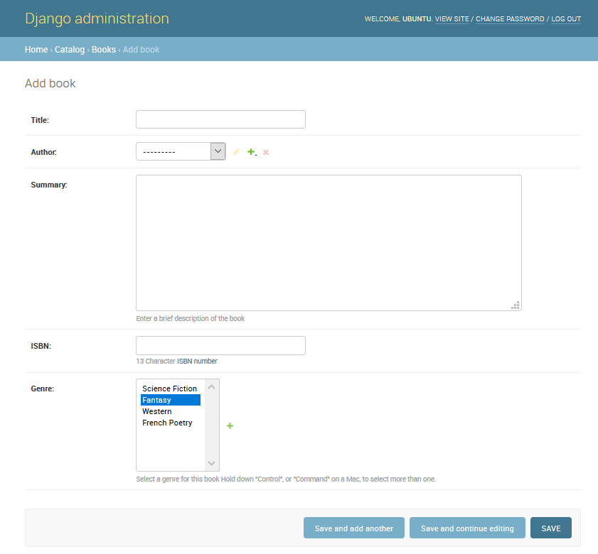
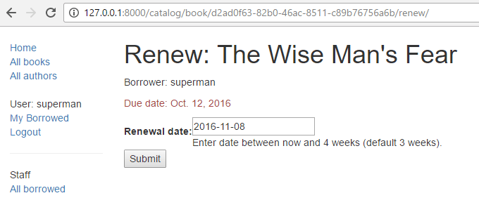
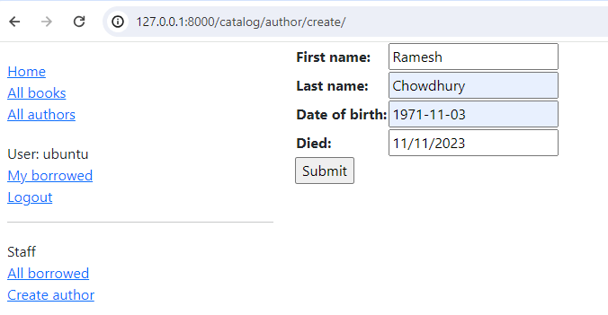
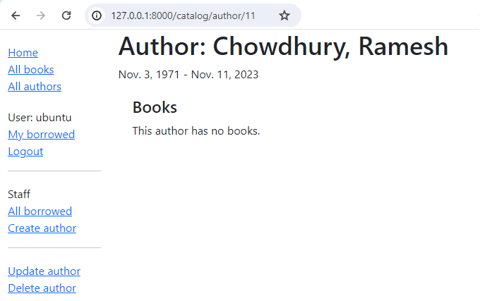
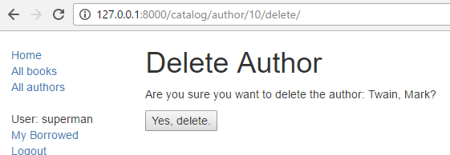
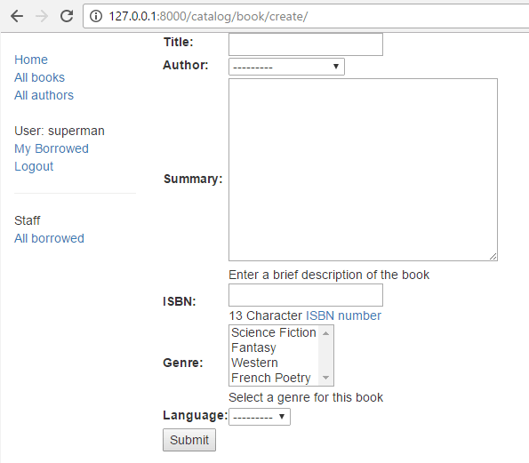

{{PreviousMenuNext("Learn_web_development/Extensions/Server-side/Django/Sessions", "Learn_web_development/Extensions/Server-side/Django/Testing", "Learn_web_development/Extensions/Server-side/Django")}}

In this tutorial, we'll show you how to work with HTML Forms in Django, and, in particular, the easiest way to write forms to create, update, and delete model instances. As part of this demonstration, we'll extend the [LocalLibrary](/en-US/docs/Learn_web_development/Extensions/Server-side/Django/Tutorial_local_library_website) website so that librarians can renew books, and create, update, and delete authors using our own forms (rather than using the admin application).

<table>
  <tbody>
    <tr>
      <th scope="row">Prerequisites:</th>
      <td>
        Complete all previous tutorial topics, including
        <a href="/en-US/docs/Learn_web_development/Extensions/Server-side/Django/Authentication">Django Tutorial Part 8: User authentication and permissions</a>.
      </td>
    </tr>
    <tr>
      <th scope="row">Objective:</th>
      <td>
        To understand how to write forms to get information from users and update the database.
        To understand how the generic class-based editing views can vastly simplify creating forms for working with a single model.
      </td>
    </tr>
  </tbody>
</table>

## Overview

An [HTML Form](/en-US/docs/Learn_web_development/Extensions/Forms) is a group of one or more fields/widgets on a web page, which can be used to collect information from users for submission to a server. Forms are a flexible mechanism for collecting user input because there are suitable widgets for entering many different types of data, including text boxes, checkboxes, radio buttons, date pickers and so on. Forms are also a relatively secure way of sharing data with the server, as they allow us to send data in `POST` requests with cross-site request forgery protection.

While we haven't created any forms in this tutorial so far, we've already encountered them in the Django Admin site — for example, the screenshot below shows a form for editing one of our [Book](/en-US/docs/Learn_web_development/Extensions/Server-side/Django/Models) models, comprised of a number of selection lists and text editors.



Working with forms can be complicated! Developers need to write HTML for the form, validate and properly sanitize entered data on the server (and possibly also in the browser), repost the form with error messages to inform users of any invalid fields, handle the data when it has successfully been submitted, and finally respond to the user in some way to indicate success. _Django Forms_ take a lot of the work out of all these steps, by providing a framework that lets you define forms and their fields programmatically, and then use these objects to both generate the form HTML code and handle much of the validation and user interaction.

In this tutorial, we're going to show you a few of the ways you can create and work with forms, and in particular, how the generic editing views can significantly reduce the amount of work you need to do to create forms to manipulate your models. Along the way, we'll extend our _LocalLibrary_ application by adding a form to allow librarians to renew library books, and we'll create pages to create, edit and delete books and authors (reproducing a basic version of the form shown above for editing books).

## HTML Forms

First, a brief overview of [HTML Forms](/en-US/docs/Learn_web_development/Extensions/Forms). Consider a simple HTML form, with a single text field for entering the name of some "team", and its associated label:


The form is defined in HTML as a collection of elements inside `<form>…</form>` tags, containing at least one `input` element of `type="submit"`.

```html
<form action="/team_name_url/" method="post">
  <label for="team_name">Enter name: </label>
  <input
    id="team_name"
    type="text"
    name="name_field"
    value="Default name for team." />
  <input type="submit" value="OK" />
</form>
```

While here we just have one text field for entering the team name, a form _may_ have any number of other input elements and their associated labels. The field's `type` attribute defines what sort of widget will be displayed. The `name` and `id` of the field are used to identify the field in JavaScript/CSS/HTML, while `value` defines the initial value for the field when it is first displayed. The matching team label is specified using the `label` tag (see "Enter name" above), with a `for` field containing the `id` value of the associated `input`.

The `submit` input will be displayed as a button by default.
This can be pressed to upload the data in all the other input elements in the form to the server (in this case, just the `team_name` field).
The form attributes define the HTTP `method` used to send the data and the destination of the data on the server (`action`):

- `action`: The resource/URL where data is to be sent for processing when the form is submitted. If this is not set (or set to an empty string), then the form will be submitted back to the current page URL.
- `method`: The HTTP method used to send the data: _post_ or _get_.

  - The `POST` method should always be used if the data is going to result in a change to the server's database, because it can be made more resistant to cross-site forgery request attacks.
  - The `GET` method should only be used for forms that don't change user data (for example, a search form). It is recommended for when you want to be able to bookmark or share the URL.

The role of the server is first to render the initial form state — either containing blank fields or pre-populated with initial values. After the user presses the submit button, the server will receive the form data with values from the web browser and must validate the information. If the form contains invalid data, the server should display the form again, this time with user-entered data in "valid" fields and messages to describe the problem for the invalid fields. Once the server gets a request with all valid form data, it can perform an appropriate action (such as: saving the data, returning the result of a search, uploading a file, etc.) and then notify the user.

As you can imagine, creating the HTML, validating the returned data, re-displaying the entered data with error reports if needed, and performing the desired operation on valid data can all take quite a lot of effort to "get right". Django makes this a lot easier by taking away some of the heavy lifting and repetitive code!

## Django form handling process

Django's form handling uses all of the same techniques that we learned about in previous tutorials (for displaying information about our models): the view gets a request, performs any actions required including reading data from the models, then generates and returns an HTML page (from a template, into which we pass a _context_ containing the data to be displayed). What makes things more complicated is that the server also needs to be able to process data provided by the user, and redisplay the page if there are any errors.

A process flowchart of how Django handles form requests is shown below, starting with a request for a page containing a form (shown in green).


Based on the diagram above, the main things that Django's form handling does are:

1. Display the default form the first time it is requested by the user.

   - The form may contain blank fields if you're creating a new record, or it may be pre-populated with initial values (for example, if you are changing a record, or have useful default initial values).
   - The form is referred to as _unbound_ at this point, because it isn't associated with any user-entered data (though it may have initial values).

2. Receive data from a submit request and bind it to the form.

   - Binding data to the form means that the user-entered data and any errors are available when we need to redisplay the form.

3. Clean and validate the data.

   - Cleaning the data performs sanitization of the input fields, such as removing invalid characters that might be used to send malicious content to the server, and converts them into consistent Python types.
   - Validation checks that the values are appropriate for the field (for example, that they are in the right date range, aren't too short or too long, etc.)

4. If any data is invalid, re-display the form, this time with any user populated values and error messages for the problem fields.
5. If all data is valid, perform required actions (such as save the data, send an email, return the result of a search, upload a file, and so on).
6. Once all actions are complete, redirect the user to another page.

Django provides a number of tools and approaches to help you with the tasks detailed above. The most fundamental is the `Form` class, which simplifies both generation of form HTML and data cleaning/validation. In the next section, we describe how forms work using the practical example of a page to allow librarians to renew books.

> [!NOTE]
> Understanding how `Form` is used will help you when we discuss Django's more "high level" form framework classes.

## Renew-book form using a Form and function view

Next, we're going to add a page to allow librarians to renew borrowed books. To do this we'll create a form that allows users to enter a date value. We'll seed the field with an initial value 3 weeks from the current date (the normal borrowing period), and add some validation to ensure that the librarian can't enter a date in the past or a date too far in the future. When a valid date has been entered, we'll write it to the current record's `BookInstance.due_back` field.

The example will use a function-based view and a `Form` class. The following sections explain how forms work, and the changes you need to make to our ongoing _LocalLibrary_ project.

### Form

The `Form` class is the heart of Django's form handling system. It specifies the fields in the form, their layout, display widgets, labels, initial values, valid values, and (once validated) the error messages associated with invalid fields. The class also provides methods for rendering itself in templates using predefined formats (tables, lists, etc.) or for getting the value of any element (enabling fine-grained manual rendering).

#### Declaring a Form

The declaration syntax for a `Form` is very similar to that for declaring a `Model`, and shares the same field types (and some similar parameters). This makes sense because in both cases we need to ensure that each field handles the right types of data, is constrained to valid data, and has a description for display/documentation.

Form data is stored in an application's forms.py file, inside the application directory. Create and open the file **django-locallibrary-tutorial/catalog/forms.py**. To create a `Form`, we import the `forms` library, derive from the `Form` class, and declare the form's fields. A very basic form class for our library book renewal form is shown below — add this to your new file:

```python
from django import forms

class RenewBookForm(forms.Form):
    renewal_date = forms.DateField(help_text="Enter a date between now and 4 weeks (default 3).")
```

#### Form fields

In this case, we have a single [`DateField`](https://docs.djangoproject.com/en/5.0/ref/forms/fields/#datefield) for entering the renewal date that will render in HTML with a blank value, the default label "_Renewal date:_", and some helpful usage text: "_Enter a date between now and 4 weeks (default 3 weeks)._" As none of the other optional arguments are specified the field will accept dates using the [input_formats](https://docs.djangoproject.com/en/5.0/ref/forms/fields/#django.forms.DateField.input_formats): YYYY-MM-DD (2024-11-06), MM/DD/YYYY (02/26/2024), MM/DD/YY (10/25/24), and will be rendered using the default [widget](https://docs.djangoproject.com/en/5.0/ref/forms/fields/#widget): [DateInput](https://docs.djangoproject.com/en/5.0/ref/forms/widgets/#django.forms.DateInput).

There are many other types of form fields, which you will largely recognize from their similarity to the equivalent model field classes:

- [`BooleanField`](https://docs.djangoproject.com/en/5.0/ref/forms/fields/#booleanfield)
- [`CharField`](https://docs.djangoproject.com/en/5.0/ref/forms/fields/#charfield)
- [`ChoiceField`](https://docs.djangoproject.com/en/5.0/ref/forms/fields/#choicefield)
- [`TypedChoiceField`](https://docs.djangoproject.com/en/5.0/ref/forms/fields/#typedchoicefield)
- [`DateField`](https://docs.djangoproject.com/en/5.0/ref/forms/fields/#datefield)
- [`DateTimeField`](https://docs.djangoproject.com/en/5.0/ref/forms/fields/#datetimefield)
- [`DecimalField`](https://docs.djangoproject.com/en/5.0/ref/forms/fields/#decimalfield)
- [`DurationField`](https://docs.djangoproject.com/en/5.0/ref/forms/fields/#durationfield)
- [`EmailField`](https://docs.djangoproject.com/en/5.0/ref/forms/fields/#emailfield)
- [`FileField`](https://docs.djangoproject.com/en/5.0/ref/forms/fields/#filefield)
- [`FilePathField`](https://docs.djangoproject.com/en/5.0/ref/forms/fields/#filepathfield)
- [`FloatField`](https://docs.djangoproject.com/en/5.0/ref/forms/fields/#floatfield)
- [`ImageField`](https://docs.djangoproject.com/en/5.0/ref/forms/fields/#imagefield)
- [`IntegerField`](https://docs.djangoproject.com/en/5.0/ref/forms/fields/#integerfield)
- [`GenericIPAddressField`](https://docs.djangoproject.com/en/5.0/ref/forms/fields/#genericipaddressfield)
- [`MultipleChoiceField`](https://docs.djangoproject.com/en/5.0/ref/forms/fields/#multiplechoicefield)
- [`TypedMultipleChoiceField`](https://docs.djangoproject.com/en/5.0/ref/forms/fields/#typedmultiplechoicefield)
- [`NullBooleanField`](https://docs.djangoproject.com/en/5.0/ref/forms/fields/#nullbooleanfield)
- [`RegexField`](https://docs.djangoproject.com/en/5.0/ref/forms/fields/#regexfield)
- [`SlugField`](https://docs.djangoproject.com/en/5.0/ref/forms/fields/#slugfield)
- [`TimeField`](https://docs.djangoproject.com/en/5.0/ref/forms/fields/#timefield)
- [`URLField`](https://docs.djangoproject.com/en/5.0/ref/forms/fields/#urlfield)
- [`UUIDField`](https://docs.djangoproject.com/en/5.0/ref/forms/fields/#uuidfield)
- [`ComboField`](https://docs.djangoproject.com/en/5.0/ref/forms/fields/#combofield)
- [`MultiValueField`](https://docs.djangoproject.com/en/5.0/ref/forms/fields/#multivaluefield)
- [`SplitDateTimeField`](https://docs.djangoproject.com/en/5.0/ref/forms/fields/#splitdatetimefield)
- [`ModelMultipleChoiceField`](https://docs.djangoproject.com/en/5.0/ref/forms/fields/#modelmultiplechoicefield)
- [`ModelChoiceField`](https://docs.djangoproject.com/en/5.0/ref/forms/fields/#modelchoicefield)

The arguments that are common to most fields are listed below (these have sensible default values):

- [`required`](https://docs.djangoproject.com/en/5.0/ref/forms/fields/#required): If `True`, the field may not be left blank or given a `None` value. Fields are required by default, so you would set `required=False` to allow blank values in the form.
- [`label`](https://docs.djangoproject.com/en/5.0/ref/forms/fields/#label): The label to use when rendering the field in HTML. If a [label](https://docs.djangoproject.com/en/5.0/ref/forms/fields/#label) is not specified, Django will create one from the field name by capitalizing the first letter and replacing underscores with spaces (e.g., _Renewal date_).
- [`label_suffix`](https://docs.djangoproject.com/en/5.0/ref/forms/fields/#label-suffix): By default, a colon is displayed after the label (e.g., Renewal date&ZeroWidthSpace;**:**). This argument allows you to specify a different suffix containing other character(s).
- [`initial`](https://docs.djangoproject.com/en/5.0/ref/forms/fields/#initial): The initial value for the field when the form is displayed.
- [`widget`](https://docs.djangoproject.com/en/5.0/ref/forms/fields/#widget): The display widget to use.
- [`help_text`](https://docs.djangoproject.com/en/5.0/ref/forms/fields/#help-text) (as seen in the example above): Additional text that can be displayed in forms to explain how to use the field.
- [`error_messages`](https://docs.djangoproject.com/en/5.0/ref/forms/fields/#error-messages): A list of error messages for the field. You can override these with your own messages if needed.
- [`validators`](https://docs.djangoproject.com/en/5.0/ref/forms/fields/#validators): A list of functions that will be called on the field when it is validated.
- [`localize`](https://docs.djangoproject.com/en/5.0/ref/forms/fields/#localize): Enables the localization of form data input (see link for more information).
- [`disabled`](https://docs.djangoproject.com/en/5.0/ref/forms/fields/#disabled): The field is displayed but its value cannot be edited if this is `True`. The default is `False`.

#### Validation

Django provides numerous places where you can validate your data. The easiest way to validate a single field is to override the method `clean_<field_name>()` for the field you want to check. So for example, we can validate that entered `renewal_date` values are between now and 4 weeks by implementing `clean_renewal_date()` as shown below.

Update your forms.py file so it looks like this:

```python
import datetime

from django import forms

from django.core.exceptions import ValidationError
from django.utils.translation import gettext_lazy as _

class RenewBookForm(forms.Form):
    renewal_date = forms.DateField(help_text="Enter a date between now and 4 weeks (default 3).")

    def clean_renewal_date(self):
        data = self.cleaned_data['renewal_date']

        # Check if a date is not in the past.
        if data < datetime.date.today():
            raise ValidationError(_('Invalid date - renewal in past'))

        # Check if a date is in the allowed range (+4 weeks from today).
        if data > datetime.date.today() + datetime.timedelta(weeks=4):
            raise ValidationError(_('Invalid date - renewal more than 4 weeks ahead'))

        # Remember to always return the cleaned data.
        return data
```

There are two important things to note. The first is that we get our data using `self.cleaned_data['renewal_date']` and that we return this data whether or not we change it at the end of the function.
This step gets us the data "cleaned" and sanitized of potentially unsafe input using the default validators, and converted into the correct standard type for the data (in this case a Python `datetime.datetime` object).

The second point is that if a value falls outside our range we raise a `ValidationError`, specifying the error text that we want to display in the form if an invalid value is entered.
The example above also wraps this text in one of Django's [translation functions](https://docs.djangoproject.com/en/5.0/topics/i18n/translation/), `gettext_lazy()` (imported as `_()`), which is good practice if you want to translate your site later.

> [!NOTE]
> There are numerous other methods and examples for validating forms in [Form and field validation](https://docs.djangoproject.com/en/5.0/ref/forms/validation/) (Django docs). For example, in cases where you have multiple fields that depend on each other, you can override the [Form.clean()](https://docs.djangoproject.com/en/5.0/ref/forms/api/#django.forms.Form.clean) function and again raise a `ValidationError`.

That's all we need for the form in this example!

### URL configuration

Before we create our view, let's add a URL configuration for the _renew-books_ page. Copy the following configuration to the bottom of **django-locallibrary-tutorial/catalog/urls.py**:

```python
urlpatterns += [
    path('book/<uuid:pk>/renew/', views.renew_book_librarian, name='renew-book-librarian'),
]
```

The URL configuration will redirect URLs with the format **/catalog/book/_\<bookinstance_id>_/renew/** to the function named `renew_book_librarian()` in **views.py**, and send the `BookInstance` id as the parameter named `pk`. The pattern only matches if `pk` is a correctly formatted `uuid`.

> [!NOTE]
> We can name our captured URL data anything we like, because we have complete control over the view function (we're not using a generic detail view class that expects parameters with a certain name). However, `pk` short for "primary key", is a reasonable convention to use!

### View

As discussed in the [Django form handling process](#django_form_handling_process) above, the view has to render the default form when it is first called and then either re-render it with error messages if the data is invalid, or process the data and redirect to a new page if the data is valid. In order to perform these different actions, the view has to be able to know whether it is being called for the first time to render the default form, or a subsequent time to validate data.

For forms that use a `POST` request to submit information to the server, the most common pattern is for the view to test against the `POST` request type (`if request.method == 'POST':`) to identify form validation requests and `GET` (using an `else` condition) to identify the initial form creation request. If you want to submit your data using a `GET` request, then a typical approach for identifying whether this is the first or subsequent view invocation is to read the form data (e.g., to read a hidden value in the form).

The book renewal process will be writing to our database, so, by convention, we use the `POST` request approach.
The code fragment below shows the (very standard) pattern for this sort of function view.

```python
import datetime

from django.shortcuts import render, get_object_or_404
from django.http import HttpResponseRedirect
from django.urls import reverse

from catalog.forms import RenewBookForm

def renew_book_librarian(request, pk):
    book_instance = get_object_or_404(BookInstance, pk=pk)

    # If this is a POST request then process the Form data
    if request.method == 'POST':

        # Create a form instance and populate it with data from the request (binding):
        form = RenewBookForm(request.POST)

        # Check if the form is valid:
        if form.is_valid():
            # process the data in form.cleaned_data as required (here we just write it to the model due_back field)
            book_instance.due_back = form.cleaned_data['renewal_date']
            book_instance.save()

            # redirect to a new URL:
            return HttpResponseRedirect(reverse('all-borrowed'))

    # If this is a GET (or any other method) create the default form.
    else:
        proposed_renewal_date = datetime.date.today() + datetime.timedelta(weeks=3)
        form = RenewBookForm(initial={'renewal_date': proposed_renewal_date})

    context = {
        'form': form,
        'book_instance': book_instance,
    }

    return render(request, 'catalog/book_renew_librarian.html', context)
```

First, we import our form (`RenewBookForm`) and a number of other useful objects/methods used in the body of the view function:

- [`get_object_or_404()`](https://docs.djangoproject.com/en/5.0/topics/http/shortcuts/#get-object-or-404): Returns a specified object from a model based on its primary key value, and raises an `Http404` exception (not found) if the record does not exist.
- [`HttpResponseRedirect`](https://docs.djangoproject.com/en/5.0/ref/request-response/#django.http.HttpResponseRedirect): This creates a redirect to a specified URL (HTTP status code 302).
- [`reverse()`](https://docs.djangoproject.com/en/5.0/ref/urlresolvers/#django.urls.reverse): This generates a URL from a URL configuration name and a set of arguments. It is the Python equivalent of the `url` tag that we've been using in our templates.
- [`datetime`](https://docs.python.org/3/library/datetime.html): A Python library for manipulating dates and times.

In the view, we first use the `pk` argument in `get_object_or_404()` to get the current `BookInstance` (if this does not exist, the view will immediately exit and the page will display a "not found" error).
If this is _not_ a `POST` request (handled by the `else` clause) then we create the default form passing in an `initial` value for the `renewal_date` field, 3 weeks from the current date.

```python
book_instance = get_object_or_404(BookInstance, pk=pk)

# If this is a GET (or any other method) create the default form
else:
    proposed_renewal_date = datetime.date.today() + datetime.timedelta(weeks=3)
    form = RenewBookForm(initial={'renewal_date': proposed_renewal_date})

context = {
    'form': form,
    'book_instance': book_instance,
}

return render(request, 'catalog/book_renew_librarian.html', context)
```

After creating the form, we call `render()` to create the HTML page, specifying the template and a context that contains our form. In this case, the context also contains our `BookInstance`, which we'll use in the template to provide information about the book we're renewing.

However, if this is a `POST` request, then we create our `form` object and populate it with data from the request. This process is called "binding" and allows us to validate the form.

We then check if the form is valid, which runs all the validation code on all of the fields — including both the generic code to check that our date field is actually a valid date and our specific form's `clean_renewal_date()` function to check the date is in the right range.

```python
book_instance = get_object_or_404(BookInstance, pk=pk)

# If this is a POST request then process the Form data
if request.method == 'POST':

    # Create a form instance and populate it with data from the request (binding):
    form = RenewBookForm(request.POST)

    # Check if the form is valid:
    if form.is_valid():
        # process the data in form.cleaned_data as required (here we just write it to the model due_back field)
        book_instance.due_back = form.cleaned_data['renewal_date']
        book_instance.save()

        # redirect to a new URL:
        return HttpResponseRedirect(reverse('all-borrowed'))

context = {
    'form': form,
    'book_instance': book_instance,
}

return render(request, 'catalog/book_renew_librarian.html', context)
```

If the form is not valid we call `render()` again, but this time the form value passed in the context will include error messages.

If the form is valid, then we can start to use the data, accessing it through the `form.cleaned_data` attribute (e.g., `data = form.cleaned_data['renewal_date']`). Here, we just save the data into the `due_back` value of the associated `BookInstance` object.

> [!WARNING]
> While you can also access the form data directly through the request (for example, `request.POST['renewal_date']` or `request.GET['renewal_date']` if using a GET request), this is NOT recommended. The cleaned data is sanitized, validated, and converted into Python-friendly types.

The final step in the form-handling part of the view is to redirect to another page, usually a "success" page. In this case, we use `HttpResponseRedirect` and `reverse()` to redirect to the view named `'all-borrowed'` (this was created as the "challenge" in [Django Tutorial Part 8: User authentication and permissions](/en-US/docs/Learn_web_development/Extensions/Server-side/Django/Authentication#challenge_yourself)). If you didn't create that page consider redirecting to the home page at URL `/`).

That's everything needed for the form handling itself, but we still need to restrict access to the view to just logged-in librarians who have permission to renew books. We use `@login_required` to require that the user is logged in, and the `@permission_required` function decorator with our existing `can_mark_returned` permission to allow access (decorators are processed in order). Note that we probably should have created a new permission setting in `BookInstance` (`can_renew`), but we will reuse the existing one to keep the example simple.

The final view is therefore as shown below. Please copy this into the bottom of **django-locallibrary-tutorial/catalog/views.py**.

```python
import datetime

from django.contrib.auth.decorators import login_required, permission_required
from django.shortcuts import get_object_or_404
from django.http import HttpResponseRedirect
from django.urls import reverse

from catalog.forms import RenewBookForm

@login_required
@permission_required('catalog.can_mark_returned', raise_exception=True)
def renew_book_librarian(request, pk):
    """View function for renewing a specific BookInstance by librarian."""
    book_instance = get_object_or_404(BookInstance, pk=pk)

    # If this is a POST request then process the Form data
    if request.method == 'POST':

        # Create a form instance and populate it with data from the request (binding):
        form = RenewBookForm(request.POST)

        # Check if the form is valid:
        if form.is_valid():
            # process the data in form.cleaned_data as required (here we just write it to the model due_back field)
            book_instance.due_back = form.cleaned_data['renewal_date']
            book_instance.save()

            # redirect to a new URL:
            return HttpResponseRedirect(reverse('all-borrowed'))

    # If this is a GET (or any other method) create the default form.
    else:
        proposed_renewal_date = datetime.date.today() + datetime.timedelta(weeks=3)
        form = RenewBookForm(initial={'renewal_date': proposed_renewal_date})

    context = {
        'form': form,
        'book_instance': book_instance,
    }

    return render(request, 'catalog/book_renew_librarian.html', context)
```

### The template

Create the template referenced in the view (**/catalog/templates/catalog/book_renew_librarian.html**) and copy the code below into it:

```django



  <h1>Renew: \{{ book_instance.book.title }}</h1>
  <p>Borrower: \{{ book_instance.borrower }}</p>
  <p  class="text-danger" >Due date: \{{ book_instance.due_back }}</p>

  <form action="" method="post">
    
    <table>
    \{{ form.as_table }}
    </table>
    <input type="submit" value="Submit">
  </form>

```

Most of this will be completely familiar from previous tutorials.

We extend the base template and then redefine the content block. We are able to reference `\{{ book_instance }}` (and its variables) because it was passed into the context object in the `render()` function, and we use these to list the book title, borrower, and the original due date.

The form code is relatively simple. First, we declare the `form` tags, specifying where the form is to be submitted (`action`) and the `method` for submitting the data (in this case a `POST`) — if you recall the [HTML Forms](#html_forms) overview at the top of the page, an empty `action` as shown, means that the form data will be posted back to the current URL of the page (which is what we want). Inside the tags, we define the `submit` input, which a user can press to submit the data. The `` added just inside the form tags is part of Django's cross-site forgery protection.

> [!NOTE]
> Add the `` to every Django template you create that uses `POST` to submit data. This will reduce the chance of forms being hijacked by malicious users.

All that's left is the `\{{ form }}` template variable, which we passed to the template in the context dictionary.
Perhaps unsurprisingly, when used as shown this provides the default rendering of all the form fields, including their labels, widgets, and help text — the rendering is as shown below:

```html
<tr>
  <th><label for="id_renewal_date">Renewal date:</label></th>
  <td>
    <input
      id="id_renewal_date"
      name="renewal_date"
      type="text"
      value="2023-11-08"
      required />
    <br />
    <span class="helptext">
      Enter date between now and 4 weeks (default 3 weeks).
    </span>
  </td>
</tr>
```

> [!NOTE]
> It is perhaps not obvious because we only have one field, but, by default, every field is defined in its own table row. This same rendering is provided if you reference the template variable `\{{ form.as_table }}`.

If you were to enter an invalid date, you'd additionally get a list of the errors rendered on the page (see `error-list` below).

```html
<tr>
  <th><label for="id_renewal_date">Renewal date:</label></th>
  <td>
    <ul class="error-list">
      <li>Invalid date - renewal in past</li>
    </ul>
    <input
      id="id_renewal_date"
      name="renewal_date"
      type="text"
      value="2023-11-08"
      required />
    <br />
    <span class="helptext">
      Enter date between now and 4 weeks (default 3 weeks).
    </span>
  </td>
</tr>
```

#### Other ways of using form template variable

Using `\{{ form.as_table }}` as shown above, each field is rendered as a table row. You can also render each field as a list item (using `\{{ form.as_ul }}`) or as a paragraph (using `\{{ form.as_p }}`).

It is also possible to have complete control over the rendering of each part of the form, by indexing its properties using dot notation. So, for example, we can access a number of separate items for our `renewal_date` field:

- `\{{ form.renewal_date }}:` The whole field.
- `\{{ form.renewal_date.errors }}`: The list of errors.
- `\{{ form.renewal_date.id_for_label }}`: The id of the label.
- `\{{ form.renewal_date.help_text }}`: The field help text.

For more examples of how to manually render forms in templates and dynamically loop over template fields, see [Working with forms > Rendering fields manually](https://docs.djangoproject.com/en/5.0/topics/forms/#rendering-fields-manually) (Django docs).

### Testing the page

If you accepted the "challenge" in [Django Tutorial Part 8: User authentication and permissions](/en-US/docs/Learn_web_development/Extensions/Server-side/Django/Authentication#challenge_yourself) you'll have a view showing all books on loan in the library, which is only visible to library staff.
The view might look similar to this:

```django



    <h1>All Borrowed Books</h1>

    
    <ul>

      
      <li class="text-danger">
        <a href="">\{{ bookinst.book.title }}</a> (\{{ bookinst.due_back }}) - \{{ bookinst.borrower }}
      </li>
      
    </ul>

    
      <p>There are no books borrowed.</p>
    

```

We can add a link to the book renew page next to each item by appending the following template code to the list item text above.
Note that this template code can only run inside the `` loop, because that is where the `bookinst` value is defined.

```django
- <a href="">Renew</a>
```

> [!NOTE]
> Remember that your test login will need to have the permission `catalog.can_mark_returned` in order to see the new "Renew" link added above, and to access the linked page (perhaps use your superuser account).

You can alternatively manually construct a test URL like this — `http://127.0.0.1:8000/catalog/book/<bookinstance_id>/renew/` (a valid `bookinstance_id` can be obtained by navigating to a book detail page in your library, and copying the `id` field).

### What does it look like?

If you are successful, the default form will look like this:



The form with an invalid value entered will look like this:


The list of all books with renew links will look like this:


## ModelForms

Creating a `Form` class using the approach described above is very flexible, allowing you to create whatever sort of form page you like and associate it with any model or models.

However, if you just need a form to map the fields of a _single_ model then your model will already define most of the information that you need in your form: fields, labels, help text and so on. Rather than recreating the model definitions in your form, it is easier to use the [ModelForm](https://docs.djangoproject.com/en/5.0/topics/forms/modelforms/) helper class to create the form from your model. This `ModelForm` can then be used within your views in exactly the same way as an ordinary `Form`.

A basic `ModelForm` containing the same field as our original `RenewBookForm` is shown below. All you need to do to create the form is add `class Meta` with the associated `model` (`BookInstance`) and a list of the model `fields` to include in the form.

```python
from django.forms import ModelForm

from catalog.models import BookInstance

class RenewBookModelForm(ModelForm):
    class Meta:
        model = BookInstance
        fields = ['due_back']
```

> [!NOTE]
> You can also include all fields in the form using `fields = '__all__'`, or you can use `exclude` (instead of `fields`) to specify the fields _not_ to include from the model).
>
> Neither approach is recommended because new fields added to the model are then automatically included in the form (without the developer necessarily considering possible security implications).

> [!NOTE]
> This might not look all that much simpler than just using a `Form` (and it isn't in this case, because we just have one field). However, if you have a lot of fields, it can considerably reduce the amount of code required!

The rest of the information comes from the model field definitions (e.g., labels, widgets, help text, error messages). If these aren't quite right, then we can override them in our `class Meta`, specifying a dictionary containing the field to change and its new value. For example, in this form, we might want a label for our field of "_Renewal date_" (rather than the default based on the field name: _Due Back_), and we also want our help text to be specific to this use case.
The `Meta` below shows you how to override these fields, and you can similarly set `widgets` and `error_messages` if the defaults aren't sufficient.

```python
class Meta:
    model = BookInstance
    fields = ['due_back']
    labels = {'due_back': _('New renewal date')}
    help_texts = {'due_back': _('Enter a date between now and 4 weeks (default 3).')}
```

To add validation you can use the same approach as for a normal `Form` — you define a function named `clean_<field_name>()` and raise `ValidationError` exceptions for invalid values.
The only difference with respect to our original form is that the model field is named `due_back` and not `renewal_date`.
This change is necessary since the corresponding field in `BookInstance` is called `due_back`.

```python
from django.forms import ModelForm

from catalog.models import BookInstance

class RenewBookModelForm(ModelForm):
    def clean_due_back(self):
       data = self.cleaned_data['due_back']

       # Check if a date is not in the past.
       if data < datetime.date.today():
           raise ValidationError(_('Invalid date - renewal in past'))

       # Check if a date is in the allowed range (+4 weeks from today).
       if data > datetime.date.today() + datetime.timedelta(weeks=4):
           raise ValidationError(_('Invalid date - renewal more than 4 weeks ahead'))

       # Remember to always return the cleaned data.
       return data

    class Meta:
        model = BookInstance
        fields = ['due_back']
        labels = {'due_back': _('Renewal date')}
        help_texts = {'due_back': _('Enter a date between now and 4 weeks (default 3).')}
```

The class `RenewBookModelForm` above is now functionally equivalent to our original `RenewBookForm`. You could import and use it wherever you currently use `RenewBookForm` as long as you also update the corresponding form variable name from `renewal_date` to `due_back` as in the second form declaration: `RenewBookModelForm(initial={'due_back': proposed_renewal_date}`.

## Generic editing views

The form handling algorithm we used in our function view example above represents an extremely common pattern in form editing views. Django abstracts much of this "boilerplate" for you, by creating [generic editing views](https://docs.djangoproject.com/en/5.0/ref/class-based-views/generic-editing/) for creating, editing, and deleting views based on models. Not only do these handle the "view" behavior, but they automatically create the form class (a `ModelForm`) for you from the model.

> [!NOTE]
> In addition to the editing views described here, there is also a [FormView](https://docs.djangoproject.com/en/5.0/ref/class-based-views/generic-editing/#formview) class, which lies somewhere between our function view and the other generic views in terms of "flexibility" vs. "coding effort". Using `FormView`, you still need to create your `Form`, but you don't have to implement all of the standard form-handling patterns. Instead, you just have to provide an implementation of the function that will be called once the submission is known to be valid.

In this section, we're going to use generic editing views to create pages to add functionality to create, edit, and delete `Author` records from our library — effectively providing a basic reimplementation of parts of the Admin site (this could be useful if you need to offer admin functionality in a more flexible way than can be provided by the admin site).

### Views

Open the views file (**django-locallibrary-tutorial/catalog/views.py**) and append the following code block to the bottom of it:

```python
from django.views.generic.edit import CreateView, UpdateView, DeleteView
from django.urls import reverse_lazy
from .models import Author

class AuthorCreate(PermissionRequiredMixin, CreateView):
    model = Author
    fields = ['first_name', 'last_name', 'date_of_birth', 'date_of_death']
    initial = {'date_of_death': '11/11/2023'}
    permission_required = 'catalog.add_author'

class AuthorUpdate(PermissionRequiredMixin, UpdateView):
    model = Author
    # Not recommended (potential security issue if more fields added)
    fields = '__all__'
    permission_required = 'catalog.change_author'

class AuthorDelete(PermissionRequiredMixin, DeleteView):
    model = Author
    success_url = reverse_lazy('authors')
    permission_required = 'catalog.delete_author'

    def form_valid(self, form):
        try:
            self.object.delete()
            return HttpResponseRedirect(self.success_url)
        except Exception as e:
            return HttpResponseRedirect(
                reverse("author-delete", kwargs={"pk": self.object.pk})
            )
```

As you can see, to create, update, or delete the views you need to derive from `CreateView`, `UpdateView`, and `DeleteView` (respectively) and then define the associated model.
We also restrict calling these views to only logged in users with the `add_author`, `change_author`, and `delete_author` permissions, respectively.

For the "create" and "update" cases you also need to specify the fields to display in the form (using the same syntax as for `ModelForm`). In this case, we show how to list them individually and the syntax to list "all" fields. You can also specify initial values for each of the fields using a dictionary of _field_name_/_value_ pairs (here we arbitrarily set the date of death for demonstration purposes — you might want to remove that). By default, these views will redirect on success to a page displaying the newly created/edited model item, which in our case will be the author detail view we created in a previous tutorial. You can specify an alternative redirect location by explicitly declaring parameter `success_url`.

The `AuthorDelete` class doesn't need to display any of the fields, so these don't need to be specified.
We also set a `success_url` (as shown above), because there is no obvious default URL for Django to navigate to after successfully deleting the `Author`. Above we use the [`reverse_lazy()`](https://docs.djangoproject.com/en/5.0/ref/urlresolvers/#reverse-lazy) function to redirect to our author list after an author has been deleted — `reverse_lazy()` is a lazily executed version of `reverse()`, used here because we're providing a URL to a class-based view attribute.

If deletion of authors should always succeed that would be it.
Unfortunately deleting an `Author` will cause an exception if the author has an associated book, because our [`Book` model](/en-US/docs/Learn_web_development/Extensions/Server-side/Django/Models#book_model) specifies `on_delete=models.RESTRICT` for the author `ForeignKey` field.
To handle this case the view overrides the [`form_valid()`](https://docs.djangoproject.com/en/5.0/ref/class-based-views/mixins-editing/#django.views.generic.edit.FormMixin.form_valid) method so that if deleting the `Author` succeeds it redirects to the `success_url`, but if not, it just redirects back to the same form.
We'll update the template below to make clear that you can't delete an `Author` instance that is used in any `Book`.

### URL configurations

Open your URL configuration file (**django-locallibrary-tutorial/catalog/urls.py**) and add the following configuration to the bottom of the file:

```python
urlpatterns += [
    path('author/create/', views.AuthorCreate.as_view(), name='author-create'),
    path('author/<int:pk>/update/', views.AuthorUpdate.as_view(), name='author-update'),
    path('author/<int:pk>/delete/', views.AuthorDelete.as_view(), name='author-delete'),
]
```

There is nothing particularly new here! You can see that the views are classes, and must hence be called via `.as_view()`, and you should be able to recognize the URL patterns in each case. We must use `pk` as the name for our captured primary key value, as this is the parameter name expected by the view classes.

### Templates

The "create" and "update" views use the same template by default, which will be named after your model: `model_name_form.html` (you can change the suffix to something other than **\_form** using the `template_name_suffix` field in your view, for example, `template_name_suffix = '_other_suffix'`)

Create the template file `django-locallibrary-tutorial/catalog/templates/catalog/author_form.html` and copy the text below.

```django



<form action="" method="post">
  
  <table>
    \{{ form.as_table }}
  </table>
  <input type="submit" value="Submit" />
</form>

```

This is similar to our previous forms and renders the fields using a table. Note also how again we declare the `` to ensure that our forms are resistant to CSRF attacks.

The "delete" view expects to find a template named with the format `[model_name]_confirm_delete.html` (again, you can change the suffix using `template_name_suffix` in your view).
Create the template file `django-locallibrary-tutorial/catalog/templates/catalog/author_confirm_delete.html` and copy the text below.

```django




<h1>Delete Author: \{{ author }}</h1>



<p>You can't delete this author until all their books have been deleted:</p>
<ul>
  
    <li><a href="">\{{book}}</a> (\{{book.bookinstance_set.all.count}})</li>
  
</ul>


<p>Are you sure you want to delete the author?</p>

<form action="" method="POST">
  
  <input type="submit" action="" value="Yes, delete.">
</form>



```

The template should be familiar.
It first checks if the author is used in any books, and if so displays the list of books that must be deleted before the author record can be deleted.
If not, it displays a form asking the user to confirm they want to delete the author record.

The final step is to hook the pages into the sidebar.
First we'll add a link for creating the author into the _base template_, so that it is visible in all pages for logged in users who are considered "staff" and who have permission to create authors (`catalog.add_author`).
Open **/django-locallibrary-tutorial/catalog/templates/base_generic.html** and add the lines that allow users with the permission to create the author (in the same block as the link that shows "All Borrowed" books).
Remember to reference the URL using its name `'author-create'` as shown below.

```django

<hr>
<ul class="sidebar-nav">
<li>Staff</li>
   <li><a href="">All borrowed</a></li>

   <li><a href="">Create author</a></li>

</ul>

```

We'll add the links to update and delete authors to the author detail page.
Open **catalog/templates/catalog/author_detail.html** and append the following code:

```django

  \{{ block.super }}

  
  <hr>
  <ul class="sidebar-nav">
    
      <li><a href="">Update author</a></li>
    
    
      <li><a href="">Delete author</a></li>
    
    </ul>
  


```

This block overrides the `sidebar` block in the base template and then pulls in the original content using `\{{ block.super }}`.
It then appends links to update or delete the author, but when the user has the correct permissions and the author record isn't associated with any books.

The pages are now ready to test!

### Testing the page

First, log in to the site with an account that has author add, change and delete permissions.

Navigate to any page, and select "Create author" in the sidebar (with URL `http://127.0.0.1:8000/catalog/author/create/`).
The page should look like the screenshot below.



Enter values for the fields and then press **Submit** to save the author record.
You should now be taken to a detail view for your new author, with a URL of something like `http://127.0.0.1:8000/catalog/author/10`.



You can test editing the record by selecting the "Update author" link (with URL something like `http://127.0.0.1:8000/catalog/author/10/update/`) — we don't show a screenshot because it looks just like the "create" page!

Finally, we can delete the page by selecting "Delete author" from the sidebar on the detail page.
Django should display the delete page shown below if the author record isn't used in any books.
Press "**Yes, delete.**" to remove the record and be taken to the list of all authors.



## Challenge yourself

Create some forms to create, edit, and delete `Book` records. You can use exactly the same structure as for `Authors` (for the deletion, remember that you can't delete a `Book` until all its associated `BookInstance` records are deleted) and you must use the correct permissions.
If your **book_form.html** template is just a copy-renamed version of the **author_form.html** template, then the new "create book" page will look like the screenshot below:



## Summary

Creating and handling forms can be a complicated process! Django makes it much easier by providing programmatic mechanisms to declare, render, and validate forms. Furthermore, Django provides generic form editing views that can do _almost all_ the work to define pages that can create, edit, and delete records associated with a single model instance.

There is a lot more that can be done with forms (check out our [See also](#see_also) list below), but you should now understand how to add basic forms and form-handling code to your own websites.

## See also

- [Working with forms](https://docs.djangoproject.com/en/5.0/topics/forms/) (Django docs)
- [Writing your first Django app, part 4 > Writing a simple form](https://docs.djangoproject.com/en/5.0/intro/tutorial04/#write-a-simple-form) (Django docs)
- [The Forms API](https://docs.djangoproject.com/en/5.0/ref/forms/api/) (Django docs)
- [Form fields](https://docs.djangoproject.com/en/5.0/ref/forms/fields/) (Django docs)
- [Form and field validation](https://docs.djangoproject.com/en/5.0/ref/forms/validation/) (Django docs)
- [Form handling with class-based views](https://docs.djangoproject.com/en/5.0/topics/class-based-views/generic-editing/) (Django docs)
- [Creating forms from models](https://docs.djangoproject.com/en/5.0/topics/forms/modelforms/) (Django docs)
- [Generic editing views](https://docs.djangoproject.com/en/5.0/ref/class-based-views/generic-editing/) (Django docs)

{{PreviousMenuNext("Learn_web_development/Extensions/Server-side/Django/authentication_and_sessions", "Learn_web_development/Extensions/Server-side/Django/Testing", "Learn_web_development/Extensions/Server-side/Django")}}
