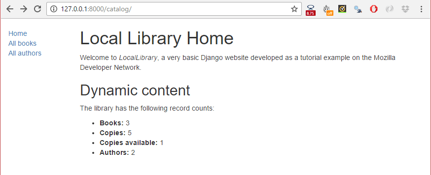

{{LearnSidebar}}{{PreviousMenuNext("Learn_web_development/Extensions/Server-side/Django/Admin_site", "Learn_web_development/Extensions/Server-side/Django/Generic_views", "Learn_web_development/Extensions/Server-side/Django")}}

We're now ready to add the code that displays our first complete page — a home page for the [LocalLibrary](/en-US/docs/Learn_web_development/Extensions/Server-side/Django/Tutorial_local_library_website) website. The home page will show the number of records we have for each model type and provide sidebar navigation links to our other pages. Along the way we'll gain practical experience in writing basic URL maps and views, getting records from the database, and using templates.

<table>
  <tbody>
    <tr>
      <th scope="row">Prerequisites:</th>
      <td>
        Read the <a href="/en-US/docs/Learn_web_development/Extensions/Server-side/Django/Introduction">Django Introduction</a>. Complete previous tutorial topics (including <a href="/en-US/docs/Learn_web_development/Extensions/Server-side/Django/Admin_site">Django Tutorial Part 4: Django admin site</a>).
      </td>
    </tr>
    <tr>
      <th scope="row">Objective:</th>
      <td>
        Learn to create simple URL maps and views (where no data is encoded in the URL), get data from models, and create templates.
      </td>
    </tr>
  </tbody>
</table>

## Overview

After we defined our models and created some initial library records to work with, it's time to write the code that presents that information to users. The first thing we need to do is determine what information we want to display in our pages, and define the URLs to use for returning those resources. Then we'll create a URL mapper, views, and templates to display the pages.

The following diagram describes the main data flow, and the components required when handling HTTP requests and responses. As we already implemented the model, the main components we'll create are:

- URL mappers to forward the supported URLs (and any information encoded in the URLs) to the appropriate view functions.
- View functions to get the requested data from the models, create HTML pages that display the data, and return the pages to the user to view in the browser.
- Templates to use when rendering data in the views.


As you'll see in the next section, we have 5 pages to display, which is too much information to document in a single article. Therefore, this article will focus on how to implement the home page, and we'll cover the other pages in a subsequent article. This should give you a good end-to-end understanding of how URL mappers, views, and models work in practice.

## Defining the resource URLs

As this version of [LocalLibrary](/en-US/docs/Learn_web_development/Extensions/Server-side/Django/Tutorial_local_library_website) is essentially read-only for end users, we just need to provide a landing page for the site (a home page), and pages that _display_ list and detail views for books and authors.

The URLs that we'll need for our pages are:

- `catalog/` — The home (index) page.
- `catalog/books/` — A list of all books.
- `catalog/authors/` — A list of all authors.
- `catalog/book/<id>` — The detail view for a particular book, with a field primary key of `<id>` (the default). For example, the URL for the third book added to the list will be `/catalog/book/3`.
- `catalog/author/<id>` — The detail view for the specific author with a primary key field of `<id>`. For example, the URL for the 11th author added to the list will be `/catalog/author/11`.

The first three URLs will return the index page, books list, and authors list. These URLs do not encode any additional information, and the queries that fetch data from the database will always be the same. However, the results that the queries return will depend on the contents of the database.

By contrast the final two URLs will display detailed information about a specific book or author. These URLs encode the identity of the item to display (represented by `<id>` above). The URL mapper will extract the encoded information and pass it to the view, and the view will dynamically determine what information to get from the database. By encoding the information in the URL we will use a single set of a URL mapping, a view, and a template to handle all books (or authors).

> [!NOTE]
> With Django, you can construct your URLs however you require — you can encode information in the body of the URL as shown above, or include `GET` parameters in the URL, for example `/book/?id=6`. Whichever approach you use, the URLs should be kept clean, logical, and readable, as [recommended by the W3C](https://www.w3.org/Provider/Style/URI).
> The Django documentation recommends encoding information in the body of the URL to achieve better URL design.

As mentioned in the overview, the rest of this article describes how to construct the index page.

## Creating the index page

The first page we'll create is the index page (`catalog/`). The index page will include some static HTML, along with generated "counts" of different records in the database. To make this work we'll create a URL mapping, a view, and a template.

> [!NOTE]
> It's worth paying a little extra attention in this section. Most of the information also applies to the other pages we'll create.

### URL mapping

When we created the [skeleton website](/en-US/docs/Learn_web_development/Extensions/Server-side/Django/skeleton_website), we updated the **locallibrary/urls.py** file to ensure that whenever a URL that starts with `catalog/` is received, the _URLConf_ module `catalog.urls` will process the remaining substring.

The following code snippet from **locallibrary/urls.py** includes the `catalog.urls` module:

```python
urlpatterns += [
    path('catalog/', include('catalog.urls')),
]
```

> [!NOTE]
> Whenever Django encounters the import function [`django.urls.include()`](https://docs.djangoproject.com/en/5.0/ref/urls/#django.urls.include), it splits the URL string at the designated end character and sends the remaining substring to the included _URLconf_ module for further processing.

We also created a placeholder file for the _URLConf_ module, named **/catalog/urls.py**.
Add the following lines to that file:

```python
urlpatterns = [
    path('', views.index, name='index'),
]
```

The `path()` function defines the following:

- A URL pattern, which is an empty string: `''`. We'll discuss URL patterns in detail when working on the other views.
- A view function that will be called if the URL pattern is detected: `views.index`, which is the function named `index()` in the **views.py** file.

The `path()` function also specifies a `name` parameter, which is a unique identifier for _this_ particular URL mapping. You can use the name to "reverse" the mapper, i.e. to dynamically create a URL that points to the resource that the mapper is designed to handle.
For example, we can use the name parameter to link to our home page from any other page by adding the following link in a template:

```django
<a href="">Home</a>.
```

> [!NOTE]
> We can hard code the link as in `<a href="/catalog/">Home</a>`), but if we change the pattern for our home page, for example, to `/catalog/index`) the templates will no longer link correctly. Using a reversed URL mapping is more robust.

### View (function-based)

A view is a function that processes an HTTP request, fetches the required data from the database, renders the data in an HTML page using an HTML template, and then returns the generated HTML in an HTTP response to display the page to the user. The index view follows this model — it fetches information about the number of `Book`, `BookInstance`, available `BookInstance` and `Author` records that we have in the database, and passes that information to a template for display.

Open **catalog/views.py** and note that the file already imports the [render()](https://docs.djangoproject.com/en/5.0/topics/http/shortcuts/#django.shortcuts.render) shortcut function to generate an HTML file using a template and data:

```python
from django.shortcuts import render

# Create your views here.
```

Paste the following lines at the bottom of the file:

```python
from .models import Book, Author, BookInstance, Genre

def index(request):
    """View function for home page of site."""

    # Generate counts of some of the main objects
    num_books = Book.objects.all().count()
    num_instances = BookInstance.objects.all().count()

    # Available books (status = 'a')
    num_instances_available = BookInstance.objects.filter(status__exact='a').count()

    # The 'all()' is implied by default.
    num_authors = Author.objects.count()

    context = {
        'num_books': num_books,
        'num_instances': num_instances,
        'num_instances_available': num_instances_available,
        'num_authors': num_authors,
    }

    # Render the HTML template index.html with the data in the context variable
    return render(request, 'index.html', context=context)
```

The first line imports the model classes that we'll use to access data in all our views.

The first part of the view function fetches the number of records using the `objects.all()` attribute on the model classes. It also gets a list of `BookInstance` objects that have a value of 'a' (Available) in the status field. You can find more information about how to access model data in our previous tutorial [Django Tutorial Part 3: Using models > Searching for records](/en-US/docs/Learn_web_development/Extensions/Server-side/Django/Models#searching_for_records).

At the end of the view function we call the `render()` function to create an HTML page and return the page as a response. This shortcut function wraps a number of other functions to simplify a very common use case. The `render()` function accepts the following parameters:

- the original `request` object, which is an `HttpRequest`.
- an HTML template with placeholders for the data.
- a `context` variable, which is a Python dictionary, containing the data to insert into the placeholders.

We'll talk more about templates and the `context` variable in the next section. Let's get to creating our template so we can actually display something to the user!

### Template

A template is a text file that defines the structure or layout of a file (such as an HTML page), it uses placeholders to represent actual content.

A Django application created using **startapp** (like the skeleton of this example) will look for templates in a subdirectory named '**templates**' of your applications. For example, in the index view that we just added, the `render()` function will expect to find the file **_index.html_** in **/django-locallibrary-tutorial/catalog/templates/** and will raise an error if the file is not present.

You can check this by saving the previous changes and accessing `127.0.0.1:8000` in your browser - it will display a fairly intuitive error message: "TemplateDoesNotExist at /catalog/", and other details.

> [!NOTE]
> Based on your project's settings file, Django will look for templates in a number of places, searching in your installed applications by default. You can find out more about how Django finds templates and what template formats it supports in [the Templates section of the Django documentation](https://docs.djangoproject.com/en/5.0/topics/templates/).

#### Extending templates

The index template will need standard HTML markup for the head and body, along with navigation sections to link to the other pages of the site (which we haven't created yet), and to sections that display introductory text and book data.

Much of the HTML and navigation structure will be the same in every page of our site. Instead of duplicating boilerplate code on every page, you can use the Django templating language to declare a base template, and then extend it to replace just the bits that are different for each specific page.

The following code snippet is a sample base template from a **base_generic.html** file.
We'll be creating the template for LocalLibrary shortly.
The sample below includes common HTML with sections for a title, a sidebar, and main contents marked with the named `block` and `endblock` template tags.
You can leave the blocks empty, or include default content to use when rendering pages derived from the template.

> [!NOTE]
> Template _tags_ are functions that you can use in a template to loop through lists, perform conditional operations based on the value of a variable, and so on. In addition to template tags, the template syntax allows you to reference variables that are passed into the template from the view, and use _template filters_ to format variables (for example, to convert a string to lower case).

```django
<!doctype html>
<html lang="en">
  <head>
    
      <title>Local Library</title>
    
  </head>
  <body>
    
      <!-- insert default navigation text for every page -->
    
    
      <!-- default content text (typically empty) -->
    
  </body>
</html>
```

When defining a template for a particular view, we first specify the base template using the `extends` template tag — see the code sample below. Then we declare what sections from the template we want to replace (if any), using `block`/`endblock` sections as in the base template.

For example, the code snippet below shows how to use the `extends` template tag and override the `content` block. The generated HTML will include the code and structure defined in the base template, including the default content you defined in the `title` block, but the new `content` block in place of the default one.

```django



  <h1>Local Library Home</h1>
  <p>
    Welcome to LocalLibrary, a website developed by
    <em>Mozilla Developer Network</em>!
  </p>

```

#### The LocalLibrary base template

We will use the following code snippet as the base template for the _LocalLibrary_ website. As you can see, it contains some HTML code and defines blocks for `title`, `sidebar`, and `content`. We have a default title and a default sidebar with links to lists of all books and authors, both enclosed in blocks to be easily changed in the future.

> [!NOTE]
> We also introduce two additional template tags: `url` and `load static`. These tags will be explained in following sections.

Create a new file **base_generic.html** in **/django-locallibrary-tutorial/catalog/templates/** and paste the following code to the file:

```django
<!doctype html>
<html lang="en">
  <head>
    
      <title>Local Library</title>
    
    <meta charset="utf-8" />
    <meta name="viewport" content="width=device-width, initial-scale=1" />
    <link href="https://cdn.jsdelivr.net/npm/bootstrap@5.3.3/dist/css/bootstrap.min.css"
      rel="stylesheet"
      integrity="sha384-QWTKZyjpPEjISv5WaRU9OFeRpok6YctnYmDr5pNlyT2bRjXh0JMhjY6hW+ALEwIH"
      crossorigin="anonymous">
    <!-- Add additional CSS in static file -->
    
    <link rel="stylesheet" href="" />
  </head>
  <body>
    <div class="container-fluid">
      <div class="row">
        <div class="col-sm-2">
          
            <ul class="sidebar-nav">
              <li><a href="">Home</a></li>
              <li><a href="">All books</a></li>
              <li><a href="">All authors</a></li>
            </ul>
          
        </div>
        <div class="col-sm-10 "></div>
      </div>
    </div>
  </body>
</html>
```

The template includes CSS from [Bootstrap](https://getbootstrap.com/) to improve the layout and presentation of the HTML page. Using Bootstrap (or another client-side web framework) is a quick way to create an attractive page that displays well on different screen sizes.

The base template also references a local CSS file (**styles.css**) that provides additional styling. Create a **styles.css** file in **/django-locallibrary-tutorial/catalog/static/css/** and paste the following code in the file:

```css
.sidebar-nav {
  margin-top: 20px;
  padding: 0;
  list-style: none;
}
```

#### The index template

Create a new HTML file **index.html** in **/django-locallibrary-tutorial/catalog/templates/** and paste the following code in the file.
This code extends our base template on the first line, and then replaces the default `content` block for the template.

```django



  <h1>Local Library Home</h1>
  <p>
    Welcome to LocalLibrary, a website developed by
    <em>Mozilla Developer Network</em>!
  </p>
  <h2>Dynamic content</h2>
  <p>The library has the following record counts:</p>
  <ul>
    <li><strong>Books:</strong> \{{ num_books }}</li>
    <li><strong>Copies:</strong> \{{ num_instances }}</li>
    <li><strong>Copies available:</strong> \{{ num_instances_available }}</li>
    <li><strong>Authors:</strong> \{{ num_authors }}</li>
  </ul>

```

In the _Dynamic content_ section we declare placeholders (_template variables_) for the information from the view that we want to include.
The variables are enclosed with double brace (handlebars).

> [!NOTE]
> You can easily recognize template variables and template tags (functions) - variables are enclosed in double braces (`\{{ num_books }}`), and tags are enclosed in single braces with percentage signs (``).

The important thing to note here is that variables are named with the _keys_ that we pass into the `context` dictionary in the `render()` function of our view (see sample below).
Variables will be replaced with their associated _values_ when the template is rendered.

```python
context = {
    'num_books': num_books,
    'num_instances': num_instances,
    'num_instances_available': num_instances_available,
    'num_authors': num_authors,
}

return render(request, 'index.html', context=context)
```

#### Referencing static files in templates

Your project is likely to use static resources, including JavaScript, CSS, and images. Because the location of these files might not be known (or might change), Django allows you to specify the location in your templates relative to the `STATIC_URL` global setting. The default skeleton website sets the value of `STATIC_URL` to `"/static/"`, but you might choose to host these on a content delivery network or elsewhere.

Within the template you first call the `load` template tag specifying "static" to add the template library, as shown in the code sample below. You can then use the `static` template tag and specify the relative URL to the required file.

```django
<!-- Add additional CSS in static file -->

<link rel="stylesheet" href="" />
```

You can add an image into the page in a similar way, for example:

```django


```

> [!NOTE]
> The samples above specify where the files are located, but Django does not serve them by default. We configured the development web server to serve files by modifying the global URL mapper (**/django-locallibrary-tutorial/locallibrary/urls.py**) when we [created the website skeleton](/en-US/docs/Learn_web_development/Extensions/Server-side/Django/skeleton_website), but still need to enable file serving in production. We'll look at this later.

For more information on working with static files see [Managing static files](https://docs.djangoproject.com/en/5.0/howto/static-files/) in the Django documentation.

#### Linking to URLs

The base template above introduced the `url` template tag.

```django
<li><a href="">Home</a></li>
```

This tag accepts the name of a `path()` function called in your **urls.py** and the values for any arguments that the associated view will receive from that function, and returns a URL that you can use to link to the resource.

#### Configuring where to find the templates

The location where Django searches for templates is specified in the `TEMPLATES` object in the **settings.py** file.
The default **settings.py** (as created for this tutorial) looks something like this:

```python
TEMPLATES = [
    {
        'BACKEND': 'django.template.backends.django.DjangoTemplates',
        'DIRS': [],
        'APP_DIRS': True,
        'OPTIONS': {
            'context_processors': [
                'django.template.context_processors.debug',
                'django.template.context_processors.request',
                'django.contrib.auth.context_processors.auth',
                'django.contrib.messages.context_processors.messages',
            ],
        },
    },
]
```

The setting of `'APP_DIRS': True`, is the most important, as it tells Django to search for templates in a subdirectory of each application in the project, named "templates" (this makes it easier to group templates with their associated application for easy re-use).

We can also specify specific locations for Django to search for directories using `'DIRS': []` (but that isn't needed yet).

> [!NOTE]
> You can find out more about how Django finds templates and what template formats it supports in [the Templates section of the Django documentation](https://docs.djangoproject.com/en/5.0/topics/templates/).

## What does it look like?

At this point we have created all required resources to display the index page. Run the server (`python3 manage.py runserver`) and open `http://127.0.0.1:8000/` in your browser. If everything is configured correctly, your site should look like the following screenshot.



> [!NOTE]
> The **All books** and **All authors** links will not work yet because the paths, views, and templates for those pages are not defined. We just inserted placeholders for those links in the `base_generic.html` template.

## Challenge yourself

Here are a couple of tasks to test your familiarity with model queries, views, and templates.

1. The LocalLibrary [base template](#the_locallibrary_base_template) includes a `title` block. Override this block in the [index template](#the_index_template) and create a new title for the page.

   > [!NOTE]
   > The section [Extending templates](#extending_templates) explains how to create blocks and extend a block in another template.

2. Modify the [view](#view_function-based) to generate counts for _genres_ and _books_ that contain a particular word (case insensitive), and pass the results to the `context`. You accomplish this in a similar way to creating and using `num_books` and `num_instances_available`. Then update the [index template](#the_index_template) to include these variables.

## Summary

We just created the home page for our site — an HTML page that displays a number of records from the database and links to other yet-to-be-created pages. Along the way we learned fundamental information about URL mappers, views, querying the database with models, passing information to a template from a view, and creating and extending templates.

In the next article we'll build upon this knowledge to create the remaining four pages of our website.

## See also

- [Writing your first Django app, part 3: Views and Templates](https://docs.djangoproject.com/en/5.0/intro/tutorial03/) (Django docs)
- [URL dispatcher](https://docs.djangoproject.com/en/5.0/topics/http/urls/) (Django docs)
- [View functions](https://docs.djangoproject.com/en/5.0/topics/http/views/) (Django docs)
- [Templates](https://docs.djangoproject.com/en/5.0/topics/templates/) (Django docs)
- [Managing static files](https://docs.djangoproject.com/en/5.0/howto/static-files/) (Django docs)
- [Django shortcut functions](https://docs.djangoproject.com/en/5.0/topics/http/shortcuts/#django.shortcuts.render) (Django docs)

{{PreviousMenuNext("Learn_web_development/Extensions/Server-side/Django/Admin_site", "Learn_web_development/Extensions/Server-side/Django/Generic_views", "Learn_web_development/Extensions/Server-side/Django")}}
