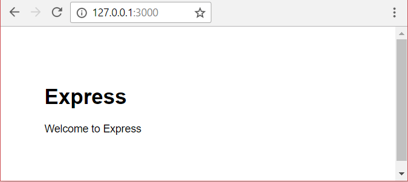

{{LearnSidebar}}{{PreviousMenuNext("Learn_web_development/Extensions/Server-side/Express_Nodejs/Introduction", "Learn_web_development/Extensions/Server-side/Express_Nodejs/Tutorial_local_library_website", "Learn_web_development/Extensions/Server-side/Express_Nodejs")}}

Now that you know what [Express](/en-US/docs/Learn_web_development/Extensions/Server-side/Express_Nodejs/Introduction#introducing_express) is for, we'll show you how to set up and test a Node/Express development environment on Windows, or Linux (Ubuntu), or macOS. For any of those operating systems, this article provides what you need to start developing Express apps.

<table>
  <tbody>
    <tr>
      <th scope="row">Prerequisites:</th>
      <td>
        Know how to open a terminal / command line. Know how to install software packages on your development computer's operating system.
      </td>
    </tr>
    <tr>
      <th scope="row">Objective:</th>
      <td>To set up a development environment for Express on your computer.</td>
    </tr>
  </tbody>
</table>

## Express development environment overview

_Node_ and _Express_ make it very easy to set up your computer in order to start developing web applications. This section provides an overview of what tools are needed, explains some of the simplest methods for installing Node (and Express) on Ubuntu, macOS, and Windows, and shows how you can test your installation.

### What is the Express development environment?

The _Express_ development environment includes an installation of _Nodejs_, the _npm package manager_, and (optionally) the _Express Application Generator_ on your local computer.

_Node_ and the _npm_ package manager are installed together from prepared binary packages, installers, operating system package managers or from source (as shown in the following sections). _Express_ is then installed by npm as a dependency of your individual _Express_ web applications (along with other libraries like template engines, database drivers, authentication middleware, middleware to serve static files, etc.).

_npm_ can also be used to (globally) install the _Express Application Generator_, a handy tool for creating skeleton _Express_ web apps that follow the [MVC pattern](/en-US/docs/Glossary/MVC). The application generator is optional because you don't _need_ to use this tool to create apps that use Express, or construct Express apps that have the same architectural layout or dependencies. We'll be using it though, because it makes getting started a lot easier, and promotes a modular application structure.

> [!NOTE]
> Unlike some other web frameworks, the development environment does not include a separate development web server. In _Node_/_Express_ a web application creates and runs its own web server!

There are other peripheral tools that are part of a typical development environment, including [text editors](/en-US/docs/Learn_web_development/Howto/Tools_and_setup/Available_text_editors) or IDEs for editing code, and source control management tools like [Git](https://git-scm.com/) for safely managing different versions of your code. We are assuming that you've already got these sorts of tools installed (in particular a text editor).

### What operating systems are supported?

_Node_ can be run on Windows, macOS, many flavors of Linux, Docker, etc. There is a full list on the Node.js [Downloads](https://nodejs.org/en/download/package-manager) page. Almost any personal computer should have the necessary performance to run Node during development. _Express_ is run in a _Node_ environment, and hence can run on any platform that runs _Node_.

In this article we provide setup instructions for Windows, macOS, and Ubuntu Linux.

### What version of Node/Express should you use?

There are many [releases of Node](https://nodejs.org/en/blog/release/) — newer releases contain bug fixes, support for more recent versions of ECMAScript (JavaScript) standards, and improvements to the Node APIs.

Generally you should use the most recent _LTS (long-term supported)_ release as this will be more stable than the "current" release while still having relatively recent features (and is still being actively maintained). You should use the _Current_ release if you need a feature that is not present in the LTS version.

For _Express_ you should always use the latest version.

### What about databases and other dependencies?

Other dependencies, such as database drivers, template engines, authentication engines, etc. are part of the application, and are imported into the application environment using the npm package manager. We'll discuss them in later app-specific articles.

## Installing Node

In order to use _Express_ you will have to install _Nodejs_ and the [Node Package Manager (npm)](https://docs.npmjs.com/) on your operating system.
To make this easier we'll first install a node version manager, and then we'll use it to install the latest Long Term Supported (LTS) versions of node and npm.

> [!NOTE]
> You can also install nodejs and npm with installers provide on <https://nodejs.org/en/> (select the button to download the LTS build that is "Recommended for most users"), or you can [install using the package manager for your OS](https://nodejs.org/en/download/package-manager) (nodejs.org).
> We highly recommend using a node version manager as these make it easier to install, upgrade, and switch between any particular version of node and npm.

### Windows

There are a number of node version managers for Windows.
Here we use [nvm-windows](https://github.com/coreybutler/nvm-windows), which is highly respected among node developers.

Install the latest version using your installer of choice from the [nvm-windows/releases](https://github.com/coreybutler/nvm-windows/releases) page.
After `nvm-windows` has installed, open a command prompt (or PowerShell) and enter the following command to download the most recent LTS version of nodejs and npm:

```bash
nvm install lts
```

At time of writing the LTS version of nodejs is 20.11.0.
You can set this as the _current version_ to use with the command below:

```bash
nvm use 20.11.0
```

> [!NOTE]
> If you get "Access Denied" warnings, you will need to run this command in a prompt with administration permissions.

Use the command `nvm --help` to find out other command line options, such as listing all available node versions, and all downloaded NVM versions.

### Ubuntu and macOS

There are a number of node version managers for Ubuntu and macOS.
[nvm](https://github.com/nvm-sh/nvm) is one of the more popular, and is the original version on which `nvm-windows` is based.
See [nvm > Install & Update Script](https://github.com/nvm-sh/nvm#install--update-script) for the terminal instructions to install the latest version of nvm.

After `nvm` has installed, open a terminal enter the following command to download the most recent LTS version of nodejs and npm:

```bash
nvm install --lts
```

At the time of writing, the LTS version of nodejs is 20.11.0.
The command `nvm list` shows the downloaded set of version and the current version.
You can set a particular version as the _current version_ with the command below (the same as for `nvm-windows`)

```bash
nvm use 20.11.0
```

Use the command `nvm --help` to find out other command line options.
These are often similar to, or the same as, those offered by `nvm-windows`.

### Testing your Nodejs and npm installation

Once you have set `nvm` to use a particular node version, you can test the installation.
A good way to do this is to use the "version" command in your terminal/command prompt and check that the expected version string is returned:

```bash
> node -v
v20.11.0
```

The _Nodejs_ package manager _npm_ should also have been installed, and can be tested in the same way:

```bash
> npm -v
10.2.4
```

As a slightly more exciting test let's create a very basic "pure node" server that prints out "Hello World" in the browser when you visit the correct URL in your browser:

1. Copy the following text into a file named **hellonode.js**. This uses pure Node features (nothing from Express):

   ```js
   //Load HTTP module
   const http = require("http");
   const hostname = "127.0.0.1";
   const port = 3000;

   //Create HTTP server and listen on port 3000 for requests
   const server = http.createServer((req, res) => {
     //Set the response HTTP header with HTTP status and Content type
     res.statusCode = 200;
     res.setHeader("Content-Type", "text/plain");
     res.end("Hello World\n");
   });

   //listen for request on port 3000, and as a callback function have the port listened on logged
   server.listen(port, hostname, () => {
     console.log(`Server running at http://${hostname}:${port}/`);
   });
   ```

   The code imports the "http" module and uses it to create a server (`createServer()`) that listens for HTTP requests on port 3000. The script then prints a message to the console about what browser URL you can use to test the server. The `createServer()` function takes as an argument a callback function that will be invoked when an HTTP request is received — this returns a response with an HTTP status code of 200 ("OK") and the plain text "Hello World".

   > [!NOTE]
   > Don't worry if you don't understand exactly what this code is doing yet! We'll explain our code in greater detail once we start using Express!

2. Start the server by navigating into the same directory as your `hellonode.js` file in your command prompt, and calling `node` along with the script name, like so:

   ```bash
   node hellonode.js
   ```

   Once the server starts, you will see console output indicating the IP address the server is running on:

   ```plain
   Server running at http://127.0.0.1:3000/
   ```

3. Navigate to the URL `http://127.0.0.1:3000`. If everything is working, the browser should display the string "Hello World".

## Using npm

Next to _Node_ itself, [npm](https://docs.npmjs.com/) is the most important tool for working with _Node_ applications.
`npm` is used to fetch any packages (JavaScript libraries) that an application needs for development, testing, and/or production, and may also be used to run tests and tools used in the development process.

> [!NOTE]
> From Node's perspective, _Express_ is just another package that you need to install using npm and then require in your own code.

You can manually use npm to separately fetch each needed package. Typically we instead manage dependencies using a plain-text definition file named [package.json](https://docs.npmjs.com/files/package.json/). This file lists all the dependencies for a specific JavaScript "package", including the package's name, version, description, initial file to execute, production dependencies, development dependencies, versions of _Node_ it can work with, etc. The **package.json** file should contain everything npm needs to fetch and run your application (if you were writing a reusable library you could use this definition to upload your package to the npm repository and make it available for other users).

### Adding dependencies

The following steps show how you can use npm to download a package, save it into the project dependencies, and then require it in a Node application.

> [!NOTE]
> Here we show the instructions to fetch and install the _Express_ package. Later on we'll show how this package, and others, are already specified for us using the _Express Application Generator_. This section is provided because it is useful to understand how npm works and what is being created by the application generator.

1. First create a directory for your new application and navigate into it:

   ```bash
   mkdir myapp
   cd myapp
   ```

2. Use the npm `init` command to create a **package.json** file for your application. This command prompts you for a number of things, including the name and version of your application and the name of the initial entry point file (by default this is **index.js**). For now, just accept the defaults:

   ```bash
   npm init
   ```

   If you display the **package.json** file (`cat package.json`), you will see the defaults that you accepted, ending with the license.

   ```json
   {
     "name": "myapp",
     "version": "1.0.0",
     "description": "",
     "main": "index.js",
     "scripts": {
       "test": "echo \"Error: no test specified\" && exit 1"
     },
     "author": "",
     "license": "ISC"
   }
   ```

3. Now install Express in the `myapp` directory and save it in the dependencies list of your **package.json** file:

   ```bash
    npm install express
   ```

   The dependencies section of your **package.json** will now appear at the end of the **package.json** file and will include _Express_.

   ```json
   {
     "name": "myapp",
     "version": "1.0.0",
     "description": "",
     "main": "index.js",
     "scripts": {
       "test": "echo \"Error: no test specified\" && exit 1"
     },
     "author": "",
     "license": "ISC",
     "dependencies": {
       "express": "^4.17.1"
     }
   }
   ```

4. To use the Express library you call the `require()` function in your **index.js** file to include it in your application.
   Create this file now, in the root of the "myapp" application directory, and give it the following contents:

   ```js
   const express = require("express");
   const app = express();
   const port = 3000;

   app.get("/", (req, res) => {
     res.send("Hello World!");
   });

   app.listen(port, () => {
     console.log(`Example app listening on port ${port}!`);
   });
   ```

   This code shows a minimal "HelloWorld" Express web application.
   This imports the "express" module using `require()` and uses it to create a server (`app`) that listens for HTTP requests on port 3000 and prints a message to the console explaining what browser URL you can use to test the server.
   The `app.get()` function only responds to HTTP `GET` requests with the specified URL path ('/'), in this case by calling a function to send our _Hello World!_ message.

   > [!NOTE]
   > The backticks in the `` `Example app listening on port ${port}!` `` let us interpolate the value of `$port` into the string.

5. You can start the server by calling node with the script in your command prompt:

   ```bash
   node index.js
   ```

   You will see the following console output:

   ```plain
   Example app listening on port 3000
   ```

6. Navigate to the URL `http://localhost:3000/`.
   If everything is working, the browser should display the string "Hello World!".

### Development dependencies

If a dependency is only used during development, you should instead save it as a "development dependency" (so that your package users don't have to install it in production). For example, to use the popular JavaScript Linting tool [ESLint](https://eslint.org/) you would call npm as shown:

```bash
npm install eslint --save-dev
```

The following entry would then be added to your application's **package.json**:

```json
  "devDependencies": {
    "eslint": "^7.10.0"
  }
```

> [!NOTE]
> "[Linters](<https://en.wikipedia.org/wiki/Lint_(software)>)" are tools that perform static analysis on software in order to recognize and report adherence/non-adherence to some set of coding best practice.

### Running tasks

In addition to defining and fetching dependencies you can also define _named_ scripts in your **package.json** files and call npm to execute them with the [run-script](https://docs.npmjs.com/cli/run-script/) command. This approach is commonly used to automate running tests and parts of the development or build toolchain (e.g., running tools to minify JavaScript, shrink images, LINT/analyze your code, etc.).

> [!NOTE]
> Task runners like [Gulp](https://gulpjs.com/) and [Grunt](https://gruntjs.com/) can also be used to run tests and other external tools.

For example, to define a script to run the _eslint_ development dependency that we specified in the previous section we might add the following script block to our **package.json** file (assuming that our application source is in a folder /src/js):

```json
"scripts": {
  // …
  "lint": "eslint src/js"
  // …
}
```

To explain a little further, `eslint src/js` is a command that we could enter in our terminal/command line to run `eslint` on JavaScript files contained in the `src/js` directory inside our app directory. Including the above inside our app's package.json file provides a shortcut for this command — `lint`.

We would then be able to run _eslint_ using npm by calling:

```bash
npm run-script lint
# OR (using the alias)
npm run lint
```

This example may not look any shorter than the original command, but you can include much bigger commands inside your npm scripts, including chains of multiple commands. You could identify a single npm script that runs all your tests at once.

## Installing the Express Application Generator

The [Express Application Generator](https://expressjs.com/en/starter/generator.html) tool generates an Express application "skeleton". Install the generator using npm as shown:

```bash
npm install express-generator -g
```

> [!NOTE]
> You may need to prefix this line with `sudo` on Ubuntu or macOS. The `-g` flag installs the tool globally so that you can call it from anywhere.

To create an _Express_ app named "helloworld" with the default settings, navigate to where you want to create it and run the app as shown:

```bash
express helloworld
```

> [!NOTE]
> Unless you're using an old nodejs version (< 8.2.0), you could alternatively skip the installation and run express-generator with [npx](https://github.com/npm/npx#readme).
> This has the same effect as installing and then running `express-generator` but does not install the package on your system:
>
> ```bash
> npx express-generator helloworld
> ```

You can also specify the template library to use and a number of other settings.
Use the `help` command to see all the options:

```bash
express --help
```

The generator will create the new Express app in a sub folder of your current location, displaying build progress on the console.
On completion, the tool will display the commands you need to enter to install the Node dependencies and start the app.

The new app will have a **package.json** file in its root directory.
You can open this to see what dependencies are installed, including Express and the template library Jade:

```json
{
  "name": "helloworld",
  "version": "0.0.0",
  "private": true,
  "scripts": {
    "start": "node ./bin/www"
  },
  "dependencies": {
    "cookie-parser": "~1.4.4",
    "debug": "~2.6.9",
    "express": "~4.16.1",
    "http-errors": "~1.6.3",
    "jade": "~1.11.0",
    "morgan": "~1.9.1"
  }
}
```

Install all the dependencies for the helloworld app using npm as shown:

```bash
cd helloworld
npm install
```

Then run the app (the commands are slightly different for Windows and Linux/macOS), as shown below:

```bash
# Run helloworld on Windows with Command Prompt
SET DEBUG=helloworld:* & npm start

# Run helloworld on Windows with PowerShell
SET DEBUG=helloworld:* | npm start

# Run helloworld on Linux/macOS
DEBUG=helloworld:* npm start
```

The DEBUG command creates useful logging, resulting in an output like the following:

```bash
>SET DEBUG=helloworld:* & npm start

> helloworld@0.0.0 start D:\GitHub\express-tests\helloworld
> node ./bin/www

  helloworld:server Listening on port 3000 +0ms
```

Open a browser and navigate to `http://localhost:3000/` to see the default Express welcome page.



We'll talk more about the generated app when we get to the article on generating a skeleton application.

## Summary

You now have a Node development environment up and running on your computer that can be used for creating Express web applications. You've also seen how npm can be used to import Express into an application, and also how you can create applications using the Express Application Generator tool and then run them.

In the next article we start working through a tutorial to build a complete web application using this environment and associated tools.

## See also

- [Downloads](https://nodejs.org/en/download/package-manager) page (nodejs.org)
- [Installing Express](https://expressjs.com/en/starter/installing.html) (expressjs.com)
- [Express Application Generator](https://expressjs.com/en/starter/generator.html) (expressjs.com)
- [Using Node.js with Windows subsystem for Linux](https://learn.microsoft.com/en-us/windows/dev-environment/javascript/) (docs.microsoft.com)

{{PreviousMenuNext("Learn_web_development/Extensions/Server-side/Express_Nodejs/Introduction", "Learn_web_development/Extensions/Server-side/Express_Nodejs/Tutorial_local_library_website", "Learn_web_development/Extensions/Server-side/Express_Nodejs")}}
