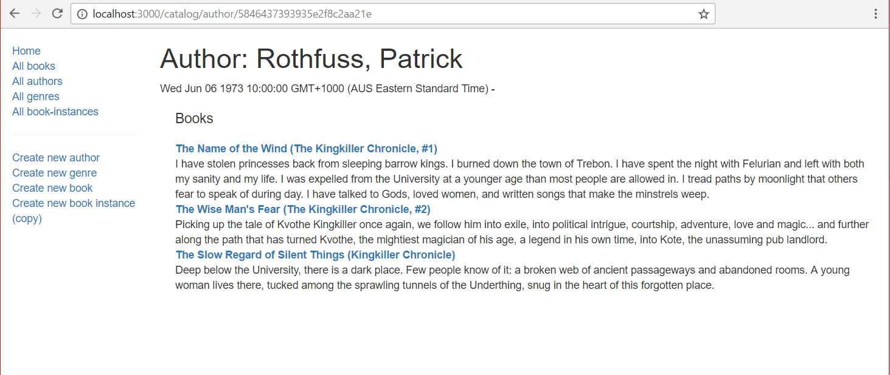

{{LearnSidebar}}

The author detail page needs to display the information about the specified `Author`, identified using their (automatically generated) `_id` field value, along with a list of all the `Book` objects associated with that `Author`.

## Controller

Open **/controllers/authorController.js**.

Add the following lines to the top of the file to `require()` the `Book` module needed by the author detail page (other modules such as "express-async-handler" should already be present).

```js
const Book = require("../models/book");
```

Find the exported `author_detail()` controller method and replace it with the following code.

```js
// Display detail page for a specific Author.
exports.author_detail = asyncHandler(async (req, res, next) => {
  // Get details of author and all their books (in parallel)
  const [author, allBooksByAuthor] = await Promise.all([
    Author.findById(req.params.id).exec(),
    Book.find({ author: req.params.id }, "title summary").exec(),
  ]);

  if (author === null) {
    // No results.
    const err = new Error("Author not found");
    err.status = 404;
    return next(err);
  }

  res.render("author_detail", {
    title: "Author Detail",
    author: author,
    author_books: allBooksByAuthor,
  });
});
```

The approach is exactly the same as described for the [Genre detail page](/en-US/docs/Learn_web_development/Extensions/Server-side/Express_Nodejs/Displaying_data/Genre_detail_page).
The route controller function uses `Promise.all()` to query the specified `Author` and their associated `Book` instances in parallel.
If no matching author is found an Error object is sent to the Express error handling middleware.
If the author is found then the retrieved database information is rendered using the "author_detail" template.

## View

Create **/views/author_detail.pug** and copy in the following text.

```pug
extends layout

block content

  h1 Author: #{author.name}
  p #{author.date_of_birth} - #{author.date_of_death}

  div(style='margin-left:20px;margin-top:20px')

    h2(style='font-size: 1.5rem;') Books
    if author_books.length
      dl
        each book in author_books
          dt
            a(href=book.url) #{book.title}
          dd #{book.summary}
    else
      p This author has no books.
```

Everything in this template has been demonstrated in previous sections.

## What does it look like?

Run the application and open your browser to `http://localhost:3000/`. Select the _All Authors_ link, then select one of the authors. If everything is set up correctly, your site should look something like the following screenshot.



> [!NOTE]
> The appearance of the author _lifespan_ dates is ugly! We'll address that in the final challenge in this article.

## Next steps

- Return to [Express Tutorial Part 5: Displaying library data](/en-US/docs/Learn_web_development/Extensions/Server-side/Express_Nodejs/Displaying_data).
- Proceed to final subarticle of part 5 : [BookInstance detail page and challenge](/en-US/docs/Learn_web_development/Extensions/Server-side/Express_Nodejs/Displaying_data/BookInstance_detail_page_and_challenge).
