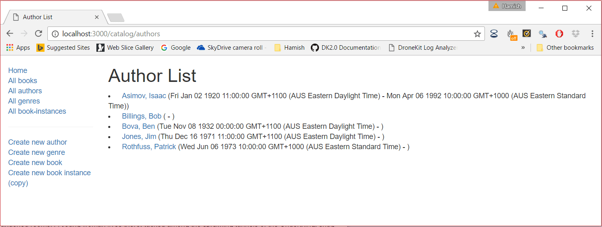
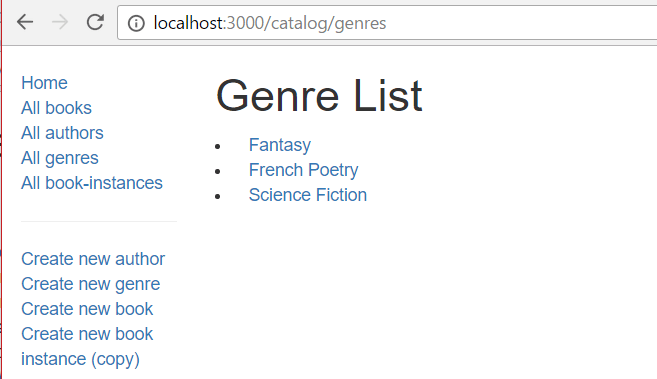

{{PreviousMenuNext("Learn_web_development/Extensions/Server-side/Express_Nodejs/Displaying_data/BookInstance_list_page", "Learn_web_development/Extensions/Server-side/Express_Nodejs/Displaying_data/Genre_detail_page", "Learn_web_development/Extensions/Server-side/Express_Nodejs/Displaying_data")}}

The author list page needs to display a list of all authors in the database, with each author name linked to its associated author detail page. The date of birth and date of death should be listed after the name on the same line.

## Controller

The author list controller function needs to get a list of all `Author` instances, and then pass these to the template for rendering.

Open **controllers/authorController.js**. Find the exported `authorList()` controller method near the top of the file and replace it with the following code.

```js
// Display list of all Authors.
export const authorList = async (req, res, next) => {
  const allAuthors = await Author.find().sort({ family_name: 1 }).exec();
  res.render("author_list", {
    title: "Author List",
    author_list: allAuthors,
  });
};
```

The route controller function follows the same pattern as for the other list pages.
It defines a query on the `Author` model, using the `find()` function to get all authors, and the `sort()` method to sort them by `family_name` in alphabetic order.
`exec()` is daisy-chained on the end in order to execute the query and return a promise that the function can `await`.

Once the promise is fulfilled the route handler renders the **author_list**(.pug) template, passing the page `title` and the list of authors (`allAuthors`) using template keys.

## View

Create **views/author_list.pug** and replace its content with the text below.

```pug
extends layout

block content
  h1= title

  if author_list.length
    ul
      each author in author_list
        li
          a(href=author.url) #{author.name}
          |  (#{author.date_of_birth} - #{author.date_of_death})
  else
    p There are no authors.
```

Run the application and open your browser to `http://localhost:3000/`. Then select the _All authors_ link. If everything is set up correctly, the page should look something like the following screenshot.



> [!NOTE]
> The appearance of the author _lifespan_ dates is ugly! You can improve this using the [same approach](/en-US/docs/Learn_web_development/Extensions/Server-side/Express_Nodejs/Displaying_data/BookInstance_list_page#formatting_the_dates) as we used for the `BookInstance` list (adding the virtual property for the lifespan to the `Author` model).
>
> However, as the author may not be dead or may have missing birth/death data, in this case we need to ignore missing dates or references to nonexistent properties. One way to deal with this is to return either a formatted date, or a blank string, depending on whether the property is defined. For example:
>
> ```js
> return this.date_of_birth ? dateFormatter.format(this.date_of_birth) : "";
> ```

## Genre list page—challenge!

In this section you should implement your own genre list page. The page should display a list of all genres in the database, with each genre linked to its associated detail page. A screenshot of the expected result is shown below.



The genre list controller function needs to get a list of all `Genre` instances, and then pass these to the template for rendering.

1. You will need to edit `genreList()` in **controllers/genreController.js**.
2. The implementation is almost exactly the same as the `authorList()` controller. Sort the results by name, in ascending order.
3. The template to be rendered should be named **genre_list.pug**.
4. The template to be rendered should be passed the variables `title` ('Genre List') and `genre_list` (the list of genres returned from `Genre.find()`).
5. The view should match the screenshot/requirements above (this should have a very similar structure/format to the Author list view, except for the fact that genres do not have dates).

{{PreviousMenuNext("Learn_web_development/Extensions/Server-side/Express_Nodejs/Displaying_data/BookInstance_list_page", "Learn_web_development/Extensions/Server-side/Express_Nodejs/Displaying_data/Genre_detail_page", "Learn_web_development/Extensions/Server-side/Express_Nodejs/Displaying_data")}}
