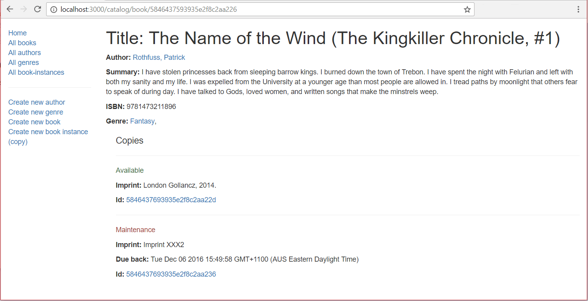

{{LearnSidebar}}

The _Book detail page_ needs to display the information for a specific `Book` (identified using its automatically generated `_id` field value), along with information about each associated copy in the library (`BookInstance`). Wherever we display an author, genre, or book instance, these should be linked to the associated detail page for that item.

## Controller

Open **/controllers/bookController.js**. Find the exported `book_detail()` controller method and replace it with the following code.

```js
// Display detail page for a specific book.
exports.book_detail = asyncHandler(async (req, res, next) => {
  // Get details of books, book instances for specific book
  const [book, bookInstances] = await Promise.all([
    Book.findById(req.params.id).populate("author").populate("genre").exec(),
    BookInstance.find({ book: req.params.id }).exec(),
  ]);

  if (book === null) {
    // No results.
    const err = new Error("Book not found");
    err.status = 404;
    return next(err);
  }

  res.render("book_detail", {
    title: book.title,
    book: book,
    book_instances: bookInstances,
  });
});
```

> [!NOTE]
> We don't need to require any additional modules in this step, as we already imported the dependencies when we implemented the home page controller.

The approach is exactly the same as described for the [Genre detail page](/en-US/docs/Learn_web_development/Extensions/Server-side/Express_Nodejs/Displaying_data/Genre_detail_page).
The route controller function uses `Promise.all()` to query the specified `Book` and its associated copies (`BookInstance`) in parallel.
If no matching book is found an Error object is returned with a "404: Not Found" error.
If the book is found, then the retrieved database information is rendered using the "book_detail" template.
Since the key 'title' is used to give name to the webpage (as defined in the header in 'layout.pug'), this time we are passing `results.book.title` while rendering the webpage.

## View

Create **/views/book_detail.pug** and add the text below.

```pug
extends layout

block content
  h1 Title: #{book.title}

  p #[strong Author: ]
    a(href=book.author.url) #{book.author.name}
  p #[strong Summary:] #{book.summary}
  p #[strong ISBN:] #{book.isbn}
  p #[strong Genre: ]
    each val, index in book.genre
      a(href=val.url) #{val.name}
      if index < book.genre.length - 1
        |,&nbsp;

  div(style='margin-left:20px;margin-top:20px')
    h2(style='font-size: 1.5rem;') Copies

    each val in book_instances
      hr
      if val.status=='Available'
        p.text-success #{val.status}
      else if val.status=='Maintenance'
        p.text-danger #{val.status}
      else
        p.text-warning #{val.status}
      p #[strong Imprint:] #{val.imprint}
      if val.status!='Available'
        p #[strong Due back:] #{val.due_back}
      p #[strong Id: ]
        a(href=val.url) #{val._id}

    else
      p There are no copies of this book in the library.
```

Almost everything in this template has been demonstrated in previous sections.

> [!NOTE]
> The list of genres associated with the book is implemented in the template as below. This adds a comma and a non breaking space after every genre associated with the book except for the last one.
>
> ```pug
>   p #[strong Genre: ]
>     each val, index in book.genre
>       a(href=val.url) #{val.name}
>       if index < book.genre.length - 1
>         |,&nbsp;
> ```

## What does it look like?

Run the application and open your browser to `http://localhost:3000/`. Select the _All books_ link, then select one of the books. If everything is set up correctly, your page should look something like the following screenshot.



## Next steps

- Return to [Express Tutorial Part 5: Displaying library data](/en-US/docs/Learn_web_development/Extensions/Server-side/Express_Nodejs/Displaying_data).
- Proceed to the next subarticle of part 5: [Author detail page](/en-US/docs/Learn_web_development/Extensions/Server-side/Express_Nodejs/Displaying_data/Author_detail_page).
