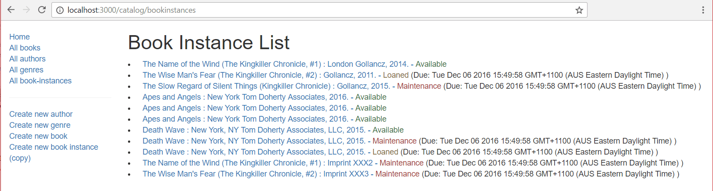

{{PreviousMenuNext("Learn_web_development/Extensions/Server-side/Express_Nodejs/Displaying_data/Book_list_page", "Learn_web_development/Extensions/Server-side/Express_Nodejs/Displaying_data/Author_list_page", "Learn_web_development/Extensions/Server-side/Express_Nodejs/Displaying_data")}}

Next we'll implement our list of all book copies (`BookInstance`) in the library. This page needs to include the title of the `Book` associated with each `BookInstance` (linked to its detail page) along with other information in the `BookInstance` model, including the status, imprint, and unique id of each copy. The unique id text should be linked to the `BookInstance` detail page.

## Controller

The `BookInstance` list controller function needs to get a list of all book instances, populate the associated book information, and then pass the list to the template for rendering.

Open **controllers/bookinstanceController.js**.
Find the exported `bookInstanceList()` controller method and replace it with the following code.

```js
// Display list of all BookInstances.
export const bookInstanceList = async (req, res, next) => {
  const allBookInstances = await BookInstance.find().populate("book").exec();

  res.render("bookinstance_list", {
    title: "Book Instance List",
    bookinstance_list: allBookInstances,
  });
};
```

The route handler calls the `find()` function on the `BookInstance` model, and then daisy-chains a call to `populate()` with the `book` field—this will replace the book id stored for each `BookInstance` with a full `Book` document.
`exec()` is then daisy-chained on the end in order to execute the query and return a promise.

The route handler uses `await` to wait on the promise, pausing execution until it is settled.
If the promise is fulfilled, the results of the query are saved to the `allBookInstances` variable, and the route handler continues execution.

The last part of the code calls `render()`, specifying the **bookinstance_list** (.pug) template and passing values for the `title` and `bookinstance_list` into the template.

## View

Create **views/bookinstance_list.pug** and paste in the text below.

```pug
extends layout

block content
  h1= title

  if bookinstance_list.length
    ul
      each val in bookinstance_list
        li
          a(href=val.url) #{val.book.title} : #{val.imprint} -&nbsp;
          if val.status=='Available'
            span.text-success #{val.status}
          else if val.status=='Maintenance'
            span.text-danger #{val.status}
          else
            span.text-warning #{val.status}
          if val.status!='Available'
            span  (Due: #{val.due_back})

  else
    p There are no book copies in this library.
```

This view is much the same as all the others. It extends the layout, replacing the _content_ block, displays the `title` passed in from the controller, and iterates through all the book copies in `bookinstance_list`. For each copy we display its status (color coded) and if the book is not available, its expected return date. One new feature is introduced—we can use dot notation after a tag to assign a class. So `span.text-success` will be compiled to `<span class="text-success">` (and might also be written in Pug as `span(class="text-success")`).

## Formatting the dates

The default rendering of dates from our models is very ugly: _Mon Apr 10 2020 15:49:58 GMT+1100 (AUS Eastern Daylight Time)_. In this section we'll show how you can update the _BookInstance List_ page from the previous section to present the `due_date` field in a more friendly format: _Apr 10, 2020_.

The approach we will use is to create a virtual property in our `BookInstance` model that returns the formatted date. We'll do the actual formatting using {{jsxref("Intl")}}.

> [!NOTE]
> It is possible to format the strings directly in our Pug templates, or we could format the string in a number of other places. Using a virtual property allows us to get the formatted date in exactly the same way as we get the `due_date` currently.

Open **models/bookinstance.js**.
Add the virtual property `due_back_formatted` just after the URL property.

```js
const dateFormatter = new Intl.DateTimeFormat("en-US", {
  year: "numeric",
  month: "short",
  day: "numeric",
});

BookInstanceSchema.virtual("due_back_formatted").get(function () {
  return dateFormatter.format(this.due_back);
});
```

Open **views/bookinstance_list.pug** and replace `due_back` with `due_back_formatted`.

```pug
      if val.status != 'Available'
        //span  (Due: #{val.due_back})
        span  (Due: #{val.due_back_formatted})
```

That's it. If you go to _All book-instances_ in the sidebar, you should now see all the due dates are far more attractive!

## What does it look like?

Run the application, open your browser to `http://localhost:3000/`, then select the _All book-instances_ link. If everything is set up correctly, your site should look something like the following screenshot.



{{PreviousMenuNext("Learn_web_development/Extensions/Server-side/Express_Nodejs/Displaying_data/Book_list_page", "Learn_web_development/Extensions/Server-side/Express_Nodejs/Displaying_data/Author_list_page", "Learn_web_development/Extensions/Server-side/Express_Nodejs/Displaying_data")}}
