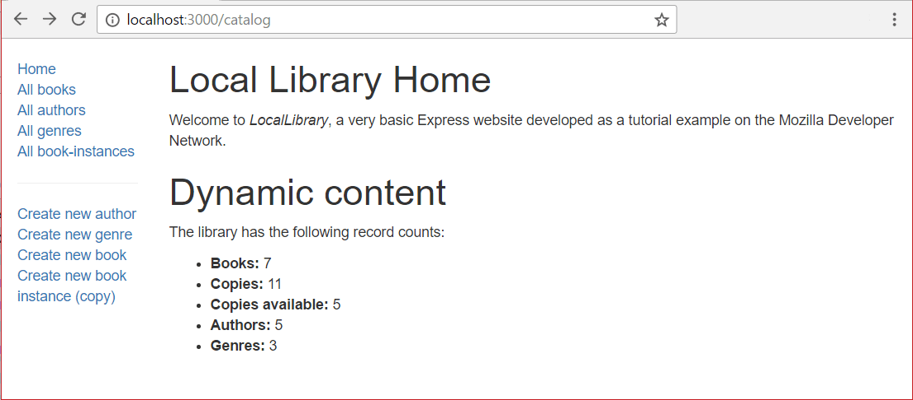

{{LearnSidebar}}

The first page we'll create will be the website home page, which is accessible from either the site (`/`) or catalog (`catalog/`) root. This will display some static text describing the site, along with dynamically calculated "counts" of different record types in the database.

We've already created a route for the home page. In order to complete the page we need to update our controller function to fetch "counts" of records from the database, and create a view (template) that we can use to render the page.

> [!NOTE]
> We'll be using Mongoose for getting database information.
> Before continuing you may wish to re-read the [Mongoose primer](/en-US/docs/Learn_web_development/Extensions/Server-side/Express_Nodejs/mongoose#mongoose_primer) section on [searching for records](/en-US/docs/Learn_web_development/Extensions/Server-side/Express_Nodejs/mongoose#searching_for_records).

## Route

We created our index page routes in a [previous tutorial](/en-US/docs/Learn_web_development/Extensions/Server-side/Express_Nodejs/routes).
As a reminder, all the route functions are defined in **/routes/catalog.js**:

```js
// GET catalog home page.
router.get("/", book_controller.index); //This actually maps to /catalog/ because we import the route with a /catalog prefix
```

The book controller index function passed as a parameter (`book_controller.index`) has a "placeholder" implementation defined in **/controllers/bookController.js**:

```js
exports.index = asyncHandler(async (req, res, next) => {
  res.send("NOT IMPLEMENTED: Site Home Page");
});
```

It is this controller function that we extend to get information from our models and then render it using a template (view).

## Controller

The index controller function needs to fetch information about how many `Book`, `BookInstance` (all), `BookInstance` (available), `Author`, and `Genre` records we have in the database, render this data in a template to create an HTML page, and then return it in an HTTP response.

Open **/controllers/bookController.js**. Near the top of the file you should see the exported `index()` function.

```js
const Book = require("../models/book");
const asyncHandler = require("express-async-handler");

exports.index = asyncHandler(async (req, res, next) => {
  res.send("NOT IMPLEMENTED: Site Home Page");
});
```

Replace all the code above with the following code fragment.
The first thing this does is import (`require()`) all the models.
We need to do this because we'll be using them to get our counts of documents.
The code also requires "express-async-handler", which provides a wrapper to [catch exceptions thrown in route handler functions](/en-US/docs/Learn_web_development/Extensions/Server-side/Express_Nodejs/routes#handling_exceptions_in_route_functions).

```js
const Book = require("../models/book");
const Author = require("../models/author");
const Genre = require("../models/genre");
const BookInstance = require("../models/bookinstance");

const asyncHandler = require("express-async-handler");

exports.index = asyncHandler(async (req, res, next) => {
  // Get details of books, book instances, authors and genre counts (in parallel)
  const [
    numBooks,
    numBookInstances,
    numAvailableBookInstances,
    numAuthors,
    numGenres,
  ] = await Promise.all([
    Book.countDocuments({}).exec(),
    BookInstance.countDocuments({}).exec(),
    BookInstance.countDocuments({ status: "Available" }).exec(),
    Author.countDocuments({}).exec(),
    Genre.countDocuments({}).exec(),
  ]);

  res.render("index", {
    title: "Local Library Home",
    book_count: numBooks,
    book_instance_count: numBookInstances,
    book_instance_available_count: numAvailableBookInstances,
    author_count: numAuthors,
    genre_count: numGenres,
  });
});
```

We use the [`countDocuments()`](<https://mongoosejs.com/docs/api/model.html#Model.countDocuments()>) method to get the number of instances of each model.
This method is called on a model, with an optional set of conditions to match against, and returns a `Query` object.
The query can be executed by calling [`exec()`](https://mongoosejs.com/docs/api/query.html#Query.prototype.exec), which returns a `Promise` that is either fulfilled with a result, or rejected if there is a database error.

Because the queries for document counts are independent of each other we use [`Promise.all()`](/en-US/docs/Web/JavaScript/Reference/Global_Objects/Promise/all) to run them in parallel.
The method returns a new promise that we [`await`](/en-US/docs/Web/JavaScript/Reference/Operators/await) for completion (execution pauses within _this function_ at `await`).
When all the queries complete, the promise returned by `all()` fulfills, continuing execution of the route handler function, and populating the array with the results of the database queries.

We then call [`res.render()`](https://expressjs.com/en/4x/api.html#res.render), specifying a view (template) named '**index**' and objects mapping the results of the database queries to the view template.
The data is supplied as key-value pairs, and can be accessed in the template using the key.

> [!NOTE]
> If you use a key/variable in a Pug template that hasn't been passed in, then it will render as an empty string, and be evaluated as `false` in expressions.
> Other template languages may require that you pass in values for all objects that you use.

Note that the code is very simple because we can assume that the database queries succeed.
If any of the database operations fail, the exception that is thrown will be caught by `asyncHandler()` and passed to the `next` middleware handler in the chain.

## View

Open **/views/index.pug** and replace its content with the text below.

```pug
extends layout

block content
  h1= title
  p Welcome to #[em LocalLibrary], a very basic Express website developed as a tutorial example on the Mozilla Developer Network.

  h2 Dynamic content

  p The library has the following record counts:

  ul
    li #[strong Books:] !{book_count}
    li #[strong Copies:] !{book_instance_count}
    li #[strong Copies available:] !{book_instance_available_count}
    li #[strong Authors:] !{author_count}
    li #[strong Genres:] !{genre_count}
```

The view is straightforward. We extend the **layout.pug** base template, overriding the `block` named '**content**'. The first `h1` heading will be the escaped text for the `title` variable that was passed into the `render()` function—note the use of the `h1=` so that the following text is treated as a JavaScript expression. We then include a paragraph introducing the LocalLibrary.

Under the _Dynamic content_ heading we list the number of copies of each model.
Note that the template values for the data are the keys that were specified when `render()` was called in the route handler function.

> [!NOTE]
> We didn't escape the count values (i.e. we used the `!{}` syntax) because the count values are calculated. If the information was supplied by end-users then we'd escape the variable for display.

## What does it look like?

At this point we should have created everything needed to display the index page. Run the application and open your browser to `http://localhost:3000/`. If everything is set up correctly, your site should look something like the following screenshot.



> [!NOTE]
> You won't be able to _use_ the sidebar links yet because the URLs, views, and templates for those pages haven't been defined. If you try you'll get errors like "NOT IMPLEMENTED: Book list" for example, depending on the link you click on. These string literals (which will be replaced with proper data) were specified in the different controllers that live inside your "controllers" file.

## Next steps

- Return to [Express Tutorial Part 5: Displaying library data](/en-US/docs/Learn_web_development/Extensions/Server-side/Express_Nodejs/Displaying_data).
- Proceed to the next subarticle of part 5: [Book list page](/en-US/docs/Learn_web_development/Extensions/Server-side/Express_Nodejs/Displaying_data/Book_list_page).
