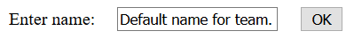

{{LearnSidebar}}{{PreviousMenuNext("Learn_web_development/Extensions/Server-side/Express_Nodejs/Displaying_data", "Learn_web_development/Extensions/Server-side/Express_Nodejs/deployment", "Learn_web_development/Extensions/Server-side/Express_Nodejs")}}

In this tutorial we'll show you how to work with HTML Forms in Express using Pug. In particular, we'll discuss how to write forms to create, update, and delete documents from the site's database.

<table>
  <tbody>
    <tr>
      <th scope="row">Prerequisites:</th>
      <td>
        Complete all previous tutorial topics, including <a href="/en-US/docs/Learn_web_development/Extensions/Server-side/Express_Nodejs/Displaying_data">Express Tutorial Part 5: Displaying library data</a>
      </td>
    </tr>
    <tr>
      <th scope="row">Objective:</th>
      <td>
        To understand how to write forms to get data from users, and update the database with this data.
      </td>
    </tr>
  </tbody>
</table>

## Overview

An [HTML Form](/en-US/docs/Learn_web_development/Extensions/Forms) is a group of one or more fields/widgets on a web page that can be used to collect information from users for submission to a server. Forms are a flexible mechanism for collecting user input because there are suitable form inputs available for entering many different types of data—text boxes, checkboxes, radio buttons, date pickers, etc. Forms are also a relatively secure way of sharing data with the server, as they allow us to send data in `POST` requests with cross-site request forgery protection.

Working with forms can be complicated! Developers need to write HTML for the form, validate and properly sanitize entered data on the server (and possibly also in the browser), repost the form with error messages to inform users of any invalid fields, handle the data when it has successfully been submitted, and finally respond to the user in some way to indicate success.

In this tutorial, we're going to show you how the above operations may be performed in _Express_. Along the way, we'll extend the _LocalLibrary_ website to allow users to create, edit and delete items from the library.

> [!NOTE]
> We haven't looked at how to restrict particular routes to authenticated or authorized users, so at this point, any user will be able to make changes to the database.

### HTML Forms

First a brief overview of [HTML Forms](/en-US/docs/Learn_web_development/Extensions/Forms). Consider a simple HTML form, with a single text field for entering the name of some "team", and its associated label:



The form is defined in HTML as a collection of elements inside `<form>…</form>` tags, containing at least one `input` element of `type="submit"`.

```html
<form action="/team_name_url/" method="post">
  <label for="team_name">Enter name: </label>
  <input
    id="team_name"
    type="text"
    name="name_field"
    value="Default name for team." />
  <input type="submit" value="OK" />
</form>
```

While here we have included just one (text) field for entering the team name, a form _may_ contain any number of other input elements and their associated labels. The field's `type` attribute defines what sort of widget will be displayed. The `name` and `id` of the field are used to identify the field in JavaScript/CSS/HTML, while `value` defines the initial value for the field when it is first displayed. The matching team label is specified using the `label` tag (see "Enter name" above), with a `for` field containing the `id` value of the associated `input`.

The `submit` input will be displayed as a button (by default)—this can be pressed by the user to upload the data contained by the other input elements to the server (in this case, just the `team_name`). The form attributes define the HTTP `method` used to send the data and the destination of the data on the server (`action`):

- `action`: The resource/URL where data is to be sent for processing when the form is submitted. If this is not set (or set to an empty string), then the form will be submitted back to the current page URL.
- `method`: The HTTP method used to send the data: `POST` or `GET`.

  - The `POST` method should always be used if the data is going to result in a change to the server's database, because this can be made more resistant to cross-site forgery request attacks.
  - The `GET` method should only be used for forms that don't change user data (e.g. a search form). It is recommended for when you want to be able to bookmark or share the URL.

### Form handling process

Form handling uses all of the same techniques that we learned for displaying information about our models: the route sends our request to a controller function which performs any database actions required, including reading data from the models, then generates and returns an HTML page. What makes things more complicated is that the server also needs to be able to process the data provided by the user, and redisplay the form with error information if there are any problems.

A process flowchart for processing form requests is shown below, starting with a request for a page containing a form (shown in green):

![Web server form request processing flowchart. Browser requests for the page containing the form by sending an HTTP GET request. The server creates an empty default form and returns it to the user. The user populates or updates the form, submitting it via HTTP POST with form data. The server validates the received form data. If the user-provided data is invalid, the server recreates the form with the user-entered data and error messages and sends it back to the user for the user to update and resubmits via HTTP Post, and it validates again. If the data is valid, the server performs actions on the valid data and redirects the user to the success URL.](web_server_form_handling.png)

As shown in the diagram above, the main things that form handling code needs to do are:

1. Display the default form the first time it is requested by the user.

   - The form may contain blank fields (e.g. if you're creating a new record), or it may be pre-populated with initial values (e.g. if you are changing a record, or have useful default initial values).

2. Receive data submitted by the user, usually in an HTTP `POST` request.
3. Validate and sanitize the data.
4. If any data is invalid, re-display the form—this time with any user populated values and error messages for the problem fields.
5. If all data is valid, perform required actions (e.g. save the data in the database, send a notification email, return the result of a search, upload a file, etc.)
6. Once all actions are complete, redirect the user to another page.

Often form handling code is implemented using a `GET` route for the initial display of the form and a `POST` route to the same path for handling validation and processing of form data. This is the approach that will be used in this tutorial.

Express itself doesn't provide any specific support for form handling operations, but it can use middleware to process `POST` and `GET` parameters from the form, and to validate/sanitize their values.

### Validation and sanitization

Before the data from a form is stored it must be validated and sanitized:

- Validation checks that entered values are appropriate for each field (are in the right range, format, etc.) and that values have been supplied for all required fields.
- Sanitization removes/replaces characters in the data that might potentially be used to send malicious content to the server.

For this tutorial, we'll be using the popular [express-validator](https://www.npmjs.com/package/express-validator) module to perform both validation and sanitization of our form data.

#### Installation

Install the module by running the following command in the root of the project.

```bash
npm install express-validator
```

#### Using express-validator

> [!NOTE]
> The [express-validator](https://express-validator.github.io/docs/#basic-guide) guide on GitHub provides a good overview of the API. We recommend you read that to get an idea of all its capabilities (including using [schema validation](https://express-validator.github.io/docs/guides/schema-validation/) and [creating custom validators](https://express-validator.github.io/docs/guides/customizing/#custom-validators-and-sanitizers)). Below we cover just a subset that is useful for the _LocalLibrary_.

To use the validator in our controllers, we specify the particular functions we want to import from the [express-validator](https://www.npmjs.com/package/express-validator) module, as shown below:

```js
const { body, validationResult } = require("express-validator");
```

There are many functions available, allowing you to check and sanitize data from request parameters, body, headers, cookies, etc., or all of them at once. For this tutorial, we'll primarily be using `body` and `validationResult` (as "required" above).

The functions are defined as below:

- [`body(fields, message)`](https://express-validator.github.io/docs/api/check/#body): Specifies a set of fields in the request body (a `POST` parameter) to validate and/or sanitize along with an optional error message that can be displayed if it fails the tests. The validation and sanitize criteria are daisy-chained to the `body()` method.

  For example, the line below first defines that we're checking the "name" field and that a validation error will set an error message "Empty name". We then call the sanitization method `trim()` to remove whitespace from the start and end of the string, and then `isLength()` to check the resulting string isn't empty. Finally, we call `escape()` to remove HTML characters from the variable that might be used in JavaScript cross-site scripting attacks.

  ```js
  [
    // …
    body("name", "Empty name").trim().isLength({ min: 1 }).escape(),
    // …
  ];
  ```

  This test checks that the age field is a valid date and uses `optional()` to specify that null and empty strings will not fail validation.

  ```js
  [
    // …
    body("age", "Invalid age")
      .optional({ values: "falsy" })
      .isISO8601()
      .toDate(),
    // …
  ];
  ```

  You can also daisy chain different validators, and add messages that are displayed if the preceding validators are false.

  ```js
  [
    // …
    body("name")
      .trim()
      .isLength({ min: 1 })
      .withMessage("Name empty.")
      .isAlpha()
      .withMessage("Name must be alphabet letters."),
    // …
  ];
  ```

- [`validationResult(req)`](https://express-validator.github.io/docs/api/validation-result/#validationresult): Runs the validation, making errors available in the form of a `validation` result object. This is invoked in a separate callback, as shown below:

  ```js
  asyncHandler(async (req, res, next) => {
    // Extract the validation errors from a request.
    const errors = validationResult(req);

    if (!errors.isEmpty()) {
      // There are errors. Render form again with sanitized values/errors messages.
      // Error messages can be returned in an array using `errors.array()`.
    } else {
      // Data from form is valid.
    }
  });
  ```

  We use the validation result's `isEmpty()` method to check if there were errors, and its `array()` method to get the set of error messages. See the [Handling validation section](https://express-validator.github.io/docs/guides/getting-started/#handling-validation-errors) for more information.

The validation and sanitization chains are middleware that should be passed to the Express route handler (we do this indirectly, via the controller). When the middleware runs, each validator/sanitizer is run in the order specified.

We'll cover some real examples when we implement the _LocalLibrary_ forms below.

### Form design

Many of the models in the library are related/dependent—for example, a `Book` _requires_ an `Author`, and _may_ also have one or more `Genres`. This raises the question of how we should handle the case where a user wishes to:

- Create an object when its related objects do not yet exist (for example, a book where the author object hasn't been defined).
- Delete an object that is still being used by another object (so for example, deleting a `Genre` that is still being used by a `Book`).

For this project we will simplify the implementation by stating that a form can only:

- Create an object using objects that already exist (so users will have to create any required `Author` and `Genre` instances before attempting to create any `Book` objects).
- Delete an object if it is not referenced by other objects (so for example, you won't be able to delete a `Book` until all associated `BookInstance` objects have been deleted).

> [!NOTE]
> A more flexible implementation might allow you to create the dependent objects when creating a new object, and delete any object at any time (for example, by deleting dependent objects, or by removing references to the deleted object from the database).

### Routes

In order to implement our form handling code, we will need two routes that have the same URL pattern. The first (`GET`) route is used to display a new empty form for creating the object. The second route (`POST`) is used for validating data entered by the user, and then saving the information and redirecting to the detail page (if the data is valid) or redisplaying the form with errors (if the data is invalid).

We have already created the routes for all our model's create pages in **/routes/catalog.js** (in a [previous tutorial](/en-US/docs/Learn_web_development/Extensions/Server-side/Express_Nodejs/routes)). For example, the genre routes are shown below:

```js
// GET request for creating a Genre. NOTE This must come before route that displays Genre (uses id).
router.get("/genre/create", genre_controller.genre_create_get);

// POST request for creating Genre.
router.post("/genre/create", genre_controller.genre_create_post);
```

## Express forms subarticles

The following sub articles will take us through the process of adding the required forms to our example application. You need to read and work through each one in turn, before moving on to the next one.

1. [Create Genre form](/en-US/docs/Learn_web_development/Extensions/Server-side/Express_Nodejs/forms/Create_genre_form) — Defining a page to create `Genre` objects.
2. [Create Author form](/en-US/docs/Learn_web_development/Extensions/Server-side/Express_Nodejs/forms/Create_author_form) — Defining a page to create `Author` objects.
3. [Create Book form](/en-US/docs/Learn_web_development/Extensions/Server-side/Express_Nodejs/forms/Create_book_form) — Defining a page/form to create `Book` objects.
4. [Create BookInstance form](/en-US/docs/Learn_web_development/Extensions/Server-side/Express_Nodejs/forms/Create_BookInstance_form) — Defining a page/form to create `BookInstance` objects.
5. [Delete Author form](/en-US/docs/Learn_web_development/Extensions/Server-side/Express_Nodejs/forms/Delete_author_form) — Defining a page to delete `Author` objects.
6. [Update Book form](/en-US/docs/Learn_web_development/Extensions/Server-side/Express_Nodejs/forms/Update_Book_form) — Defining page to update `Book` objects.

## Challenge yourself

Implement the delete pages for the `Book`, `BookInstance`, and `Genre` models, linking them from the associated detail pages in the same way as our _Author delete_ page. The pages should follow the same design approach:

- If there are references to the object from other objects, then these other objects should be displayed along with a note that this record can't be deleted until the listed objects have been deleted.
- If there are no other references to the object then the view should prompt to delete it. If the user presses the **Delete** button, the record should then be deleted.

A few tips:

- Deleting a `Genre` is just like deleting an `Author`, as both objects are dependencies of `Book` (so in both cases you can delete the object only when the associated books are deleted).
- Deleting a `Book` is also similar as you need to first check that there are no associated `BookInstances`.
- Deleting a `BookInstance` is the easiest of all because there are no dependent objects. In this case, you can just find the associated record and delete it.

Implement the update pages for the `BookInstance`, `Author`, and `Genre` models, linking them from the associated detail pages in the same way as our _Book update_ page.

A few tips:

- The _Book update page_ we just implemented is the hardest! The same patterns can be used for the update pages for the other objects.
- The `Author` date of death and date of birth fields and the `BookInstance` due_date field are the wrong format to input into the date input field on the form (it requires data in form "YYYY-MM-DD"). The easiest way to get around this is to define a new virtual property for the dates that formats the dates appropriately, and then use this field in the associated view templates.
- If you get stuck, there are examples of the update pages in [the example here](https://github.com/mdn/express-locallibrary-tutorial).

## Summary

_Express_, node, and third-party packages on npm provide everything you need to add forms to your website. In this article, you've learned how to create forms using _Pug_, validate and sanitize input using _express-validator_, and add, delete, and modify records in the database.

You should now understand how to add basic forms and form-handling code to your own node websites!

## See also

- [express-validator](https://www.npmjs.com/package/express-validator) (npm docs).

{{PreviousMenuNext("Learn_web_development/Extensions/Server-side/Express_Nodejs/Displaying_data", "Learn_web_development/Extensions/Server-side/Express_Nodejs/deployment", "Learn_web_development/Extensions/Server-side/Express_Nodejs")}}
