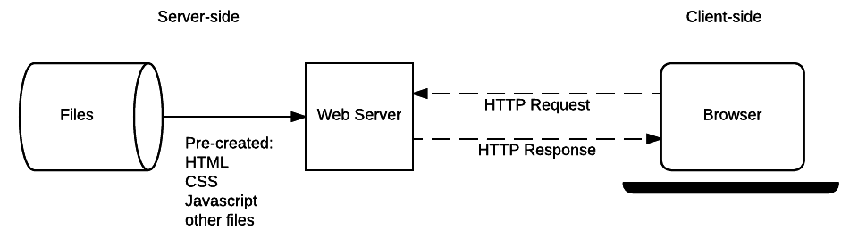

{{LearnSidebar}}{{PreviousMenuNext("Learn_web_development/Extensions/Server-side/First_steps/Introduction", "Learn_web_development/Extensions/Server-side/First_steps/Web_frameworks", "Learn_web_development/Extensions/Server-side/First_steps")}}

Now that you know the purpose and potential benefits of server-side programming, we're going to examine in detail what happens when a server receives a "dynamic request" from a browser. As most website server-side code handles requests and responses in similar ways, this will help you understand what you need to do when writing most of your own code.

<table>
  <tbody>
    <tr>
      <th scope="row">Prerequisites:</th>
      <td>
        A basic understanding of what a web server is.
      </td>
    </tr>
    <tr>
      <th scope="row">Objective:</th>
      <td>
        To understand client-server interactions in a dynamic website, and in
        particular what operations need to be performed by server-side code.
      </td>
    </tr>
  </tbody>
</table>

There is no real code in the discussion because we haven't yet chosen a web framework to use to write our code! This discussion is however still very relevant, because the described behavior must be implemented by your server-side code, irrespective of which programming language or web framework you select.

## Web servers and HTTP (a primer)

Web browsers communicate with [web servers](/en-US/docs/Learn_web_development/Howto/Web_mechanics/What_is_a_web_server) using the **H**yper**T**ext **T**ransfer **P**rotocol ([HTTP](/en-US/docs/Web/HTTP)). When you click a link on a web page, submit a form, or run a search, the browser sends an _HTTP Request_ to the server.

This request includes:

- A URL identifying the target server and resource (e.g. an HTML file, a particular data point on the server, or a tool to run).
- A method that defines the required action (for example, to get a file or to save or update some data). The different methods/verbs and their associated actions are listed below:

  - `GET`: Get a specific resource (e.g. an HTML file containing information about a product, or a list of products).
  - `POST`: Create a new resource (e.g. add a new article to a wiki, add a new contact to a database).
  - `HEAD`: Get the metadata information about a specific resource without getting the body like `GET` would. You might for example use a `HEAD` request to find out the last time a resource was updated, and then only use the (more "expensive") `GET` request to download the resource if it has changed.
  - `PUT`: Update an existing resource (or create a new one if it doesn't exist).
  - `DELETE`: Delete the specified resource.
  - `TRACE`, `OPTIONS`, `CONNECT`, `PATCH`: These verbs are for less common/advanced tasks, so we won't cover them here.

- Additional information can be encoded with the request (for example, HTML form data). Information can be encoded as:

  - URL parameters: `GET` requests encode data in the URL sent to the server by adding name/value pairs onto the end of it — for example `http://example.com?name=Fred&age=11`. You always have a question mark (`?`) separating the rest of the URL from the URL parameters, an equals sign (`=`) separating each name from its associated value, and an ampersand (`&`) separating each pair. URL parameters are inherently "insecure" as they can be changed by users and then resubmitted. As a result URL parameters/`GET` requests are not used for requests that update data on the server.
  - `POST` data. `POST` requests add new resources, the data for which is encoded within the request body.
  - Client-side cookies. Cookies contain session data about the client, including keys that the server can use to determine their login status and permissions/accesses to resources.

Web servers wait for client request messages, process them when they arrive, and reply to the web browser with an HTTP response message. The response contains an [HTTP Response status code](/en-US/docs/Web/HTTP/Status) indicating whether or not the request succeeded (e.g., {{HTTPStatus("200", "200 OK")}} for success, {{HTTPStatus("404", "404 Not Found")}} if the resource cannot be found, {{HTTPStatus("403", "403 Forbidden")}} if the user isn't authorized to see the resource, etc.). The body of the response to a successful `GET` request contains the requested resource.

When an HTML page is returned, it is rendered by the web browser. As part of processing, the browser may discover links to other resources (e.g. an HTML page usually references JavaScript and CSS files), and will send separate HTTP Requests to download these files.

Both static and dynamic websites (discussed in the following sections) use exactly the same communication protocol/patterns.

### GET request/response example

You can make a simple `GET` request by clicking on a link or searching on a site (like a search engine homepage). For example, the HTTP request that is sent when you perform a search on MDN for the term "client-server overview" will look a lot like the text shown below (it will not be identical because parts of the message depend on your browser/setup).

> [!NOTE]
> The format of HTTP messages is defined in a "web standard" ([RFC9110](https://httpwg.org/specs/rfc9110.html#messages)). You don't need to know this level of detail, but at least now you know where this all came from!

#### The request

Each line of the request contains information about it. The first part is called the **header**, and contains useful information about the request, in the same way that an [HTML head](/en-US/docs/Learn_web_development/Core/Structuring_content/Webpage_metadata) contains useful information about an HTML document (but not the actual content itself, which is in the body):

```http
GET /en-US/search?q=client+server+overview&topic=apps&topic=html&topic=css&topic=js&topic=api&topic=webdev HTTP/1.1
Host: developer.mozilla.org
Connection: keep-alive
Pragma: no-cache
Cache-Control: no-cache
Upgrade-Insecure-Requests: 1
User-Agent: Mozilla/5.0 (Windows NT 10.0; WOW64) AppleWebKit/537.36 (KHTML, like Gecko) Chrome/52.0.2743.116 Safari/537.36
Accept: text/html,application/xhtml+xml,application/xml;q=0.9,image/webp,*/*;q=0.8
Referer: https://developer.mozilla.org/en-US/
Accept-Encoding: gzip, deflate, sdch, br
Accept-Language: en-US,en;q=0.8,es;q=0.6
Cookie: sessionid=6ynxs23n521lu21b1t136rhbv7ezngie; csrftoken=zIPUJsAZv6pcgCBJSCj1zU6pQZbfMUAT; dwf_section_edit=False; dwf_sg_task_completion=False; _gat=1; _ga=GA1.2.1688886003.1471911953; ffo=true
```

The first and second lines contain most of the information we talked about above:

- The type of request (`GET`).
- The target resource URL (`/en-US/search`).
- The URL parameters (`q=client%2Bserver%2Boverview&topic=apps&topic=html&topic=css&topic=js&topic=api&topic=webdev`).
- The target/host website (developer.mozilla.org).
- The end of the first line also includes a short string identifying the specific protocol version (`HTTP/1.1`).

The final line contains information about the client-side cookies — you can see in this case the cookie includes an id for managing sessions (`Cookie: sessionid=6ynxs23n521lu21b1t136rhbv7ezngie; …`).

The remaining lines contain information about the browser used and the sort of responses it can handle.
For example, you can see here that:

- My browser (`User-Agent`) is Mozilla Firefox (`Mozilla/5.0`).
- It can accept gzip compressed information (`Accept-Encoding: gzip`).
- It can accept the specified languages (`Accept-Language: en-US,en;q=0.8,es;q=0.6`).
- The `Referer` line indicates the address of the web page that contained the link to this resource (i.e. the origin of the request, `https://developer.mozilla.org/en-US/`).

HTTP requests can also have a body, but it is empty in this case.

#### The response

The first part of the response for this request is shown below. The header contains information like the following:

- The first line includes the response code `200 OK`, which tells us that the request succeeded.
- We can see that the response is `text/html` formatted (`Content-Type`).
- We can also see that it uses the UTF-8 character set (`Content-Type: text/html; charset=utf-8`).
- The head also tells us how big it is (`Content-Length: 41823`).

At the end of the message we see the **body** content — which contains the actual HTML returned by the request.

```http
HTTP/1.1 200 OK
Server: Apache
X-Backend-Server: developer1.webapp.scl3.mozilla.com
Vary: Accept, Cookie, Accept-Encoding
Content-Type: text/html; charset=utf-8
Date: Wed, 07 Sep 2016 00:11:31 GMT
Keep-Alive: timeout=5, max=999
Connection: Keep-Alive
X-Frame-Options: DENY
Allow: GET
X-Cache-Info: caching
Content-Length: 41823

<!doctype html>
<html lang="en-US" dir="ltr" class="redesign no-js" data-ffo-opensanslight=false data-ffo-opensans=false >
<head prefix="og: http://ogp.me/ns#">
  <meta charset="utf-8">
  <meta http-equiv="X-UA-Compatible" content="IE=Edge">
  <script>(function(d) { d.className = d.className.replace(/\bno-js/, ''); })(document.documentElement);</script>
  …
```

The remainder of the response header includes information about the response (e.g. when it was generated), the server, and how it expects the browser to handle the page (e.g. the `X-Frame-Options: DENY` line tells the browser not to allow this page to be embedded in an {{htmlelement("iframe")}} in another site).

### POST request/response example

An HTTP `POST` is made when you submit a form containing information to be saved on the server.

#### The request

The text below shows the HTTP request made when a user submits new profile details on this site. The format of the request is almost the same as the `GET` request example shown previously, though the first line identifies this request as a `POST`.

```http
POST /en-US/profiles/hamishwillee/edit HTTP/1.1
Host: developer.mozilla.org
Connection: keep-alive
Content-Length: 432
Pragma: no-cache
Cache-Control: no-cache
Origin: https://developer.mozilla.org
Upgrade-Insecure-Requests: 1
User-Agent: Mozilla/5.0 (Windows NT 10.0; WOW64) AppleWebKit/537.36 (KHTML, like Gecko) Chrome/52.0.2743.116 Safari/537.36
Content-Type: application/x-www-form-urlencoded
Accept: text/html,application/xhtml+xml,application/xml;q=0.9,image/webp,*/*;q=0.8
Referer: https://developer.mozilla.org/en-US/profiles/hamishwillee/edit
Accept-Encoding: gzip, deflate, br
Accept-Language: en-US,en;q=0.8,es;q=0.6
Cookie: sessionid=6ynxs23n521lu21b1t136rhbv7ezngie; _gat=1; csrftoken=zIPUJsAZv6pcgCBJSCj1zU6pQZbfMUAT; dwf_section_edit=False; dwf_sg_task_completion=False; _ga=GA1.2.1688886003.1471911953; ffo=true

csrfmiddlewaretoken=zIPUJsAZv6pcgCBJSCj1zU6pQZbfMUAT&user-username=hamishwillee&user-fullname=Hamish+Willee&user-title=&user-organization=&user-location=Australia&user-locale=en-US&user-timezone=Australia%2FMelbourne&user-irc_nickname=&user-interests=&user-expertise=&user-twitter_url=&user-stackoverflow_url=&user-linkedin_url=&user-mozillians_url=&user-facebook_url=
```

The main difference is that the URL doesn't have any parameters. As you can see, the information from the form is encoded in the body of the request (for example, the new user fullname is set using: `&user-fullname=Hamish+Willee`).

#### The response

The response from the request is shown below. The status code of `302 Found` tells the browser that the post succeeded, and that it must issue a second HTTP request to load the page specified in the `Location` field. The information is otherwise similar to that for the response to a `GET` request.

```http
HTTP/1.1 302 FOUND
Server: Apache
X-Backend-Server: developer3.webapp.scl3.mozilla.com
Vary: Cookie
Vary: Accept-Encoding
Content-Type: text/html; charset=utf-8
Date: Wed, 07 Sep 2016 00:38:13 GMT
Location: https://developer.mozilla.org/en-US/profiles/hamishwillee
Keep-Alive: timeout=5, max=1000
Connection: Keep-Alive
X-Frame-Options: DENY
X-Cache-Info: not cacheable; request wasn't a GET or HEAD
Content-Length: 0
```

> [!NOTE]
> The HTTP responses and requests shown in these examples were captured using the [Fiddler](https://www.telerik.com/download/fiddler) application, but you can get similar information using web sniffers (e.g. [WebSniffer](https://websniffer.com/)) or packet analyzers like [Wireshark](https://www.wireshark.org/). You can try this yourself. Use any of the linked tools, and then navigate through a site and edit profile information to see the different requests and responses. Most modern browsers also have tools that monitor network requests (for example, the [Network Monitor](https://firefox-source-docs.mozilla.org/devtools-user/network_monitor/index.html) tool in Firefox).

## Static sites

A _static site_ is one that returns the same hard coded content from the server whenever a particular resource is requested. So for example if you have a page about a product at `/static/my-product1.html`, this same page will be returned to every user. If you add another similar product to your site you will need to add another page (e.g. `my-product2.html`) and so on. This can start to get really inefficient — what happens when you get to thousands of product pages? You would repeat a lot of code across each page (the basic page template, structure, etc.), and if you wanted to change anything about the page structure — like add a new "related products" section for example — then you'd have to change every page individually.

> [!NOTE]
> Static sites are excellent when you have a small number of pages and you want to send the same content to every user. However they can have a significant cost to maintain as the number of pages becomes larger.

Let's recap on how this works, by looking again at the static site architecture diagram we looked at in the last article.



When a user wants to navigate to a page, the browser sends an HTTP `GET` request specifying the URL of its HTML page. The server retrieves the requested document from its file system and returns an HTTP response containing the document and an [HTTP Response status code](/en-US/docs/Web/HTTP/Status) of `200 OK` (indicating success). The server might return a different status code, for example `404 Not Found` if the file is not present on the server, or `301 Moved Permanently` if the file exists but has been redirected to a different location.

The server for a static site will only ever need to process GET requests, because the server doesn't store any modifiable data. It also doesn't change its responses based on HTTP Request data (e.g. URL parameters or cookies).

Understanding how static sites work is nevertheless useful when learning server-side programming, because dynamic sites handle requests for static files (CSS, JavaScript, static images, etc.) in exactly the same way.

## Dynamic sites

A _dynamic site_ is one that can generate and return content based on the specific request URL and data (rather than always returning the same hard-coded file for a particular URL). Using the example of a product site, the server would store product "data" in a database rather than individual HTML files. When receiving an HTTP `GET` Request for a product, the server determines the product ID, fetches the data from the database, and then constructs the HTML page for the response by inserting the data into an HTML template. This has major advantages over a static site:

Using a database allows the product information to be stored efficiently in an easily extensible, modifiable, and searchable way.

Using HTML templates makes it very easy to change the HTML structure, because this only needs to be done in one place, in a single template, and not across potentially thousands of static pages.

### Anatomy of a dynamic request

This section provides a step-by-step overview of the "dynamic" HTTP request and response cycle, building on what we looked at in the last article with much more detail. In order to "keep things real" we'll use the context of a sports-team manager website where a coach can select their team name and team size in an HTML form and get back a suggested "best lineup" for their next game.

The diagram below shows the main elements of the "team coach" website, along with numbered labels for the sequence of operations when the coach accesses their "best team" list. The parts of the site that make it dynamic are the _Web Application_ (this is how we will refer to the server-side code that processes HTTP requests and returns HTTP responses), the _Database_, which contains information about players, teams, coaches and their relationships, and the _HTML Templates_.


After the coach submits the form with the team name and number of players, the sequence of operations is:

1. The web browser creates an HTTP `GET` request to the server using the base URL for the resource (`/best`) and encoding the team and player number either as URL parameters (e.g. `/best?team=my_team_name&show=11`) or as part of the URL pattern (e.g. `/best/my_team_name/11/`). A `GET` request is used because the request is only fetching data (not modifying data).
2. The _Web Server_ detects that the request is "dynamic" and forwards it to the _Web Application_ for processing (the web server determines how to handle different URLs based on pattern matching rules defined in its configuration).
3. The _Web Application_ identifies that the _intention_ of the request is to get the "best team list" based on the URL (`/best/`) and finds out the required team name and number of players from the URL. The _Web Application_ then gets the required information from the database (using additional "internal" parameters to define which players are "best", and possibly also getting the identity of the logged in coach from a client-side cookie).
4. The _Web Application_ dynamically creates an HTML page by putting the data (from the _Database_) into placeholders inside an HTML template.
5. The _Web Application_ returns the generated HTML to the web browser (via the _Web Server_), along with an HTTP status code of 200 ("success"). If anything prevents the HTML from being returned then the _Web Application_ will return another code — for example "404" to indicate that the team does not exist.
6. The Web Browser will then start to process the returned HTML, sending separate requests to get any other CSS or JavaScript files that it references (see step 7).
7. The Web Server loads static files from the file system and returns them to the browser directly (again, correct file handling is based on configuration rules and URL pattern matching).

An operation to update a record in the database would be handled similarly, except that like any database update, the HTTP request from the browser should be encoded as a `POST` request.

### Doing other work

A _Web Application's_ job is to receive HTTP requests and return HTTP responses. While interacting with a database to get or update information are very common tasks, the code may do other things at the same time, or not interact with a database at all.

A good example of an additional task that a _Web Application_ might perform would be sending an email to users to confirm their registration with the site. The site might also perform logging or other operations.

### Returning something other than HTML

Server-side website code does not have to return HTML snippets/files in the response. It can instead dynamically create and return other types of files (text, PDF, CSV, etc.) or even data (JSON, XML, etc.).

This is especially relevant for websites that work by fetching content from the server using JavaScript and updating the page dynamically, rather than always loading a new page when new content is to be shown. See [Making network requests with JavaScript](/en-US/docs/Learn_web_development/Core/Scripting/Network_requests) for more on the motivation for this approach, and what this model looks like from the client's point of view.

## Web frameworks simplify server-side web programming

Server-side web frameworks make writing code to handle the operations described above much easier.

One of the most important operations they perform is providing simple mechanisms to map URLs for different resources/pages to specific handler functions. This makes it easier to keep the code associated with each type of resource separate. It also has benefits in terms of maintenance, because you can change the URL used to deliver a particular feature in one place, without having to change the handler function.

For example, consider the following Django (Python) code that maps two URL patterns to two view functions. The first pattern ensures that an HTTP request with a resource URL of `/best` will be passed to a function named `index()` in the `views` module. A request that has the pattern `/best/junior`, will instead be passed to the `junior()` view function.

```python
# file: best/urls.py
#

from django.conf.urls import url

from . import views

urlpatterns = [
    # example: /best/
    url(r'^$', views.index),
    # example: /best/junior/
    url(r'^junior/$', views.junior),
]
```

> [!NOTE]
> The first parameters in the `url()` functions may look a bit odd (e.g. `r'^junior/$'`) because they use a pattern matching technique called "regular expressions" (RegEx, or RE). You don't need to know how regular expressions work at this point, other than that they allow us to match patterns in the URL (rather than the hard coded values above) and use them as parameters in our view functions. As an example, a really simple RegEx might say "match a single uppercase letter, followed by between 4 and 7 lower case letters."

The web framework also makes it easy for a view function to fetch information from the database. The structure of our data is defined in models, which are Python classes that define the fields to be stored in the underlying database. If we have a model named _Team_ with a field of "_team_type_" then we can use a simple query syntax to get back all teams that have a particular type.

The example below gets a list of all teams that have the exact (case sensitive) `team_type` of "junior" — note the format: field name (`team_type`) followed by double underscore, and then the type of match to use (in this case `exact`). There are many other types of matches and we can daisy chain them. We can also control the order and the number of results returned.

```python
#best/views.py

from django.shortcuts import render

from .models import Team

def junior(request):
    list_teams = Team.objects.filter(team_type__exact="junior")
    context = {'list': list_teams}
    return render(request, 'best/index.html', context)
```

After the `junior()` function gets the list of junior teams, it calls the `render()` function, passing the original `HttpRequest`, an HTML template, and a "context" object defining the information to be included in the template. The `render()` function is a convenience function that generates HTML using a context and an HTML template, and returns it in an `HttpResponse` object.

Obviously web frameworks can help you with a lot of other tasks. We discuss a lot more benefits and some popular web framework choices in the next article.

## Summary

At this point you should have a good overview of the operations that server-side code has to perform, and know some of the ways in which a server-side web framework can make this easier.

In a following module we'll help you choose the best Web Framework for your first site.

{{PreviousMenuNext("Learn_web_development/Extensions/Server-side/First_steps/Introduction", "Learn_web_development/Extensions/Server-side/First_steps/Web_frameworks", "Learn_web_development/Extensions/Server-side/First_steps")}}
