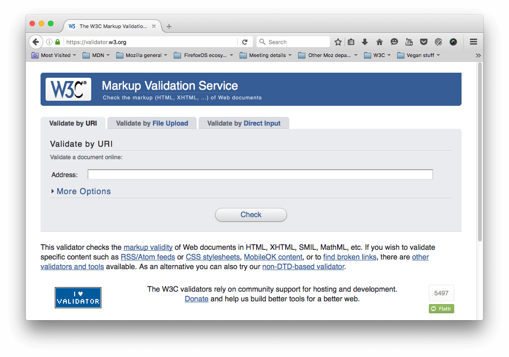
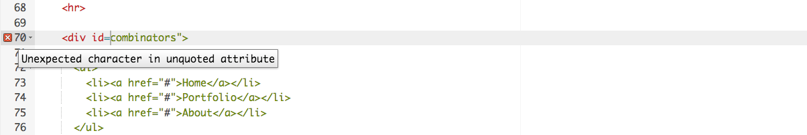
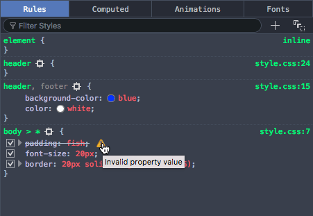
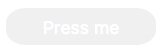

{{LearnSidebar}}

{{PreviousMenuNext("Learn_web_development/Extensions/Testing/Testing_strategies","Learn_web_development/Extensions/Testing/Feature_detection", "Learn_web_development/Extensions/Testing")}}

With the scene set, we'll now look specifically at the common cross-browser problems you will come across in HTML and CSS code, and what tools can be used to prevent problems from happening, or fix problems that occur. This includes linting code, handling CSS prefixes, using browser dev tools to track down problems, using polyfills to add support into browsers, tackling responsive design problems, and more.

<table>
  <tbody>
    <tr>
      <th scope="row">Prerequisites:</th>
      <td>
        Familiarity with the core <a href="/en-US/docs/Learn_web_development/Core/Structuring_content">HTML</a>,
        <a href="/en-US/docs/Learn_web_development/Core/Styling_basics">CSS</a>, and
        <a href="/en-US/docs/Learn_web_development/Core/Scripting">JavaScript</a> languages; an idea
        of the high level
        <a
          href="/en-US/docs/Learn_web_development/Extensions/Testing/Introduction"
          >principles of cross browser testing</a
        >.
      </td>
    </tr>
    <tr>
      <th scope="row">Objective:</th>
      <td>
        To be able to diagnose common HTML and CSS cross browser problems, and
        use appropriate tools and techniques to fix them.
      </td>
    </tr>
  </tbody>
</table>

## The trouble with HTML and CSS

Some of the trouble with HTML and CSS lies with the fact that both languages are fairly simple, and often developers don't take them seriously, in terms of making sure the code is well-crafted, efficient, and semantically describes the purpose of the features on the page. In the worst cases, JavaScript is used to generate the entire web page content and style, which makes your pages inaccessible, and less performant (generating DOM elements is expensive). In other cases, nascent features are not supported consistently across browsers, which can make some features and styles not work for some users. Responsive design problems are also common — a site that looks good in a desktop browser might provide a terrible experience on a mobile device, because the content is too small to read, or perhaps the site is slow because of expensive animations.

Let's go forth and look at how we can reduce cross browser errors that result from HTML/CSS.

## First things first: fixing general problems

We said in the [first article of this series](/en-US/docs/Learn_web_development/Extensions/Testing/Introduction#testingdiscovery) that a good strategy to begin with is to test in a couple of modern browsers on desktop/mobile, to make sure your code is working generally, before going on to concentrate on the cross browser issues.

In our [Debugging HTML](/en-US/docs/Learn_web_development/Core/Structuring_content/Debugging_HTML) and [Debugging CSS](/en-US/docs/Learn_web_development/Core/Styling_basics/Debugging_CSS) articles, we provided some really basic guidance on debugging HTML/CSS — if you are not familiar with the basics, you should definitely study these articles before carrying on.

Basically, it is a matter of checking whether your HTML and CSS code is well formed and doesn't contain any syntax errors.

> [!NOTE]
> One common problem with CSS and HTML arises when different CSS rules begin to conflict with one another. This can be especially problematic when you are using third party code. For example, you might use a CSS framework and find that one of the class names it uses clashes with one you've already used for a different purpose. Or you might find that HTML generated by some kind of third party API (generating ad banners, for example) includes a class name or ID that you are already using for a different purpose. To ensure this doesn't happen, you need to research the tools you are using first and design your code around them. It is also worth "namespacing" CSS, e.g. if you have a widget, make sure it has a distinct class, and then start the selectors that select elements inside the widget with this class, so conflicts are less likely. For example `.audio-player ul a`.

### Validation

For HTML, validation involves making sure all your tags are properly closed and nested, you are using a doctype, and you are using tags for their correct purpose. A good strategy is to validate your code regularly. One service that can do this is the W3C [Markup Validation Service](https://validator.w3.org/), which allows you to point to your code, and returns a list of errors:



CSS has a similar story — you need to check that your property names are spelled correctly, property values are spelled correctly and are valid for the properties they are used on, you are not missing any curly braces, and so on. The W3C has a [CSS Validator](https://jigsaw.w3.org/css-validator/) available too, for this purpose.

### Linters

Another good option to choose is a so-called Linter application, which not only points out errors, but can also flag up warnings about bad practices in your CSS, and other points besides. Linters can generally be customized to be stricter or more relaxed in their error/warning reporting.

There are many online linter applications, such as [Dirty Markup](https://www.10bestdesign.com/dirtymarkup/) for HTML, CSS, and JavaScript. These allows you to paste your code into a window, and it will flag up any errors with crosses, which can then be hovered to get an error message informing you what the problem is. Dirty Markup also allows you to make fixes to your markup using the _Clean_ button.



However, it is not very convenient to have to copy and paste your code over to a web page to check its validity several times. What you really want is a linter that will fit into your standard workflow with the minimum of hassle.

Many code editors have linter plugins. For example, see:

- [SublimeLinter](https://www.sublimelinter.com/) for Sublime Text
- [Notepad++ linter](https://sourceforge.net/projects/notepad-linter/)
- [VS Code linters](https://marketplace.visualstudio.com/search?target=vscode&category=Linters&sortBy=Installs)

### Browser developer tools

The developer tools built into most browsers also feature useful tools for hunting down errors, mainly for CSS.

> [!NOTE]
> HTML errors don't tend to show up so easily in dev tools, as the browser will try to correct badly-formed markup automatically; the W3C validator is the best way to find HTML errors — see [Validation](#validation) above.

As an example, in Firefox the CSS inspector will show CSS declarations that aren't applied crossed out, with a warning triangle. Hovering the warning triangle will provide a descriptive error message:



Other browser devtools have similar features.

## Common cross browser problems

Now let's move on to look at some of the most common cross browser HTML and CSS problems. The main areas we'll look at are lack of support for modern features, and layout issues.

### Browsers not supporting modern features

This is a common problem, especially when you need to support old browsers or you are using features that are implemented in some browsers but not yet in all. In general, most core HTML and CSS functionality (such as basic HTML elements, CSS basic colors and text styling) works across all the browsers you'll want to support; more problems are uncovered when you start wanting to use newer HTML, CSS, and APIs. MDN displays browser compatibility data for each feature documented; for example, see the [browser support table for the `:has()` pseudo-class](/en-US/docs/Web/CSS/:has#browser_compatibility).

Once you've identified a list of technologies you will be using that are not universally supported, it is a good idea to research what browsers they are supported in, and what related techniques are useful. See [Finding help](#finding_help) below.

### HTML fallback behavior

Some problems can be solved by just taking advantage of the natural way in which HTML/CSS work.

Unrecognized HTML elements are treated by the browser as anonymous inline elements (effectively inline elements with no semantic value, similar to {{htmlelement("span")}} elements). You can still refer to them by their names, and style them with CSS, for example — you just need to make sure they are behaving as you want them to. Style them just as you would any other element, including setting the `display` property to something other than `inline` if needed.

More complex elements like HTML [`<video>`](/en-US/docs/Web/HTML/Element/video), [`<audio>`](/en-US/docs/Web/HTML/Element/audio), [`<picture>`](/en-US/docs/Web/HTML/Element/picture), [`<object>`](/en-US/docs/Web/HTML/Element/object), and [`<canvas>`](/en-US/docs/Web/HTML/Element/canvas) (and other features besides) have natural mechanisms for fallbacks to be added in case the resources linked to are not supported. You can add fallback content in between the opening and closing tags, and non-supporting browsers will effectively ignore the outer element and run the nested content.

For example:

```html
<video id="video" controls preload="metadata" poster="img/poster.jpg">
  <source
    src="video/tears-of-steel-battle-clip-medium.webm"
    type="video/webm" />
  <!-- Offer download -->
  <p>
    Your browser does not support WebM video; here is a link to
    <a href="video/tears-of-steel-battle-clip-medium.mp4"
      >view the video directly</a
    >
  </p>
</video>
```

This example includes a simple link allowing you to download the video if even the HTML video player doesn't work, so at least the user can still access the video.

Another example is form elements. When new [`<input>`](/en-US/docs/Web/HTML/Element/input) types were introduced for inputting specific information into forms, such as times, dates, colors, numbers, etc., if a browser didn't support the new feature, the browser used the default of `type="text"`. Input types were added, which are very useful, particularly on mobile platforms, where providing a pain-free way of entering data is very important for the user experience. Platforms provide different UI widgets depending on the input type, such as a calendar widget for entering dates. Should a browser not support an input type, the user can still enter the required data.

The following example shows date and time inputs:

```html
<form>
  <div>
    <label for="date">Enter a date:</label>
    <input id="date" type="date" />
  </div>
  <div>
    <label for="time">Enter a time:</label>
    <input id="time" type="time" />
  </div>
</form>
```

The output of this code is as follows:

{{EmbedGHLiveSample("learning-area/tools-testing/cross-browser-testing/html-css/forms-test", '100%', 150)}}

> [!NOTE]
> You can also see this running live as [forms-test.html](https://mdn.github.io/learning-area/tools-testing/cross-browser-testing/html-css/forms-test.html) on GitHub (see the [source code](https://github.com/mdn/learning-area/blob/main/tools-testing/cross-browser-testing/html-css/forms-test.html) also).

If you view the example, you'll see the UI features in action as you try to input data. On devices with dynamic keyboards, type-specific keypads will be displayed. On a non-supporting browser, the inputs will just default to normal text inputs, meaning the user can still enter the correct information.

### CSS fallback behavior

CSS is arguably better at fallbacks than HTML. If a browser encounters a declaration or rule it doesn't understand, it just skips it completely without applying it or throwing an error. This might be frustrating for you and your users if such a mistake slips through to production code, but at least it means the whole site doesn't come crashing down because of one error, and if used cleverly you can use it to your advantage.

Let's look at an example — a simple box styled with CSS, which has some styling provided by various CSS features:


> [!NOTE]
> You can also see this example running live on GitHub as [button-with-fallback.html](https://mdn.github.io/learning-area/tools-testing/cross-browser-testing/html-css/button-with-fallback.html) (also see the [source code](https://github.com/mdn/learning-area/blob/main/tools-testing/cross-browser-testing/html-css/button-with-fallback.html)).

The button has a number of declarations that style, but the two we are most interested in are as follows:

```css
button {
  /* … */

  background-color: #ff0000;
  background-color: rgb(255 0 0 / 100%);
  box-shadow:
    inset 1px 1px 3px rgb(255 255 255 / 40%),
    inset -1px -1px 3px rgb(0 0 0 / 40%);
}

button:hover {
  background-color: rgb(255 0 0 / 50%);
}

button:active {
  box-shadow:
    inset 1px 1px 3px rgb(0 0 0 / 40%),
    inset -1px -1px 3px rgb(255 255 255 / 40%);
}
```

Here we are providing an [RGB](/en-US/docs/Web/CSS/color_value/rgb) {{cssxref("background-color")}} that changes opacity on hover to give the user a hint that the button is interactive, and some semi-transparent inset {{cssxref("box-shadow")}} shades to give the button a bit of texture and depth. While now fully supported, RGB colors and box shadows haven't been around forever; starting in IE9. Browsers that didn't support RGB colors would ignore the declaration meaning in old browsers the background just wouldn't show up at all so the text would be unreadable, no good at all!



To sort this out, we have added a second `background-color` declaration, which just specifies a hex color — this is supported way back in really old browsers, and acts as a fallback if the modern shiny features don't work. What happens is a browser visiting this page first applies the first `background-color` value; when it gets to the second `background-color` declaration, it will override the initial value with this value if it supports RGB colors. If not, it will just ignore the entire declaration and move on.

> [!NOTE]
> The same is true for other CSS features like [media queries](/en-US/docs/Web/CSS/CSS_media_queries/Using_media_queries), [`@font-face`](/en-US/docs/Web/CSS/@font-face) and [`@supports`](/en-US/docs/Web/CSS/@supports) blocks — if they are not supported, the browser just ignores them.

### Selector support

Of course, no CSS features will apply at all if you don't use the right [selectors](/en-US/docs/Learn_web_development/Core/Styling_basics/Basic_selectors) to select the element you want to style!

In a comma-separated list of selectors, if you just write a selector incorrectly, it may not match any element. If, however, a selector is invalid, the **entire** list of selectors is ignored, along with the entire style block. For this reason, only include a `:-moz-` prefixed pseudo class or pseudo-element in a [forgiving selector list](/en-US/docs/Web/CSS/Selector_list#forgiving_selector_list), such as `:where(::-moz-thumb)`. Don't include a `:-moz-` prefixed pseudo class or pseudo-element within a comma-separated group of selectors outside of a [`:is()`](/en-US/docs/Web/CSS/:is) or [`:where()`](/en-US/docs/Web/CSS/:where) forgiving selector list as all browsers other than Firefox will ignore the entire block. Note that both `:is()` and `:where()` can be passed as parameters in other selector lists, including [`:has()`](/en-US/docs/Web/CSS/:has) and [`:not()`](/en-US/docs/Web/CSS/:not).

We find that it is helpful to inspect the element you are trying to style using your browser's dev tools, then look at the DOM tree breadcrumb trail that DOM inspectors tend to provide to see if your selector makes sense compared to it.

For example, in the Firefox dev tools, you get this kind of output at the bottom of the DOM inspector:


If for example you were trying to use this selector, you'd be able to see that it wouldn't select the input element as desired:

```css
form > #date
```

(The `date` form input isn't a direct child of the `<form>`; you'd be better off using a general descendant selector instead of a child selector).

### Handling CSS prefixes

Another set of problems comes with CSS prefixes — these are a mechanism originally used to allow browser vendors to implement their own version of a CSS (or JavaScript) feature while the technology is in an experimental state, so they can play with it and get it right without conflicting with other browser's implementations, or the final unprefixed implementations.

For example, Firefox uses `-moz-` and Chrome/Edge/Opera/Safari use `-webkit-`. Other prefixes you may encounter in old code that can safely be removed include `-ms-`, which was used by Internet Explorer and early versions of Edge, and `-o` which was used in the original versions of Opera.

Prefixed features were never supposed to be used in production websites — they are subject to change or removal without warning, may cause performance issues in old browser versions that require them, and have been the cause of cross-browser issues. This is particularly a problem, for example, when developers decide to use only the `-webkit-` version of a property, which implied that the site won't work in other browsers. This actually happened so much that other browser vendors implemented `-webkit-` prefixed versions of several CSS properties. While browsers still support some prefixed property names, property values, and pseudo classes, now experimental features are put behind flags so that web developers can test them during development.

If using a prefix, make sure it is needed; that the property is one of the few remaining prefixed features. You can look up what browsers require prefixes on MDN reference pages, and sites like [caniuse.com](https://caniuse.com/). If you are unsure, you can also find out by doing some testing directly in browsers. Include the standard non-prefixed version after the prefixed style declaration; it will be ignored if not supported and used when supported.

```css
.masked {
  -webkit-mask-image: url(MDN.svg);
  mask-image: url(MDN.svg);
  -webkit-mask-size: 50%;
  mask-size: 50%;
}
```

Try this simple example:

1. Use this page, or another site that has a prominent heading or other block-level element.
2. Right/Cmd + click on the element in question and choose Inspect/Inspect element (or whatever the option is in your browser) — this should open up the dev tools in your browser, with the element highlighted in the DOM inspector.
3. Look for a feature you can use to select that element. For example, at the time of writing, this page on MDN has a logo with an ID of `mdn-docs-logo`.
4. Store a reference to this element in a variable, for example:

   ```js
   const test = document.getElementById("mdn-docs-logo");
   ```

5. Now try to set a new value for the CSS property you are interested in on that element; you can do this using the [style](/en-US/docs/Web/API/HTMLElement/style) property of the element, for example try typing these into the JavaScript console:

   ```js
   test.style.transform = "rotate(90deg)";
   ```

As you start to type the property name representation after the second dot (note that in JavaScript, CSS property names are written in {{Glossary("camel_case", "lower camel case")}}, not {{Glossary("kebab_case", "kebab-case")}}), the JavaScript console should begin to autocomplete the names of the properties that exist in the browser and match what you've written so far. This is useful for finding out what properties are implemented in that browser.

If you do need to include modern features, test for feature support using [`@supports`](/en-US/docs/Web/CSS/@supports), which allows you to implement native feature detection tests, and nest the prefixed or new feature within the `@supports` block.

### Responsive design problems

Responsive design is the practice of creating web layouts that change to suit different device form factors — for example, different screen widths, orientations (portrait or landscape), or resolutions. A desktop layout for example will look terrible when viewed on a mobile device, so you need to provide a suitable mobile layout using [media queries](/en-US/docs/Web/CSS/CSS_media_queries), and make sure it is applied correctly using [viewport](/en-US/docs/Web/HTML/Viewport_meta_tag). You can find a detailed account of such practices in [our responsive design tutorial](/en-US/docs/Learn_web_development/Core/CSS_layout/Responsive_Design).

Resolution is a big issue too — for example, mobile devices are less likely to need big heavy images than desktop computers, and are more likely to have slower internet connections and possibly even expensive data plans that make wasted bandwidth more of a problem. In addition, different devices can have a range of different resolutions, meaning that smaller images could appear pixelated. There are a number of techniques that allow you to work around such problems, from [media queries](/en-US/docs/Learn_web_development/Core/CSS_layout/Responsive_Design#media_queries) to more complex [responsive image techniques](/en-US/docs/Web/HTML/Responsive_images#resolution_switching_different_sizes), including {{HTMLElement('picture')}} and the {{HTMLElement('img')}} element's [`srcset`](/en-US/docs/Web/HTML/Element/img#srcset) and [`sizes`](/en-US/docs/Web/HTML/Element/img#sizes) attributes.

## Finding help

There are many other issues you'll encounter with HTML and CSS, making knowledge of how to find answers online invaluable.

Among the best sources of support information are the Mozilla Developer Network (that's where you are now!), [stackoverflow.com](https://stackoverflow.com/), and [caniuse.com](https://caniuse.com/).

To use the Mozilla Developer Network (MDN), most people do a search engine search of the technology they are trying to find information on, plus the term "mdn", for example, "mdn HTML video". MDN contains several useful types of content:

- Reference material with browser support information for client-side web technologies, e.g. the [\<video> reference page](/en-US/docs/Web/HTML/Element/video).
- Other supporting reference material, for example our [Guide to media types and formats on the web](/en-US/docs/Web/Media/Guides/Formats),
- Useful tutorials that solve specific problems, for example, [Creating a cross-browser video player](/en-US/docs/Web/Media/Guides/Audio_and_video_delivery/cross_browser_video_player).

[caniuse.com](https://caniuse.com/) provides support information, along with a few useful external resource links. For example, see <https://caniuse.com/#search=video> (you just have to enter the feature you are searching for into the text box).

[stackoverflow.com](https://stackoverflow.com/) (SO) is a forum site where you can ask questions and have fellow developers share their solutions, look up previous posts, and help other developers. You are advised to look and see if there is an answer to your question already, before posting a new question. For example, we searched for "disabling autofocus on HTML dialog" on SO, and very quickly came up with [Disable showModal auto-focusing using HTML attributes](https://stackoverflow.com/questions/63267581/disable-showmodal-auto-focusing-using-html-attributes).

Aside from that, try searching your favorite search engine for an answer to your problem. It is often useful to search for specific error messages if you have them — other developers will be likely to have had the same problems as you.

## Summary

Now you should be familiar with the main types of cross browser HTML and CSS problems that you'll meet in web development, and how to go about fixing them.

{{PreviousMenuNext("Learn_web_development/Extensions/Testing/Testing_strategies","Learn_web_development/Extensions/Testing/Feature_detection", "Learn_web_development/Extensions/Testing")}}
