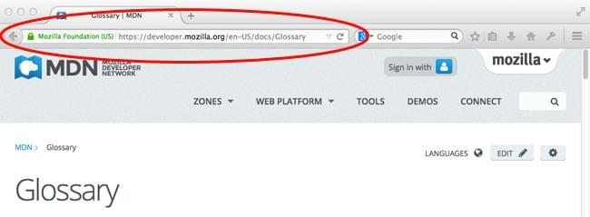

{{LearnSidebar}}

{{PreviousMenuNext("Learn_web_development/Getting_started/Environment_setup/Installing_software", "Learn_web_development/Getting_started/Environment_setup/Code_editors", "Learn_web_development/Getting_started/Environment_setup")}}

By this point in the module, you should have multiple modern web browsers installed on your computer or other available devices. This article goes deeper into using browsers, looking at how a web browser works, the difference between some of the everyday things you'll interact with, and how to search for information.

> [!NOTE]
> If you don't have any browsers installed beyond the default ones that came with your devices, install some others. See [Modern web browsers](/en-US/docs/Learn_web_development/Getting_started/Environment_setup/Installing_software#modern_web_browsers) for more information.

As with any area of knowledge, the web comes with a lot of jargon and technical terminology. Don't worry: We won't overwhelm you with all of it upfront (you can check the [glossary](/en-US/docs/Glossary) if you're curious). However, there are some basic terms you need to understand from the beginning since you'll hear these expressions all the time. We introduce some important terms below.

<table>
  <tbody>
    <tr>
      <th scope="row">Prerequisites:</th>
      <td>
        Basic familiarity with your computer operating system.
      </td>
    </tr>
    <tr>
      <th scope="row">Learning outcomes:</th>
      <td>
        <ul>
          <li>The difference between a web browser, a website, and a search engine.</li>
          <li>How a web browser works at a basic level.</li>
          <li>Searching for information.</li>
        </ul>
      </td>
    </tr>
  </tbody>
</table>

## The difference between web page, website, web server, and search engine

We will start by describing various web-related concepts: web pages, websites, web servers, and search engines. These terms are often confused by newcomers to the web or are incorrectly used. Let's make sure you know what they each mean! Let's start with some definitions:

- **Web page**
  - : A document that can be displayed in a web {{Glossary("browser")}}. These are also often called just "pages". Such documents are written in the {{Glossary("HTML")}} language (which we look at in more detail later on).
- **Website**
  - : A collection of web pages grouped together into a single resource, with links connecting them together. Often called a "site".
- **Web server**
  - : A computer that hosts a website on the Internet.
- **Search engine**
  - : A web service that helps you find other web pages, such as Google, Bing, Yahoo, or DuckDuckGo. Search engines are normally accessed through a web browser (for example, you can perform search engine searches directly in the address bar of Firefox, Chrome, etc.) or through a web page (for example, [bing.com](https://www.bing.com/) or [duckduckgo.com](https://duckduckgo.com/)).

Let's look at an analogy — a public library. This is what you would generally do when visiting a library:

1. Find a search index and look for the title of the book you want.
2. Make a note of the catalog number of the book.
3. Go to the particular section containing the book, find the right catalog number, and get the book.

Let's compare a public library with the web:

- The library is like a web server. It has several sections, which is similar to a web server hosting multiple websites.
- The different sections (science, math, history, etc.) in the library are like websites. Each section is like a unique website (two sections do not contain the same books).
- The books in each section are like web pages. One website may have several web pages, for example, the Science section (the website) will have books on heat, sound, thermodynamics, statics, etc.
- The search index is like the search engine. Each book has its own unique location in the library (two books cannot be kept at the same place) which is specified by the catalog number.

Let's now take the time to look at each term in a little bit more detail.

### Web page

A **web page** is a simple document displayable by a browser. A web page can embed a variety of different types of resources such as:

- _Style information_ — controlling a page's look-and-feel.
- _Scripts_ — which add interactivity to the page.
- _Media_ — images, sounds, and videos.

> [!NOTE]
> Browsers can also display other documents such as {{Glossary("PDF")}} files and other resources such as images or videos, but the term **web page** specifically refers to HTML documents.

All web pages can each be found at a unique location (web address, also called a [URL](/en-US/docs/Glossary/URL)). To access a page, just type its address in your browser address bar:

> [!CALLOUT]
>
> **Try it out**
>
> Try loading one of your favorite websites in a browser now.

### Website

A _website_ is a collection of linked web pages (plus their associated resources) that share a unique [domain name](/en-US/docs/Learn_web_development/Howto/Web_mechanics/What_is_a_domain_name). Each web page of a given website provides explicit links—most of the time in the form of clickable portions of text—that allow the user to move from one page of the website to another.

When you load your favorite website in a browser, it tends to first display the website's main web page, or _homepage_ (casually referred to as "home"):

> [!CALLOUT]
>
> **Try it out**
>
> Try clicking some menu items or links to look at some different pages on your favorite website.

> [!NOTE]
> It is also possible to have a [_single-page app_](/en-US/docs/Glossary/SPA): a website that consists of a single web page that is dynamically updated with new content when needed.

### Web server

A _web server_ is a computer hosting one or more _websites_. "Hosting" means that all the _web pages_ and their associated files are available on that computer. The _web server_ will send web page files it is hosting to a user's browser when they attempt to load it.

Don't confuse _websites_ and _web servers_. For example, if you hear someone say, "My website is not responding", it actually means that the _web server_ is not responding and therefore the _website_ is not available. More importantly, since a web server can host multiple websites, the term _web server_ is never used to designate a website, as it could cause great confusion. In our previous example, if we said, "My web server is not responding", it means that multiple websites on that web server are not available.

### Search engine

Search engines are a common source of confusion on the web. A search engine is a special kind of website that helps users find web pages from _other_ websites.

There are plenty out there: [Google](https://www.google.com/), [Bing](https://www.bing.com/), [Yandex](https://yandex.com/), [DuckDuckGo](https://duckduckgo.com/), and many more. Some are generic, some are specialized around certain topics.

Many beginners on the web confuse search engines and browsers. Let's make it clear: A _browser_ is a piece of software that retrieves and displays web pages; a _search engine_ is a website that helps people find web pages from other websites. The confusion arises because, the first time someone launches a browser, the browser often displays a search engine's homepage or a search box allowing them to search for a term using that search engine. Most browsers also allow their users to use a search engine by typing search terms directly into the browser address bar.

This all makes sense because the first thing people tend to want to do with a browser is find a web page to display. Don't confuse the software (the browser) with the service (the search engine).

Here is an instance of Firefox showing a Google search box as its default startup page:

> [!CALLOUT]
>
> **Try it out**
>
> Do a search in a search engine by:
>
> - Going to a search engine homepage and entering a search term.
> - Entering a search term into the browser address bar.

## How the web works: the basics

In many parts of the world, the web has become just as essential a tool to our everyday lives as cutlery, bicycles and cars, or toothbrushes. If that sounds unrealistic to you, just think about how often you use a website or mobile phone app each day! Even if you are not typing a web address into a web browser to access content or services, the chances are that the app you are making use of is probably using web technology behind the scenes to grab data to present to you.

When you access the web, quite a lot happens between your first interaction (for example, typing a web address (URL) into a browser and pressing <kbd>Enter</kbd>/<kbd>Return</kbd>) and the result of your action being presented to you (for example, the website appearing in your web browser):

1. The web browser requests the resource (for example, a web page, some data, or an image or video) you want to access from the web server it is stored on. Such requests (and the resulting responses) are made using a technology called [HTTP](/en-US/docs/Glossary/HTTP) (Hypertext Transfer Protocol), which uses a language of verbs (such as **GET**) to describe what should happen.
2. If the request is successful, the web server sends an HTTP response back to the web browser containing the requested resource.
3. In some cases, the requested resource will then fire off more HTTP requests, which will result in more responses. For example:
   1. When a website is loaded, initially the main index HTML file of the site's home page is requested.
   2. When that file is received by the browser, it will start to parse it, and will probably find instructions to make more requests. As discussed above, these might be for files to embed such as images, style information, scripts, and so on.
4. When all of the resources have been requested, the web browser parses and renders them as required, before displaying the result to the user.

This description of how the web works is heavily simplified, but it is all you really need to know at this point. You will find a more detailed account of how web pages are requested and rendered by a web browser in our [Web standards](/en-US/docs/Learn_web_development/Getting_started/Web_standards) module, slightly later on.

For now, try opening a web browser and loading up a couple of your favorite sites, thinking about the above steps as you do so.

## Searching for information

As a web developer, you will spend a lot of time searching for information, from syntax you can't remember to solutions to specific problems. It is therefore a good idea to learn how to effectively search the web.

If you are looking for general information about a specific web technology feature, you should type the name of the feature into the MDN search box. For example, try typing `box model`, `fetch()` or `video element` into the search box and see what comes up. If you don't find the information you need, try expanding your search — try your search term in a search engine.

If you are looking for a solution to a specific problem, such as `how to print out the fibonacci sequence with JavaScript` or `how to calculate whether a number is a prime number with JavaScript`, it is a good idea to search on a website such as [StackOverflow](https://stackoverflow.com), which is a community dedicated to answering programming problems. Again, try using a general search engine if a specific site doesn't give you a helpful answer.

> [!CALLOUT]
>
> **Try it out**
>
> Try some searches, as indicated above:
>
> - Begin by searching for the exact terms we've included above.
> - Next, move on to searching for some topics of your own that you'd like to learn about. Try using more and less specific searches and different related terms to see what works best.
> - See our [Search tips](#search_tips) for more things to try.

### Using AI

AI-generated search results are a very popular way of receiving information. They basically provide a superpowered search: they do a lot of searching in the background, before compiling the results into a single, easily-digestible answer. Common choices are [ChatGPT](https://chatgpt.com), [Google Gemini](https://gemini.google.com/app), and [Microsoft Copilot](https://copilot.microsoft.com), accessed either directly in a chat format, or via AI-powered in-app help or automation systems.

When learning to code, AI chat prompts can be useful in a variety of ways:

- Doing conventional searches, like the examples above.
- Figuring out bugs in a block of code. If you are getting frustrated because your code is not working, you can paste your code into an AI chat prompt, preceeded by a question such as `Where is the mistake in this code?`
- Generating an optimized version of a specific block of code. This can be useful when you've written a block of code that works, but you want to find out how it could be done more efficiently, or in a more robust way that solves more use cases.
- Providing advice on how to do something. For example, if you don't just want to know where the bug is in a block of code, but instead you want advice on what strategy to use to debug it.

> [!CALLOUT]
>
> **Try it out**
>
> Try using a couple of AI tools to do some searches.

### A cautionary tale

In truth, AI can do so much that you may start to wonder why you need to learn to code.

But wait! The following is important: **You still need to understand what you are trying to do at a high level, what the code is doing, and where each piece of code needs to be used**. If you don't, you won't be very useful when trying to solve real-world problems. This means that you still need to learn to code. AI can be a really useful tool to help you find answers more quickly, but if you just type every question you are asked into an AI prompt, you won't understand how anything works.

In addition:

- AI tools present their answers in a confident, authoritative voice, but they can often be misleading or just plain wrong. Some of the errors they make can be very subtle. They don't have any innate intelligence of their own — they are basically advanced pattern matching tools. AI tools compile their answers from other sources out there, so will hoover up wrong information as well as correct information. Even two correct sources can be combined to create an answer that is incorrect.
- Newer information may not be available, or answers may be skewed to older and more prevalent documentation, so "how to do X in JS" might give you outdated guidance.

As a result, you need to be careful to check the answers they give you, and not just trust everything without question.

**When you are learning, spend time trying to solve the problem yourself before searching for an answer, whether you are using AI or a conventional search engine. It will make you a better developer.**

### Search tips

- You should include the language you are using in the search term, as shown in the examples above. If you just typed in `how to print out the fibonacci sequence`, you would likely end up with several solutions in Python, C++, Java, Ruby, or other languages — not quite as helpful when you are trying to learn JavaScript!
- When you find a useful answer, bookmark or make a copy of it somewhere so you can find it again later. You'll be amazed how many times you run into the same problem.
- If your code is returning a specific error message, try entering the error into a search engine or AI prompt. Other people will probably have already tackled the same error in the past and recorded solutions publicly somewhere.
- If possible, stick with recommended sites like MDN and [StackOverflow](https://stackoverflow.com).
- There are many advanced search techniques you can use in search engines that will give you better results than just typing a plain search term. Typing in a plain search term such as `ant fish cheese` will return results that contain any combination of those words. However, most search engines support variations of the following formats:

  - Typing in `"ant fish cheese"` (with the quotes) will only return results that contain that exact phrase.
  - `"ant cheese" -fish` will return results that contain `ant` and/or `cheese` but not `fish`.
  - `ant OR cheese` will only return results with one term or the other, not both. From our testing, this one only seemed to work effectively in Google.
  - `intitle:cheese` will only return results that have "cheese" in the main title of the page.

  > [!NOTE]
  > There are many other techniques you can use in various different search engines. Try seeing what others you can find — some useful resources are [Refine Google Searches](https://support.google.com/websearch/answer/2466433?hl=en), [How to use advanced syntax on DuckDuckGo Search](https://duckduckgo.com/duckduckgo-help-pages/results/syntax/), and [Microsoft: Advanced search options](https://support.microsoft.com/en-us/topic/advanced-search-options-b92e25f1-0085-4271-bdf9-14aaea720930).

{{PreviousMenuNext("Learn_web_development/Getting_started/Environment_setup/Installing_software", "Learn_web_development/Getting_started/Environment_setup/Code_editors", "Learn_web_development/Getting_started/Environment_setup")}}
