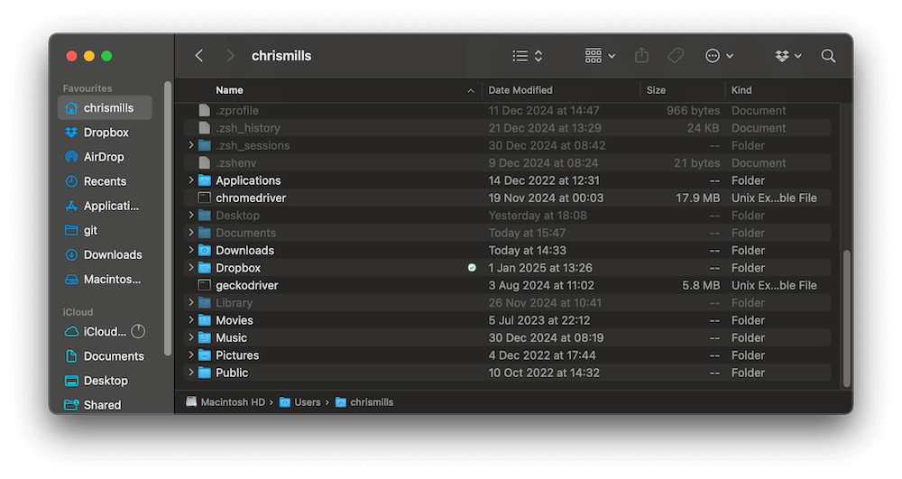
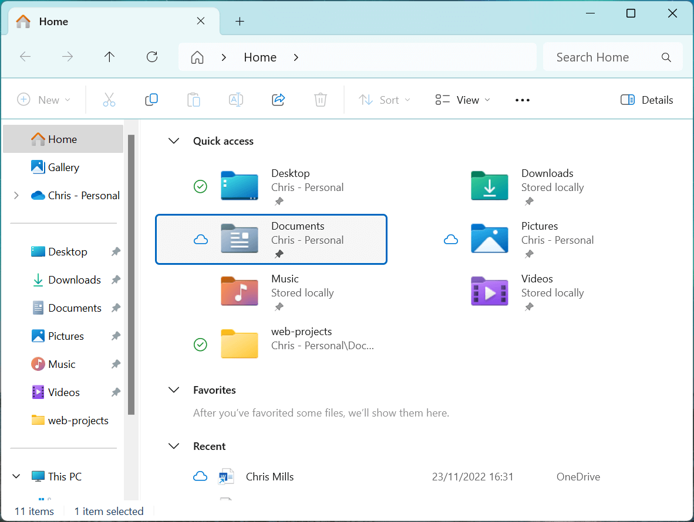
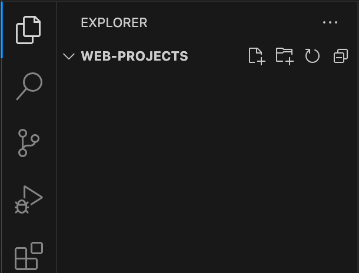

{{LearnSidebar}}

{{PreviousMenuNext("Learn_web_development/Getting_started/Environment_setup/Code_editors", "Learn_web_development/Getting_started/Environment_setup/Command_line", "Learn_web_development/Getting_started/Environment_setup")}}

A website consists of many files: text content, code, stylesheets, media content, and so on. When you're building a website, you need to assemble these files into a sensible structure on your local computer, make sure they can talk to one another, and get all your content looking right before eventually putting them on a server for the world to see. This article explains how to use your computer's file explorer user interface (UI) and set up a sensible file structure for a website.

<table>
  <tbody>
    <tr>
      <th scope="row">Prerequisites:</th>
      <td>
        Basic familiarity with your computer operating system (OS) and the basic software you will use to build a website.
      </td>
    </tr>
    <tr>
      <th scope="row">Learning outcomes:</th>
      <td>
        <ul>
          <li>Manipulating files and folders.</li>
          <li>Naming best practices.</li>
          <li>Standard website folder structure.</li>
          <li>Handling file paths</li>
          <li>Dealing with file extensions.</li>
        </ul>
      </td>
    </tr>
  </tbody>
</table>

## Manipulating files and folders

There are many different ways to create and edit the files and folders contained on your computer. You can do it via your computer's command line/terminal using a series of text commands, which you'll learn more about in the next article. However, many people find it easier to start learning about file systems visually, which is what we'll discuss here. Modern operating systems (OSes) have a robust file system user interface (UI) that you can use to manipulate files and folders as needed.

On macOS for example, you have the Finder program:



Whereas Windows has the File Explorer:



> [!NOTE]
> This guide was written using Windows 11 and macOS 15. You may be using a different OS version, or a different OS altogether, in which case the experience may differ slightly. There are plenty of guides on the web on basic OS usage — we encourage you to search the web for information on your particular OS.

### Basic structure

Most modern operating systems have a `Users` folder, which contains a folder for each user account that exists on the system, also known as the user's _Home_ folder. This is usually represented by a house icon to make it easier to find. In turn, the _Home_ folder will contain other important standard folders (and files) relevant to that user in particular, such as _Documents_, _Music_, etc. There are a lot of other files and folders on your computer as well, but don't worry about those for now.

The currently-logged-in user will by default only be able to access their own _Home_ folder.

You should create project files relating to your work somewhere inside in your _Home_ folder, perhaps inside _Documents_. This makes sense, as web page files are often referred to as _documents_.

> [!WARNING]
> If you start creating and editing files in other places on your system (for example, areas that control the operating system or important applications), you might break something. For the moment, stick to creating and editing files inside your _Home_ folder.

### Creating a folder

Let's create a new folder to store all of our web projects.

1. In your file system UI, click on your _Home_ folder, then double-click your _Documents_ folder.
2. Create a new folder in this location called `web-projects`:
   1. On Windows, this can be done by selecting the _New_ button in the File Explorer window and selecting _Folder_ (or pressing <kbd>Ctrl</kbd> + <kbd>Shift</kbd> + <kbd>N</kbd>), typing in `web-projects` as the name of the new folder icon that appears, and pressing <kbd>Enter</kbd>/<kbd>Return</kbd>.
   2. On macOS, this can be done by selecting _File_ > _New Folder_ on the Finder menu (or pressing <kbd>Cmd</kbd> + <kbd>Shift</kbd> + <kbd>N</kbd>) — you'll see a new folder appear called _untitled folder_. Click on the folder name to start editing it, type in `web-projects`, and press <kbd>Enter</kbd>/<kbd>Return</kbd>.

If you make a typo, you can edit the folder name to correct it (this also works with files):

- On Windows, right-click the folder, select _Rename_ from the menu, then edit it. Some Windows versions have a simplified menu that shows initially — you might have to right-click, then select _Show more options_, then select _Rename_!
- On macOS, click on/select the folder name to edit it.

### Opening a project folder and creating files in VS Code

While you can create text files inside the OS file system UI, it is generally easier and less error-prone to create them inside your code editor. In fact, VS Code has its own file explorer that allows you to create all the folders and files you need for your web projects.

So why did we put you through the trouble of creating a folder using the OS file system UI? Because VS Code needs to be pointed to an initial top-level folder!

It is also useful to understand a little bit of how your OS file system is structured. This will become more useful as you start to use more complex tools later on.

Let's open our `web-projects` folder in VS Code now:

1. Open VS Code.
2. Select _File_ > _Open Folder..._ from the menu.
   > [!NOTE]
   > If you are a keyboard user, you can run the _Open Folder_ command in Windows by holding down the <kbd>Ctrl</kbd> key and pressing <kbd>K</kbd> then <kbd>O</kbd>. The easiest way for a macOS user to do this is to open the _Command Palette_ with <kbd>Cmd</kbd> + <kbd>Shift</kbd> + <kbd>P</kbd>, type in "Open Folder" to filter the command list, use the cursor keys to move down to _File: Open Folder_, then press <kbd>Enter</kbd>.
3. A mini-version of the OS file system UI will appear. Use it to find your `web-projects` folder, select it, then press the _Select Folder_ button.
4. You will be presented with a dialog box entitled _Do you trust the authors of the files in this folder?_ Read this carefully to understand what it is about. At the moment, you are the only person who will be creating files in this folder, so you can click _Yes, I trust the authors_.

You should see your `web-projects` folder open in the VS Code _EXPLORER_ pane, as shown below:



> [!WARNING]
> Again, make sure you stick to editing your own files inside your _Home_ folder for now, to avoid causing any problems with your system.

#### An aside on keyboard navigation in VS Code

VS Code, while not perfect by any means, has an extensive set of keyboard shortcuts. Throughout this article we've tried to include useful ones where possible, but you can find more comprehensive lists at the VS Code [Keyboard Shortcuts Reference](https://code.visualstudio.com/docs/getstarted/keybindings#_keyboard-shortcuts-reference).

In general, if you want to navigate VS Code via the keyboard, you can press the <kbd>Tab</kbd> key to move around different areas of the UI (<kbd>Shift</kbd> + <kbd>Tab</kbd> will move you to a previous tab focus position). If there are multiple buttons in a tab focus position, you can use the cursor keys to move between them.

If you are currently editing a file, the tab key won't navigate around the UI — it will add tab characters into the file. To move out of the file you are editing over to the _EXPLORER_ pane, you can press <kbd>Cmd</kbd> + <kbd>Shift</kbd> + <kbd>E</kbd> on macOS, or <kbd>Ctrl</kbd> + <kbd>Shift</kbd> + <kbd>E</kbd> on Windows.

To move back to the file editor pane and start moving between the different files open in different tabs, hold down the <kbd>Ctrl</kbd> key and use <kbd>Tab</kbd> and <kbd>Shift</kbd> + <kbd>Tab</kbd> to move up and down the list of open tabs (on both macOS and Windows). Once you've highlighted the file you want to edit, release the keys to move to that tab.

#### Creating a file

From here, you can create new files and folders using the relevant buttons at the top of the _EXPLORER_ pane.

1. Create a new file by clicking the _New File..._ icon (or <kbd>Tab</kbd> to it and press <kbd>Enter</kbd>/<kbd>Return</kbd>).
2. Enter the file name as "index.html" in the text entry box that appears, and press <kbd>Enter</kbd>/<kbd>Return</kbd>.

> [!NOTE]
> Don't use the buttons at the top of the _Welcome_ tab to create files and folders, as they work a bit differently. In fact, you can close the _Welcome_ tab, as you don't need it. Do this by clicking the "x" at the right-hand-side of the tab, or by pressing <kbd>Cmd</kbd> + <kbd>W</kbd> on macOS (<kbd>Ctrl</kbd> + <kbd>W</kbd> on Windows).

At this point, go back to your OS file system UI, go into your `web-projects` folder by double-clicking it, and you should see your `index.html` file there as well. VS Code is using the underlying OS file system, not using some weird file system of its own.

### Moving index.html to its own sub-folder

You can create folders inside other folders (called _sub-folders_) as many levels deep as you want. You can also move files (and folders) inside other folders by dragging and dropping them on top of that folder.

Let's explore this, and in the process, move our `index.html` file inside its own sub-folder. We don't really want it sat inside the main `web-projects` folder.

1. Create a new folder inside `web-projects`, using the VS Code _EXPLORER_ pane's _New Folder..._ button.
2. Name it `test-site`.
3. You should now be able to drag the `index.html` file and drop it on top of the `test-site` folder to move the file inside the folder.
   > [!NOTE]
   > If you are a keyboard user, you can do this by following these steps:
   >
   > 1. Use the up and down arrow keys to move the focus outline over the `index.html` file.
   > 2. Press <kbd>Cmd</kbd> + <kbd>X</kbd> on macOS (<kbd>Ctrl</kbd> + <kbd>X</kbd> on Windows) to select the file for moving.
   > 3. Use the arrow keys to move the focus outline over the folder.
   > 4. Press <kbd>Cmd</kbd> + <kbd>V</kbd> on macOS (<kbd>Ctrl</kbd> + <kbd>V</kbd> on Windows) to move the file into that folder.

There is way more we could include about using OS file system UIs and VS Code, but we have limited space, so we'll leave it there for now. This has given you enough information to get started, and we encourage you to search the web for information on how to do other things with files and folders.

Let's move on to a brief discussion of website structure.

## What structure should a website have?

When you are working on websites locally (on your computer), you should keep all the related files for each site in a single folder. In turn, you should keep all your website folders in one central folder, so they are all easy to find.

Earlier in the article, we instructed you to create a central folder called `web-projects` to store all your website projects. We also got you to create a subfolder called `test-site` with an empty `index.html` file inside it.

Let's add some more features inside `test-site` to demonstrate a typical website structure; in the next module, we'll get you to build up a complete website example inside it. The most common things any website project will contain are an index HTML file and folders to contain images, style files, and script files:

1. **`index.html`**: This file will generally contain your homepage content, that is, the text and images that people see when they first go to your site.
2. **`images` folder**: This folder will contain all the images that you use on your site.
3. **`styles` folder**: This folder will contain the CSS code used to style your content (for example, setting text and background colors).
4. **`scripts` folder**: This folder will contain all the JavaScript code used to add interactive functionality to your site (for example, defining what happens when buttons are clicked).

> [!CALLOUT]
>
> **Try it out**
>
> You should already have an `index.html` file inside `test-site`. Create the `images`, `styles`, and `scripts` folders inside it now.

## File names

There are generally two parts to a file name — the **name** and the **extension**. Take the file we created above — `index.html`:

- The name in this case is `index`. File names can generally contain whatever characters you like, although different computer systems will have various restrictions on the characters that can be used. It is better to stick to numbers and letters, at least to begin with. In addition, systems may give special meaning to certain names or parts of names — as we've already said, `index` files tend to be recognized as the main homepage file of a website.
- The file extension identifies the type of file we are dealing with, and is used by computer systems to identify what kind of content it can expect in the file, which program it should use to open the file, etc. in this case, the extension is `.html`, which means the file should contain plain text, and more specifically, HTML code. Because of the extension, your computer knows that when you try to open the file it should open it using your default text editor, which should be VS Code if you followed all our instructions up to now.

It is not true in all cases, but most files need an extension to be handled properly. Removing or changing the file extension is likely to cause errors, so you shouldn't alter it unless you really know what you are doing.

> [!NOTE]
> It is possible to put more than one dot in a file name, for example `my.cats.html`. In such cases, the last dot is assumed to be the start of the file extension.

On Windows computers, you might have trouble seeing the extensions of some files, because Windows has an option called **Hide extensions for known file types** turned on by default. You can turn this off by going to File Explorer, selecting the **Folder options…** option, unchecking the **Hide extensions for known file types** check box, then clicking **OK**. For more specific information covering your version of Windows, you can search on the web.

### Best practices for naming files

As you follow this course, you'll notice that we always ask you to name folders and files completely in lowercase with no spaces. There are many ways in which using spaces in file and folder names creates issues — some of the more common ones are as follows:

1. Many computer systems, including most web servers, are case-sensitive. So for example, if you put an image on your website at `test-site/images/MyImage.jpg` and then in a different file you try to reference the image with `test-site/images/myimage.jpg`, it may not work.
2. When you invoke commands on the command line, you have to put quotes around file names with spaces in them, otherwise they will be interpreted as two separate items.
3. Some programming languages (for example, Python) do not work well with spaces in file names in certain circumstances (for example, if these files are modules to be imported).
4. File names commonly map to web addresses/URLs. If you, for example, have a file called `my file.html` in your server's root folder, generally it will be accessible at a URL like `https://example.com/my%20file.html`. Web servers usually replace the spaces in filenames with `%20` (because URLs are {{Glossary("Percent-encoding", "percent-encoded")}}), which can create subtle bugs with some systems if they assume that file names and URLs match perfectly.

Instead of spaces, many developers use a separator character such as a hyphen (`-`) rather than a space — for example `my-file.html` rather than `my file.html`. This is a good practice.

It is best to get into the habit of writing your folder and file names in lowercase with no spaces and with words separated by hyphens, at least until you know what you're doing. That way, you'll encounter fewer problems further down the road.

> [!NOTE]
> You can find more best practices for file names and URLs in [URL structure best practices for Google](https://developers.google.com/search/docs/crawling-indexing/url-structure).

## File paths

To reference one file from another, you have to provide a file path — basically a route, so one file knows where another one is. For example, when creating a web page containing an image, your web page code will need to contain a file path indicating the location of the image you want to display.

Let's work through a basic example of this. You might not understand what this all means for now, but that's fine.

1. Search the web for an image you like (for example, using a service like [Google Images](https://www.google.com/imghp)) and download it. Alternatively, you can just grab our [Firefox icon image](https://raw.githubusercontent.com/mdn/beginner-html-site/refs/heads/main/images/firefox-icon.png) to use for this example.
2. Put the image inside your _images_ folder.
3. Make sure the image file is called something short and simple, with no spaces in it. For example, `firefox-icon.png` is good, and `cat.jpg` is good, but `efregre^%^£$£@%$^&YTJgfbgfdgt54656756_ertgrth-rtgtfghhyj.png` is not good. Also make sure that you preserve the file extension.

Now we'll add content to the `index.html` file to allow it to locate the image file and display it.

1. Open your `index.html` in VS Code, and insert the following content into the file exactly as shown below. This is HTML, the language we use to define and structure web page content. You'll learn a lot more about this very soon!

   ```html
   <!doctype html>
   <html lang="en-US">
     <head>
       <meta charset="utf-8" />
       <meta name="viewport" content="width=device-width" />
       <title>My test page</title>
     </head>
     <body>
       
     </body>
   </html>
   ```

2. The line `` is the HTML code that inserts an image into the page. We need to tell the HTML where the image is. The image is inside the _images_ folder, which is in the same folder as `index.html`. To walk down the file structure from `index.html` to our image, the file path we'd need is `images/your-image-filename`. For example, if your image was called `firefox-icon.png`, the file path would be `images/firefox-icon.png`.
3. Insert the file path into your HTML code between the double quote marks of `src=""`.
4. Save your HTML file, then load it in your web browser. You can do this by <kbd>Ctrl</kbd>/right-clicking the HTML file, then choosing _Open With_ and selecting a web browser from the resulting sub-menu. You could also open your file system UI and a web browser window on the same screen, and drag and drop the HTML file over the top of the web browser window.

You should see a basic webpage displaying your image!


### General rules for file paths

- To link to a target file in the same folder as the invoking HTML file, just use the filename, for example `my-image.jpg`.
- To reference a file in a sub-folder, write the folder name in front of the path, plus a forward slash, for example `subfolder/my-image.jpg`.
- To link to a target file in the folder **above** the invoking HTML file, write two dots. So for example, if `index.html` was inside a subfolder of `test-site` and `my-image.jpg` was inside `test-site`, you could reference `my-image.jpg` from `index.html` using `../my-image.jpg`.
- You can combine these as much as you like, for example `../subfolder/another-subfolder/my-image.jpg`.

> [!NOTE]
> The Windows file system tends to use backslashes, not forward slashes, e.g. `C:\Windows`. This doesn't matter in HTML — even if you are developing your website on Windows, you should still use forward slashes in your code.

{{PreviousMenuNext("Learn_web_development/Getting_started/Environment_setup/Code_editors", "Learn_web_development/Getting_started/Environment_setup/Command_line", "Learn_web_development/Getting_started/Environment_setup")}}
