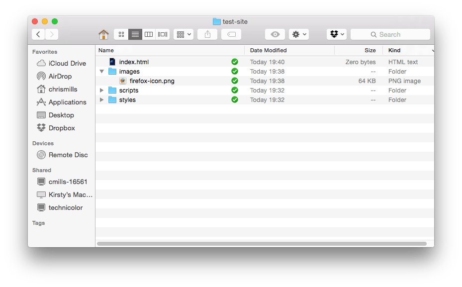

{{LearnSidebar}}

{{PreviousMenuNext("Learn_web_development/Getting_started/Environment_setup/Code_editors", "Learn_web_development/Getting_started/Environment_setup/Command_line", "Learn_web_development/Getting_started/Environment_setup")}}

A website consists of many files: text content, code, stylesheets, media content, and so on. When you're building a website, you need to assemble these files into a sensible structure on your local computer, make sure they can talk to one another, and get all your content looking right before you eventually [upload them to a server](/en-US/docs/Learn_web_development/Getting_started/Your_first_website/Publishing_your_website). This article discusses some issues you should be aware of with file systems so you can set up a sensible file structure for your website.

<table>
  <tbody>
    <tr>
      <th scope="row">Prerequisites:</th>
      <td>
        Basic familiarity with your computer operating system and the basic software you will use to build a website.
      </td>
    </tr>
    <tr>
      <th scope="row">Learning outcomes:</th>
      <td>
        <ul>
          <li>Basic explorer/finder usage.</li>
          <li>Standard folder structure.</li>
          <li>File naming best practices for the web — no spaces, lowercase, choosing a reasonable separator like a hyphen or underscore.</li>
          <li>Basic file organization best practices.</li>
          <li>Creating, moving, and deleting files and folders using Explorer/Finder.</li>
          <li>Searching for files and folders.</li>
          <li>Dealing with file extensions (e.g. turning off "Hide extensions for known file types" in Windows, showing dot files (.env, etc.)).</li>
          <li>Learning how file types are associated with applications.</li>
        </ul>
      </td>
    </tr>
  </tbody>
</table>

## Where should your website live on your computer?

When you are working on a website locally on your computer, you should keep all the related files in a single folder that mirrors the published website's file structure on the server. This folder can live anywhere you like, but you should put it somewhere where you can easily find it, maybe on your Desktop, in your Home folder, or at the root of your hard drive.

In general, you should:

1. Choose a place to store your projects. This is where all your website projects will live.
2. Inside this first folder, create other folders to store each project in. For example, you could call your first project `test-site` (or something more imaginative).

Choose a place now to store you projects. Inside your chosen place, create a new folder called `web-projects`.

## An aside on casing and spacing

You'll notice that throughout MDN, we ask you to name folders and files completely in lowercase with no spaces. This is because:

1. Many computers, particularly web servers, are case-sensitive. So for example, if you put an image on your website at `test-site/MyImage.jpg` and then in a different file you try to reference the image with `test-site/myimage.jpg`, it may not work.
2. There are many ways in which using spaces in file names creates issues:
   - When you invoke commands in the commend line, you have to put quotes around file names with spaces in them, or the path will be interpreted as two separate items.
   - Some programming languages (for example, Python) do not work well with spaces in file names in certain circumstances (for example, if these files are modules to be imported).

File names also map to URLs. For example, if you have a file called `my_file.html` at the root of your server-served directory, generally it will be accessible at `https://example.com/my_file.html` by most web servers' default behavior. Some servers will replace the spaces in your filenames with "%20" (the character code for spaces in URLs), which can create subtle bugs with some server-side logic if they assume that file names and URLs match perfectly.

Instead of spaces, many developers use a separator character such as a hyphen (`-`) or underscore (`_`). It's advisable to separate words with hyphens rather than underscores: `my-file.html` vs. `my_file.html`. The [Google search engine treats a hyphen as a word separator but does not regard an underscore that way](https://developers.google.com/search/docs/crawling-indexing/url-structure). This can be remedied by configuring your server to replace underscores with hyphens, but that's extra work and more bug-prone with diverging file names and URLs.

It is best to get into the habit of writing your folder and file names in lowercase with no spaces and with words separated by hyphens, at least until you know what you're doing. That way, you'll encounter fewer problems down the road.

## What structure should a website have?

Next, let's look at what structures websites generally have. The most common things we'll have on any website project we create are an index HTML file and folders to contain images, style files, and script files:

1. **`index.html`**: This file will generally contain your homepage content, that is, the text and images that people see when they first go to your site.
2. **`images` folder**: This folder will contain all the images that you use on your site.
3. **`styles` folder**: This folder will contain the CSS code used to style your content (for example, setting text and background colors).
4. **`scripts` folder**: This folder will contain all the JavaScript code used to add interactive functionality to your site (e.g. buttons that load data when clicked).



> [!NOTE]
> On Windows computers, you might have trouble seeing the file names, because Windows has an option called **Hide extensions for known file types** turned on by default. Generally, you can turn this off by going to Windows Explorer, selecting the **Folder options…** option, unchecking the **Hide extensions for known file types** check box, then clicking **OK**. For more specific information covering your version of Windows, you can search on the web.

## File paths

To reference one file from another, you have to provide a file path — basically a route, so one file knows where another one is. For example, when creating a web page containing an image, your web page code will need to contain a file path indicating the location of the image you want to display. Let's create a basic example of this. You might not understand what this all means for now, but that's fine.

1. Inside your `web-projects` folder, create a new folder called `path-example`.
2. Go to [Google Images](https://www.google.com/imghp), choose an image you like, and download it.
3. Inside your `path-example` folder, create a new folder called `images`. Put your downloaded image inside this folder.
4. Create a new file called `index.html`, and insert the following code into the file exactly as shown:

   ```html
   <!doctype html>
   <html lang="en-US">
     <head>
       <meta charset="utf-8" />
       <meta name="viewport" content="width=device-width" />
       <title>My test page</title>
     </head>
     <body>
       
     </body>
   </html>
   ```

5. The line `` is the HTML code that inserts an image into the page. We need to tell the HTML where the image is. The image is inside the _images_ directory, which is in the same directory as `index.html`. To walk down the file structure from `index.html` to our image, the file path we'd need is `images/your-image-filename`. For example, if our image was called `firefox-icon.png`, the file path would be `images/firefox-icon.png`.
6. Insert the file path into your HTML code between the double quote marks of the `src=""` code.
7. Save your HTML file, then load it in your web browser (for example, by double-clicking the file). You should see your new webpage displaying your image!


Some general rules for file paths:

- To link to a target file in the same directory as the invoking HTML file, just use the filename, e.g. `my-image.jpg`.
- To reference a file in a subdirectory, write the directory name in front of the path, plus a forward slash, e.g. `subdirectory/my-image.jpg`.
- To link to a target file in the directory **above** the invoking HTML file, write two dots. So for example, if `index.html` was inside a subfolder of `test-site` and `my-image.jpg` was inside `test-site`, you could reference `my-image.jpg` from `index.html` using `../my-image.jpg`.
- You can combine these as much as you like, for example `../subdirectory/another-subdirectory/my-image.jpg`.

> [!NOTE]
> The Windows file system tends to use backslashes, not forward slashes, e.g. `C:\Windows`. This doesn't matter in HTML — even if you are developing your website on Windows, you should still use forward slashes in your code.

For now, this is about all you need to know.

{{PreviousMenuNext("Learn_web_development/Getting_started/Environment_setup/Code_editors", "Learn_web_development/Getting_started/Environment_setup/Command_line", "Learn_web_development/Getting_started/Environment_setup")}}
