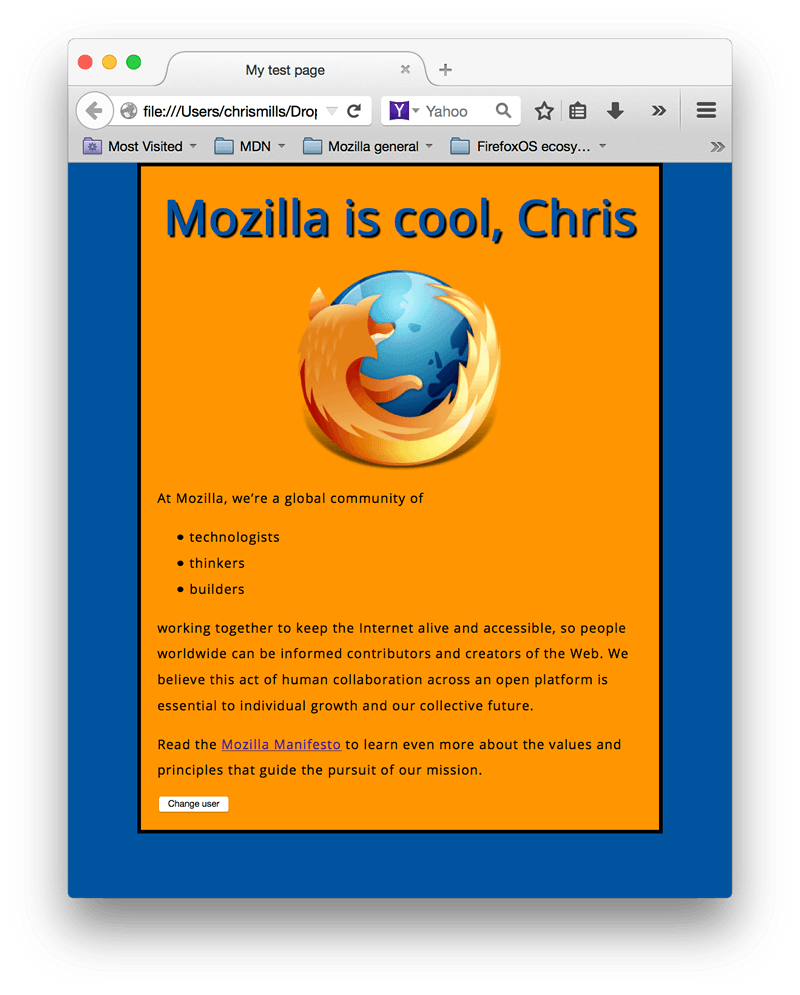

{{PreviousMenuNext("Learn_web_development/Getting_started/Your_first_website/Styling_the_content", "Learn_web_development/Getting_started/Your_first_website/Publishing_your_website", "Learn_web_development/Getting_started/Your_first_website")}}

JavaScript is a programming language that adds interactivity to websites. You can use it to control just about anything — form data validation, button functionality, game logic, dynamic styling, animation updates, and much more. This article gets you started with JavaScript and walks you through adding some fun features to your first website.

<table>
  <tbody>
    <tr>
      <th scope="row">Prerequisites:</th>
      <td>
        Basic familiarity with your computer operating system, the basic software you will use to build a website, and file systems.
      </td>
    </tr>
    <tr>
      <th scope="row">Learning outcomes:</th>
      <td>
        <ul>
          <li>The purpose and function of JavaScript.</li>
          <li>A basic understanding of JavaScript language fundamentals such as variables, operators, conditionals, functions, and events.</li>
        </ul>
      </td>
    </tr>
  </tbody>
</table>

## What is JavaScript?

{{Glossary("JavaScript")}} is a full-fledged programming language — it contains all the classic programming features you may have seen in other programming languages (or at least heard about), such as **variables**, **loops**, and **functions**.

JavaScript, when used on web pages (though it can also be used in other places), generally works by:

- Getting references to one or more values such as numbers or to elements on the page.
- Doing something with those values, such as adding the numbers together.
- Returning a result that can be used to do something else later on. For example, you might want to display the sum of those numbers on the page.

Let's look at an example. We'll use the same basic list we saw in the last couple of articles:

```html live-sample___basic-js
<p>Instructions for life:</p>

<ul>
  <li>Eat</li>
  <li>Sleep</li>
  <li>Repeat</li>
</ul>
```

We'll also define a CSS class that styles the element it is applied to to look like it is done, with a green text color and a strikethrough:

```css live-sample___basic-js
.done {
  color: darkseagreen;
  text-decoration: line-through solid black 2px;
}
```

Now on to the JavaScript. Here, we first store a reference to the `<li>` elements inside a variable called `listItems`. We then define a function called `toggleDone()` that adds a `class` of `done` to an element if it desn't have a class, and removes its class if it already has one. Finally, we loop through the list items (using `forEach()`) and add an event listener to each one so that when the list items are clicked, the `done` class is applied to them, which sets the CSS declared above on them.

```js live-sample___basic-js
const listItems = document.querySelectorAll("li");

function toggleDone(e) {
  if (!e.target.className) {
    e.target.className = "done";
  } else {
    e.target.className = "";
  }
}

listItems.forEach((item) => {
  item.addEventListener("click", toggleDone);
});
```

This example will render as follows in a web browser:

{{EmbedLiveSample("basic-js", "100%", "140px")}}

Try clicking the list items a few times and note how the "done" styles are toggled on and off as a result. Not that bad for 11 lines of JavaScript.

Don't worry if you don't understand the above JavaScript now. Getting comfortable with JavaScript is more challenging than getting comfortable with HTML and CSS, but things will become clearer later on in the course.

## A "Hello world!" walkthrough

To start you off with writing some JavaScript, we'll walk you through adding a _Hello world!_ example to your sample website. ([_Hello world!_](https://en.wikipedia.org/wiki/%22Hello,_World!%22_program) is the standard introductory programming example.)

> [!WARNING]
> If you haven't been following along with the rest of our course, [download this example code](https://codeload.github.com/mdn/beginner-html-site-styled/zip/refs/heads/gh-pages) and use it as a starting point.

1. Inside your `first-website` folder or the example folder you have just downloaded, create a new folder named `scripts`.
2. Within the `scripts` folder, create a new text document called `main.js`, and save it.
3. Go to your `index.html` file and enter this code on a new line, just before the closing `</head>` tag:

   ```html
   <script async src="scripts/main.js"></script>
   ```

   This does the same job as the {{htmlelement("link")}} element for CSS – it applies the JavaScript to the page so it can affect the HTML (along with the CSS and anything else on the page).

4. Add this code to your `scripts/main.js` file:

   ```js
   // Store a reference to the <h1> in a variable
   const myHeading = document.querySelector("h1");
   // Update the text content of the <h1>
   myHeading.textContent = "Hello world!";
   ```

5. Make sure the HTML and JavaScript files are saved, then load `index.html` in your browser. You should see something like this:


Let's break down how this example works.

We have used JavaScript to change the heading text to _Hello world!_. We grabbed a reference to the heading and stored it in a variable called `myHeading` (a container that stores a value). This is similar to what we did using CSS selectors. When you want to do something to an element, you need to select it first.

Following that, we set the value of the `myHeading` variable's text content to _Hello world!_.

> [!NOTE]
> The lines that start with `//` are JavaScript comments. In the same way as HTML and CSS comments, the browser ignores these, providing a way for you to add notes about your code to help explain how it works.

## Supercharging our example website

Let's move on and add some new features to our example site.

Before going any further, delete the "Hello world!" code from your `main.js` file. If you don't, the existing code will clash with the new code you are about to add.

## Adding an image changer

In this section, you will use JavaScript and [DOM API](/en-US/docs/Web/API/HTML_DOM_API) features to alternate the display between two images. This change will happen when a user clicks the displayed image.

1. Choose another image to feature on your example site. Ideally, the image should be the same size as the one you added previously, or as close as possible.
2. Save this image in your `images` folder.
3. Add the following JavaScript code to your `main.js` file, making sure to replace `firefox2.png` and both instances of `firefox-icon.png` with your second and first image names, respectively.

   ```js
   const myImage = document.querySelector("img");

   myImage.addEventListener("click", () => {
     const mySrc = myImage.getAttribute("src");
     if (mySrc === "images/firefox-icon.png") {
       myImage.setAttribute("src", "images/firefox2.png");
     } else {
       myImage.setAttribute("src", "images/firefox-icon.png");
     }
   });
   ```

4. Save all files and load `index.html` in the browser. Now when you click the image, it should change to the other one.

In this code, you stored a reference to your {{htmlelement("img")}} element in the `myImage` variable. Then you assigned it a `click` event handler function. Every time the `` is clicked, the function does the following:

1. Retrieves the value of the image's `src` attribute.
2. Uses a conditional (`if ... else` structure) to check if the `src` value is equal to the path of the original image:

   1. If it is, the code changes the `src` value to the path of the second image, forcing the other image to be loaded inside the {{htmlelement("img")}} element.
   2. If it isn't (meaning it must already have changed), the `src` value swaps back to the original image path.

> [!NOTE]
> This section contains several items of important terminology. The key terms are:
>
> - [API](/en-US/docs/Glossary/API): A set of functionality that allows a developer to interact with a programming environment. WebAPIs (such as the DOM API features we used above) are built on top of the JavaScript language and allow you to manipulate various parts of the browser.
> - [Events](/en-US/docs/Learn_web_development/Core/Scripting/Events): Real interactivity on a website requires events — things that happen in the browser. You can run code in response to events using **event handler functions**, code structures that run code in response to an event happening. The most obvious example is the [click event](/en-US/docs/Web/API/Element/click_event), which is fired by the browser when you click on something with your mouse.
> - [Functions](/en-US/docs/Learn_web_development/Core/Scripting/Functions): A way of packaging code that you wish to reuse. You can define your code inside a function and execute it when you call the function name in your code, avoiding having to repeatedly write the same code over and over again.
> - [Conditionals](/en-US/docs/Learn_web_development/Core/Scripting/Conditionals): Code structures used to test if an expression returns `true` or `false` and run different code in response to each result. A very common form of conditionals is the `if...else` statement.

## Adding a personalized welcome message

Next, let's change the page heading to a personalized welcome message when the user first visits the site. This welcome message will be saved in the browser via the [Web Storage API](/en-US/docs/Web/API/Web_Storage_API), meaning that if the user leaves the site and returns later, their personalized data will still be there. We will also include the ability to change the message.

1. In `index.html`, add the following line just before the closing `</body>` tag:

   ```html
   <button>Change user</button>
   ```

2. In `main.js`, place the following code at the bottom of the file, exactly as it is written. This creates references to the new button and the heading, storing each inside variables:

   ```js
   let myButton = document.querySelector("button");
   let myHeading = document.querySelector("h1");
   ```

3. Add the following function to set the personalized greeting. This won't do anything yet; we will call the function later on.

   ```js
   function setUserName() {
     const myName = prompt("Please enter your name.");
     localStorage.setItem("name", myName);
     myHeading.textContent = `Mozilla is cool, ${myName}`;
   }
   ```

   The `setUserName()` function contains a [`prompt()`](/en-US/docs/Web/API/Window/prompt) function, which displays a dialog box, similar to `alert()`. This `prompt()` function does more than `alert()`, asking the user to enter data, and storing it in a variable after the user clicks _OK_. In this case, we are asking the user to enter a name. Next, the code calls on the `localStorage` API, which allows us to store data in the browser and retrieve it later. We use the {{domxref("Storage.setItem", "localStorage.setItem()")}} function to create and store a data item called `"name"`, setting its value to the `myName` variable, which contains the user's entry for the name. Finally, we set the `textContent` of the heading to a string with the user's newly-stored name added to the end of it.

4. Add the following condition block after the function declaration. This is our _initialization code_: it runs the functionality when the page first loads:

   ```js
   if (!localStorage.getItem("name")) {
     setUserName();
   } else {
     const storedName = localStorage.getItem("name");
     myHeading.textContent = `Mozilla is cool, ${storedName}`;
   }
   ```

   The first line of this block uses the negation operator (logical NOT, represented by the `!` character) to check whether the `name` data item is _not_ already stored in `localStorage`. If not, the `setUserName()` function runs to create it. If it exists (that is, the user set a username during a previous visit), we retrieve the stored name using {{domxref("Storage.getItem", "localStorage.getItem()")}} and set the `textContent` of the heading to a string, plus the user's name, as we did inside `setUserName()`.

5. Add a `click` event handler function to the button. When clicked, `setUserName()` runs. This allows the user to store a different name if wished.

   ```js
   myButton.addEventListener("click", () => {
     setUserName();
   });
   ```

6. Save all files and load `index.html` in the browser. You should immediately be asked to enter your name. When you do so, it will appear inside the `<h1>` as part of the personalized greeting. Also, note how the personalization persists when you reload the page, and try pressing the "Change user" button and entering a new name.

> [!NOTE]
> The term [operator](/en-US/docs/Learn_web_development/Core/Scripting/Math) is a general term referring to a JavaScript language character that carries out an operation on a value or values. Examples include `+` (adds two values together), `-` (subtracts one value from another), and `!` (negates a value — you met this above).

### A user name of null?

When you run the example and get the dialog box that prompts you to enter your user name, try pressing the _Cancel_ button. You should end up with a title that reads _Mozilla is cool, null_. This happens because the value is set as [`null`](/en-US/docs/Web/JavaScript/Reference/Operators/null) when you cancel the prompt. _null_ is a special value in JavaScript that refers to the absence of a value.

Also, try clicking _OK_ without entering a name. You should end up with a title that reads _Mozilla is cool,_ because you've set `myName` to an empty string.

To avoid these problems, you could check that the user hasn't entered a blank name using another conditional. Update your `setUserName()` function to this:

```js
function setUserName() {
  const myName = prompt("Please enter your name.");
  if (!myName) {
    setUserName();
  } else {
    localStorage.setItem("name", myName);
    myHeading.textContent = `Mozilla is cool, ${myName}`;
  }
}
```

In human language, this means: If `myName` has no value, run `setUserName()` again from the start. If it does have a value (if the above statement is not true), then store the value in `localStorage` and set it as the heading's text.

## Conclusion

If you have followed all the instructions in this article, you should end up with a page that looks something like the image below. You can also [view our version](https://mdn.github.io/beginner-html-site-scripted/).



If you get stuck, you can compare your work with our [finished example code on GitHub](https://github.com/mdn/beginner-html-site-scripted/blob/main/scripts/main.js).

Here, we have only really scratched the surface of JavaScript. You'll learn a lot more in our [Dynamic scripting with JavaScript](/en-US/docs/Learn_web_development/Core/Scripting) Core module later on in the course.

## See also

- [Scrimba: Learn JavaScript](https://v2.scrimba.com/learn-javascript-c0v?via=mdn) <sup>[_MDN learning partner_](/en-US/docs/MDN/Writing_guidelines/Learning_content#partner_links_and_embeds)</sup>
  - : [Scrimba's](https://scrimba.com?via=mdn) _Learn JavaScript_ course teaches you JavaScript through solving 140+ interactive coding challenges, building projects including a game, a browser extension, and even a mobile app. Scrimba features fun interactive lessons taught by knowledgeable teachers.
- [Learn JavaScript](https://learnjavascript.online/)
  - : This is an excellent resource for aspiring web developers! Learn JavaScript in an interactive environment, with short lessons and interactive tests, guided by an automated assessment. The first 40 lessons are free. The complete course is available for a small one-time payment.

{{PreviousMenuNext("Learn_web_development/Getting_started/Your_first_website/Styling_the_content", "Learn_web_development/Getting_started/Your_first_website/Publishing_your_website", "Learn_web_development/Getting_started/Your_first_website")}}
