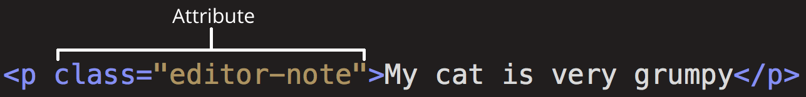
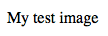
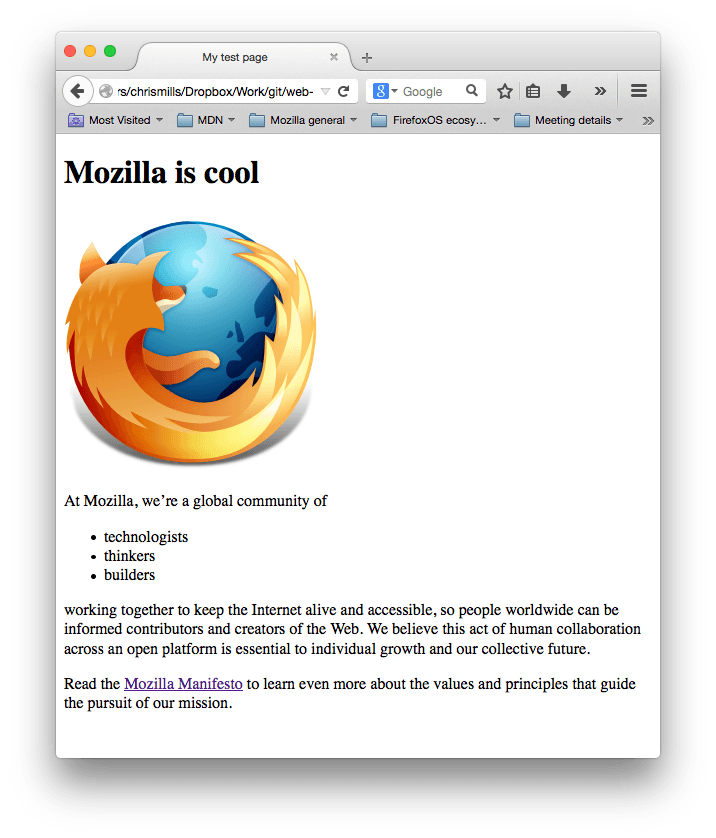

{{LearnSidebar}}

{{PreviousMenuNext("Learn_web_development/Getting_started/Your_first_website/What_will_your_website_look_like", "Learn_web_development/Getting_started/Your_first_website/Styling_the_content", "Learn_web_development/Getting_started/Your_first_website")}}

HTML (**H**yper**T**ext **M**arkup **L**anguage) is the code that is used to structure a web page and its content. For example, content could be structured within a set of paragraphs, a list of bulleted points, or using images and data tables. This article provides a basic understanding of HTML and its functions, and shows you how to create the basic content for your first website.

<table>
  <tbody>
    <tr>
      <th scope="row">Prerequisites:</th>
      <td>
        Basic familiarity with your computer operating system, the basic software you will use to build a website, and file systems.
      </td>
    </tr>
    <tr>
      <th scope="row">Learning outcomes:</th>
      <td>
        <ul>
          <li>The purpose and function of HTML.</li>
          <li>The basic parts of HTML syntax — opening and closing tags, elements, attributes, head, body.</li>
          <li>Common HTML elements including paragraphs, headings, images, lists, and links.</li>
        </ul>
      </td>
    </tr>
  </tbody>
</table>

## So what is HTML?

HTML is a _markup language_ that defines the structure of your content. HTML consists of a series of **{{Glossary("element", "elements")}}**, which you use to enclose, or wrap, different parts of the content to make it appear a certain way, or act a certain way. The enclosing {{Glossary("tag", "tags")}} can make a word or image hyperlink to somewhere else, can italicize words, can make the font bigger or smaller, and so on. For example, take the following line of content:

```plain
My cat is very grumpy
```

If we wanted the line to stand by itself, we could specify that it is a paragraph by enclosing it in paragraph tags:

```html
<p>My cat is very grumpy</p>
```

### Anatomy of an HTML element

Let's explore this paragraph element a bit further.


The main parts of our element are as follows:

1. **The opening tag:** This consists of the name of the element (in this case, p), wrapped in opening and closing **angle brackets**. This states where the element begins or starts to take effect — in this case where the paragraph begins.
2. **The closing tag:** This is the same as the opening tag, except that it includes a _forward slash_ before the element name. This states where the element ends — in this case where the paragraph ends. Failing to add a closing tag is one of the standard beginner errors and can lead to strange results.
3. **The content:** This is the content of the element, which in this case, is just text.
4. **The element:** The opening tag, the closing tag, and the content together comprise the element.

Elements can also have attributes that look like the following:



Attributes contain extra information about the element that you don't want to appear in the actual content. Here, `class` is the attribute _name_ and `editor-note` is the attribute _value_. The `class` attribute allows you to give the element a non-unique identifier that can be used to target it (and any other elements with the same `class` value) with style information and other things.
Some attributes have no value, such as [`required`](/en-US/docs/Web/HTML/Attributes/required).

Attributes that set a value always have:

1. A space between it and the element name (or the previous attribute, if the element already has one or more attributes).
2. The attribute name followed by an equal sign.
3. The attribute value wrapped by opening and closing quotation marks.

> [!NOTE]
> Simple attribute values that don't contain {{Glossary("ASCII")}} whitespace (or any of the characters `"` `'` `` ` `` `=` `<` `>`) can remain unquoted, but it is recommended that you quote all attribute values, as it makes the code more consistent and understandable.

### Nesting elements

You can put elements inside other elements too — this is called **nesting**. If we wanted to state that our cat is **very** grumpy, we could wrap the word "very" in a {{htmlelement("strong")}} element, which means that the word is to be strongly emphasized:

```html
<p>My cat is <strong>very</strong> grumpy.</p>
```

You do however need to make sure that your elements are properly nested. In the example above, we opened the {{htmlelement("p")}} element first, then the {{htmlelement("strong")}} element; therefore, we have to close the {{htmlelement("strong")}} element first, then the {{htmlelement("p")}} element. The following is incorrect:

```html-nolint example-bad
<p>My cat is <strong>very grumpy.</p></strong>
```

The elements have to open and close correctly so that they are clearly inside or outside one another. If they overlap as shown above, then your web browser will try to make the best guess at what you were trying to say, which can lead to unexpected results. So don't do it!

### Void elements

Some elements have no content and are called **{{glossary("void element", "void elements")}}**. Take the {{htmlelement("img")}} element that we already have in our HTML page:

```html

```

This contains two attributes, but there is no closing `</img>` tag and no inner content. This is because an image element doesn't wrap content to affect it. Its purpose is to embed an image in the HTML page in the place it appears.

## Creating your first HTML document

That wraps up the basics of individual HTML elements, but they aren't very useful on their own. Now we'll look at how individual elements are combined to form an entire HTML page. Let's create a basic HTML file, and have a look at what it is made up of:

1. Inside your `web-projects` folder, create another new folder called `first-website`.
2. Inside `first-website`, Create a new file called `index.html`, and insert the following code into the file exactly as shown:

```html
<!doctype html>
<html lang="en-US">
  <head>
    <meta charset="utf-8" />
    <meta name="viewport" content="width=device-width" />
    <title>My test page</title>
  </head>
  <body>
    
  </body>
</html>
```

Here, we have the following:

- `<!doctype html>` — The [doctype](/en-US/docs/Glossary/Doctype) is a required preamble. In the mists of time, when HTML was young (around 1991/92), doctypes were meant to act as links to a set of rules that the HTML page had to follow to be considered good HTML, which could mean automatic error checking and other useful things. However, these days, they don't do much and are basically just needed to make sure your document behaves correctly. That's all you need to know for now.
- `<html></html>` — the {{htmlelement("html")}} element. This element wraps all the content on the entire page and is sometimes known as the root element. It also includes the `lang` attribute, setting the primary language of the document.
- `<head></head>` — the {{htmlelement("head")}} element. This element acts as a container for all the stuff you want to include on the HTML page that _isn't_ the content you are showing to your page's viewers. This includes things like {{Glossary("keyword", "keywords")}} and a page description that you want to appear in search results, CSS to style our content, character set declarations, and more.
- `<meta charset="utf-8">` — This element sets the character set your document should use to UTF-8 which includes most characters from the vast majority of written languages. Essentially, it can now handle any textual content you might put on it. There is no reason not to set this, and it can help avoid some problems later on.
- `<meta name="viewport" content="width=device-width">` — This [viewport element](/en-US/docs/Web/CSS/Viewport_concepts#mobile_viewports) ensures the page renders at the width of viewport, preventing mobile browsers from rendering pages wider than the viewport and then shrinking them down.
- `<title></title>` — the {{htmlelement("title")}} element. This sets the title of your page, which is the title that appears in the browser tab the page is loaded in. It is also used to describe the page when you bookmark/favorite it.
- `<body></body>` — the {{htmlelement("body")}} element. This contains _all_ the content that you want to show to web users when they visit your page, whether that's text, images, videos, games, playable audio tracks, or whatever else.

## Images

Let's turn our attention to the {{htmlelement("img")}} element:

```html

```

This embeds an image into our page in the position it appears. It does this via the `src` (source) attribute, which contains the path to our image file.

We have also included an `alt` (alternative) attribute. In the [`alt` attribute](/en-US/docs/Web/HTML/Element/img#authoring_meaningful_alternate_descriptions), you specify descriptive text for users who cannot see the image, possibly because of the following reasons:

1. They are visually impaired. Users with significant visual impairments often use tools called screen readers to read out the alt text to them.
2. Something has gone wrong causing the image not to display. If the `src` attribute does not contain a valid path to an image, the alt text will be displayed instead:



The keywords for alt text are "descriptive text". The alt text you write should provide the reader with enough information to have a good idea of what the image conveys. In this example, our current text of "My test image" is no good at all. A much better alternative for our Firefox logo would be "The Firefox logo: a flaming fox surrounding the Earth."

> [!NOTE]
> Find out more about accessibility in our [accessibility learning module](/en-US/docs/Learn_web_development/Core/Accessibility).

Let's get your image displaying now.

1. Inside the `first-website` folder, Create a new folder called `images`, and put the image you chose in the previous example inside this folder.
2. Inside the `` tag's `src` attribute value, enter the path to your image. It is inside a folder called `images`, which is inside the same directory as your `index.html` file, therefore the path will be `images/` plus the name of your image. For example, if your image was called `firefox-icon.png`, your `src` attribute would look like this: `src="images/firefox-icon.png"`.
3. replace the `alt` attribute value — `My test image` — with some text that better describes your image.
4. Open your `index.html` file inside a web browser. You should see your image displayed. If not, check your `` element against our code above; make sure it is not missing any of the syntax, such as the quote marks. Make sure the image filename is correct.

> [!NOTE]
> If the image is really large and therefore doesn't fit on the screen, don't worry about this. We'll fix this issue in the next article.
> Find out more about using an `alt` attribute for images in various situations in our [accessible multimedia tutorial](/en-US/docs/Learn_web_development/Core/Accessibility/Multimedia) and [An alt Decision Tree](https://www.w3.org/WAI/tutorials/images/decision-tree/).

## Marking up text

This section will cover some essential HTML elements you'll use for marking up the text.

### Headings

Heading elements allow you to specify that certain parts of your content are headings — or subheadings. In the same way that a book has the main title, chapter titles, and subtitles, an HTML document can too. HTML contains 6 heading levels, {{htmlelement("Heading_Elements", "&lt;h1&gt; - &lt;h6&gt;")}}, although you'll commonly only use 3 to 4 at most:

```html
<!-- 4 heading levels: -->
<h1>My main title</h1>
<h2>My top level heading</h2>
<h3>My subheading</h3>
<h4>My sub-subheading</h4>
```

> [!NOTE]
> Anything in HTML between `<!--` and `-->` is an **HTML comment**. The browser ignores comments as it renders the code. In other words, they are not visible on the page - just in the code. HTML comments are a way for you to write helpful notes about your code or logic.

Now try adding a suitable main title to your HTML page just above your {{htmlelement("img")}} element. Save the file and view it in a browser to see the effect.

> [!NOTE]
> You'll see that your heading level 1 has an implicit style. Don't use heading elements to make text bigger or bold, because they are used for [accessibility](/en-US/docs/Learn_web_development/Core/Accessibility/HTML#text_content) and [other reasons such as SEO](/en-US/docs/Learn_web_development/Core/Structuring_content/Headings_and_paragraphs#why_do_we_need_structure). Try to create a meaningful sequence of headings on your pages, without skipping levels.

### Paragraphs

As explained above, {{htmlelement("p")}} elements are for containing paragraphs of text; you'll use these frequently when marking up regular text content:

```html
<p>This is a single paragraph</p>
```

Add your sample text from the previous article into one or a few paragraphs, placed directly below your {{htmlelement("img")}} element. Save it and look at your page in a browser.

### Lists

A lot of the web's content is lists and HTML has special elements for these. Marking up lists always consists of at least 2 elements. The most common list types are ordered and unordered lists:

1. **Unordered lists** are for lists where the order of the items doesn't matter, such as a shopping list. These are wrapped in a {{htmlelement("ul")}} element.
2. **Ordered lists** are for lists where the order of the items does matter, such as a list of cooking instructions in a recipe. These are wrapped in an {{htmlelement("ol")}} element.

Each item inside the lists is put inside an {{htmlelement("li")}} (list item) element.

For example, if we wanted to turn the part of the following paragraph fragment into a list

```html
<p>
  At Mozilla, we're a global community of technologists, thinkers, and builders
  working together…
</p>
```

We could modify the markup to this

```html
<p>At Mozilla, we're a global community of</p>

<ul>
  <li>technologists</li>
  <li>thinkers</li>
  <li>builders</li>
</ul>

<p>working together…</p>
```

Try adding an ordered or unordered list to your example page, and view the result in a browser.

## Links

Links are very important — they are what makes the web a web! To add a link, we need to use a specific element — {{htmlelement("a")}} — "a" being the short form for "anchor". To make text within your paragraph into a link, follow these steps:

1. Choose some text. We chose the text "Mozilla Manifesto".
2. Wrap the text in an {{htmlelement("a")}} element, as shown below:

   ```html
   <a>Mozilla Manifesto</a>
   ```

3. Give the {{htmlelement("a")}} element an `href` attribute, as shown below:

   ```html
   <a href="">Mozilla Manifesto</a>
   ```

4. Fill in the value of this attribute with the web address that you want the link to point to:

   ```html
   <a href="https://www.mozilla.org/en-US/about/manifesto/">
     Mozilla Manifesto
   </a>
   ```

You might get unexpected results if you omit the `https://` or `http://` part, called the _protocol_, at the beginning of the web address. After making a link, click it to make sure it is sending you where you wanted it to.

> **Note:** `href` might appear like a rather obscure choice for an attribute name at first. If you are having trouble remembering it, remember that it stands for _**h**ypertext **ref**erence_.

Add a link to your page now, if you haven't already done so.

## Conclusion

If you have followed all the instructions in this article, you should end up with a page that looks like the one below (you can also [view it here](https://mdn.github.io/beginner-html-site/)):



If you get stuck, you can always compare your work with our [finished example code](https://github.com/mdn/beginner-html-site/blob/main/index.html) on GitHub.

Here, we have only really scratched the surface of HTML. You'll learn a lot more in our [Structuring content with HTML](/en-US/docs/Learn_web_development/Core/Structuring_content) Core module.

{{PreviousMenuNext("Learn_web_development/Getting_started/Your_first_website/What_will_your_website_look_like", "Learn_web_development/Getting_started/Your_first_website/Styling_the_content", "Learn_web_development/Getting_started/Your_first_website")}}
