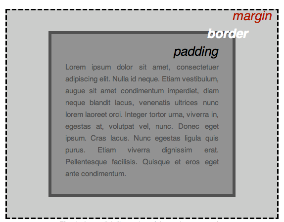

{{PreviousMenuNext("Learn_web_development/Getting_started/Your_first_website/Creating_the_content", "Learn_web_development/Getting_started/Your_first_website/Adding_interactivity", "Learn_web_development/Getting_started/Your_first_website")}}

CSS (Cascading Style Sheets) is the code that styles web content. This article walks you through a basic understanding of CSS — how it works and how to improve the look and feel of the content structure you created in the previous article.

<table>
  <tbody>
    <tr>
      <th scope="row">Prerequisites:</th>
      <td>
        Basic familiarity with your computer operating system, the basic software you will use to build a website, and file systems.
      </td>
    </tr>
    <tr>
      <th scope="row">Learning outcomes:</th>
      <td>
        <ul>
          <li>The purpose and function of CSS.</li>
          <li>The basic parts of CSS syntax — rulesets, selectors, declarations, properties, property values.</li>
          <li>Common CSS functionality including box model, changing colors and fonts, and positioning HTML elements.</li>
        </ul>
      </td>
    </tr>
  </tbody>
</table>

## What is CSS?

Like HTML, CSS is not a programming language. It's not a markup language either. **CSS is a style sheet language.** CSS is used to style HTML elements: you select the elements you want to style and set values for their style properties, which define how they will look.

Let's revisit the basic HTML example from the article [Creating the content](/en-US/docs/Learn_web_development/Getting_started/Your_first_website/Creating_the_content):

```html live-sample___basic-html live-sample___basic-css
<p>Instructions for life:</p>

<ul>
  <li>Eat</li>
  <li>Sleep</li>
  <li>Repeat</li>
</ul>
```

This renders as follows on its own:

{{EmbedLiveSample("basic-html", "100%", "140px")}}

If we add some CSS into the mix, we can change how the HTML looks. The following snippet selects the {{htmlelement("p")}} element and gives it a different [font](/en-US/docs/Web/CSS/font-family) and a red text {{cssxref("color")}}. It then selects all the {{htmlelement("li")}} elements and gives each one a greeny-yellow {{cssxref("background-color")}}, a 1-pixel solid black {{cssxref("border")}}, and a 5-pixel [bottom margin](/en-US/docs/Web/CSS/margin-bottom):

```css live-sample___basic-css
p {
  font-family: sans-serif;
  color: red;
}

li {
  background-color: greenyellow;
  border: 1px solid black;
  margin-bottom: 5px;
}
```

With the CSS applied to the HTML, the demo now renders like this:

{{EmbedLiveSample("basic-css", "100%", "160px")}}

As you can see, with just a little CSS, we were able to change the appearance of a plain-looking list.

CSS has many other functions, from specifying background images and gradients, to controlling typography and scrolling behavior, to adding animations and building entire web page layouts.

## Applying CSS to your HTML

When using CSS, the first thing to get right is to make sure that your CSS is successfully applied to your HTML. In this section, we'll add a CSS **stylesheet** to your `first-website` and apply it to your page.

1. Inside your `first-website` folder, create another new folder called `styles`.
2. Using a text editor, paste the following CSS into a new file, which will give your `<p>` elements a red text color. It's useful to start with something like this to test whether your stylesheet is being applied to your HTML correctly.

   ```css
   p {
     color: red;
   }
   ```

3. Save the file in the `styles` folder with the filename `style.css`.
4. Open your `index.html` file. Paste the following line inside the HTML head (between the {{HTMLElement("head")}} and `</head>` tags):

   ```html
   <link href="styles/style.css" rel="stylesheet" />
   ```

5. Save `index.html` and load it in your browser. You should see something like this:


If your paragraph text is red, congratulations! Your CSS is working. If not, go through the above steps and check carefully that you have followed each one correctly.

## CSS syntax basics

In the previous CSS example, `p` is called a **selector** — it selects the element(s) to style. In particular, `p` selects all the paragraphs in the HTML. The line inside the curly braces (`{ }`) is called a **declaration** – it sets a value for a specific property. In this case, the **property** is `color`, which controls the text color of the paragraphs, and the **property value** set is `red`.

The whole structure is called a **ruleset**. (The term _ruleset_ is often referred to as just _rule_.)

Let's look at another ruleset, this time with multiple declarations:

```css
p {
  color: red;
  width: 500px;
  border: 1px solid black;
}
```

Within a ruleset, you must use a semicolon (`;`) to separate one declaration from the next. Within each declaration, you must use a colon (`:`) to separate the property and its value.

You can also include multiple selectors in one rule, separated by commas, to select multiple elements. For example:

```css
p,
.my-class,
#my-id {
  color: red;
}
```

In this CSS rule, we've included an **element** (or **type**) selector, which selects a specific HTML element. We've also included two other selector types, which aren't relevant to the rest of this tutorial. If you're curious about what they do, check out our [Basic selectors](/en-US/docs/Learn_web_development/Core/Styling_basics/Basic_selectors) guide.

> [!NOTE]
> Scrimba's [Write your first lines of CSS!](https://scrimba.com/the-frontend-developer-career-path-c0j/~015?via=mdn) <sup>[_MDN learning partner_](/en-US/docs/MDN/Writing_guidelines/Learning_content#partner_links_and_embeds)</sup> provides a useful interactive introduction to CSS syntax.

## Improving the text

Let's return to our example and use CSS to improve the appearance of the text. We'll set a new font for the page and change some text settings for different elements.

1. First, find the [output from Google Fonts](/en-US/docs/Learn_web_development/Getting_started/Your_first_website/What_will_your_website_look_like#choosing_a_font) that you previously saved. If you've not already chosen a font, follow the link and do it now.
2. Add the {{htmlelement("link")}} elements inside your `index.html`'s {{HTMLElement("head")}}, just before the closing `</head>` tag. They should look something like this:

   ```html
   <link rel="preconnect" href="https://fonts.googleapis.com" />
   <link rel="preconnect" href="https://fonts.gstatic.com" crossorigin />
   <link
     href="https://fonts.googleapis.com/css2?family=Roboto:ital,wght@0,100..900;1,100..900&display=swap"
     rel="stylesheet" />
   ```

   This code links your page to a stylesheet hosted by the Google Fonts service, which loads your chosen font.

3. Next, go to your `style.css` file and delete the existing rule. We no longer want our paragraphs to be red.
4. Add the following lines to `style.css`:

   ```css
   html {
     /* px means "pixels". The base font size is now 10 pixels high */
     font-size: 10px;
     /* Replace PLACEHOLDER with the font-family property value you got from Google Fonts */
     font-family: PLACEHOLDER;
   }
   ```

   > [!NOTE]
   > Anything in CSS between `/*` and `*/` is a **CSS comment**, which is ignored by the browser. CSS comments are a way for you to include helpful notes about your code or logic, without affecting how your webpage is rendered.

5. Replace the `font-family` placeholder line with the `font-family` line from your Google Fonts code, for example:

   ```css
   font-family: "Roboto", sans-serif;
   ```

   The `font-family` property sets the font(s) you want to apply to your HTML. This rule defines a global base font and font size for the whole page. All elements inside the {{HTMLElement("html")}} element will inherit the same `font-size` and `font-family`.

6. Now let's set some font and text styles on our [`<h1>`](/en-US/docs/Web/HTML/Reference/Elements/Heading_Elements), {{htmlelement("li")}}, and {{htmlelement("p")}} elements. We'll set new {{cssxref("font-size")}} values for each element. We'll also center the heading using {{cssxref("text-align")}} and increase the {{cssxref("line-height")}} and {{cssxref("letter-spacing")}} of the paragraphs and list items to make the body content more readable.

   ```css
   h1 {
     font-size: 60px;
     text-align: center;
   }

   p,
   li {
     font-size: 16px;
     line-height: 2;
     letter-spacing: 1px;
   }
   ```

7. Save your code and load your HTML in a browser (refresh it if you've got it open from before). Your work-in-progress should look similar to this:

   

   > [!NOTE]
   > Try adjusting the `px` values until you end up with font sizes that you like for your heading and body text.

## CSS is all about boxes

Something you'll notice about CSS as you use it more is that a lot of it is about boxes. Most HTML elements on a page can be thought of as boxes that sit on top of (or alongside) other boxes. You can set values on these boxes for size, color, positioning, etc. This is referred to as [**the box model**](/en-US/docs/Learn_web_development/Core/Styling_basics/Box_model).



Each box that takes up space on your page has properties like:

- {{cssxref("padding")}}: The space around the content. In the previous example, it is the space around the paragraph text.
- {{cssxref("border")}}: The solid line just outside the padding.
- {{cssxref("margin")}}: The space outside the border.

In this section, we also use the following properties, some of which you've seen before:

- {{cssxref("width")}}: The width of an element.
- {{cssxref("background-color")}}: The color behind an element's content and padding.
- {{cssxref("color")}}: The color of an element's content (usually text).
- {{cssxref("text-shadow")}}: A drop shadow on the text inside an element.
- {{cssxref("display")}}: The display mode of an element (which basically refers to how it appears or is laid out on the web page).

In each of the sections that follow:

1. Add the provided CSS code to the bottom of your `style.css` file.
2. Save the file and refresh your browser to see how the CSS has affected the HTML rendering.
3. Read the provided explanation to help you understand how the CSS works.
4. If you are feeling adventurous, experiment with changing the property values to further customize your page.

## Changing the page color

Add the following:

```css
html {
  background-color: #00539f;
}
```

This rule sets a background color for the entire page. Change the color code to the color you chose in [What will your website look like?](/en-US/docs/Learn_web_development/Getting_started/Your_first_website/What_will_your_website_look_like#choosing_a_theme_color).

## Styling the body

Next, add this rule:

```css
body {
  width: 600px;
  margin: 0 auto;
  background-color: #ff9500;
  padding: 0 20px 20px 20px;
  border: 5px solid black;
}
```

The above code sets new values for several properties of the {{htmlelement("body")}} element. Let's go through these line-by-line:

- `width: 600px;`: This forces the body to always be 600 pixels wide.
- `margin: 0 auto;`: When you set two values on a property like `margin` or `padding`, the first value affects the element's top _and_ bottom side (setting it to `0` in this case); the second value affects the left _and_ right side. `auto` is a special value that divides the available horizontal space evenly between left and right.
- `background-color: #FF9500;`: This sets the element's background color. Our project uses a reddish orange for the `<body>` background color to contrast with the dark blue used for the {{htmlelement("html")}} element.
- `padding: 0 20px 20px 20px;`: This sets four values for padding. The goal is to put some space around the content. In this example, there is no padding on the top of the body, and 20 pixels on the right, bottom, and left. The values set top, right, bottom, and left padding, in that order.
- `border: 5px solid black;`: This sets values for the width, style, and color of the border. In this case, it's a 5-pixel-wide solid black border around all sides of the body.

## Positioning and styling the main page title

Now add this:

```css
h1 {
  margin: 0;
  padding: 20px 0;
  color: #00539f;
  text-shadow: 3px 3px 1px black;
}
```

You may have noticed a horrible gap at the top of the body. That happens because browsers apply default styling to the `<h1>` element. That might seem like a bad idea, but the intent is to provide basic readability for unstyled pages. To eliminate the gap, we overwrite the browser's default styling with the setting `margin: 0;`.

Next, we set the heading's top and bottom padding to 20 pixels, and set the heading text to be the same color as the HTML background color.

Finally, `text-shadow` applies a shadow to the text content of the element:

- The first pixel value sets the **horizontal offset** of the shadow from the text: how far it moves across.
- The second pixel value sets the **vertical offset** of the shadow from the text: how far it moves down.
- The third pixel value sets the **blur radius** of the shadow. A larger value produces a more fuzzy-looking shadow.
- The fourth value sets the base color of the shadow.

## Centering the image

Finally, insert this rule:

```css
img {
  display: block;
  margin: 0 auto;
  max-width: 100%;
}
```

Next, we center the image to make it look better. We can use the same `margin: 0 auto` trick as we did for the body, but there are differences that require an additional setting to make the CSS work.

The {{htmlelement("body")}} element is a **block** element, meaning it takes up space on the page and can accept margin, padding, and other box properties. {{htmlelement("img")}} (image) elements, on the other hand, are **inline** elements: by default, they don't accept margin values in the same way block elements do. For the auto-margin trick to work on this image, we must give it block-level behavior by using `display: block;`.

Finally, we set the {{cssxref("max-width")}} property to `100%` to ensure that if the image is larger than the `width` set on the body (600 pixels), it will be constrained to `600px` and won't stretch wider.

> [!NOTE]
> Don't be too concerned if you don't completely understand `display: block;` and the differences between a block element and an inline element, or `max-width: 100%;`. They will make more sense as you continue your study of CSS.

## Conclusion

If you followed all the instructions in this article, you should have a page that looks similar to this one:


You can [view our version here](https://mdn.github.io/beginner-html-site-styled/). If you get stuck, you can always compare your work with our [finished example code on GitHub](https://github.com/mdn/beginner-html-site-styled/blob/main/styles/style.css).

In this article, we've only scratched the surface of CSS. You'll learn a lot more in our [CSS styling basics](/en-US/docs/Learn_web_development/Core/Styling_basics) Core module later in the course.

## See also

- [Learn HTML and CSS](https://scrimba.com/learn-html-and-css-c0p?via=mdn), Scrimba <sup>[_MDN learning partner_](/en-US/docs/MDN/Writing_guidelines/Learning_content#partner_links_and_embeds)</sup>
  - : [Scrimba's](https://scrimba.com?via=mdn) _Learn HTML and CSS_ course teaches you HTML and CSS through building and deploying five awesome projects, with fun interactive lessons and challenges taught by knowledgeable teachers.

{{PreviousMenuNext("Learn_web_development/Getting_started/Your_first_website/Creating_the_content", "Learn_web_development/Getting_started/Your_first_website/Adding_interactivity", "Learn_web_development/Getting_started/Your_first_website")}}
