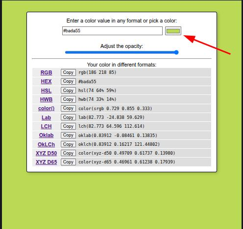
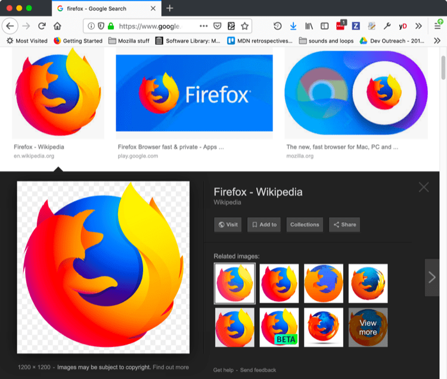

{{NextMenu("Learn_web_development/Getting_started/Your_first_website/Creating_the_content", "Learn_web_development/Getting_started/Your_first_website")}}

_What will your website look like?_ discusses the planning and design work you have to do for your website before writing code, including "What information does my website offer?", "What fonts and colors do I want?", and "What does my site do?"

<table>
  <tbody>
    <tr>
      <th scope="row">Prerequisites:</th>
      <td>
        Basic familiarity with your computer operating system, the basic software you will use to build a website, and file systems.
      </td>
    </tr>
    <tr>
      <th scope="row">Learning outcomes:</th>
      <td>
        <ul>
          <li>Plan a basic website.</li>
          <li>Use a basic design process.</li>
          <li>Gather assets.</li>
        </ul>
      </td>
    </tr>
  </tbody>
</table>

## First things first: planning

Before doing anything, you need some ideas. What should your website actually do? A website can do basically anything, but, for your first try, you should keep things simple. We'll start by creating a simple webpage with a heading, an image, and a few paragraphs.

To begin, you'll need to answer these questions:

1. **What is your website about?** Do you like dogs, New York, or Pac-Man?
2. **What information are you presenting on the subject?** Write a title and a few paragraphs and think of an image you'd like to show on your page.
3. **What does your website look like,** in simple high-level terms? What's the background color? What kind of font is appropriate: formal, cartoony, bold and loud, subtle?

> [!NOTE]
> Complex projects need detailed guidelines that go into all the details of colors, fonts, spacing between items on a page, appropriate writing style, and so on. This is sometimes called a design guide, design system, or brand book, and you can see an example at the [Firefox Acorn Design System](https://acorn.firefox.com/latest).

## Sketching out your design

Next, grab pen and paper and sketch out roughly how you want your site to look. For your first simple webpage, there's not much to sketch out, but you should get in the habit of doing this now. It really helps — you don't have to be Van Gogh!

> [!NOTE]
> Even on real, complex websites, the design teams usually start out with rough sketches on paper and later on build digital mockups using a graphics editor or web technologies.
>
> Web teams often include both a [graphic designer](/en-US/docs/Learn_web_development/Getting_started/Soft_skills/Workflows_and_processes#graphic_designer) and a [user experience (UX) designer](/en-US/docs/Learn_web_development/Getting_started/Soft_skills/Workflows_and_processes#user_experience_ux_designer). Graphic designers put together the visuals of the website. UX designers have a somewhat more abstract role in addressing how users will experience and interact with the website.

At this point, it's good to start putting together the content that will eventually appear on your webpage. You should still have your paragraphs and title from earlier. Keep these close by.

## Choosing a theme color

Let's choose a background color for your page.

1. Go to [the Color Picker](/en-US/docs/Web/CSS/CSS_colors/Color_format_converter) and find a color you like.
2. When you pick a color, you'll see a strange six-character code like `#660066`. That's called a _hex code_ (short for hexadecimal), and represents your color. Copy the code down somewhere safe for now.

## Choosing an image

Now it's time to find an image to show on your site.

1. Go to [Google Images](https://www.google.com/imghp).
2. Note that most images on the web, including in Google Images, are copyrighted. To reduce your likelihood of violating copyright, you can use Google's license filter. Click on the _Tools_ button, then on the resulting _Usage rights_ option that appears below. You should choose the option _Creative Commons licenses_.

   

3. Search for a suitable image.
4. When you find the image you want, click on the image to get an enlarged view of it.
5. Right-click the image (<kbd>Ctrl</kbd> + click on a Mac), choose _Save Image As…_, and choose a safe place to save your image.

   

## Choosing a font

There is a set of fonts called the [web safe fonts](/en-US/docs/Learn_web_development/Core/Text_styling/Fundamentals#web_safe_fonts) — such as Arial, Times New Roman, or Courier New — that are generally available on most computer systems. If you use one of these fonts on your website, the browser will load the font file available on the user's computer.

However, if you want to use other fonts not generally available on devices, you need to either include them along with your website files or reference the font files from a third-party font service so the browser can download them as needed. [Google Fonts](https://fonts.google.com/) is one such service that provides access to many fonts.

Let's use Google fonts to choose a font for your website:

1. Go to [Google Fonts](https://fonts.google.com/).
2. Scroll down the list of fonts until you find one you like. If you are having trouble finding one, you can use the filters available in the other column to narrow down your search.
3. Click your font option, then on the next page click the "Get font" button.
4. On the next page, click "Get embed code".
5. Copy both of the provided code blocks, and save them somewhere safe for later use.

> [!NOTE]
> As with images, many fonts are protected by licenses, meaning you cannot necessarily use them freely on commercial websites. You will be fine for now while working on learning examples, but keep this in mind when choosing fonts for real websites.

{{NextMenu("Learn_web_development/Getting_started/Your_first_website/Creating_the_content", "Learn_web_development/Getting_started/Your_first_website")}}
