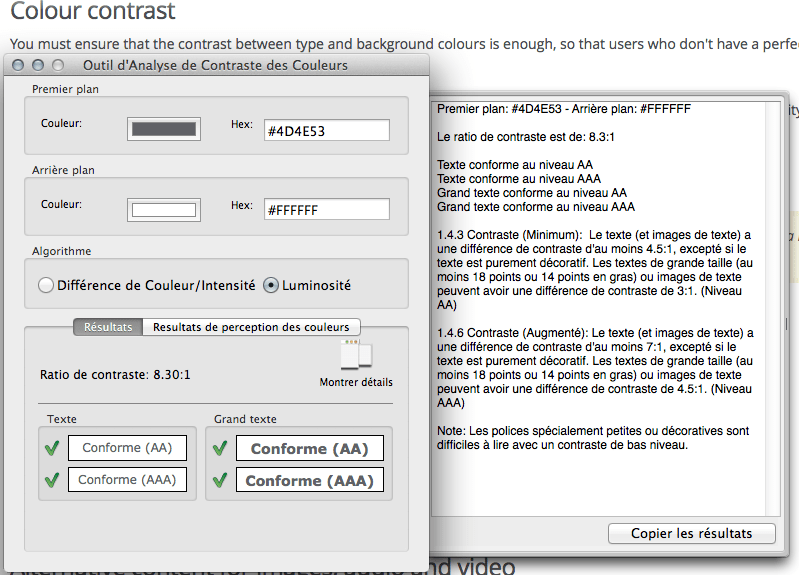

This article provides basic tips to help you design websites for any kind of user.

<table class="standard-table">
  <tbody>
    <tr>
      <th scope="row">Prerequisites:</th>
      <td>
        You should first read
        <a href="/en-US/docs/Learn_web_development/Howto/Design_and_accessibility/What_is_accessibility"
          >What is accessibility?</a
        >, since we don't cover accessibility in detail here.
      </td>
    </tr>
    <tr>
      <th scope="row">Objective:</th>
      <td>
        Universal design means design for everybody, regardless of disabilities
        or technical constraints. This article lists the most important
        quick-wins for universal design.
      </td>
    </tr>
  </tbody>
</table>

## Summary

When you're building a website, one top issue to consider is [Universal Design](https://en.wikipedia.org/wiki/Universal_design): accommodating all users regardless of disability, technical constraints, culture, location, and so on.

## Active Learning

_There is no active learning available yet. [Please, consider contributing](/en-US/docs/MDN/Community/Getting_started)._

## Dig deeper

### Color contrast

To keep your text readable, use a text color that contrasts well with the background color. Make it extra easy to read the text, to help visually-impaired people and people using their phones on the street.

The {{Glossary("W3C")}} defines a good color mix with an algorithm that calculates luminosity ratio between foreground and background. The calculation may seem pretty complicated, but we can rely on tools to do the job for us.

Let's download and install the Paciello Group's [Color Contrast Analyser](https://www.tpgi.com/color-contrast-checker/).

> [!NOTE]
> Alternatively you can find a number of contrast checkers online, such as WebAIM's [Color Contrast Checker](https://webaim.org/resources/contrastchecker/). We suggest a local checker because it comes packaged with an on-screen color picker to find out a color value.

For instance, let's test the colors on this page and see how we fare in the color Contrast Analyser:



The luminosity contrast ratio between text and background is 8.30:1, which exceeds the minimum standard (4.5:1) and should enable many visually-impaired people to read this page.

### Font size

You can specify font size on a website either through relative units or absolute units.

#### Absolute units

Absolute units are not proportionally calculated but refer to a size set in stone, so to speak, and are expressed most of the time in pixels (`px`). For instance, if in your CSS you declare this:

```css
body {
  font-size: 16px;
}
```

… you are telling the browser that whatever happens, the font size must be 16 pixels. Modern browsers get around this rule by pretending that you're asking for "16 pixels when the user sets a zoom factor of 100%".

#### Relative units

Also called _proportional units,_ relative units are computed relative to a parent element. Relative units are friendlier to accessibility because they respect the settings on the user's system.

Relative units are expressed in `em`, `%` and `rem`:

- Percent-based sizes: `%`
  - : This unit tells your browser that an element's font size must be N% of the previous element whose font size was expressed. If no parent can be found, the default font size within the browser is considered as the base size for the calculation (usually the equivalent of 16 pixels).
- Em-based sizes: `em`
  - : This unit is calculated the same way as percents, except that you compute in portions of 1 and not portions of 100. It is said that "em" is the width of a capital "M" in the alphabet (roughly speaking, an "M" fits into a square).
- Rem-based sizes: `rem`
  - : This unit is proportional to the root element's font size and is expressed as portions of 1, like `em`.

Suppose we wanted a base font size of 16px and an h1 (main heading) at the equivalent of 32px, yet if within the h1 we find a `span` with the `subheading` class, it too must be rendered at the default font size (usually 16px).

Here is the HTML we're using:

```html
<!doctype html>
<html lang="en">
  <head>
    <meta charset="UTF-8" />
    <title>Font size experiment</title>
  </head>
  <body>
    <h1>
      This is our main heading
      <span class="subheading">This is our subheading</span>
    </h1>
  </body>
</html>
```

A percent-based CSS will look like this:

```css
body {
  /* 100% of the browser's base font size, so in most cases this will render as 16 pixels */
  font-size: 100%;
}
h1 {
  /* twice the size of the body, thus 32 pixels */
  font-size: 200%;
}
span.subheading {
  /* half the size of the h1, thus 16 pixels to come back to the original size */
  font-size: 50%;
}
```

The same problem expressed with ems:

```css
body {
  /* 1em = 100% of the browser's base font size, so in most cases this will render as 16 pixels */
  font-size: 1em;
}
h1 {
  /* twice the size of the body, thus 32 pixels */
  font-size: 2em;
}
span.subheading {
  /* half the size of the h1, thus 16 pixels to come back to the original size */
  font-size: 0.5em;
}
```

As you can see, the math quickly gets daunting when you have to keep track of the parent, the parent's parent, the parent's parent's parent, and so on. (Most designs are done in pixel-based software, so the math has to be done by the person coding the CSS).

Enter `rem`. This unit is relative to the root element's size and not to any other parent. The CSS can be rewritten thus:

```css
body {
  /* 1em = 100% of the browser's base font size, so in most cases this will render as 16 pixels */
  font-size: 1em;
}
h1 {
  /* twice the size of the body, thus 32 pixels */
  font-size: 2rem;
}
span.subheading {
  /* original size */
  font-size: 1rem;
}
```

Easier, isn't it? This works as of [every current browser](https://caniuse.com/#search=rem), so please feel free to use this unit.

> [!NOTE]
> You may notice Opera Mini does not support font sizing in rem. It will end up setting its own font size, so don't bother feeding it font units.

#### Why would I want to use proportional units?

Because you don't know when a browser is going to come around and refuse to zoom up text whose size is expressed in pixels. Also, check your website's statistics: you may receive visits from older browsers.

We would advise the following:

- Describe fonts in `rem` units, most browsers will be very happy with them;
- Let older browsers display fonts with their own internal engine. Browser's engines will ignore any property or value in the CSS if they can't cope with them, so that your website is still usable if not true to your designer's vision. Older browsers are on the way out anyway.

> [!NOTE]
> Your mileage may vary. If you have to cater to older browsers, you'll have to use `em`s and do a bit more math.

### Line width

There is a longstanding debate about line length on the web, but here's the story. Back when we had newspapers, printers realized that the reader's eyes would have trouble going from one line to the next if the lines were too long. The solution? Columns.

Of course the problem doesn't go away when we switch to the Web. The reader's eyes act like a shuttle going from line to line. To make it easier on people's eyes, limit line width to around 60 or 70 characters.

To achieve this, you can specify a size for your text's container. Let's consider this HTML:

```html
<!doctype html>
<html lang="en">
  <head>
    <meta charset="UTF-8" />
    <title>Font size experiment</title>
  </head>
  <body>
    <div class="container">
      <h1>
        This is our main heading
        <span class="subheading">This is our subheading</span>
      </h1>

      <p>[lengthy text that spans many lines]</p>
    </div>
  </body>
</html>
```

We have a `div` with class `container`. We can style the `div` either to set its width (using the `width` property) or its maximum width so that it never gets too large (using the `max-width` property). If you want an elastic/responsive website, and you don't know what the browser's default width is, you can use the `max-width` property to allow up to 70 characters per line and no more:

```css
div.container {
  max-width: 70em;
}
```

### Alternative content for images, audio, and video

Websites often include stuff besides plain text.

#### Images

Images can be either decorative or informative, but there's no guarantee that your users can see them. For example,

- Visually impaired users rely on a screen reader, which can only handle text.
- Your readers may be using a very strict intranet that blocks images originating from a {{Glossary("CDN")}}.
- Your readers may have disabled images to save bandwidth, especially on mobile devices (see below).

<!---->

- Decorative images
  - : They're just for decoration and don't convey any real information. They could most often be replaced by a background image. Make sure they feature an empty `alt` attribute: `` so they don't clog up the text.
- Informative images
  - : They are used to convey information, hence their name. They can, for instance, feature a graph, or show a person's gesture, or any other information. At minimum, you must provide a relevant `alt` attribute.

If the image can be described succinctly, you can provide an `alt` attribute and nothing more. If the image cannot be described succinctly, you will have to either provide the same content in another form in the same page (e.g., complement a pie chart with a table providing the same data), or resort to a `longdesc` attribute. This attribute's value is a URL pointing towards a resource explicitly describing in detail the image's content.

> [!NOTE]
> The use and even the existence of `longdesc` has been debated for quite some time. Please refer to the W3C's [Image Description Extension (longdesc)](https://www.w3.org/TR/html-longdesc/) for the full explanation and thorough examples.

#### Audio/video

You must also provide alternatives to multimedia content.

- Subtitling/close-captioning
  - : You should include captions in your video to cater to visitors who can't hear the audio. Some users have hearing challenges, lack functioning speakers, or work in a noisy environment (like on the train).
- Transcript
  - : Subtitles only work if somebody watches the video. Many users don't have time, or lack the proper plugin or codec. Additionally, search engines rely mainly on text to index your contents. For all these reasons, please provide a text transcript of the video/audio file.

### Image compression

Some users may choose to display images, but still have limited bandwidth available, especially in developing countries and on mobile devices. If you want a successful website, please compress your images. There are various tools to help you, either online or local. Generally, local tools are preferred because they can be more integrated with your development workflow; these tools include [ImageOptim](https://imageoptim.com/api) (Mac), [OptiPNG](https://optipng.sourceforge.net/) (all platforms), and [PNGcrush](https://pmt.sourceforge.io/pngcrush/) (DOS, Unix/Linux).
