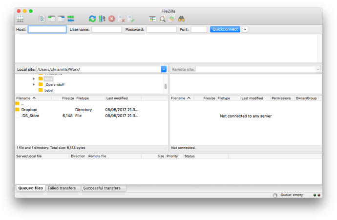
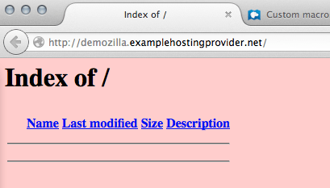
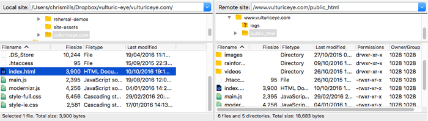
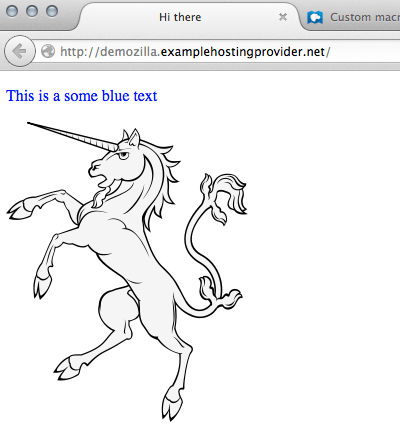

{{QuicklinksWithSubPages("/en-US/docs/Learn_web_development/Howto")}}

This article shows you how to publish your site online using file transfer tools.

<table>
  <tbody>
    <tr>
      <th scope="row">Prerequisites:</th>
      <td>
        You must know
        <a href="/en-US/docs/Learn_web_development/Howto/Web_mechanics/What_is_a_web_server"
          >what a web server is</a
        >
        and
        <a href="/en-US/docs/Learn_web_development/Howto/Web_mechanics/What_is_a_domain_name"
          >how domain names work</a
        >. You must also know how to
        <a
          href="/en-US/docs/Learn_web_development/Howto/Tools_and_setup/set_up_a_local_testing_server"
          >set up a basic environment</a
        >
        and how to
        <a href="/en-US/docs/Learn_web_development/Getting_started/Your_first_website"
          >write a simple webpage</a
        >.
      </td>
    </tr>
    <tr>
      <th scope="row">Objective:</th>
      <td>
        Learn how to push files to a server using the various file transfer
        tools available.
      </td>
    </tr>
  </tbody>
</table>

## Summary

If you have built a simple web page (see [HTML basics](/en-US/docs/Learn_web_development/Getting_started/Your_first_website/Creating_the_content) for an example), you will probably want to put it online, on a web server. In this article we'll discuss how to do that, using various available options such as SFTP clients, RSync and GitHub.

## SFTP

There are several SFTP clients out there. Our demo covers [FileZilla](https://filezilla-project.org/), since it's free and available for Windows, macOS and Linux. To install FileZilla go to the [FileZilla downloads page](https://filezilla-project.org/download.php?type=client), click the big Download button, then install from the installer file in the usual way.

> [!NOTE]
> Of course there are lots of other options. See [Publishing tools](/en-US/docs/Learn_web_development/Howto/Tools_and_setup/How_much_does_it_cost#publishing_tools) for more information.

Open the FileZilla application; you should see something like this:



### Logging in

For this example, we'll suppose that our hosting provider (the service that will host our HTTP web server) is a fictitious company "Example Hosting Provider" whose URLs look like this: `mypersonalwebsite.examplehostingprovider.net`.

We have just opened an account and received this info from them:

> Congratulations for opening an account at Example Hosting Provider.
>
> Your account is: `demozilla`
>
> Your website will be visible at `demozilla.examplehostingprovider.net`
>
> To publish to this account, please connect through SFTP with the following credentials:
>
> - SFTP server: `sftp://demozilla.examplehostingprovider.net`
> - Username: `demozilla`
> - Password: `quickbrownfox`
> - Port: `5548`
> - To publish on the web, put your files into the `Public/htdocs` directory.

Let's first look at `http://demozilla.examplehostingprovider.net/` — as you can see, so far there is nothing there:



> [!NOTE]
> Depending on your hosting provider, most of the time you'll see a page saying something like "This website is hosted by \[Hosting Service]." when you first go to your web address.

To connect your SFTP client to the distant server, follow these steps:

1. Choose _File > Site Manager…_ from the main menu.
2. In the _Site Manager_ window, press the _New Site_ button, then fill in the site name as **demozilla** in the provided space.
3. Fill in the SFTP server your host provided in the _Host:_ field.
4. In the _Logon Type:_ drop down, choose _Normal_, then fill in your provided username and password in the relevant fields.
5. Fill in the correct port and other information.

Your window should look something like this:


Now press _Connect_ to connect to the SFTP server.

Note: Make sure your hosting provider offers SFTP (Secure FTP) connection to your hosting space. FTP is inherently insecure, and you shouldn't use it.

### Here and there: local and remote view

Once connected, your screen should look something like this (we've connected to an example of our own to give you an idea):



Let's examine what you're seeing:

- On the center left pane, you see your local files. Navigate into the directory where you store your website (e.g. `mdn`).
- On the center right pane, you see remote files. We are logged into our distant FTP root (in this case, `users/demozilla`)
- You can ignore the bottom and top panes for now. Respectively, these are a log of messages showing the connection status between your computer and the SFTP server, and a live log of every interaction between your SFTP client and the server.

### Uploading to the server

Our example host instructions told us "To publish on the web, put your files into the `Public/htdocs` directory." You need to navigate to the specified directory in your right pane. This directory is effectively the root of your website — where your `index.html` file and other assets will go.

Once you've found the correct remote directory to put your files in, to upload your files to the server you need to drag-and-drop them from the left pane to the right pane.

### Are they really online?

So far, so good, but are the files really online? You can double-check by going back to your website (e.g. `http://demozilla.examplehostingprovider.net/`) in your browser:



And our website is live!

## Rsync

{{Glossary("Rsync")}} is a local-to-remote file synchronizing tool, which is generally available on most Unix-based systems (like macOS and Linux), but Windows versions exist too.

It is seen as a more advanced tool than SFTP, because by default it is used on the command line. A basic command looks like this:

```bash
rsync [-options] SOURCE user@x.x.x.x:DESTINATION
```

- `-options` is a dash followed by a one or more letters, for example `-v` for verbose error messages, and `-b` to make backups. You can see the full list at the [rsync man page](https://linux.die.net/man/1/rsync) (search for "Options summary").
- `SOURCE` is the path to the local file or directory that you want to copy files over from.
- `user@` is the credentials of the user on the remote server you want to copy files over to.
- `x.x.x.x` is the IP address of the remote server.
- `DESTINATION` is the path to the location you want to copy your directory or files to on the remote server.

You'd need to get such details from your hosting provider.

For more information and further examples, see [How to Use Rsync to Copy/Sync Files Between Servers](https://www.atlantic.net/vps-hosting/how-to-use-rsync-copy-sync-files-servers/).

Of course, it is a good idea to use a secure connection, as with FTP. In the case of Rsync, you specify SSH details to make the connection over SSH, using the `-e` option. For example:

```bash
rsync [-options] -e "ssh [SSH DETAILS GO HERE]" SOURCE user@x.x.x.x:DESTINATION
```

You can find more details of what is needed at [How To Copy Files With Rsync Over SSH](https://www.digitalocean.com/community/tutorials/how-to-copy-files-with-rsync-over-ssh).

### Rsync GUI tools

GUI tools are available for Rsync (for those who are not as comfortable using the command line). [Acrosync](https://acrosync.com/mac.html) is one such tool, and it is available for Windows and macOS.

Again, you would have to get the connection credentials from your hosting provider, but this way you'd have a GUI to enter them in.

## GitHub

GitHub allows you to publish websites via [GitHub pages](https://pages.github.com/) (gh-pages).

We've covered the basics of using this in the [Publishing your website](/en-US/docs/Learn_web_development/Getting_started/Your_first_website/Publishing_your_website) article from our [Getting started with the Web](/en-US/docs/Learn_web_development/Getting_started/Your_first_website) guide, so we aren't going to repeat it all here.

However, it is worth knowing that you can also host a website on GitHub, but use a custom domain with it. See [Using a custom domain with GitHub Pages](https://docs.github.com/en/pages/configuring-a-custom-domain-for-your-github-pages-site) for a detailed guide.

## Other methods to upload files

The FTP protocol is one well-known method for publishing a website, but not the only one. Here are a few other possibilities:

- **Web interfaces**. An HTML interface acting as front-end for a remote file upload service. Provided by your hosting service.
- **{{Glossary("WebDAV")}}**. An extension of the {{Glossary("HTTP")}} protocol to allow more advanced file management.
