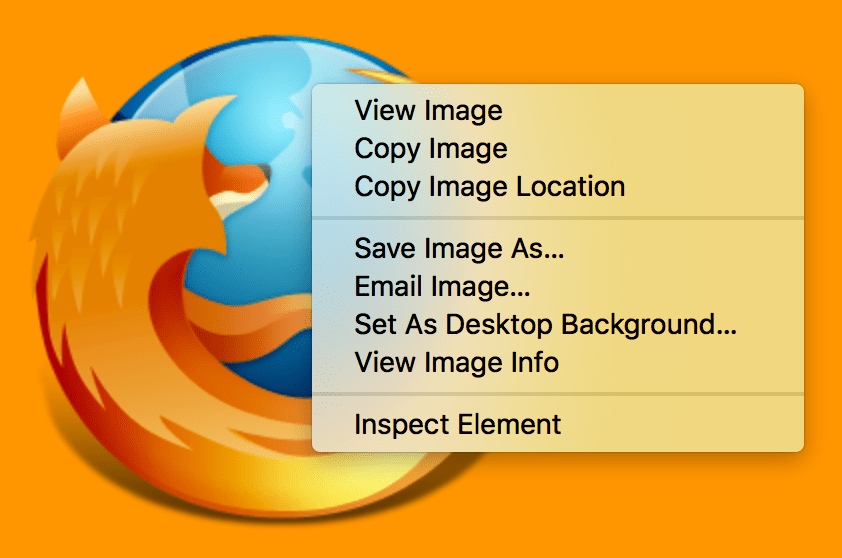
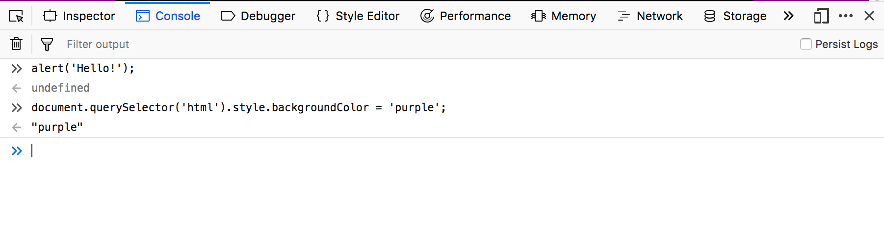

{{QuicklinksWithSubPages("/en-US/docs/Learn_web_development/Howto")}}

Every modern web browser includes a powerful suite of developer tools. These tools do a range of things, from inspecting currently-loaded HTML, CSS and JavaScript to showing which assets the page has requested and how long they took to load. This article explains how to use the basic functions of your browser's devtools.

> [!NOTE]
> Before you run through the examples below, open the [Beginner's example site](https://mdn.github.io/beginner-html-site-scripted/) that we built during the [Getting started with the Web](/en-US/docs/Learn_web_development/Getting_started/Your_first_website) article series. You should have this open as you follow the steps below.

## How to open the devtools in your browser

The devtools live inside your browser in a subwindow that looks roughly like this, depending on what browser you are using:


How do you pull it up? Three ways:

- **_Keyboard:_**

  - **Windows:** <kbd>Ctrl</kbd> + <kbd>Shift</kbd> + <kbd>I</kbd> or <kbd>F12</kbd>
  - **macOS:** <kbd>⌘</kbd> + <kbd>⌥</kbd> + <kbd>I</kbd>

- **_Menu bar:_**

  - **Firefox:** _Menu (☰) ➤ More tools ➤ Web Developer Tools_
  - **Chrome:** _More tools ➤ Developer tools_
  - **Opera**: _Developer ➤ Developer tools_
  - **Safari:** _Develop ➤ Show Web Inspector._

    > [!NOTE]
    > The Safari developer tools are not enabled by default.
    > To enable them, go to _Safari ➤ Preferences ➤ Advanced_, and check the _Show Develop menu in menu bar_ or _Enable features for web developers_ checkbox.

- **_Context menu:_** Press-and-hold/right-click an item on a webpage (Ctrl-click on the Mac), and choose _Inspect Element_ from the context menu that appears. (_An added bonus:_ this method straight-away highlights the code of the element you right-clicked.)



## The Inspector: DOM explorer and CSS editor

The developer tools usually open by default to the inspector, which looks something like the following screenshot. This tool shows what the HTML on your page looks like at runtime, as well as what CSS is applied to each element on the page. It also allows you to instantly modify the HTML and CSS and see the results of your changes reflected live in the browser viewport.


If you _don't_ see the inspector,

- **Firefox:** Select the **Inspector** tab.
- **Other browsers:** Select the **Elements** tab.

### Exploring the DOM inspector

For a start, right-click (Ctrl-click) an HTML element in the DOM inspector and look at the context menu. The available menu options vary among browsers, but the important ones are mostly the same:


- **Delete Node** (sometimes _Delete Element_). Deletes the current element.
- **Edit as HTML** (sometimes _Add attribute_/_Edit text_). Lets you change the HTML and see the results on the fly. Very useful for debugging and testing.
- **:hover/:active/:focus**. Forces element states to be toggled on, so you can see what their styling would look like.
- **Copy/Copy as HTML**. Copy the currently selected HTML.
- Some browsers also have _Copy CSS Path_ and _Copy XPath_ available, to allow you to copy the CSS selector or XPath expression that would select the current HTML element.

Try editing some of your DOM now. Double-click an element, or right-click it and choose _Edit as HTML_ from the context menu. You can make any changes you'd like, but you cannot save your changes.

### Exploring the CSS editor

By default, the CSS editor displays the CSS rules applied to the currently selected element:


These features are especially handy:

- The rules applied to the current element are shown in order of most-to-least-specific.
- Click the checkboxes next to each declaration to see what would happen if you removed the declaration.
- Click the little arrow next to each shorthand property to show the property's longhand equivalents.
- Click a property name or value to bring up a text box, where you can key in a new value to get a live preview of a style change.
- Next to each rule is the file name and line number the rule is defined in. Clicking that rule causes the dev tools to jump to show it in its own view, where it can generally be edited and saved.
- You can also click the closing curly brace of any rule to bring up a text box on a new line, where you can write a completely new declaration for your page.

You'll notice a number of clickable tabs at the top of the CSS Viewer:

- _Computed_: This shows the computed styles for the currently selected element (the final, normalized values that the browser applies).
- _Layout_: This shows the details for CSS [grid](/en-US/docs/Web/CSS/CSS_grid_layout) and [flexbox](/en-US/docs/Web/CSS/CSS_flexible_box_layout) layout modes if the element you are inspecting uses them.
- _Fonts_: In Firefox and Safari, the _Fonts_ tab shows the fonts applied to the current element.

The _box model_ view visually represents the current element's box model, so you can see at a glance what padding, border and margin is applied to it, and how big its content is. In Firefox, this is located in the _Layout_ tab, and in other browsers it is in the _Computed_ tab.

In some browsers, the JavaScript details of the selected element can also be viewed in this panel. In Safari, these are unified under the _Node_ tab, but are in separate tabs in Chrome, Opera, and Edge.

- _Properties_: The {{Glossary("Property/JavaScript", "properties")}} of the element object.
- _Event Listeners_: The [events](/en-US/docs/Web/API/Event) associated with the element.

### Find out more

Find out more about the Inspector in different browsers:

- [Firefox Page inspector](https://firefox-source-docs.mozilla.org/devtools-user/page_inspector/index.html)
- [Chrome DOM inspector](https://developer.chrome.com/docs/devtools/dom/) (Opera and Edge's inspector is the same)
- [Safari Elements tab](https://webkit.org/web-inspector/elements-tab/)

## The JavaScript debugger

The JavaScript debugger allows you to watch the value of variables and set breakpoints, places in your code that you want to pause execution and identify the problems that prevent your code from executing properly.


To get to the debugger:

**Firefox**: Open the Developer tools and select the **Debugger** tab.
**Other browsers**: Open the Developer tools and select the **Sources** tab.

### Exploring the debugger

Each browser's JavaScript debugger is divided into three panes. The layout of these is somewhat different depending on the browser you are using; this guide uses Firefox as a reference.

#### File list

The first pane on the left contains the list of files associated with the page you are debugging. Select the file you want to work with from this list. Click on a file to select it and view its contents in the center pane of the Debugger.


#### Source code

Set breakpoints where you want to pause execution. In the following image, the highlight on the number 18 shows that the line has a breakpoint set.


#### Watch expressions and breakpoints

The right-hand pane shows a list of the watch expressions you have added and breakpoints you have set.

In the image, the first section, **Watch expressions**, shows that the listItems variable has been added. You can expand the list to view the values in the array.

The next section, **Breakpoints**, lists the breakpoints set on the page. In example.js, a breakpoint has been set on the statement `listItems.push(inputNewItem.value);`

The final two sections only appear when the code is running.

The **Call stack** section shows you what code was executed to get to the current line. You can see that the code is in the function that handles a mouse click, and that the code is currently paused on the breakpoint.

The final section, **Scopes**, shows what values are visible from various points within your code. For example, in the image below, you can see the objects available to the code in the addItemClick function.


### Find out more

Find out more about the JavaScript debugger in different browsers:

- [Firefox JavaScript Debugger](https://firefox-source-docs.mozilla.org/devtools-user/debugger/index.html))
- [Chrome Debugger](https://developer.chrome.com/docs/devtools/javascript/) (Opera and Edge's debugger is the same)
- [Safari Sources tab](https://webkit.org/web-inspector/sources-tab/)

## The JavaScript console

The JavaScript console is an incredibly useful tool for debugging JavaScript that isn't working as expected. It allows you to run lines of JavaScript against the page currently loaded in the browser, and reports the errors encountered as the browser tries to execute your code.

To access the console in any browser, open the developer tools and select the **Console** tab. This will give you a window like the following:



To see what happens, try entering the following snippets of code into the console one by one (and then pressing Enter):

```js
alert("hello!");
```

```js
document.querySelector("html").style.backgroundColor = "purple";
```

```js
const loginImage = document.createElement("img");
loginImage.setAttribute(
  "src",
  "https://raw.githubusercontent.com/mdn/learning-area/master/html/forms/image-type-example/login.png",
);
document.querySelector("h1").appendChild(loginImage);
```

Now try entering the following incorrect versions of the code and see what you get.

```js-nolint example-bad
alert("hello!);
```

```js example-bad
document.cheeseSelector("html").style.backgroundColor = "purple";
```

```js example-bad
const loginImage = document.createElement("img");
banana.setAttribute(
  "src",
  "https://raw.githubusercontent.com/mdn/learning-area/master/html/forms/image-type-example/login.png",
);
document.querySelector("h1").appendChild(loginImage);
```

You'll start to see the kind of errors that the browser returns. Often these errors are fairly cryptic, but it should be pretty simple to figure these problems out!

### Find out more

Find out more about the JavaScript console in different browsers:

- [Firefox Web Console](https://firefox-source-docs.mozilla.org/devtools-user/web_console/index.html)
- [Chrome JavaScript Console](https://developer.chrome.com/docs/devtools/console/) (Opera and Edge's console is the same)
- [Safari Console Object API](https://webkit.org/web-inspector/console-object-api/) and [Console Command Line API](https://webkit.org/web-inspector/console-command-line-api/)

## See also

- [Debugging HTML](/en-US/docs/Learn_web_development/Core/Structuring_content/Debugging_HTML)
- [Debugging CSS](/en-US/docs/Learn_web_development/Core/Styling_basics/Debugging_CSS)
