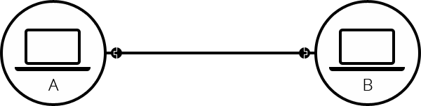
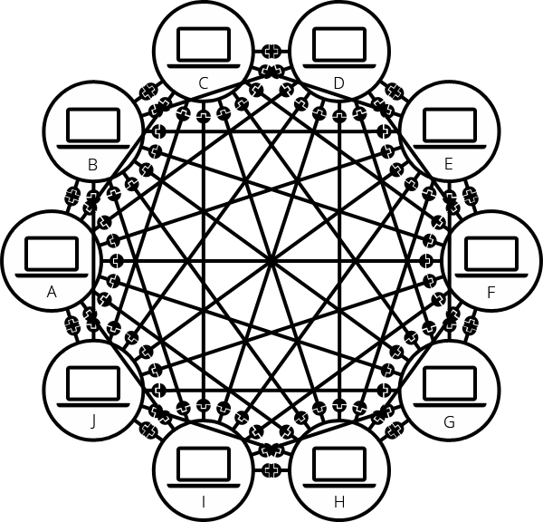
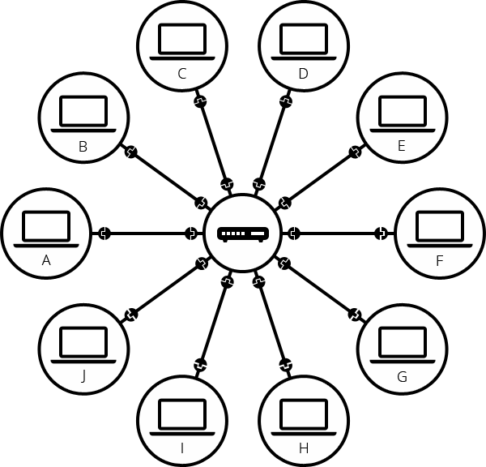
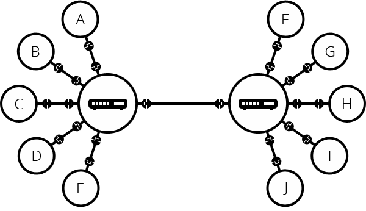
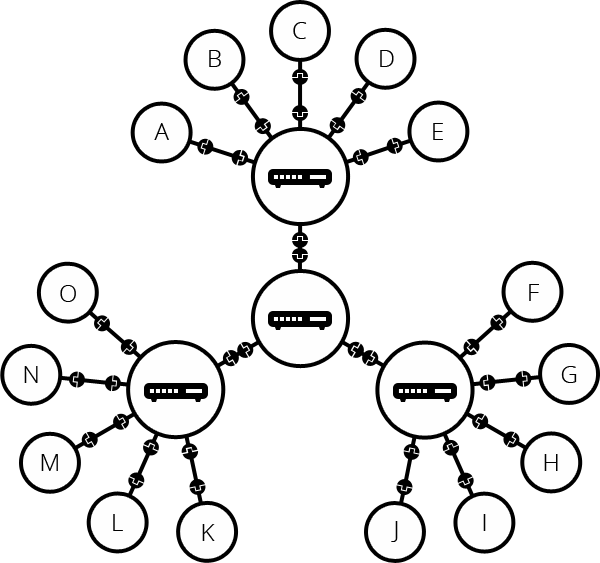
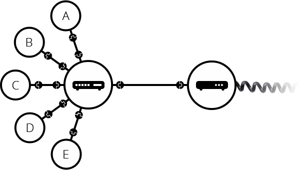
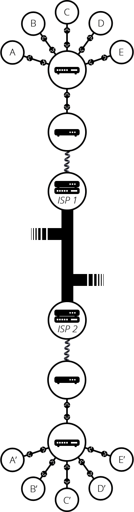
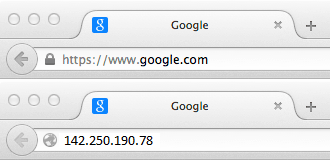
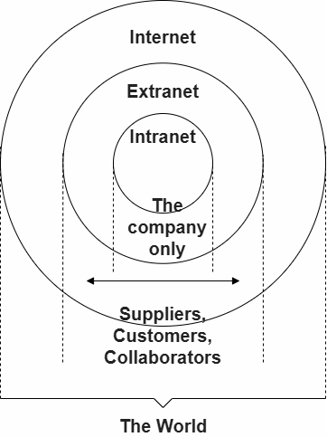

This article discusses what the Internet is and how it works.

<table>
  <tbody>
    <tr>
      <th scope="row">Prerequisites:</th>
      <td>
        None, but we encourage you to read the
        <a href="/en-US/docs/Learn_web_development/Howto/Design_and_accessibility/Thinking_before_coding"
          >Article on setting project goals</a
        >
        first
      </td>
    </tr>
    <tr>
      <th scope="row">Objective:</th>
      <td>
        You will learn the basics of the technical infrastructure of the Web and
        the difference between Internet and the Web.
      </td>
    </tr>
  </tbody>
</table>

## Summary

The **Internet** is the backbone of the Web, the technical infrastructure that makes the Web possible. At its most basic, the Internet is a large network of computers which communicate all together.

[The history of the Internet is somewhat obscure](https://en.wikipedia.org/wiki/Internet#History). It began in the 1960s as a US-army-funded research project, then evolved into a public infrastructure in the 1980s with the support of many public universities and private companies. The various technologies that support the Internet have evolved over time, but the way it works hasn't changed that much: Internet is a way to connect computers all together and ensure that, whatever happens, they find a way to stay connected.

## Videos about the Internet

- [How the internet Works in 5 minutes](https://www.youtube.com/watch?v=7_LPdttKXPc): A 5-minute video to understand the very basics of Internet by Aaron Titus.
- [How does the Internet work?](https://www.youtube.com/watch?v=x3c1ih2NJEg) Detailed well visualized 9-minute video.

## Deeper dive

### A simple network

When two computers need to communicate, you have to link them, either physically (usually with an [Ethernet cable](https://en.wikipedia.org/wiki/Ethernet_crossover_cable)) or wirelessly (for example with [Wi-Fi](https://en.wikipedia.org/wiki/Wi-Fi) or [Bluetooth](https://en.wikipedia.org/wiki/Bluetooth) systems). All modern computers can sustain any of those connections.

> [!NOTE]
> For the rest of this article, we will only talk about physical cables, but wireless networks work the same.

Such a network is not limited to two computers. You can connect as many computers as you wish. But it gets complicated quickly. If you're trying to connect, say, ten computers, you need 45 cables, with nine plugs per computer!

To solve this problem, each computer on a network is connected to a special tiny computer called a _network switch_ (or _switch_ for short). This switch has only one job: like a signaler at a railway station, it forwards messages toward their intended recipients. To send a message to computer B, computer A sends the message to the switch, which in turn forwards the message to computer B.

Once we add a switch to the system, our network of 10 computers only requires 10 cables: a single plug for each computer and a switch with 10 plugs.

To tell computers apart, the switch uses _MAC addresses_, which identify network interfaces for delivery within the local network. MAC addresses are like fingerprints; they are typically assigned by the manufacturer, but software can also assign or change them (common today for privacy reasons). Each message carries the sender's and recipient's MAC addresses. The switch reads the sender's address and remembers which connection the message arrived from, so it knows where to forward future messages addressed to that sender. If it hasn't yet learned where a recipient is, it forwards the message through all its other connections. When the recipient sends a message back, the switch learns its location too.

### A network of networks

So far so good. But what about connecting hundreds, thousands, billions of computers? Of course a single switch can't scale that far, but, if you read carefully, we said that a switch is a computer like any other, so what keeps us from connecting two switches together? Nothing, so let's do that.

You may imagine that we can connect switches together infinitely, to form a network like this:

Connecting switches this way extends a single local network. Each switch has an extensive map of which connection to use for each MAC address in its local network. If you connected ten billion computers in this network, each switch would need to remember up to ten billion MAC addresses. Whenever the recipient's address is unknown (or it has been deleted due to inactivity), switches must broadcast the message to all computers on the local network. As the network grows, it becomes increasingly costly to keep track of individual devices and find unknown recipients.

The key problem is that our addresses have no hierarchy and don't correspond to the network structure—it's like trying to figure out who to deliver mail to by comparing each person's fingerprint. To fix this problem, we divide computers into separate local networks and connect these networks using a device called a _router_. It uses a different kind of address, an _{{Glossary("IP address")}}_, which is a 4-number sequence like `142.250.190.78`. Unlike MAC addresses, which are "fingerprints", IP addresses are "street addresses" and are assigned when a computer connects to a network, identified in the IP address by a shared _prefix_. A router can therefore store forwarding instructions for a whole group of addresses (e.g., "forward to this router whenever the IP address starts with `142.250`") without learning the location of every individual computer in that group.

> [!NOTE]
> You may wonder why we need MAC addresses and switches, if IP addresses and routers can also do end-to-end networking. Switches have many practical benefits. One is that a switched local network lets a device keep the same IP address as it moves between connections within that network (like between two Wi-Fi access points): the switch relearns which connection your MAC address is on, so your IP address — and any connections already using it — keep working. Another is that routers need MAC addresses themselves: to pass a packet to the next router along the way, a router must still identify which device on the shared network should receive it.

Such a network comes very close to what we call the Internet. We just need the physical medium (cables) to connect all these routers. Luckily, such an infrastructure already existed prior to the Internet, and that's the telephone network. To connect our network to the telephone infrastructure, we need a special piece of equipment called a _modem_. This _modem_ turns the information from our network into information manageable by the telephone infrastructure and vice versa.

Note that the commercial router in your home is likely a combination of a switch, a router, and a modem, all in one device.

So we are connected to the telephone infrastructure. The next step is to send the messages from our network to the network we want to reach. To do that, we will connect our network to an Internet Service Provider (ISP). An ISP is a company that manages some special _routers_ that are all linked together and can also access other ISPs' routers. So the message from our network is carried through the network of ISP networks to the destination network. The Internet consists of this whole infrastructure of networks.

### Domain names

IP addresses are perfectly fine for computers, but we human beings have a hard time remembering that sort of address. To make things easier, we can alias an IP address with a human-readable name called a _domain name_. For example (at the time of writing; IP addresses can change) `google.com` is the domain name used on top of the IP address `142.250.190.78`. So using the domain name is the easiest way for us to reach a computer over the Internet.

### Internet and the web

As you might notice, when we browse the Web with a Web browser, we usually use the domain name to reach a website. Does that mean the Internet and the Web are the same thing? It's not that simple. As we saw, the Internet is a technical infrastructure which allows billions of computers to be connected all together. Among those computers, some computers (called _Web servers_) can send messages intelligible to web browsers. The _Internet_ is an infrastructure, whereas the _Web_ is a service built on top of the infrastructure. It is worth noting there are several other services built on top of the Internet, such as email and {{Glossary("IRC")}}.

### Intranets and Extranets

Intranets are _private_ networks that are restricted to members of a particular organization.
They are commonly used to provide a portal for members to securely access shared resources, collaborate and communicate.
For example, an organization's intranet might host web pages for sharing department or team information, shared drives for managing key documents and files,
portals for performing business administration tasks, and collaboration tools like wikis, discussion boards, and messaging systems.

Extranets are very similar to Intranets, except they open all or part of a private network to allow sharing and collaboration with other organizations.
They are typically used to safely and securely share information with clients and stakeholders who work closely with a business.
Often their functions are similar to those provided by an intranet: information and file sharing, collaboration tools, discussion boards, etc.

Both intranets and extranets run on the same kind of infrastructure as the Internet, and use the same protocols.
They can therefore be accessed by authorized members from different physical locations.

## Next steps

- [How the Web works](/en-US/docs/Learn_web_development/Getting_started/Web_standards/How_the_web_works)
- [Understanding the difference between a web page, a website, a web server and a search engine](/en-US/docs/Learn_web_development/Getting_started/Environment_setup/Browsing_the_web)
- [Understanding domain names](/en-US/docs/Learn_web_development/Howto/Web_mechanics/What_is_a_domain_name)
